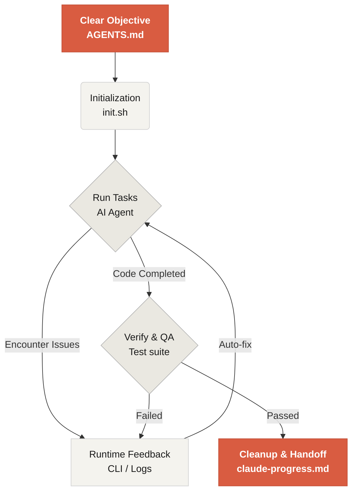

# مرحبًا بك في Learn Harness Engineering

Learn Harness Engineering هو مساق مخصص لهندسة وكلاء البرمجة بالذكاء الاصطناعي. درسنا و لخصنا مجموعة من أكثر نظريات وممارسات Harness Engineering تقدمًا في الصناعة. تشمل مراجعنا الأساسية:
- [OpenAI: Harness engineering: leveraging Codex in an agent-first world](https://openai.com/index/harness-engineering/)
- [Anthropic: Effective harnesses for long-running agents](https://www.anthropic.com/engineering/effective-harnesses-for-long-running-agents)
- [Anthropic: Harness design for long-running application development](https://www.anthropic.com/engineering/harness-design-long-running-apps)
- [Awesome Harness Engineering](https://github.com/walkinglabs/awesome-harness-engineering)

من خلال تصميم البيئة، وإدارة الحالة، والتحقق، وأنظمة التحكم بطريقة منهجية، يوضح هذا المساق كيف تجعل أدوات البرمجة الوكيلية مثل Codex و Claude Code موثوقة فعليًا. ستتعلم كيف تبني الميزات، وتصلح الأخطاء، وتؤتمت مهام التطوير عبر تقييد مساعد البرمجة بالذكاء الاصطناعي بقواعد وحدود صريحة.

## ابدأ

اختر مسار التعلم المناسب لك. ينقسم المساق إلى محاضرات نظرية، ومشاريع عملية، ومكتبة موارد جاهزة للنسخ.

  <a href="./lectures/lecture-01-why-capable-agents-still-fail/" class="card">
    <h3>المحاضرات</h3>
    
افهم لماذا تفشل النماذج القوية أحيانًا، وتعلم النظرية وراء harnesses الفعالة.

  </a>
  <a href="./projects/" class="card">
    <h3>المشاريع</h3>
    
تدريب عملي على بناء بيئة وكيلية موثوقة من الصفر.

  </a>
  <a href="./resources/" class="card">
    <h3>مكتبة الموارد</h3>
    
قوالب جاهزة للنسخ مثل AGENTS.md و feature_list.json لاستخدامها في مستودعاتك.

  </a>

## الآلية الأساسية للـ harness

الـ harness لا "يجعل النموذج أذكى"؛ بل ينشئ **نظام عمل** مغلق الحلقة للنموذج. يمكنك فهم التدفق الأساسي من خلال هذا المخطط:

## ما الذي ستتعلمه

هذه بعض المفاهيم الأساسية التي ستتقنها:

<ul class="index-list">
  <li><strong>تقييد سلوك الوكيل</strong> بقواعد وحدود صريحة.</li>
  <li><strong>الحفاظ على السياق</strong> عبر المهام الطويلة ومتعددة الجلسات.</li>
  <li><strong>منع الوكلاء</strong> من إعلان النجاح مبكرًا.</li>
  <li><strong>التحقق من العمل</strong> باستخدام اختبارات pipeline كاملة ومراجعة ذاتية.</li>
  <li><strong>جعل runtime قابلًا للملاحظة</strong> وأسهل في التصحيح.</li>
</ul>

## الخطوات التالية

بعد فهم المفاهيم الأساسية، تساعدك هذه الأدلة على التعمق:

<ul class="index-list">
  <li><a href="./lectures/lecture-01-why-capable-agents-still-fail/">المحاضرة 01: لماذا تفشل الوكلاء القادرة أحيانًا</a>: ابدأ بالنظرية وراء harness engineering.</li>
  <li><a href="./projects/project-01-baseline-vs-minimal-harness/">المشروع 01: baseline مقابل harness بسيط</a>: نفذ أول مهمة عملية حقيقية.</li>
  <li><a href="./resources/templates/">القوالب</a>: احصل على حزمة harness بسيطة لاستخدامها في مشاريعك.</li>
</ul>
