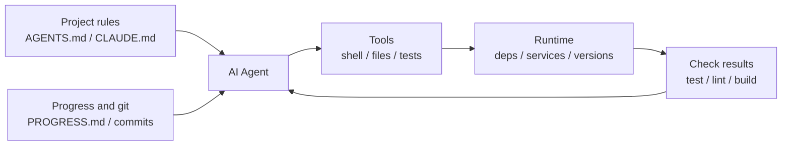

[中文版本 →](../../../zh/lectures/lecture-02-what-a-harness-actually-is/)

> أمثلة الكود: [code/](https://github.com/walkinglabs/learn-harness-engineering/blob/main/docs/ar/lectures/lecture-02-what-a-harness-actually-is/code/)
> مشروع عملي: [Project 01. Prompt-only vs. rules-first](./../../projects/project-01-baseline-vs-minimal-harness/index.md)

# المحاضرة 02. ما معنى harness فعليًا

تُستخدم كلمة "harness" بكثرة في أوساط وكلاء البرمجة بالذكاء الاصطناعي، لكن بصراحة، معظم الناس يقصدون "ملف prompt" عندما يقولون harness. هذا ليس harness. الأمر أشبه بفتح مطعم ليس فيه سوى المكونات — لا موقد، ولا سكاكين، ولا وصفات، ولا خطة لتقديم الأطباق. هذا ليس مطعمًا. هذا ثلاجة.

تقدم لك هذه المحاضرة تعريفًا دقيقًا وقابلًا للتطبيق لمفهوم harness. ليس تجريدًا أكاديميًا، بل إطار عمل يمكنك استخدامه اليوم: يتكون harness من خمسة أنظمة فرعية، لكل منها مسؤوليات واضحة ومعايير تقييم محددة.

## ابدأ بتشبيه

تخيل أنك مهندس تم تعيينه حديثًا وأُلقيت في مشروع بدون أي توثيق. لا README، ولا تعليقات في الكود، ولا أحد يخبرك كيف تشغّل الاختبارات، وإعدادات CI مدفونة في مكان ما. هل يمكنك كتابة كود جيد؟ ربما — إذا كنت ذكيًا بما فيه الكفاية وصبورًا بما فيه الكفاية. لكنك ستقضي وقتًا هائلًا في "اكتشاف ما يدور حوله هذا المشروع" بدلاً من "حل المشكلة."

يواجه وكيل الذكاء الاصطناعي نفس الموقف تمامًا. والأمر أسوأ — يمكنك على الأقل سؤال زميل. الوكيل لا يمكنه رؤية سوى الملفات التي تضعها أمامه والأوامر التي يمكنه تنفيذها. لا يمكنه أن يربت على كتف أحدهم ويسأل "مرحبًا، أي إصدار من ORM يستخدمه هذا المشروع؟"

صاغت OpenAI المبدأ الأساسي بأن "المستودع هو المواصفة" — يجب أن يكون كل السياق الضروري في المستودع، مُقدمًا من خلال ملفات تعليمات منظمة، وأوامر تحقق صريحة، وتنظيم واضح للأدلة. توثيق Anthropic للوكلاء طويلي التشغيل يُؤكد على استمرارية الحالة، ومسارات الاسترداد الصريحة، وتتبع التقدم المنظم. الشركتان تركزان على جوانب مختلفة، لكنهما تقولان نفس الشيء: **كل شيء في البنية التحتية الهندسية خارج النموذج يحدد مقدار ما يتحقق فعليًا من قدرات النموذج.**

انظر إلى بعض الأدوات التي تعرفها بالفعل:

**Claude Code** يجسد تفكير harness. يقرأ `CLAUDE.md` من مستودعك (رف الوصفات)، ويمكنه تشغيل أوامر shell (حامل السكاكين)، وينفذ في بيئتك المحلية (الموقد)، ويحافظ على سجل الجلسة (محطة التحضير)، ويمكنه تشغيل الاختبارات ورؤية النتائج (نافذة فحص الجودة). لكن إذا لم تخبره كيف يشغّل الاختبارات، فنافذة فحص الجودة معطلة — لا أحد يعرف ما إذا كان الطبق ناضجًا بالكامل.

**Cursor** يتبع منطقًا مشابهًا. ملف `.cursorrules` الخاص به هو رف الوصفات، والطرفية هي حامل السكاكين، ويقرأ هيكل مشروعك وإعدادات lint كالموقد. لكن إدارة حالة Cursor ضعيفة نسبيًا — أغلق IDE وأعد فتحه، والسياق السابق اختفى.

**Codex** (وكيل البرمجة من OpenAI) يستخدم git worktrees لعزل بيئة تشغيل كل مهمة، مقترنًا بمكدس مراقبة محلي (سجلات، مقاييس، تتبعات)، بحيث يتم التحقق من كل تغيير في بيئة مستقلة. في المستودعات التي تحتوي على `AGENTS.md` وأوامر تحقق واضحة، فإنه يؤدي بشكل أفضل بكثير من المستودعات "العارية".

**AutoGPT** هي قصة تحذيرية — غياب إدارة الحالة المنظمة يؤدي إلى تراكم السياق في المهام الطويلة، وغياب آليات التغذية الراجعة الدقيقة يجعل الوكيل يدور في حلقة مفرغة. كثير من الناس يقولون إن AutoGPT "لا يعمل"، لكن في الحقيقة إن harness الخاص بـ AutoGPT هو الذي لا يعمل — أعطِ طباخًا موقدًا معطلًا وحتى أفضل المكونات لن تُنتج وجبة.

## المفاهيم الأساسية

- **ما هو harness**: كل شيء في البنية التحتية الهندسية خارج أوزان النموذج. تُلخص OpenAI الوظيفة الأساسية للمهندس في ثلاثة أشياء: تصميم البيئات، والتعبير عن النوايا، وبناء حلقات التغذية الراجعة. تسمي Anthropic Claude Agent SDK الخاص بها "harness وكيل للأغراض العامة."
- **المستودع هو المصدر الوحيد للحقيقة**: أي شيء لا يستطيع الوكيل رؤيته، لجميع الأغراض العملية، غير موجود. تتعامل OpenAI مع المستودع بصفته "سجل النظام" — يجب أن يعيش فيه كل السياق الضروري، من خلال ملفات منظمة وتنظيم واضح للأدلة.
- **أعطِ خريطة، لا دليلًا**: تجربة OpenAI — يجب أن يكون `AGENTS.md` صفحة فهرس، لا موسوعة. حوالي 100 سطر كافية. إذا لم تكف، قسّمها إلى دليل `docs/` ودع الوكيل يقرأ عند الحاجة.
- **قيّد، لا تُدارة بالتفصيل**: harness الجيد يستخدم قواعد قابلة للتنفيذ لتقييد الوكيل، بدلاً من تعداد التعليمات واحدة تلو الأخرى. تقول OpenAI "فرض الثوابت، لا تُدارة التنفيذ"؛ ووجدت Anthropic أن الوكلاء يمدحون عملهم بثقة، والحل هو فصل "من يقوم بالعمل" عن "من يتحقق من العمل."
- **أزل المكونات واحدًا تلو الآخر**: لقياس قيمة كل مكون من مكونات harness، أزلها واحدًا تلو الآخر وانظر أي إزالة تسبب أكبر انخفاض في الأداء. استخدمت Anthropic هذه الطريقة ووجدت أنه مع قوة النماذج، تتوقف بعض المكونات عن كونها حرجة — لكن جديدة تظهر دائمًا.

## نموذج harness ذو الأنظمة الفرعية الخمسة

نعود إلى تشبيه المطبخ. المطبخ الكامل يحتوي على خمس مناطق وظيفية، وharness يحتوي على خمسة أنظمة فرعية:



**نظام التعليمات (رف الوصفات)**: أنشئ `AGENTS.md` (أو `CLAUDE.md`) يحتوي على نظرة عامة على المشروع والغرض منه (جملة واحدة)، حزمة التقنيات والإصدارات (Python 3.11، FastAPI 0.100+، PostgreSQL 15)، أوامر التشغيل الأولى (`make setup`، `make test`)، القيود الصارمة غير القابلة للتفاوض ("جميع واجهات API يجب أن تستخدم OAuth 2.0")، وروابط إلى توثيق أكثر تفصيلًا.

**نظام الأدوات (حامل السكاكين)**: تأكد من أن الوكيل لديه وصول كافٍ للأدوات. لا تعطل shell بحجة "الأمان" — إذا لم يستطع الوكيل حتى تشغيل `pip install`، فكيف يُفترض أن يعمل؟ لكن لا تفتح كل شيء أيضًا — اتبع مبادئ الامتياز الأقل.

**نظام البيئة (الموقد)**: اجعل حالة البيئة واصفة لنفسها. استخدم `pyproject.toml` أو `package.json` لتثبيت التبعيات، و`.nvmrc` أو `.python-version` لإصدارات وقت التشغيل، وDocker أو devcontainers لضمان قابلية التكرار.

**نظام الحالة (محطة التحضير)**: المهام الطويلة تحتاج إلى تتبع التقدم. استخدم ملف `PROGRESS.md` بسيط يسجل: ما تم إنجازه، ما قيد التنفيذ، ما المحظور. حدّثه قبل نهاية كل جلسة، واقرأه عند بدء الجلسة التالية.

**نظام التغذية الراجعة (نافذة فحص الجودة)**: هذا هو النظام الفرعي ذو أعلى عائد على الاستثمار. اذكر أوامر التحقق صراحةً في `AGENTS.md`:
```
Verification commands:
- Tests: pytest tests/ -x
- Type check: mypy src/ --strict
- Lint: ruff check src/
- Full verification: make check (includes all above)
```

غياب أي نظام فرعي يشبه غياب منطقة وظيفية في المطبخ — لا يزال بإمكانك الطبخ، لكن الأمر دائمًا محرج.

**تشخيص جودة harness**: استخدم "التحكم المتساوي للنموذج." أبقِ النموذج ثابتًا، وأزل الأنظمة الفرعية واحدًا تلو الآخر، وقِس أي إزالة تسبب أكبر انخفاض في الأداء. هذا هو عنق الزجاجة الخاص بك — ركّز جهدك هناك. مثل البحث عن عنق الزجاجة في المطبخ: خذ رف الوصفات وانظر كم يصبح الأمر أبطأ، أطفئ الموقد وانظر التأثير.

## قصة فريق حقيقية

استخدم فريق GPT-4o على تطبيق واجهة أمامية بـ TypeScript + React (~20,000 سطر كود). مرّوا بأربع مراحل — بشكل أساسي إضافة معدات المطبخ قطعة قطعة:

**المرحلة 1 — مطبخ فارغ**: فقط وصف مشروع أساسي في README. نجحت محاولة واحدة من أصل 5 (20%). الأعطال الرئيسية: اختيار مدير حزم خاطئ (npm مقابل yarn)، عدم اتباع اصطلاحات تسمية المكونات، عدم القدرة على تشغيل الاختبارات.

**المرحلة 2 — رف الوصفات مُركّب**: أُضيف `AGENTS.md` بإصدارات حزمة التقنيات، واصطلاحات التسمية، والقرارات المعمارية الرئيسية. ارتفع معدل النجاح إلى 60%. كانت الأعطال المتبقية أساسًا مشاكل بيئية وتحقق مفقود.

**المرحلة 3 — نافذة فحص الجودة مفتوحة**: أُدرجت أوامر التحقق في `AGENTS.md`: `yarn test && yarn lint && yarn build`. ارتفع معدل النجاح إلى 80%.

**المرحلة 4 — محطة التحضير جاهزة**: أُدخلت قوالب ملفات التقدم حيث سجّل الوكلاء العمل المكتمل وغير المكتمل في كل تشغيل. استقر معدل النجاح عند 80-100%.

أربع تكرارات، النموذج لم يتغير إطلاقًا، ومعدل النجاح ارتفع من 20% إلى ما يقارب 100%. هذه هي قوة هندسة harness. لم تشترِ مكونات أغلى — لقد نظّمت المطبخ بشكل صحيح فحسب.

## الخلاصات الأساسية

- Harness = تعليمات + أدوات + بيئة + حالة + تغذية راجعة. خمسة أنظمة فرعية، مثل المناطق الوظيفية الخمس للمطبخ — جميعها أساسية.
- إذا لم تكن أوزان النموذج، فهي harness. إن harness الخاص بك يحدد مقدار ما يتحقق من قدرات النموذج.
- من بين الأنظمة الفرعية الخمسة، عادةً ما يكون نظام التغذية الراجعة هو الأقل استثمارًا والأعلى عائدًا. اجعل أوامر التحقق صحيحة أولاً — نافذة فحص الجودة هي الترقية الأكثر جدوى بالاستثمار.
- استخدم "التحكم المتساوي للنموذج" لقياس المساهمة الحدية لكل نظام فرعي — لا تعتمد على الحدس.
- harness يتآكل مثل الكود. راجع بانتظام، وسدد ديون harness كما تسدد الديون التقنية.

## قراءات إضافية

- [OpenAI: Harness Engineering](https://openai.com/index/harness-engineering/)
- [Anthropic: Effective Harnesses for Long-Running Agents](https://www.anthropic.com/engineering/effective-harnesses-for-long-running-agents)
- [HumanLayer: Harness Engineering for Coding Agents](https://humanlayer.dev/articles/harness-engineering-for-coding-agents/)
- [SWE-agent: Agent-Computer Interfaces](https://github.com/princeton-nlp/SWE-agent)
- [Thoughtworks: Harness Engineering on Technology Radar](https://www.thoughtworks.com/radar)

## تمارين

1. **تدقيق harness الخماسي**: خذ مشروعًا تستخدم فيه وكيل ذكاء اصطناعي وقم بتدقيق كامل باستخدام إطار العمل الخماسي. قيّم كل نظام فرعي من 1 إلى 5. اعثر على النظام الفرعي الأقل تقييمًا، واقضِ 30 دقيقة في تحسينه، ثم لاحظ التغيير في أداء الوكيل.

2. **تجربة التحكم المتساوي للنموذج**: اختر نموذجًا واحدًا ومهمة صعبة واحدة. أزل التعليمات بالتتابع (احذف AGENTS.md)، وأزل التغذية الراجعة (لا تقدم أوامر تحقق)، وأزل الحالة (بدون ملفات تقدم) — أزل واحدًا فقط في كل مرة وقِس انخفاض الأداء. بناءً على النتائج، رتّب أهمية الأنظمة الفرعية لمشروعك.

3. **تحليل الأفعال**: اعثر على سيناريو في مشروعك حيث الوكيل "يريد أن يفعل شيئًا لكنه لا يستطيع" (مثلًا، يعرف أنه يجب استخدام استعلامات معلمّة لكنه لا يعرف أنماط ORM في مشروعك). حلل هل هذه فجوة تنفيذ (لا يعرف كيف) أم فجوة تقييم (لا يعرف ما إذا كان صحيحًا)، ثم صمّم تحسينًا لـ harness لسدّها.
