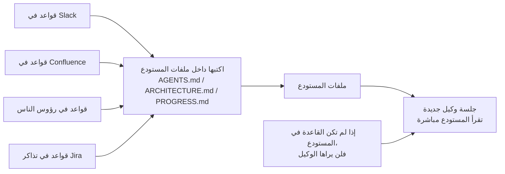
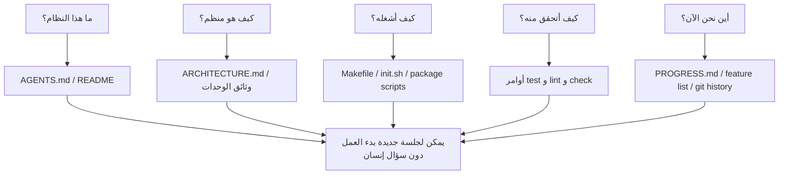

[中文版本 →](../../../zh/lectures/lecture-03-why-the-repository-must-become-the-system-of-record/)

> أمثلة الكود: [code/](https://github.com/walkinglabs/learn-harness-engineering/blob/main/docs/ar/lectures/lecture-03-why-the-repository-must-become-the-system-of-record/code/)
> مشروع عملي: [المشروع 02. مساحة عمل قابلة للقراءة بواسطة الوكلاء](./../../projects/project-02-agent-readable-workspace/index.md)

# المحاضرة 03. اجعل المستودع مصدر الحقيقة الوحيد

قرارات المعمارية في فريقك مبعثرة بين Confluence وSlack وJira ورؤوس بعض المهندسين الكبار. بالنسبة للبشر، هذا يعمل بالكاد: يمكنك سؤال زميل، أو البحث في سجل المحادثات، أو التنقيب في الوثائق. وإذا فشل كل شيء، يمكنك الإمساك بشخص في غرفة الاستراحة. لكن بالنسبة إلى وكيل ذكاء اصطناعي، فإن المعلومات غير الموجودة في المستودع لا وجود لها ببساطة.

هذا ليس مبالغة. فكّر في مدخلات الوكيل الفعلية: مطالبات النظام ووصف المهمة، محتوى الملفات من المستودع، ومخرجات تنفيذ الأدوات. هذا كل شيء. سجل Slack، وتذاكر Jira، وصفحات Confluence، وقرار المعمارية الذي ناقشته مع زميل على القهوة بعد ظهر الجمعة - لا يرى الوكيل شيئًا من ذلك. لا يستطيع "الذهاب ليسأل شخصًا" ولا "البحث في سجل المحادثة". إنه مهندس محبوس داخل المستودع؛ كل ما هو خارجه لا يعرف عنه شيئًا.

إذًا يصبح السؤال: هل ستعطي هذا المهندس خريطة جيدة؟

## ما الذي يجب أن يكون على الخريطة

تقول OpenAI ذلك بصراحة: **المعلومات التي لا توجد في المستودع لا توجد بالنسبة للوكيل.** يسمون هذا مبدأ "repo as spec" - أي أن المستودع نفسه هو وثيقة المواصفات ذات السلطة الأعلى.

توثيق Anthropic عن الوكلاء طويلة التشغيل يردد الفكرة نفسها: الحالة المستمرة شرط ضروري لاستمرارية المهام الطويلة. القدرة على استعادة المعرفة عبر الجلسات تحدد مباشرة معدلات نجاح المهام. وهذه الحالة يجب أن توجد في المستودع، لأنه التخزين الوحيد المستقر والقابل للوصول لدى الوكيل.

قد تفكر: "فريقنا صغير، والمعرفة في رؤوس الجميع، والأمور تسير جيدًا." صحيح بالنسبة للبشر. لكن إذا كنت تستخدم وكيلًا، فاقبل هذه الحقيقة: الوكيل لا يستطيع سؤال الناس. كل ما يحتاج إلى معرفته يجب أن يُكتب ويوضع حيث يستطيع العثور عليه.

ليس الأمر عن "كتابة المزيد من الوثائق". بل عن "وضع معلومات القرار في المكان الصحيح". ملف `ARCHITECTURE.md` من 50 سطرًا داخل `src/api/` أكثر فائدة بعشرة آلاف مرة من وثيقة تصميم من 500 صفحة في Confluence لا يصونها أحد. يشبه الأمر خريطة مكتب مرسومة يدويًا ومثبتة على مكتبك مقابل مخطط معماري جميل مقفل في خزانة ملفات: الأولى أمامك عندما تحتاجها؛ أما الثانية فقد تكون أفضل تقنيًا لكنها عديمة الفائدة في اللحظة.

## وضوح المعرفة



كيف تختبر إن كانت خريطتك جيدة بما يكفي؟ نفّذ "اختبار البدء البارد": افتح جلسة وكيل جديدة تمامًا تستخدم محتوى المستودع فقط، وانظر هل تستطيع الإجابة عن خمسة أسئلة أساسية:



إذا لم تستطع الإجابة، ففي الخريطة فراغات. حيث تكون الخريطة فارغة، يخمّن الوكيل؛ التخمينات الخاطئة تصبح عيوبًا، وكثرة التخمين تستهلك السياق. وكل جلسة جديدة تخمّن من جديد. تكلفة التخمين دائمًا أعلى من تكلفة رسم الخريطة جيدًا من البداية.

## المفاهيم الأساسية

- **Knowledge Visibility Gap**: نسبة معرفة المشروع الكلية غير الموجودة في المستودع. كلما كبرت الفجوة، ارتفع معدل فشل الوكيل. كم من المعرفة الضمنية عن هذا المشروع يعيش في رأسك؟ احسبها كلها، ثم انظر كم دخل إلى المستودع - الفرق هو فجوة الوضوح.
- **System of Record**: مستودع الكود كمصدر رسمي لقرارات المشروع، وقيود المعمارية، وحالة التنفيذ، ومعايير التحقق. الكلمة الأخيرة للمستودع، ولا شيء آخر يُحسب. مثل خريطة تحدد "الطريق مغلق" - لن تسلك ذلك الطريق. لكن إذا كانت تلك المعلومة موجودة فقط في رأس شخص ما، فستضطر إلى سؤاله كل مرة.
- **Cold-Start Test**: الأسئلة الخمسة أعلاه. عدد الإجابات الممكنة يوضح مدى اكتمال خريطتك.
- **Discovery Cost**: مقدار ميزانية السياق التي يحرقها الوكيل للعثور على معلومة أساسية داخل المستودع. كلما كانت المعلومة مخفية أكثر، ارتفعت تكلفة الاكتشاف، وبقيت ميزانية أقل للمهمة الحقيقية. إخفاء معلومة حرجة في README على عمق عشرة مجلدات يشبه قفل مطفأة الحريق داخل خزنة في القبو: هي موجودة، لكنك لا تجدها عند الحاجة.
- **Knowledge Decay Rate**: نسبة مدخلات المعرفة التي تصبح قديمة لكل وحدة زمن. خروج الوثائق عن التزامن مع الكود هو العدو الأكبر - أسوأ من عدم وجود وثائق أصلًا.
- **ACID Analogy**: تطبيق مبادئ معاملات قواعد البيانات (Atomicity، Consistency، Isolation، Durability) على إدارة حالة الوكلاء. سنفصل ذلك أدناه.

## كيف ترسم خريطة جيدة

**المبدأ 1: المعرفة تعيش بجانب الكود.** قاعدة عن مصادقة نقاط API يجب أن تكون بجانب كود API، لا مدفونة في وثيقة عالمية ضخمة. ضع مستندًا قصيرًا في كل مجلد وحدة يشرح مسؤوليات الوحدة، وواجهاتها، وقيودها الخاصة. مثل لافتات رفوف المكتبة: إذا أردت كتب التاريخ، تذهب مباشرة إلى الرف المكتوب عليه "History". لا حاجة للبحث في المكتبة كلها.

**المبدأ 2: استخدم ملف دخول موحدًا.** `AGENTS.md` (أو `CLAUDE.md`) هو صفحة هبوط الوكيل. لا يحتاج إلى احتواء كل المعلومات، لكنه يجب أن يسمح للوكيل بالإجابة بسرعة عن ثلاثة أسئلة: "ما هذا المشروع؟"، "كيف أشغله؟"، و"كيف أتحقق منه؟". 50-100 سطر كافية.

**المبدأ 3: الحد الأدنى، لكن مكتمل.** يجب أن يكون لكل قطعة معرفة حالة استخدام واضحة. إذا لم يؤثر حذف قاعدة على جودة قرارات الوكيل، فلا ينبغي أن توجد تلك القاعدة. لكن كل سؤال في اختبار البدء البارد يجب أن تكون له إجابة. هذا توازن دقيق: لا كثير، ولا قليل، بل ما يكفي.

**المبدأ 4: حدّث مع الكود.** اربط تحديثات المعرفة بتغييرات الكود. أبسط نهج: ضع وثائق المعمارية في مجلد الوحدة المقابلة. عندما تعدّل الكود، ترى الوثيقة طبيعيًا. بعد تغييرات الكود، يمكن لـ CI تذكيرك بالتحقق مما إذا كانت الوثائق تحتاج تحديثًا.

**هيكل مستودع ملموس**:

```
project/
├── AGENTS.md              # Entry: project overview, run commands, hard constraints
├── src/
│   ├── api/
│   │   ├── ARCHITECTURE.md  # API layer architecture decisions
│   │   └── ...
│   ├── db/
│   │   ├── CONSTRAINTS.md   # Database operation hard constraints
│   │   └── ...
│   └── ...
├── PROGRESS.md             # Current progress: done, in-progress, blocked
└── Makefile                # Standardized commands: setup, test, lint, check
```

## إدارة حالة الوكيل بمبادئ ACID

تأتي هذه الاستعارة من إدارة معاملات قواعد البيانات. قد تظن أنها تعقيد زائد، لكنها تمنحك إطارًا عمليًا جدًا:

- **Atomicity**: كل "عملية منطقية" (مثل "إضافة endpoint جديد وتحديث الاختبارات") تحصل على commit واحد في git. إذا فشلت في المنتصف، استخدم `git stash` للتراجع. الكل أو لا شيء - لا يوجد "نصف منجز".
- **Consistency**: عرّف شروط تحقق لـ "حالة متسقة": كل الاختبارات تنجح، وlint لا يبلغ عن أخطاء. يشغّل الوكيل التحقق بعد كل عملية؛ الحالات الوسيطة غير المتسقة لا تُسجّل في commit. مثل تحويل بنكي: لا يمكنك الخصم دون إضافة الرصيد.
- **Isolation**: عندما تعمل عدة وكلاء بالتوازي، صمم ملفات الحالة لتجنب race conditions. نهج بسيط: يستخدم كل وكيل ملف تقدم خاصًا به، أو تُستخدم فروع git للعزل. لا يستطيع طاهيان تتبيل القدر نفسه في الوقت نفسه - من يتحمل المسؤولية إذا أصبح مالحًا أكثر من اللازم؟
- **Durability**: معرفة المشروع الحرجة تعيش في ملفات متتبعة بـ git. يمكن للحالة المؤقتة أن تبقى في ذاكرة الجلسة، لكن المعرفة العابرة للجلسات يجب أن تُحفظ في ملفات. ما في رأسك لا يُحسب - ما هو مكتوب فقط يُحسب.

## قصة تحول حقيقية

كان فريق يصون منصة تجارة إلكترونية تضم نحو 30 خدمة مصغرة. قرارات المعمارية (بروتوكولات الاتصال بين الخدمات، استراتيجيات اتساق البيانات، قواعد إصدار API) كانت مبعثرة بين Confluence (قديم جزئيًا)، وSlack (يصعب البحث فيه)، ورؤوس بعض المهندسين الكبار (لا يتوسع)، وتعليقات كود متفرقة (غير منهجية).

بعد إدخال وكلاء الذكاء الاصطناعي، احتاجت 70% من المهام إلى تدخل بشري. كان كل فشل تقريبًا يتضمن انتهاك الوكيل لقيد ضمني من نوع "الجميع يعرفه لكن لا أحد كتبه". يشبه موظفًا جديدًا لم يخبره أحد "يجب أن تنشر طلب الغداء في محادثة المجموعة" - يخمّن خطأ، يُوبَّخ، لكن بعد التوبيخ لا يكتب أحد القاعدة.

نفذ الفريق تحولًا:
1. أنشأ `AGENTS.md` في جذر المستودع مع نظرة عامة على المشروع، وإصدارات مكدس التقنية، والقيود العالمية الصارمة
2. أضاف `ARCHITECTURE.md` في كل مجلد خدمة مصغرة يصف المسؤوليات، والواجهات، والاعتماديات
3. أنشأ `CONSTRAINTS.md` مركزيًا يتضمن القيود الصارمة بلغة "MUST/MUST NOT" صريحة
4. أضاف `PROGRESS.md` في كل مجلد خدمة لتتبع حالة العمل الحالية

بعد التحول، استطاع الوكيل نفسه الإجابة عن كل أسئلة المشروع الأساسية عند البدء البارد، وتحسنت جودة إنجاز المهام بوضوح.

## الخلاصات الأساسية

- المعرفة غير الموجودة في المستودع لا توجد بالنسبة للوكيل. وضع القرارات الحرجة في المستودع هو أبسط استثمار في الـ Harness - ارسم خريطة جيدة كي لا تضل الطريق.
- استخدم "اختبار البدء البارد" لتقييم جودة المستودع: هل تستطيع جلسة جديدة الإجابة عن خمسة أسئلة أساسية باستخدام محتوى المستودع فقط؟
- يجب أن تكون المعرفة قريبة من الكود، في حدها الأدنى لكنها مكتملة، ومحدثة مع الكود. ليس الأمر عن كتابة المزيد من الوثائق، بل عن وضع المعلومات في المكان الصحيح.
- استخدم مبادئ ACID لحالة الوكلاء: commits ذرية، تحقق من الاتساق، عزل التوازي، ومعرفة حرجة مستدامة.
- تدهور المعرفة هو العدو الأكبر. الوثائق غير المتزامنة مع الكود أخطر من غياب الوثائق - فهي ترسل الوكيل في الاتجاه الخطأ بينما يظن أنه على صواب.

## قراءات إضافية

- [OpenAI: Harness Engineering](https://openai.com/index/harness-engineering/)
- [Anthropic: Effective Harnesses for Long-Running Agents](https://www.anthropic.com/engineering/effective-harnesses-for-long-running-agents)
- [Infrastructure as Code — Martin Fowler](https://martinfowler.com/bliki/InfrastructureAsCode.html)
- [ADR: Architecture Decision Records](https://adr.github.io/)
- [The Twelve-Factor App](https://12factor.net/)

## تمارين

1. **اختبار البدء البارد**: افتح جلسة وكيل جديدة تمامًا في مشروعك (لا سياق شفهي، محتوى المستودع فقط). اسأله خمسة أسئلة: ما هذا النظام؟ كيف هو منظم؟ كيف أشغله؟ كيف أتحقق منه؟ ما التقدم الحالي؟ سجل ما لا يستطيع الإجابة عنه، ثم حسّن المستودع حتى يستطيع.

2. **قياس تحويل المعرفة إلى خارج الرأس**: اسرد كل القرارات والقيود المهمة لعمل التطوير في مشروعك. علّم كل واحدة بأنها داخل المستودع أو خارجه. احسب Knowledge Visibility Gap لديك (النسبة خارج المستودع). ضع خطة لخفضها إلى أقل من 10%.

3. **تقييم ACID**: قيّم إدارة الحالة في مشروعك باستخدام استعارة ACID في هذه المحاضرة. Atomicity - هل يمكن التراجع عن عمليات الوكيل بشكل نظيف؟ Consistency - هل يوجد تحقق من "حالة متسقة"؟ Isolation - هل تتداخل الوكلاء المتزامنة مع بعضها؟ Durability - هل كل المعرفة العابرة للجلسات محفوظة؟
