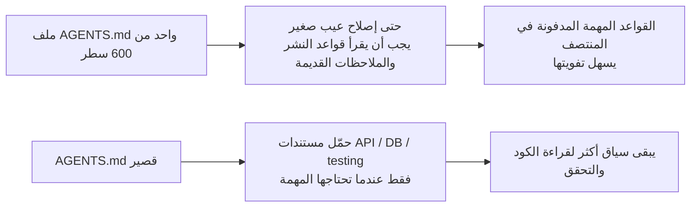
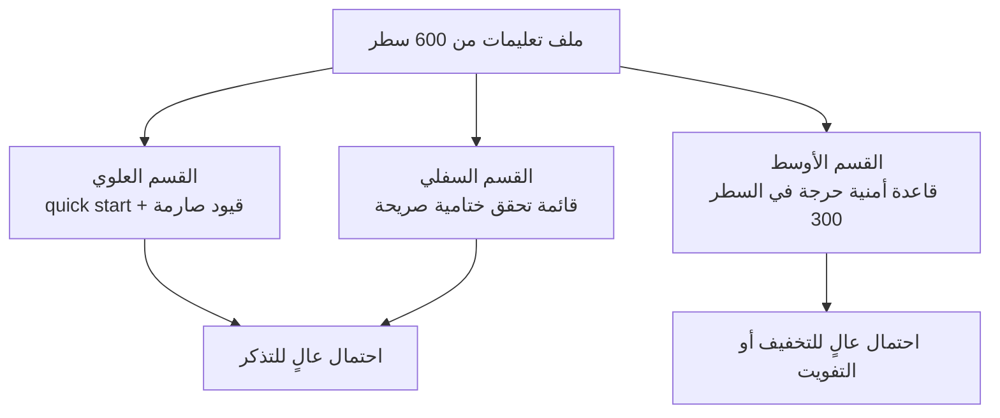

[中文版本 →](../../../zh/lectures/lecture-04-why-one-giant-instruction-file-fails/)

> أمثلة الكود: [code/](https://github.com/walkinglabs/learn-harness-engineering/blob/main/docs/ar/lectures/lecture-04-why-one-giant-instruction-file-fails/code/)
> مشروع عملي: [المشروع 02. مساحة عمل قابلة للقراءة بواسطة الوكلاء](./../../projects/project-02-agent-readable-workspace/index.md)

# المحاضرة 04. قسّم التعليمات عبر ملفات

أخذت هندسة الـ Harness بجدية. أنشأت ملف `AGENTS.md` ووضعت فيه كل قاعدة، وكل قيد، وكل درس تعلمته يخطر في بالك. بعد شهر أصبح الملف 300 سطر، وبعد شهرين 450 سطرًا، وبعد ثلاثة أشهر 600 سطر. ثم لاحظت أن أداء الوكيل يزداد سوءًا: في إصلاح عيب بسيط، يستهلك الوكيل قدرًا كبيرًا من السياق في معالجة تعليمات نشر غير ذات صلة؛ قيد أمني حرج مدفون في السطر 300 يتم تجاهله تمامًا؛ وثلاث قواعد متناقضة لأسلوب الكود تجعل الوكيل يختار واحدة عشوائيًا كل مرة.

هذا هو فخ "ملف التعليمات العملاق". يشبه حقيبة سفر محشوة أكثر من اللازم: كل شيء يبدو مفيدًا، فتضغطه داخلها حتى توشك السحّابة أن تنفجر. للعثور على قطعة ملابس بديلة، عليك إفراغ الحقيبة كلها. تحمل حقيبة ممتلئة، لكنك تستخدم ربما ثلث ما بداخلها فقط.

## الحلقة المفرغة في الجذر

الحلقة المفرغة الأكثر شيوعًا تسير هكذا: يخطئ الوكيل، فتقول "أضف قاعدة تمنع هذا"، وتضيفها إلى `AGENTS.md`، فتعمل مؤقتًا، ثم يخطئ الوكيل خطأ آخر، فتضيف قاعدة أخرى، وتكرر ذلك، حتى يتضخم الملف خارج السيطرة.

ليس هذا ذنبك. إنها استجابة طبيعية جدًا: إضافة قاعدة كلما حدث خطأ تبدو منطقية، مثل رمي شيء إضافي في حقيبتك كلما خرجت من المنزل "للاحتياط". لكن الأثر التراكمي كارثي. لنرَ ما الذي يتعطل تحديدًا.

**ميزانية السياق تُلتهم.** نافذة السياق لدى الوكيل محدودة. لنفترض أن لدى وكيلك نافذة 200K token (حجم شائع في Claude). قد يستهلك ملف تعليمات متضخم 10-20K token. يبدو أن هناك مساحة كثيرة؟ لكن المهمة المعقدة قد تحتاج إلى قراءة عشرات ملفات المصدر، ومخرجات الأدوات تستهلك سياقًا أيضًا، وسجل المحادثة يتراكم. عندما يحتاج الوكيل إلى فهم الكود، تكون الميزانية ضيقة بالفعل، مثل حقيبة مليئة بأشياء "للاحتياط" ولا يبقى فيها مكان للحاسوب المحمول.

**الضياع في المنتصف.** أثبت بحث "Lost in the Middle" (Liu et al., 2023) بوضوح أن نماذج اللغة الكبيرة تستخدم المعلومات الموجودة في منتصف النصوص الطويلة بفاعلية أقل بكثير من المعلومات في البداية أو النهاية. ملف `AGENTS.md` لديك طوله 600 سطر، وفي السطر 300 توجد عبارة "كل استعلامات قاعدة البيانات يجب أن تستخدم استعلامات مهيكلة بالمعاملات" - هذا قيد أمني صارم. لكنه مدفون في المنتصف، ومن المرجح جدًا أن يتجاهله الوكيل. مثل زجاجة واقي الشمس في قاع حقيبة محشوة: تعرف أنها موجودة، تبحث ثلاث مرات، لا تجدها، ثم تشتري واحدة أخرى.

**تضارب الأولويات.** يخلط الملف بين قيود غير قابلة للتفاوض ("never use eval()")، وإرشادات تصميم مهمة ("prefer functional style")، ودرس تاريخي محدد ("تم إصلاح تسرب ذاكرة في WebSocket الأسبوع الماضي، انتبه للأنماط المشابهة"). لهذه القواعد الثلاث مستويات أهمية مختلفة تمامًا، لكنها تبدو متطابقة داخل الملف. لا يملك الوكيل إشارة موثوقة للتمييز بينها، مثل جواز السفر وكابل الشحن مختلطين في الحقيبة بلا طريقة لمعرفة أيهما أكثر إلحاحًا.

**تدهور الصيانة.** الملفات الكبيرة صعبة الصيانة بطبيعتها. نادرًا ما تُحذف التعليمات القديمة، لأن عواقب الحذف غير واضحة ("ربما يعتمد شيء ما على هذه القاعدة")، بينما تبدو إضافة تعليمات جديدة مجانية. النتيجة: الملف يكبر فقط ولا يصغر، ونسبة الإشارة إلى الضجيج تهبط باستمرار. هذا بالضبط تراكم الدين التقني، لكن في التعليمات.

**تراكم التناقضات.** التعليمات المضافة في أوقات مختلفة تبدأ بالتناقض: واحدة تقول "استخدم TypeScript strict mode"، وأخرى تقول "بعض ملفات legacy تسمح بأنواع any". يختار الوكيل عشوائيًا أيهما يتبع كل مرة. مثل أن تقول لك أمك "ارتدِ ملابس دافئة" ويقول لك أبوك "لا تلبس كثيرًا"، فتقف عند الباب لا تعرف لمن تستمع.

## المفاهيم الأساسية

- **Instruction Bloat**: عندما يشغل ملف التعليمات أكثر من 10-15% من نافذة السياق، يبدأ بمزاحمة الميزانية المخصصة لقراءة الكود والتفكير في المهمة. قد يستهلك `AGENTS.md` من 600 سطر 10,000-20,000 token، أي 8-15% من نافذة 128K قبل أن يبدأ الوكيل أصلًا.
- **Lost in the Middle Effect**: أثبت بحث Liu et al. عام 2023 أن نماذج اللغة الكبيرة تستخدم المعلومات في منتصف النصوص الطويلة بفاعلية أقل بكثير من المعلومات في البداية أو النهاية. قيد حرج مدفون في السطر 300 من ملف 600 سطر لديه احتمال عالٍ أن يُتجاهل عمليًا.
- **Instruction Signal-to-Noise Ratio (SNR)**: نسبة التعليمات في ملف ما التي ترتبط بالمهمة الحالية. إجبار الوكيل على قراءة 50 سطرًا من تعليمات النشر أثناء إصلاح عيب يعني SNR منخفضًا.
- **Routing File**: ملف دخول قصير تتمثل وظيفته الأساسية في توجيه الوكيل إلى مستندات أكثر تفصيلًا، لا احتواء كل شيء بنفسه. 50-200 سطر كافية.
- **Progressive Disclosure**: أعطِ معلومات عامة أولًا، ثم التفاصيل عند الحاجة. تصميم Harness جيد يشبه تصميم واجهة جيدًا: لا ترمِ كل الخيارات على المستخدم دفعة واحدة.
- **Priority Ambiguity**: عندما تظهر كل التعليمات بالشكل نفسه وفي المكان نفسه، لا يستطيع الوكيل التمييز بين القيود الصارمة غير القابلة للتفاوض والإرشادات اللينة.

## بنية التعليمات





## كيفية التقسيم

المبدأ الأساسي: أبقِ المعلومات المطلوبة كثيرًا في المتناول، وضع المعلومات المطلوبة أحيانًا في مكان منفصل، واترك ما لن تستخدمه أبدًا.

يبقى ملف الدخول `AGENTS.md` بين 50 و200 سطر، ويحتوي فقط على العناصر الأكثر استخدامًا: نظرة عامة على المشروع (جملة أو جملتان)، أوامر التشغيل الأولى (`make setup && make test`)، قيود عالمية صارمة (لا أكثر من 15 قاعدة غير قابلة للتفاوض)، وروابط إلى مستندات موضوعية (وصف من سطر واحد + شرط التطبيق).

```markdown
# AGENTS.md

## نظرة عامة على المشروع
Python 3.11 FastAPI backend, PostgreSQL 15 database.

## Quick Start
- Install: `make setup`
- Test: `make test`
- Full verification: `make check`

## Hard Constraints
- All APIs must use OAuth 2.0 authentication
- All database queries must use SQLAlchemy 2.0 syntax
- All PRs must pass pytest + mypy --strict + ruff check

## Topic Docs
- [API Design Patterns](docs/api-patterns.md) — Required reading when adding endpoints
- [Database Rules](docs/database-rules.md) — Required when modifying database operations
- [Testing Standards](docs/testing-standards.md) — Reference when writing tests
```

كل مستند موضوعي يكون بين 50 و150 سطرًا، منظمًا حسب الموضوع داخل `docs/` أو بجانب الوحدة المقابلة. يقرأه الوكيل فقط عند الحاجة. مثل مكعبات التنظيم داخل حقيبة السفر: الملابس في مكعب، أدوات العناية في آخر، الشواحن في ثالث. العثور على شيء لا يتطلب إفراغ الحقيبة كلها.

بعض المعلومات أفضل مكان لها داخل الكود مباشرة: تعريفات الأنواع، تعليقات الواجهات، وشرح ملفات الإعداد. يراها الوكيل طبيعيًا عند قراءة الكود، فلا حاجة لتكرارها في التعليمات.

ينبغي أن يكون لكل تعليمة مصدر ("لماذا أُضيفت هذه القاعدة؟")، وشرط تطبيق ("متى تكون مطلوبة؟")، وشرط انتهاء ("في أي ظروف يمكن حذفها؟"). راجع بانتظام، واحذف المدخلات القديمة والمكررة والمتناقضة. أدِر تعليماتك كما تدير اعتماديات الكود: الاعتماديات غير المستخدمة يجب حذفها، وإلا فهي تبطئ النظام فقط.

إذا كان لا بد من وجود تعليمة في ملف الدخول، فضعها في الأعلى أو الأسفل، لا في المنتصف. يخبرنا تأثير "lost in the middle" أن نماذج اللغة تستخدم المعلومات في الأطراف أفضل بكثير من المركز. لكن النهج الأفضل هو نقل التعليمات إلى مستندات موضوعية تُحمّل عند الطلب.

تدعم OpenAI وAnthropic ضمنيًا نهج التقسيم. تقول OpenAI إن ملفات الدخول يجب أن تكون "قصيرة وموجهة للتوجيه"، وتقول Anthropic إن معلومات التحكم في الوكلاء طويلة التشغيل يجب أن تكون "موجزة وعالية الأولوية". كلاهما يقول الشيء نفسه: لا تحشر كل شيء في ملف واحد. الحقيبة تحتاج تنظيمًا، لا ضغطًا بالقوة.

## مثال من الواقع

تضخم ملف `AGENTS.md` لدى فريق SaaS من 50 سطرًا إلى 600. كان يخلط إصدارات مكدس التقنية، ومعايير الكود، وملاحظات إصلاح عيوب تاريخية، وأدلة استخدام API، وإجراءات النشر، وتفضيلات شخصية لأعضاء الفريق - حقيبة كاملة توشك أن تنفجر.

بدأ أداء الوكيل يتدهور بوضوح: أثناء إصلاحات عيوب بسيطة، كان يستهلك سياقًا كبيرًا في معالجة تعليمات نشر غير ذات صلة؛ القيد الأمني "كل استعلامات قاعدة البيانات يجب أن تستخدم استعلامات مهيكلة بالمعاملات" كان مدفونًا في السطر 300 ويُتجاهل كثيرًا؛ ثلاث قواعد متناقضة لأسلوب الكود سببت سلوكًا عشوائيًا.

نفذ الفريق "إعادة تنظيم للحقيبة":
1. تقليص `AGENTS.md` إلى 80 سطرًا: فقط نظرة عامة على المشروع، أوامر التشغيل، و15 قيدًا عالميًا صارمًا
2. إنشاء مستندات موضوعية: `docs/api-patterns.md` (120 سطرًا)، `docs/database-rules.md` (60 سطرًا)، `docs/testing-standards.md` (80 سطرًا)
3. إضافة روابط المستندات الموضوعية في ملف التوجيه
4. تحويل الملاحظات التاريخية إلى اختبارات أو حذفها

بعد إعادة التنظيم، ارتفعت نسبة نجاح مجموعة المهام نفسها من 45% إلى 72%. وارتفع الالتزام بالقيد الأمني من 60% إلى 95%، لأنه انتقل من منتصف الملف إلى أعلى ملف التوجيه، ولم يعد "ضائعًا في المنتصف".

## الخلاصات الأساسية

- "إضافة قاعدة" مسكن قصير الأمد وسم طويل الأمد. قبل إضافة قاعدة، اسأل: هل ستكون أفضل في مستند موضوعي؟ لا تواصل حشو الحقيبة.
- ملف الدخول موجّه وليس موسوعة. 50-200 سطر مع نظرة عامة، قيود صارمة، وروابط فقط.
- استفد من تأثير "lost in the middle": المعلومات المهمة في الأعلى أو الأسفل؛ المعلومات الأقل أهمية تنتقل إلى مستندات موضوعية.
- أدِر تضخم التعليمات مثل الدين التقني. مراجعات دورية؛ كل تعليمة تحتاج مصدرًا، وشرط تطبيق، وشرط انتهاء.
- بعد التقسيم يتحسن SNR، ويصرف الوكيل ميزانية سياق أكثر على المهمة الفعلية بدل معالجة تعليمات غير ذات صلة.

## قراءات إضافية

- [OpenAI: Harness Engineering](https://openai.com/index/harness-engineering/)
- [Anthropic: Effective Harnesses for Long-Running Agents](https://www.anthropic.com/engineering/effective-harnesses-for-long-running-agents)
- [Lost in the Middle: How Language Models Use Long Contexts](https://arxiv.org/abs/2307.03172)
- [HumanLayer: Harness Engineering for Coding Agents](https://humanlayer.dev/articles/harness-engineering-for-coding-agents/)
- [Nielsen Norman Group: Progressive Disclosure](https://www.nngroup.com/articles/progressive-disclosure/)

## تمارين

1. **تدقيق SNR**: خذ ملف تعليمات الدخول الحالي لديك واسرد كل التعليمات. اختر 5 أنواع شائعة من المهام وحدد ما إذا كانت كل تعليمة ذات صلة بتلك المهمة. احسب SNR لكل نوع مهمة. التعليمات التي تكون ضجيجًا لمعظم المهام يجب نقلها إلى مستندات موضوعية.

2. **إعادة تنظيم Progressive Disclosure**: إذا كان لديك ملف تعليمات يتجاوز 300 سطر، فقسّمه إلى: (a) ملف توجيه أقل من 100 سطر، (b) 3-5 مستندات موضوعية. شغّل مجموعة المهام نفسها (5 على الأقل) قبل وبعد، وقارن نسب النجاح.

3. **التحقق من Lost in the middle**: في ملف تعليمات طويل، ضع قيدًا حرجًا في الأعلى، والمنتصف، والأسفل على التوالي، وشغّل مجموعة المهام نفسها في كل مرة (5 تشغيلات على الأقل لكل موضع). راقب إن كان هناك فرق في معدل الالتزام. قد يفاجئك مدى قوة تأثير الموضع.
