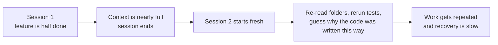
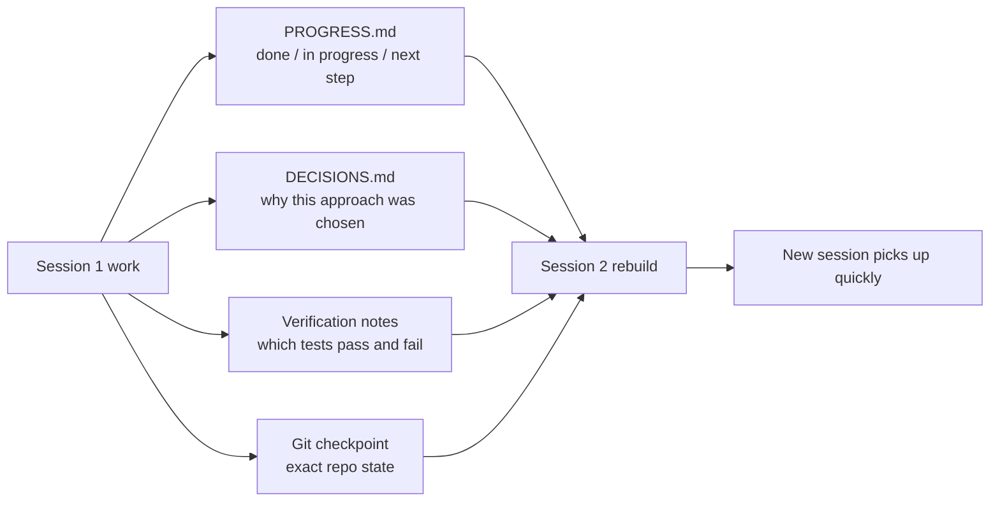

[中文版本 →](../../../zh/lectures/lecture-05-why-long-running-tasks-lose-continuity/)

> أمثلة الكود: [code/](https://github.com/walkinglabs/learn-harness-engineering/blob/main/docs/ar/lectures/lecture-05-why-long-running-tasks-lose-continuity/code/)
> مشروع عملي: [Project 03. Multi-session continuity](./../../projects/project-03-multi-session-continuity/index.md)

# المحاضرة 05. حافظ على السياق عبر الجلسات

تطلب من Claude Code تنفيذ ميزة كاملة. يعمل لمدة 30 دقيقة، وينجز معظم العمل، لكن السياق ينفد. تبدأ جلسة جديدة للاستمرار — وتكتشف أنه لا يتذكر ما القرارات التي اتُخذت في المرة السابقة، ولا لماذا خُيرت الخيار A على الخيار B، ولا أي الملفات عدّلت بالفعل، ولا في أي حالة تكون الاختبارات. يقضي 15 دقيقة في إعادة استكشاف المشروع، وقد يكون غير متسق مع النهج السابق.

تخيل لو كنت حرفيًا ينسى كل شيء كل صباح عند الاستيقاظ. سيتعين عليك إعادة التعرف على موقع البناء بالكامل — أي جدار نصف مكتمل، ولماذا اختيرت الطوب الأحمر بدلاً من الأزرق، وأين وصلت مسارات السباكة. والأخطر، قد تقتلع نافذة رُكّبت بالفعل أمس، ببساطة لأنك لم تتذكر أنه تم إنجازها.

هذا بالضبات ما يواجهه وكلاء البرمجة بالذكاء الاصطناعي في المهام العابرة للجلسات. تشرح هذه المحاضرة لماذا "يفقد الوكلاء الوعي" خلال المهام الطويلة، وكيف يمكن لاستمرارية الحالة المنظمة أن تجعلهم كحرفي يحتفظ بمذكرات يومية موثوقة — لا يزال مصابًا بفقدان الذاكرة، لكن المذكرة تتذكر كل شيء.

## نوافذ السياق: ليست بلا حدود

نوافذ السياق محدودة. هذه المشكلة لا تُحل بترقية النماذج — حتى لو نمت أحجام النوافذ إلى مليون token، فإن المهام المعقدة ستستنزفها. لأن الوكلاء لا يُولّدون الكود فحسب؛ بل يفهمون قواعد الكود، ويتابعون تاريخ قراراتهم، ويعالجون مخرجات الأدوات، ويحافظون على سياق المحادثة. كل هذه المعلومات تنمو أسرع من توسع النافذة.

مشكلة أعمق: المعلومات التي يُنتجها الوكيل ليست متساوية الأهمية. خطوات الاستدلال الوسيطة تحتوي على "السبب" وراء القرارات — لماذا خُير الخيار B على A، ولماذا هذه المكتبة بدلاً من تلك، ولماذا تُركي تحسين معين. المخرجات النهائية تحتوي فقط على "الماذا" — الكود نفسه. استراتيجيات الضغط عادةً تحافظ على الأخيرة وتفقد الأولى. الجلسة التالية ترى الكود لكنها لا تعرف لماذا كُتب بهذه الطريقة، وقد "تُحسّن" قرار تصميم متعمد بعيدًا.

اكتشفت Anthropic شيئًا مذهلًا في أبحاثها حول الوكلاء طويلي التشغيل: عندما يحس الوكلاء بنفاد السياق، يُظهرون سلوك "التقارب المبكر" — الاستعجال لإنهاء العمل الحالي، أو تخطي خطوات التحقق، أو اختيار حل بسيط بدلاً من الحل الأمثل. الأمر أشبه بإدراك أن الوقت ينفد في الامتحان والتخمين السريع في الأسئلة المتبقية متعددة الخيارات. تسمي Anthropic هذا "قلق السياق."

## تدفق استمرارية الجلسة

بدون مخرجات الاستمرارية، كل جلسة جديدة كارثة:



مع مخرجات الاستمرارية، يمكن للجلسات الجديدة الاستمرار بسرعة:



## المفاهيم الأساسية

- **نوافذ السياق محدودة**: مهما كان حجم النافذة المُعلن عنه (128K، 200K، 1M)، المهام الطويلة ستستنزفها في النهاية. بعد الاستنفاد، يلزم إما ضغط (فقدان معلومات) أو إعادة تعيين (جلسة جديدة). كلاهما يفقد شيئًا ما.
- **مخرجات الاستمرارية**: ملفات حالة محفوظة تتيح لجلسة جديدة استئناف ما توقف عنده الجلسة السابقة بدون لبس. الشكل الأساسي: سجل تقدم + سجل تحقق + إجراءات تالية. مذكرة ذلك الحرفي.
- **تكلفة إعادة البناء**: الوقت الذي تحتاجه جلسة جديدة للوصول إلى حالة قابلة للتنفيذ. harness الجيد يمكن أن يضغط تكلفة إعادة البناء من 15 دقيقة إلى 3 دقائق.
- **الانحراف**: الفجوة بين فهم الوكيل والحالة الفعلية لمستودع الكود. كل حد جلسة يُدخل انحرافًا؛ بدون تحكم، يتراكم.
- **قلق السياق**: ظاهرة رصدتها Anthropic — يُظهر الوكلاء سلوك التقارب المبكر عند اقترابهم من حدود السياق المتوقعة، منهين المهام مبكرًا لتجنب فقدان المعلومات. إنه قلق موارد غير عقلاني.
- **الضغط مقابل إعادة التعيين**: الضغط يُلخص السياق داخل نفس الجلسة (يحافظ على "الماذا"، قد يفقد "السبب")؛ إعادة التعيين تفتح جلسة جديدة تعيد البناء من المخرجات المحفوظة (نظيفة لكنها تعتمد على اكتمال المخرجات).

## ماذا يحدث عندما تنقطع الاستمرارية

الجلسة السابقة أنفقت جزءًا كبيرًا من ميزانية السياق في تحليل ثلاثة أساليب واختيار الخيار B. وكيل هذه الجلسة لا يعرف عن ذلك التحليل وقد يعيد اتخاذ القرار بناءً على معلومات غير مكتملة — ربما يختار الخيار A. مثل الحرفي المصاب بفقدان الذاكرة الذي لا يتذكر لماذا اختير الطوب الأحمر، ينظر إلى الأزرق اليوم ويظنه أجمل، ويهدم جدار أمس ليبنيه من جديد.

الأسوأ من ذلك هو العمل المكرر. الوكيل غير متأكد مما إذا كان عمل معين قد أُنجز بالفعل فيقوم به مرة أخرى. أو الأسوأ — يُنجز نصفه، ويكتشف تعارضًا مع التنفيذ الموجود، ويضطر لإعادة العمل. في موقع بناء، لا يمكن لفريقين بناء نفس الجدار في وقت واحد — لكن بدون سجلات تقدم، الطاقم الجديد لا يعلم أن أحدهم يعمل عليه بالفعل.

عبر عدة جلسات، قد يكون اتجاه التنفيذ قد انحرف بصمت عن المتطلبات الأصلية. كل جلسة جديدة لديها فهم مختلف قليلًا لأهداف المشروع. مثل لعبة التلفاز — بعد أن يمرر عشرة أشخاص الرسالة، "أحضر لي قهوة" قد تصبح "اشترِ لي آلة قهوة."

هناك أيضًا فجوة التحقق. نتائج تحقق الجلسة السابقة (أي اختبارات نجحت، أيها فشلت، ولماذا فشلت) لم تُسجّل. الجلسة الجديدة عليها إعادة تشغيل كل التحقق لفهم الحالة الحالية. كل جلسة تعيد التشخيص من الصفر، في كل مرة تُهدر سياق ثمين.

كلتا الشركتين OpenAI وAnthropic تؤكدان على استمرارية الحالة المنظمة في توثيقهما. مقال OpenAI حول هندسة harness يتعامل مع المستودع بصفته "سجل عمليات" — يجب أن تترك نتائج كل عملية دليلًا قابلًا للتتبع في المستودع. توثيق Anthropic للوكلاء طويلي التشغيل يوصي تحديدًا بـ "ملفات التسليم" — مستندات منظمة تحتوي على الحالة الحالية، والمشاكل المعروفة، والإجراءات التالية.

## مذكرة للحرفي المصاب بفقدان الذاكرة

النهج الأساسي: **عامل الوكيل كمهندس عبقري مصاب بفقدان الذاكرة.** قبل أن "ينهي دوامه"، يجب أن يكتب المعلومات الحاسمة حتى يتمكن وكيل "المناوبة" التالي من الاستمرار بسرعة.

**الأداة 1: ملف التقدم (PROGRESS.md).** أقدم مخرجات الاستمرارية — جوهر المذكرة:

```markdown
# Project Progress

## Current State
- Latest commit: abc1234 (feat: add user preferences endpoint)
- Test status: 42/43 passing (test_pagination_edge_case failing)
- Lint: passing

## Completed
- [x] User model and database migration
- [x] Basic CRUD endpoints
- [x] Auth middleware integration

## In Progress
- [ ] Pagination feature (90% - edge case test failing)

## Known Issues
- test_pagination_edge_case returns 500 on empty result sets
- Need to confirm whether deleted users should appear in listings

## Next Steps
1. Fix pagination edge case bug
2. Add "include deleted users" query parameter
3. Update API documentation
```

**الأداة 2: سجل القرارات (DECISIONS.md).** سجّل قرارات التصميم المهمة وأسبابها. لا حاجة لمستندات تصميم مفصلة — فقط "أي قرار، لماذا، متى" — الملاحظات في المذكرة:

```markdown
# Design Decisions

## 2024-01-15: Use Redis for user preferences caching
- Reason: High read frequency (every API call), small data size
- Rejected alternative: PostgreSQL materialized view (high change frequency makes maintenance cost not worthwhile)
- Constraint: Cache TTL of 5 minutes, active invalidation on write
```

**الأداة 3: git commits كنقاط فحص.** Commit بعد إكمال كل وحدة عمل ذرية. يجب أن تشرح رسائل Commit ما تم إنجازه ولماذا. هذه لقطات حالة مجانية ومُصدَّرة تلقائيًا.

**الأداة 4: init.sh أو تدفق تهيئة harness.** حدد في `AGENTS.md` إجراءات "تسجيل الحضور" و"انتهاء الدوام":

```markdown
## At session start (clock in)
1. Read PROGRESS.md for current state
2. Read DECISIONS.md for important decisions
3. Run make check to confirm repo is in consistent state
4. Continue from PROGRESS.md "Next Steps" section

## Before session end (clock out)
1. Update PROGRESS.md
2. Run make check to confirm consistent state
3. Commit all completed work
```

**الاستراتيجية المختلطة**: ليست كل مهمة تحتاج إعادة تعيين السياق. المهام القصيرة (أقل من 30 دقيقة) يمكن إنجازها ضمن جلسة واحدة. المهام الطويلة (التي تمتد عبر جلسات) يجب أن تستخدم ملفات التقدم وسجلات القرارات للاستمرارية. معيار القرار: إذا كانت المهمة تحتاج أكثر من 60% من النافذة، ابدأ في تحضير التسليم.

### تعمق في قلق السياق

كشفت أبحاث Anthropic في مارس 2026 مزيدًا من مظاهر قلق السياق المحددة: على Sonnet 4.5، عندما يقترب السياق من حد النافذة، يُظهر الوكيل سلوك "التقارب المبكر" القوي. الأمر أشبه بإدراك أن الوقت قد انتهى تقريبًا في الامتحان والملء السريع بإجابات عشوائية.

استراتيجيتان تعالجان هذا:

**الضغط**: تلخيص المحادثة المبكرة داخل نفس الجلسة. الميزة: يحافظ على الاستمرارية، الوكيل يمكنه رؤية "الماذا." العيب: "السبب" غالبًا يُفقد في الملخصات — لماذا خُير الخيار B على A، ولماذا تُركي تحسين معين. الأكثر أهمية، الضغط لا يُزيل قلق السياق — الوكيل يعرف أن السياق كان كبيرًا يومًا ما، ونفسيًا لا يزال يميل إلى الاستعجال في الإنهاء.

**إعادة تعيين السياق**: مسح السياق بالكامل، وفتح جلسة جديدة، وإعادة البناء من المخرجات المحفوظة. الميزة: حالة ذهنية نظيفة — الجلسة الجديدة ليس لديها قلق "الوقت ينفد." العيب: يعتمد على اكتمال مخرجات التسليم. إذا كانت المذكرة تفتقر إلى معلومات حاسمة، قد تُهدر الجلسة الجديدة وقتًا في اتجاه خاطئ.

بيانات Anthropic الفعلية: على Sonnet 4.5، قلق السياق شديد بما يكفي لأن الضغط وحده غير كافٍ — تصبح إعادة تعيين السياق مكونًا حاسمًا في تصميم harness. لكن على Opus 4.5، هذا السلوك يقل كثيرًا، ويمكن للضغط إدارة السياق بدون الاعتماد على إعادة التعيين. هذا يعني: **تصميم harness يحتاج إلى فهم محدد للنموذج المستهدف، لا قالبًا واحدًا يناسب الجميع.**

> المصدر: [Anthropic: Harness design for long-running application development](https://www.anthropic.com/engineering/harness-design-long-running-apps)

## مثال من الواقع

كُلّف وكيل بتنفيذ نظام مدونة مع مصادقة مستخدمين — 12 نقطة ميزة، وقُدّر أنها تحتاج 5 جلسات.

**الخط الأساسي بدون المذكرة**: الجلسة 1 نفّذت نموذج المستخدم والمسارات الأساسية. الجلسة 2 بدأت بدون أن يتذكر الوكيل عقد واجهة middleware المصادقة، وقضى ~15 دقيقة في استنتاج نية التصميم السابقة. بحلول الجلسة 3، الانحراف المتراكم جعل الوكيل يبدأ في إعادة تنفيذ ميزات مكتملة بالفعل. بحلول الجلسة 5، المستودع يحتوي على الكثير من الكود المكرر لكن ميزة المصادقة الأساسية لم تجتز اختبارات شاملة بعد. فقط 7 من 12 نقطة ميزة أُنجزت، 3 منها بمشاكل صحة خفية. مثل الحرفي الذي لا يكتب في مذكرته أبدًا — بحلول اليوم الخامس، موقع البناء في حالة فوضى، بعض الجدران بُنيت مرتين، وبعضها الذي كان يجب بناؤه لم يُبدأ.

**مع المذكرة**: باستخدام ملفات التقدم، وسجلات القرارات، وسجلات التحقق، ونقاط فحص git. تُحدَّث تقارير الحالة تلقائيًا عند نهاية كل جلسة. تكلفة إعادة بناء الجلسة 2 انخفضت إلى ~3 دقائق. بحلول الجلسة 5، أُنجزت كل نقاط الميزة الـ 12 وتحققت منها.

مقارنة كمية: وقت إعادة البناء انخفض ~78%، ومعدل إكمال الميزات من 58% إلى 100%، ومعدل العيوب الخفية من 43% إلى 8%. الحرفي لا يزال مصابًا بفقدان الذاكرة، لكن مع المذكرة، كل يوم يبدأ من حيث توقف أمس، لا من الصفر.

## الخلاصات الأساسية

- نوافذ السياق مورد محدود. المهام الطويلة ستمتد عبر جلسات، والجلسات ستفقد معلومات — مثل الحرفي الذي ينسى كل يوم، هذا واقع موضوعي.
- الحل ليس نوافذ أكبر — بل استمرارية حالة أفضل. ملفات التقدم + سجلات القرارات + نقاط فحص git — أعطِ الحرفي المصاب بفقدان الذاكرة مذكرة موثوقة.
- عامل الوكيل كمهندس مصاب بفقدان الذاكرة: قبل "انتهاء الدوام"، اكتب ما تم إنجازه، ولماذا، وما التالي.
- تكلفة إعادة البناء هي المقياس الأساسي. harness الجيد يجب أن يوصل الجلسات الجديدة إلى حالة قابلة للتنفيذ خلال 3 دقائق.
- الاستراتيجية المختلطة: مهام قصيرة ضمن الجلسات، مهام طويلة مع مخرجات منظمة للاستمرارية.

## قراءات إضافية

- [Anthropic: Effective Harnesses for Long-Running Agents](https://www.anthropic.com/engineering/effective-harnesses-for-long-running-agents)
- [OpenAI: Harness Engineering](https://openai.com/index/harness-engineering/)
- [Lost in the Middle: How Language Models Use Long Contexts](https://arxiv.org/abs/2307.03172)
- [Claude Code Documentation](https://docs.anthropic.com/ar/docs/claude-code)
- [HumanLayer: Harness Engineering for Coding Agents](https://humanlayer.dev/articles/harness-engineering-for-coding-agents/)

## تمارين

1. **قياس فقدان الاستمرارية**: اختر مهمة تطوير تحتاج 3 جلسات على الأقل. بدون تقديم أي مخرجات استمرارية، سجّل عند بدء كل جلسة كم سياق يُنفق في "اكتشاف ما حدث في المرة السابقة." بعد كل جلسة، أنشئ ملف تقدم ودع الجلسة التالية تبدأ منه. قارن تكاليف إعادة البناء مع وبدون ملفات التقدم.

2. **تصميم قالب تسليم**: صمّم قالب تسليم بسيط بأربعة حقول: حالة المستودع (commit hash)، حالة وقت التشغيل (معدل نجاح الاختبارات)، العوائق، الإجراءات التالية. دع جلسة وكيل جديدة تمامًا تستعيد حالة المشروع باستخدام هذا القالب فقط. سجّل الالتباسات التي واجهتها أثناء الاستعادة، وكرّر لتحسين القالب.

3. **تجربة الاستراتيجية المختلطة**: في مهمة تطوير من 5 جلسات، قارن ثلاث استراتيجيات: (a) دائمًا ابدأ جلسات جديدة + ملفات تقدم، (b) أنجز قدر الممكن في جلسة واحدة (ضغط السياق)، (c) استراتيجية مختلطة (مهام قصيرة ضمن الجلسة، مهام طويلة عبر جلسات + ملفات تقدم). قارن وقت إعادة البناء، ومعدل إكمال الميزات، وثبات القرارات.
