[中文版本 →](../../../zh/lectures/lecture-06-why-initialization-needs-its-own-phase/)

> أمثلة الكود: [code/](https://github.com/walkinglabs/learn-harness-engineering/blob/main/docs/ar/lectures/lecture-06-why-initialization-needs-its-own-phase/code/)
> مشروع عملي: [Project 03. Multi-session continuity](./../../projects/project-03-multi-session-continuity/index.md)

# المحاضرة 06. هيئ قبل كل جلسة وكيل

تبدأ جلسة وكيل جديدة وتقول "أضف ميزة بحث." يقفز مباشرة إلى البرمجة — حماس مُعجب. بعد 20 دقيقة يكتشف أن إطار الاختبار غير مضبوط بشكل صحيح، يقضي 10 دقائق أخرى في إصلاح ذلك، ثم تنسيق نص ترحيل قاعدة البيانات خاطئ، المزيد من العبث. ميزة البحث تُضاف في النهاية، لكن الجلسة كلها كانت غير فعالة — معظم الوقت ذهب إلى "اكتشاف كيف يعمل هذا المشروع" بدلاً من كتابة ميزة البحث.

النهج الأفضل: قبل السماح للوكيل ببدء العمل، استخدم مرحلة منفصلة لتجهيز البيئة الأساسية، واجعل أوامر التحقق ناجحة، وهيكل المشروع مفهومًا. الأمر أشهر ببناء منزل — لا تصب الأساس وترفع الجدران في وقت واحد. إذا فعلت، ترتفع الجدران قبل أن يتصلب الأساس، ويجب هدم المبنى بالكامل والبدء من جديد. صب الأساس أولًا، دعه يتصلب، ثم ابنِ الجدران — نظيف وفعال.

تشرح هذه المحاضرة لماذا يجب أن تكون التهيئة مرحلة منفصلة، لا مختلطة بالتنفيذ.

## الأساس والجدران: وظيفتان مختلفتان جذريًا

التهيئة والتنفيذ لهما أهداف تحسين مختلفة تمامًا. مرحلة التنفيذ تُحسِّن من: زيادة كمية وجودة الميزات المُتحقَقة. مرحلة التهيئة تُحسِّن من: زيادة موثوقية وكفاءة كل التنفيذ اللاحق.

عندما تخلط التهيئة والتنفيذ، يواجه الوكيل مشكلة تحسين متعددة الأهداف — بناء البنية التحتية وكتابة كود الميزات في وقت واحد. بدون تحديد أولويات صريح، يميل الوكيل طبيعيًا نحو كتابة الكود (لأن ذلك مخرج مرئي مباشر) مع التضحية بالبنية التحتية (لأن قيمتها تظهر فقط في الجلسات اللاحقة). الأمر أشبه بإخبار طاقم بناء بصب الأساس ورفع الجدران في وقت واحد — سيسرعون على الأرجح لرفع الجدران لأن الجدران مرئية ويمكن إثباتها. لكن المنزل ذو الأساس السيء سيواجه مشاكل نظامية لاحقًا.

## دورة حياة التهيئة

```mermaid
flowchart TB
    subgraph Wrong["Mixed session (wrong)"]
        W1["Start feature work immediately"] --> W2["Discover env and test gaps mid-task"]
        W2 --> W3["Accumulate unverified code"]
        W3 --> W4["Next session must rediscover project state"]
    end

    subgraph Right["Dedicated initialization (right)"]
        R1["Session 1: environment runnable"] --> R2["Example test passing"]
        R2 --> R3["Bootstrap contract + task list written"]
        R3 --> R4["Clean checkpoint committed"]
        R4 --> R5["Later sessions start directly on verified tasks"]
    end
```



## ماذا يحدث عند خلطهما

المشكلة الأكثر مباشرة: الأساس لا يتصلب بشكل صحيح. الوكيل ينفق 80% من جهده على كود الميزات و20% في إعداد بعض البنية التحتية بشكل عابر. إطار الاختبار مضبوط لكن لم يُتحقق منه قط، وقواعد lint محددة لكنها متساهلة جدًا، ولم يُنشأ ملف تقدم. هذه العيوب ليست واضحة في الجلسة الأولى (لأن الوكيل لا يزال يتذكر ما فعله)، لكنها تظهر في الجلسة الثانية — الوكيل الجديد لا يعرف كيف يُشغّل، أو يختبر، أو أين تقف الأمور. أساس رديء، مبنى مهتز.

تكلفة أخفى هي "التراكم غير المُتحقَق" — كود الميزات المكتوب قبل ضبط إطار الاختبار هو كود بدون تحقق. عندما تعود أخيرًا لإضافة اختبارات لهذا الكود، قد تكتشف أن التصميم كان خاطئًا من البداية — لو كنت تعرف، لطبّقته بشكل مختلف. مثل تبليط سطح خرسانة رطبة — عندما تكتشف أن الأرضية غير مستوية، يجب نزع كل البلاط وإعادة العمل.

ميزانية الجلسة تُهدر أيضًا. عمل التهيئة (ضبط البيئات، إعداد الاختبارات، فهم هيكل المشروع) يستهلك ميزانية كبيرة، تاركًا أقل للتنفيذ الفعلي للميزات. النتيجة: الجلسة الأولى تُنجز نصف الميزات فقط، والجلسة الثانية عليها البدء من جديد في فهم المشروع. ميزانية أُنفقت على الأساس، لكن الأساس ليس متينًا أيضًا — لم يتحقق أي هدف.

المشكلة الأكثر تجاهلًا هي ألغام الافتراضات الضمنية. القرارات التي يتخذها الوكيل أثناء التهيئة (أي إطار اختبار، كيف تنظيم الأدلة، إدارة التبعيات) — إذا لم تُسجَّل صراحةً، لا يمكن للجلسات اللاحقة فهم هذه الخيارات. الأسوأ، أن الجلسات اللاحقة قد تتخذ خيارات متناقضة. طاقم البناء الأول استخدم أساسًا خرسانيًا، والطاقم الثاني لا يعرف وغرس فيه أوتادًا خشبية — الأساس يتشقق.

أبحاث Anthropic لتطوير التطبيقات طويلة التشغيل توصي صراحةً بفصل التهيئة عن التنفيذ. بياناتهم التجريبية: المشاريع التي استخدمت مرحلة تهيئة مخصصة أظهرت معدلات إكمال ميزات أعلى بنسبة 31% في سيناريوهات الجلسات المتعددة مقارنة بالأساليب المختلطة. الرؤية الأساسية — الوقت المستثمر في مرحلة التهيئة يُسترد بالكامل في الجلسات الـ 3-4 التالية. كلما كان الأساس أصلب، ارتفعت الجدران أسرع.

دليل OpenAI Codex لهندسة harness يُؤكد أيضًا على مبدأ "المستودع كسجل عمليات" — أَسِّس هيكل عمليات واضحًا من التشغيل الأول، وإلا ستضطر كل جلسة جديدة إلى استنتاج اصطلاحات المشروع من جديد.

## المفاهيم الأساسية

- **مرحلة التهيئة**: المرحلة الأولى في دورة حياة الوكيل — بدون تنفيذ ميزات، فقط إعداد المتطلبات المسبقة لكل مراحل التنفيذ اللاحقة. المخرج ليس كودًا، بل بنية تحتية.
- **عقد الإقلاع**: الشروط التي يمكن بموجبها تشغيل المشروع بوضوح بواسطة جلسة وكيل جديدة — يمكن البدء، يمكن الاختبار، يمكن رؤية التقدم، يمكن استئناف الخطوات التالية. أربعة شروط، جميعها مطلوبة.
- **البدء البارد مقابل البدء الدافئ**: البدء البارد هو من دليل فارغ حيث يجب على الوكيل تخمين هيكل المشروع؛ البدء الدافئ هو من قالب أو مشروع موجود حيث البنية التحتية جاهزة بالفعل. البدء الدافئ يتفوق بكثير على البدء البارد — مثل بدء العمل في موقع به مياه جارية وكهرباء مقابل البدء من أرض قاحلة.
- **جاهزية التسليم**: المشروع في حالة تسمح في أي لحظة لوكيل جديد بتسلمه. لا حاجة لشرح شفهي — فقط محتويات المستودع.
- **الوقت حتى أول تحقق**: الوقت من بداية المشروع حتى اجتياز أول نقطة ميزة للتحقق. هذا هو المقياس الأساسي لقياس كفاءة التهيئة.
- **قابلية الاستخدام اللاحقة**: أفضل مقياس لجودة التهيئة — نسبة الجلسات اللاحقة التي يمكنها تنفيذ المهام بنجاح دون الاعتماد على معرفة ضمنية.

## كيف تُنجز التهيئة بشكل صحيح

**عامل التهيئة كمرحلة مخصصة.** الجلسة الأولى تُنجز التهيئة فقط — بدون أي كود ميزات أعمال. التهيئة تُنتج:

**1. بيئة قابلة للتشغيل.** المشروع يبدأ، التبعيات مثبتة، لا مشاكل بيئية. الأساس مَصوب، بدون شقوق.

**2. إطار اختبار قابل للتحقق.** اختبار مثال واحد على الأقل يجتاز بنجاح. هذا يثبت أن إطار الاختبار نفسه مضبوط بشكل صحيح — مثل إقامة عمود على الأساس لإثبات أنه يحمل الوزن.

**3. مستند عقد الإقلاع.** مستند واضح يخبر الجلسات اللاحقة:
```markdown
# Initialization Contract

## Start Commands
- Install dependencies: `make setup`
- Start dev server: `make dev`
- Run tests: `make test`
- Full verification: `make check`

## Current State
- All dependencies installed and locked
- Test framework configured (Vitest + React Testing Library)
- Example test passing (1/1)
- Lint rules configured (ESLint + Prettier)

## Project Structure
- src/ — Source code
- src/components/ — React components
- src/api/ — API client
- tests/ — Test files
```

**4. تقسيم المهام.** قسّم المشروع بالكامل إلى قائمة مهام مرتبة، كل مهمة بمعايير قبول واضحة:
```markdown
# Task Breakdown

## Task 1: User Authentication Basics
- Implement JWT auth middleware
- Add login/register endpoints
- Acceptance: pytest tests/test_auth.py all passing

## Task 2: User Profile Page
- Implement user profile CRUD
- Add profile edit form
- Acceptance: pytest tests/test_profile.py all passing

## Task 3: Search Feature
- ...
```

**5. Git commit كنقطة فحص.** بعد اكتمال التهيئة، commit نقطة فحص نظيفة. كل العمل اللاحق يبدأ من هذه النقطة.

**استراتيجية البدء الدافئ**: لا تبدأ من دليل فارغ. استخدم قالب مشروع (create-react-app، fastapi-template، إلخ) لإعداد هيكل أدلة قياسي، وتكوين تبعيات، وإطار اختبار مسبقًا. اخبز خطوات التهيئة الشائعة في القالب، واترك فقط عمل التهيئة الخاص بالمشروع. مثل بدء العمل في موقع به مياه جارية وكهرباء — أفضل ب ten thousand مرة من البدء من أرض قاحلة.

**معايير اكتمال التهيئة**: ليس "كم كود كُتب"، بل هل شروط عقد الإقلاع الأربعة محققة — يمكن البدء، يمكن الاختبار، يمكن رؤية التقدم، يمكن استئناف الخطوات التالية. استخدم قائمة الفحص هذه للتحقق من التهيئة:

```markdown
## Initialization Acceptance Checklist
- [ ] `make setup` succeeds from scratch
- [ ] `make test` has at least one passing test
- [ ] A new agent session can answer "how to run" and "how to test" from repo contents alone
- [ ] Task breakdown file exists with at least 3 tasks
- [ ] Everything committed to git
```

## مثال من الواقع

أسلوبا تهيئة لمشروع واجهة أمامية بـ React:

**الأسلوب المختلط (صب الأساس ورفع الجدران في وقت واحد)**: الوكيل أنشأ هيكل المشروع ونفّذ الميزة الأولى في وقت واحد في الجلسة 1. عند نهاية الجلسة، المستودع يحتوي على كود قابل للتشغيل لكن: بدون توثيق صريح لأوامر البدء/الاختبار، وبدون ملف تتبع تقدم، وبدون تقسيم مهام. الجلسة 2 قضت ~20 دقيقة في استنتاج هيكل المشروع وإطار الاختبار وعملية البناء — مثل طاقم بناء جديد يصل إلى موقع، لا يعرف مدى تقدم الأساس أو أين مسارات السباكة، يضطر لحفر ثقوب واحدة تلو الأخرى للاكتشاف.

**التهيئة المخصصة (الأساس أولًا)**: الجلسة 1 أنجزت التهيئة فقط — أنشأت هيكل الأدلة من قالب، وضبطت إطار الاختبار (Vitest + React Testing Library)، وكتبت وتحققت من اختبار مثال واحد، وأنشأت مستند عقد الإقلاع وملف تقسيم المهام، وcommit نقطة فحص أولية. وقت إعادة بناء الجلسة 2 كان أقل من 3 دقائق، وبدأت العمل مباشرة من قائمة المهام — الطاقم يصل، يلقي نظرة على المخطط، ويعرف بالضبط من أين يستأنف.

مقارنة دورة المشروع الكاملة: إجمالي وقت إعادة البناء (عبر كل الجلسات) للأسلوب المختلط كان ~60% أكثر من أسلوب التهيئة المخصصة. الـ 20 دقيقة الإضافية المُنفقة على التهيئة استُردت مرات عديدة في الجلسات اللاحقة. مثل الأساس المتين الذي يجعل الجدران ترتفع أسرع — البطيء سريع.

## الخلاصات الأساسية

- التهيئة والتنفيذ لهما أهداف تحسين مختلفة — خلطهما يسحب كليهما للأسفل. صب الأساس أولًا، ثم ابنِ الجدران.
- مخرجات التهيئة ليست كودًا، بل بنية تحتية: بيئة قابلة للتشغيل، اختبارات قابلة للتحقق، عقد إقلاع، تقسيم مهام.
- تحقق من التهيئة بشروط عقد الإقلاع الأربعة: يمكن البدء، يمكن الاختبار، يمكن رؤية التقدم، يمكن استئناف الخطوات التالية.
- البدء الدافئ يتفوق على البدء البارد. استخدم قوالب المشاريع لإعداد بنية تحتية قياسية مسبقًا.
- الوقت المستثمر في التهيئة يُسترد بالكامل في الجلسات الـ 3-4 التالية. هذا ليس تكلفة إضافية — بل استثمار مسبق. كلما كان الأساس أصلب، ارتفع المبنى أسرع.

## قراءات إضافية

- [Anthropic: Effective Harnesses for Long-Running Agents](https://www.anthropic.com/engineering/effective-harnesses-for-long-running-agents)
- [OpenAI: Harness Engineering](https://openai.com/index/harness-engineering/)
- [HumanLayer: Harness Engineering for Coding Agents](https://humanlayer.dev/articles/harness-engineering-for-coding-agents/)
- [Infrastructure as Code — Martin Fowler](https://martinfowler.com/bliki/InfrastructureAsCode.html)
- [SWE-agent: Agent-Computer Interfaces](https://github.com/princeton-nlp/SWE-agent)

## تمارين

1. **تصميم عقد الإقلاع**: اكتب عقد إقلاع كامل لمشروع تعمل على تطويره. ثم افتح جلسة وكيل جديدة تمامًا، وأره فقط محتويات المستودع (بدون سياق شفهي)، واجعله يحاول بدء المشروع، وتشغيل الاختبارات، وفهم التقدم الحالي. سجّل كل مشكلة يواجهها — كل واحدة تقابل بندًا مفقودًا في عقد الإقلاع الخاص بك.

2. **تجربة مقارنة**: اختر مشروعًا جديدًا متوسط التعقيد. الأسلوب A: دع الوكيل يُهيئ وينفذ أول تنفيذ في وقت واحد. الأسلوب B: اقضِ جلسة واحدة في التهيئة المخصصة، وابدأ التنفيذ في الجلسة 2. بعد 4 جلسات، قارن: الوقت حتى أول تحقق، وتكلفة إعادة البناء، ومعدل إكمال الميزات.

3. **قائمة فحص قبول التهيئة**: صمّم قائمة فحص قبول تهيئة لمشروعك. اجعل جلسة وكيل جديدة تنفذ كل بند في قائمة الفحص وسجّل أيها ينجح وأيها يفشل. البنود الفاشلة هي حيث يحتاج harness الخاص بك إلى تقوية.
