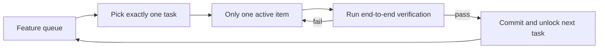
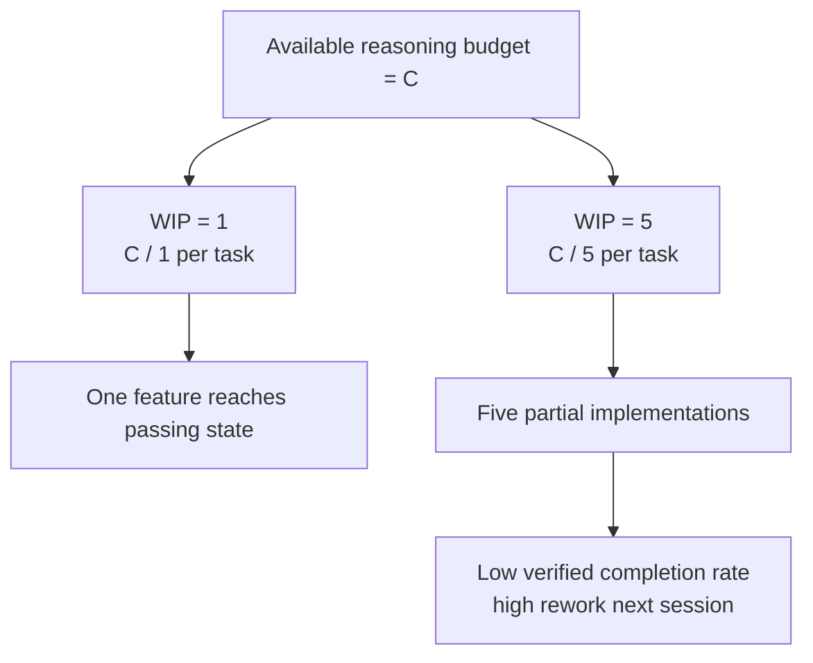

[中文版本 →](../../../zh/lectures/lecture-07-why-agents-overreach-and-under-finish/)

> أمثلة الكود: [code/](https://github.com/walkinglabs/learn-harness-engineering/blob/main/docs/ar/lectures/lecture-07-why-agents-overreach-and-under-finish/code/)
> مشروع عملي: [Project 04. Runtime feedback and scope control](./../../projects/project-04-incremental-indexing/index.md)

# المحاضرة 07. ارسم حدود مهمة واضحة للوكلاء

تطلب من Claude Code "إضافة مصادقة المستخدم إلى هذا المشروع"، فيبدأ بتعديل مخطط قاعدة البيانات، وكتابة المسارات، وتغيير مكونات الواجهة الأمامية، و — أثناء وجوده في ذلك — إعادة هيكلة middleware معالجة الأخطاء. بعد ساعتين تتفقد: 12 ملفًا معدّلًا، 800 سطر كود جديد، ولا ميزة واحدة تعمل من البداية للنهاية.

العض أكثر مما تستطيع مضغه — هذا القول ينطبق على وكلاء الذكاء الاصطناعي بشكل خاص. الوكلاء يولدون بدافع "فعل القليل الإضافي" — يرون أشياء مرتبطة فيتعاملون معها في الطريق، مثل شخص يذهب إلى السوبرماركت لزجاجة صلصة صويا ويخرج يدفع عربة كاملة. المشكلة هي أن البشر الذين يشترون أكثر مما ينب مضيعون للمال فقط؛ الوكلاء الذين يفعلون أشياء كثيرة في وقت واحد يعني أنه لا شيء يُنجز بشكل صحيح.

مقال مدونة Anthropic الهندسية "Effective harnesses for long-running agents" يوضح: عندما تكون prompts واسعة جدًا، يميل الوكلاء إلى "بدء أشياء متعددة في وقت واحد" بدلاً من "إنهاء شيء واحد أولًا." ممارسات OpenAI الهندسية لـ Codex وجدت نفس الشيء — المهام بدون ضوابط نطاق صريحة تشهد انهيارًا في معدلات الإكمال. هذه ليست مشكلة نموذج — إنها مشكلة harness. أنت لم ترسم الحدود.

## الانتباه مورد محدود

هذه ليست استعارة — إنها رياضيات. افترض أن سعة سياق الوكيل هي C ويُنشط k مهمة في وقت واحد. كل مهمة تحصل على متوسط C/k من موارد الاستدلال. عندما ينخفض C/k تحت الحد الأدنى المطلوب لإكمال مهمة واحدة، لا شيء يُنجز. معدتك بحجم محدد فقط — ضع عشر فطائر في وقت واحد ولن تهضمها جميعًا، بل ستحصل على عشر حالات عسر هضم.

السلوك الفعلي لـ Claude Code يوضح. اطلب منه "إضافة تسجيل مستخدم" وقد:

1. ينشئ نموذج User
2. يكتب مسار التسجيل
3. يلاحظ أنه يحتاج تحقق بريد إلكتروني، فيضيف خدمة بريد
4. يرى أن كلمات المرور تحتاج تجزئة، فيجلب bcrypt
5. يلاحظ أن معالجة الأخطاء غير متسقة، فيُعيد هيكلة middleware الأخطاء العام
6. يرى أن هيكل ملف الاختبار فوضوي، فيُعيد تنظيم الدليل

بعد ست خطوات، كل واحدة نصف مكتملة. بدون تحقق شامل، وارتباط معقد بين الكود غير المكتمل، والجلسة التالية التي ستلتقط القطع ستكون ضائعة تمامًا. مثل شخص يطبخ ستة أطباق في وقت واحد — كل طبق في المقلاة لكن لم يُقدم أي منها. جميعها تحترق.

البيانات التجريبية من Anthropic تدعم هذا مباشرة: الوكلاء الذين يستخدمون استراتيجية "الخطوة التالية الصغيرة" (ما يعادل WIP=1) يُظهرون معدل إكمال مهام أعلى بنسبة 37% من الوكلاء الذين يستخدمون prompts واسعة. والأكثر إثارة للاهتمام، أن عدد أسطر الكود التي يُنتجها الوكلاء مرتبط ارتباطًا سلبيًا ضعيفًا مع إكمال الميزات الفعلي — كود أكثر مكتوب، ميزات أقل مُنجزة. العض أكثر مما تستطيع مضغه، مُثبت بالبيانات.

## سير عمل WIP=1





## المفاهيم الأساسية

- **التجاوز (Overreach)**: الوكيل يُنشط مهامًا أكثر من المثالي في جلسة واحدة. إنه قابل للقياس — فعل 5 ميزات مع 0 نجحت شاملة هو تجاوز.
- **عدم الإكمال (Under-finish)**: نسبة المهام التي تجتاز التحقق الشامل، من إجمالي المهام المُنشطة، تنخفض عن الحد. كود مكتوب لكن اختبارات لا تنجح هو عدم إكمال.
- **حد WIP (حد العمل الجاري)**: من منهجية Kanban. الفكرة الأساسية: حدد عدد المهام الجارية في وقت واحد. للوكلاء، WIP=1 هو الإعداد الافتراضي الأكثر أمانًا — أنهِ واحدة قبل بدء التالية. مثل بوفيه — لا تُكدّس طبقك، أنهِ طبقًا ثم عد للطبق التالي.
- **دليل الإكمال**: الشرط القابل للتحقق الذي يجب أن تلبيه المهمة للانتقال من "قيد التنفيذ" إلى "مكتملة." بدون هذا، يستبدل الوكلاء "الكود يبدو جيدًا" بـ "السلوك يجتاز الاختبارات."
- **سطح النطاق**: هيكل DAG حيث كل عقدة هي وحدة عمل والحواف هي التبعيات. الحالات محدودة بأربعة: not_started، active، blocked، passing.
- **ضغط الإكمال**: القوة المقيدة التي يمارسها harness من خلال حدود WIP ومتطلبات دليل الإكمال، مُجبرًا الوكيل على إنهاء المهمة الحالية قبل بدء مهمة جديدة.

## التجاوز وعدم الإكمال متعايشان

هاتان المشكلتان ليستا مستقلتين — تُضخّم كل منهما الأخرى. التجاوز يُخفّف الانتباه، والانتباه المُخفّض يسبب عدم الإكمال، والكود نصف المكتوب المتبقي يزيد من تعقيد النظام، مما يزيد من دفع التجاوز في المهمة التالية. حلقة مفرغة.

بلغة Kanban: قانون ليتل يخبرنا أن L = lambda * W. إذا كان العمل الجاري L مرتفعًا جدًا (فعل أشياء كثيرة في وقت واحد)، فإن زمن التسليم W لكل مهمة يزداد حتمًا. للوكلاء، هذا يعني أن كل ميزة تستغرق وقتًا أطول من البداية حتى الإكمال المُتحقَق، واحتمالية الفشل تنمو.

هذه مشكلة قديمة في عالم البشر أيضًا — وثّق Steve McConnell في *Rapid Development* أن زحف النطاق هو السبب الرئيس لفشل المشاريع. لكن البشر لديهم على الأقل حدس "لقد أنجزت ما يكفي." الوكلاء ليس لديهم شيء. توليد الفكرة التالية يكلف النموذج تقريبًا صفر tokens إضافية — كتابة "دعني أصلح هذا أيضًا وأنا هنا" بالكاد يُسجَّل — لكن كل تعديل إضافي يُخفّف انتباه الوكيل. مثل بوفيه كل طبق إضافي فيه تكلفة حدية قريبة من الصفر، لكن معدتك بسعة محدودة.

## كيف تفعل ذلك بشكل صحيح

### 1. فرض WIP=1

هذه هي الطريقة الأكثر مباشرة وفعالية. في harness الخاص بك، أخبر الوكيل صراحةً: **مهمة واحدة فقط مسموح بها في حالة "active" في أي وقت.** في `CLAUDE.md` الخاص بـ Claude Code أو `AGENTS.md` الخاص بـ Codex، اكتب:

```
## Work Rules
- Work on one feature at a time
- Only start the next feature after the current one passes end-to-end verification
- Don't "also refactor" feature B while implementing feature A
```

مثل الأكل في بوفيه — طبق واحد في كل مرة، أنهِه قبل العود للمزيد.

### 2. حدد دليل إكمال صريح لكل مهمة

الإنجاز ليس "الكود مكتوب" — بل "التحقق من السلوك ناجح." في قائمة الميزات الخاصة بك، كل إدخال يحتاج أمر تحقق:

```
F01: User Registration
  Verification: curl -X POST /api/register -d '{"email":"test@example.com","password":"123456"}' | jq .status == 201
  State: passing
```

### 3. أخرج سطح النطاق إلى ملف خارجي

استخدم ملفًا قابلًا للقراءة آليًا (JSON أو Markdown) لتسجيل حالات كل المهام. أي جلسة جديدة يمكنها قراءة هذا الملف والمعرفة فورًا: أي مهمة نشطة؟ ما السلوك الذي يُحسب كمنجز؟ أي عمليات تحقق نجحت؟

### 4. راقب معدل الإكمال المُتحقَق

يجب على harness تتبع VCR (معدل الإكمال المُتحقَق) = مهام مُتحقَقة / مهام مُنشطة باستمرار. احظر تنشيط مهام جديدة عندما يكون VCR < 1.0.

## حالة من الواقع

مشروع REST API مع 8 ميزات، استراتيجيتان مقارنتان:

**وضع البوفيه (غير مقيد)**: الوكيل يُنشط 5 ميزات في وقت واحد في الجلسة 1. يُنتج ~800 سطر عبر 12 ملفًا. معدل نجاح اختبار شامل: 20% — فقط تسجيل المستخدم يعمل. الميزات الأربع الأخرى: مخطط قاعدة بيانات مُنشأ لكن ينقصه منطق التحقق، مسارات محددة لكنها تُعيد تنسيقات استجابة خاطئة. مثل شخص يطبخ ستة أطباق في وقت واحد، واحد فقط بالكاد صالح للأكل. بنهاية الجلسة 3، فقط 3 من 8 ميزات مكتملة.

**وضع الطبق الواحد (WIP=1)**: الوكيل يعمل على تسجيل المستخدم فقط في الجلسة 1. يُنتج ~200 سطر عبر 4 ملفات. اختبارات شاملة: 100% ناجحة. يُنفذ commit لتطبيق نظيف ومُتحقَق. بنهاية الجلسة 4، 7 من 8 ميزات مكتملة (الثامنة محجوبة بتبعية خارجية).

النتيجة: كود إجمالي أقل (800 مقابل 1200 سطر) لكن كود أكثر فعالية. معدل الإكمال: 87.5% مقابل 37.5%. خذ قضمة واحدة في كل مرة، وتأكل فعليًا أكثر.

## الخلاصات الأساسية

- **WIP=1 هو الإعداد الافتراضي الآمن لـ harness الوكلاء** — أنهِ واحدة، ثم ابدأ التالية؛ لا تحاول التوازي. لا يمكنك أن تسمن في قضمة واحدة.
- **دليل الإكمال يجب أن يكون قابلًا للتنفيذ** — "الكود يبدو جيدًا" لا يُحسب؛ "curl يُعيد 201" نعم.
- **سطح النطاق يجب أن يُخرَج كملف** — ليس فقط مذكورًا في المحادثة، بل مسجّلًا بتنسيق قابل للقراءة آليًا في المستودع.
- **التجاوز وعدم الإكمال متعايشان** — حل أحدهما يحل الآخر.
- **"افعل أقل لكن أنهِ" دائمًا يتفوق على "افعل أكثر لكن اترك نصفه غير مكتمل"** — أسطر كود الوكيل ومعدل إكمال الميزات مرتبطان سلبيًا. الجودة دائمًا تتفوق على الكمية.

## قراءات إضافية

- [Effective harnesses for long-running agents - Anthropic](https://www.anthropic.com/engineering/effective-harnesses-for-long-running-agents) — مدونة Anthropic الهندسية، مناقشة تفصيلية لاستراتيجية "الخطوة التالية الصغيرة"
- [Harness Engineering - OpenAI](https://openai.com/index/harness-engineering/) — المعالجة الكاملة لـ OpenAI لهندسة harness
- [Kanban: Successful Evolutionary Change - David Anderson](https://www.goodreads.com/book/show/1070822.Kanban) — المصدر الكلاسيكي حول حدود WIP
- [Rapid Development - Steve McConnell](https://www.goodreads.com/book/show/125171.Rapid_Development) — بيانات تجريبية حول زحف النطاق بصفته السبب الرئيس لفشل المشاريع

## تمارين

1. **تنوي المهام**: اختر متطلبًا واسعًا (مثلًا، "نفّذ نظام إدارة مستخدمين") وقسّمه إلى 5 وحدات عمل ذرية على الأقل. لكل وحدة، حدد: (a) وصف سلوك واحد، (b) أمر تحقق قابل للتنفيذ، (c) التبعيات. تحقق مما إذا كان التحلل يلبي قيد WIP=1.

2. **تجربة مقارنة**: شغّل نفس المشروع مرتين — مرة بدون قيود، ومرة مع WIP=1 مفروض. قارن: معدل الإكمال المُتحقَق، وإجمالي أسطر الكود، ونسبة الكود الفعال.

3. **تدقيق دليل الإكمال**: راجع مخرجات تشغيل وكيل حديث، وصنّف كل تغيير كود بصفته "سلوك مكتمل،" أو "سلوك غير مكتمل،" أو "هيكل أولي." أضف أوامر تحقق مفقودة لكل سلوك غير مكتمل.
