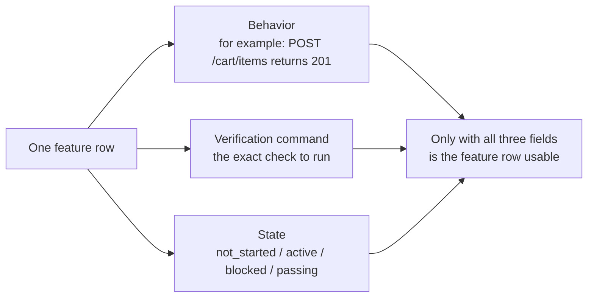
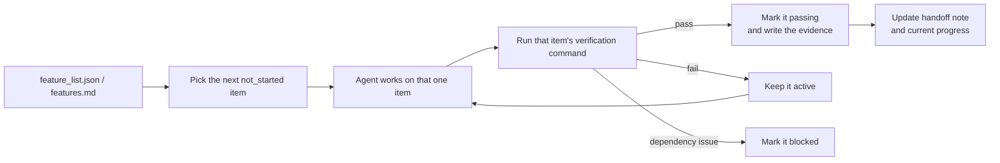

[中文版本 →](../../../zh/lectures/lecture-08-why-feature-lists-are-harness-primitives/)

> أمثلة الكود: [code/](https://github.com/walkinglabs/learn-harness-engineering/blob/main/docs/ar/lectures/lecture-08-why-feature-lists-are-harness-primitives/code/)
> مشروع عملي: [Project 04. Runtime feedback and scope control](./../../projects/project-04-incremental-indexing/index.md)

# المحاضرة 08. استخدم قوائم الميزات لتقييد الوكيل

تطلب من agent بناء موقع تجارة إلكترونية. بعد أن ينتهي، يخبرك "انتهيت". تنظر إلى الكود — مصادقة المستخدم تعمل، لكن زر الدفع في سلة التسوق لا يفعل شيئًا، وتدفق الدفع غير متصل على الإطلاق. المشكلة: لم تخبره أبدًا ما يعنيه "انتهيت"، لذا استخدم معياره الخاص — "كتبت الكثير من الكود ويبدو مكتملًا إلى حد ما."

قوائم الميزات، في نظر الكثير من الناس، هي مجرد مذكرة — اكتب الأشياء حتى لا تنساها، ثم ألقِها جانبًا. لكن في عالم harness، قائمة الميزات ليست مذكرة للبشر — إنها العمود الفقري لـ harness بالكامل. يعتمد المجدول عليها لاختيار المهام، ويعتمد المدقق عليها للحكم على الاكتمال، ويعتمد مُعدّ التسليم عليها لإنشاء الملخصات. اكسر العمود الفقري والجسم كله يشل.

تشدد كل من Anthropic و OpenAI: **يجب إخراج القطع الأثرية (artifacts) إلى الخارج.** يجب أن تعيش حالة الميزة في ملف قابل للقراءة آليًا في المستودع، وليس في نص محادثة غير منظم.

## الوكلاء لا يعرفون ما يعنيه "انتهيت"

لا يعرف Claude Code ولا Codex تلقائيًا ما تقصده بـ "انتهيت". تقول "أضف ميزة سلة تسوق"، وقد يكون تفسير النموذج "اكتب مكوّن Cart ودالة addToCart." لكنك كنت تقصد "يمكن للمستخدم تصفح المنتجات وإضافتها إلى السلة وإتمام الشراء من البداية إلى النهاية." تستمر هذه الفجوة في الفهم بدون قائمة ميزات. يستخدم agent معياره الضمني الخاص — عادةً "الكود ليس به أخطاء بناء جملة واضحة." ما تحتاجه هو تحقق سلوكي شامل. مثلما تطلب من صديق أن يشتري لك فاكهة — تقول "احضر بعض الفاكهة" فيعود بالليمون. فاكهته وفاكهتك ليستا نفس الفاكهة.

انظر إلى ملاحظة التقدم الشائعة هذه:

```
Did user auth, shopping cart mostly done, still need payments
```
هل يمكن لجلسة agent جديدة الإجابة على هذه الأسئلة من هذه الملاحظة؟ ماذا يعني "مكتملة إلى حد كبير"؟ أي اختبارات اجتازتها السلة؟ ما الذي يعيق المدفوعات؟ الإجابة على الكل هي "لا أحد يعرف." مثلما تخبر طبيبك "معدتي تؤلمني، كنت بخير مؤخرًا" — أي دواء يمكنه وصفه؟

النتيجة: تقضي الجلسة الجديدة 20 دقيقة في استنتاج حالة المشروع، وقد تعيد تنفيذ الميزات المكتملة. تُظهر بيانات هندسة Anthropic أن سجلات التقدم الجيدة تقلل وقت تشخيص بدء الجلسة بنسبة 60-80%.

## آلة حالة الميزات





## المفاهيم الأساسية

- **قوائم الميزات هي عناصر بدائية في harness**: ليست "أدوات تخطيط اختيارية"، بل هي هياكل بيانات أساسية تعتمد عليها جميع مكونات harness الأخرى. مثل هياكل جداول قاعدة البيانات — لا يمكنك أن تقول "لن نتخطى المفاتيح الأساسية."
- **البنية الثلاثية**: كل عنصر ميزة هو ثلاثية `(وصف السلوك، أمر التحقق، الحالة الحالية)`. غياب أي عنصر يجعل العنصر غير مكتمل.
- **نموذج آلة الحالة**: لكل عنصر ميزة أربع حالات — `not_started`، `active`، `blocked`، `passing`. تُ controlled انتقالات الحالة بواسطة harness، وليست قابلة للتغيير بحرية من agent.
- **بوابة حالة الاجتياز**: الطريقة الوحيدة لانتقال ميزة من `active` إلى `passing` هي تنفيذ أمر التحقق بنجاح. هذا لا رجعة فيه — بمجرد أن يصبح `passing`، لا يمكنه العودة. مثل اجتياز امتحان يعني أنك اجتزته، لا يمكنك تغيير الدرجة بأثر رجعي.
- **مصدر حقيقة واحد**: يجب أن تُستمد جميع المعلومات حول "ما يجب فعله" من قائمة ميزات واحدة. لا تناقضات بين قائمة الميزات وسجل المحادثة.
- **الضغط العكسي**: عدد الميزات التي لم تجتز بعد هو الضغط الذي يمارسه harness على agent. ضغط صفري = المشروع مكتمل.

## لماذا يجب أن تكون قوائم الميزات "عناصر بدائية"

المستندات للبشر ليقرأوها؛ العناصر البدائية للأنظمة لتنفذها. يمكن تجاهل المستندات؛ لا يمكن تجاوز العناصر البدائية.

فكر في الأمر مثل قيود مشغلات قاعدة البيانات مقابل عمليات التحقق في طبقة التطبيق: الأولى تُفرض بواسطة محرك قاعدة البيانات، لا يمكن لأي SQL تخطيها؛ الثانية تعتمد على صحة كود التطبيق ويمكن تجاوزها عن طريق الخطأ. قوائم الميزات كعناصر بدائية في harness — تحديدًا، تخدم قائمة الميزات أربعة مكونات من harness:

1. **المجدول**: يقرأ الحالات، يختار ميزة `not_started` التالية. مثل نظام تخطيط الإنتاج في المصنع.
2. **المدقق**: ينفذ أوامر التحقق، يقرر ما إذا كان سيسمح بانتقالات الحالة. مثل فحص الجودة.
3. **مُعدّ التسليم**: ينشئ تلقائيًا ملخصات تسليم الجلسة من قائمة الميزات. مثل تقرير تغيير الوردية التلقائي.
4. **متتبع التقدم**: يحصي توزيع الحالات، يوفر مقاييس صحة المشروع. مثل لوحة المعلومات.

## كيف تفعل ذلك بشكل صحيح

### 1. حدد تنسيق قائمة ميزات بسيط

لا تحتاج إلى نظام معقد — ملف Markdown أو JSON منظم يكفي. المفتاح هو أن كل إدخال يجب أن يمتلك الثلاثية:

```json
{
  "id": "F03",
  "behavior": "POST /cart/items with {product_id, quantity} returns 201",
  "verification": "curl -X POST http://localhost:3000/api/cart/items -H 'Content-Type: application/json' -d '{\"product_id\":1,\"quantity\":2}' | jq .status == 201",
  "state": "passing",
  "evidence": "commit abc123, test output log"
}
```

### 2. دع harness يتحكم في انتقالات الحالة

لا يمكن لـ agent تغيير حالة ميزة مباشرة إلى `passing`. يمكنه فقط تقديم طلب تحقق؛ ينفذ harness أمر التحقق ويقرر ما إذا كان سيسمح بالانتقال. هذه هي "بوابة حالة الاجتياز."

### 3. اكتب القواعد في CLAUDE.md

```
## Feature List Rules
- Feature list file: /docs/features.md
- Only one feature active at a time
- Verification command must pass before marking as passing
- Don't modify feature list states yourself — the verification script updates them automatically
```

### 4. معايرة الدقة

يجب أن يكون نطاق كل عنصر ميزة "قابل للإنجاز في جلسة واحدة." واسع جدًا ولن ينتهي؛ ضيق جدًا وتزداد تكلفة الإدارة. "يمكن للمستخدم إضافة عناصر إلى السلة" دقة جيدة. "تنفيذ سلة التسوق" واسع جدًا. "إنشاء حقل الاسم في نموذج Cart" ضيق جدًا. مثل تقطيع شريحة لحم — ليس القطعة كاملة، وليست لحماً مفروماً.

## حالة من العالم الحقيقي

منصة تجارة إلكترونية مع 10 ميزات. مقارنة نهجي تتبع:

**وضع المذكرة**: يستخدم agent ملاحظات غير منظمة. بعد 3 جلسات، تصبح الملاحظات "تمت مصادقة المستخدم وقائمة المنتجات، سلة التسوق مكتملة إلى حد كبير لكن بها أخطاء، المدفوعات لم تبدأ." تحتاج الجلسة الجديدة إلى 20 دقيقة لاستنتاج الحالة، وتعيد تنفيذ الميزات المكتملة في النهاية. مثل قائمة تسوقك التي تقول "حليب، خبز، وذلك الشيء" — في المتجر، ما زلت لا تعرف ماذا تشتري.

**وضع العمود الفقري**: كل ميزة لها حالة واضحة وأمر تحقق. تقرأ الجلسة الجديدة قائمة الميزات وتعرف في 3 دقائق: F01-F05 `passing`، F06 `active`، F07-F10 `not_started`. تستأنف من F06 مباشرة، صيانة صفرية.

النتيجة المُقاسة: تُظهر المشاريع التي تستخدم قوائم ميزات منظمة معدل إنجاز ميزات أعلى بنسبة 45% من التتبع الحر، مع صفر عمليات تنفيذ مكررة.

## الخلاصات الأساسية

- **قوائم الميزات هي العمود الفقري لـ harness**، وليست مذكرات للبشر. المجدول والمدقق ومُعدّ التسليم يعتمدون عليها جميعًا.
- **كل عنصر ميزة يجب أن يمتلك الثلاثية**: وصف السلوك + أمر التحقق + الحالة الحالية. غياب عنصر واحد يجعله غير مكتمل — مثل كرسي بثلاث أرجل ينقصه ساق.
- **انتقالات الحالة يتحكم فيها harness** — لا يمكن لـ agent تغيير الحالات بمفرده. اجتياز التحقق = مسار الترقية الوحيد.
- **قائمة الميزات هي مصدر الحقيقة الوحيد للمشروع** — جميع معلومات "ماذا نفعل" تُستمد من قائمة واحدة.
- **عاير الدقة إلى "قابل للإنجاز في جلسة واحدة."**

## قراءات إضافية

- [Building Effective Agents - Anthropic](https://www.anthropic.com/research/building-effective-agents) — يحدد صراحةً قائمة الميزات باعتبارها "هيكل البيانات الأساسي" للتحكم في نطاق agent
- [Harness Engineering - OpenAI](https://openai.com/index/harness-engineering/) — يؤكد على مبدأ "إخراج القطع الأثرية إلى الخارج"
- [Design by Contract - Bertrand Meyer](https://www.goodreads.com/book/show/130439.Object_Oriented_Software_Construction) — مبادئ تصميم العقود، الأساس النظري لقوائم الميزات
- [How Google Tests Software](https://www.goodreads.com/book/show/13563030-how-google-tests-software) — هرم الاختبار وممارسات هندسة المواصفات السلوكية

## تمارين

1. **تصميم قائمة الميزات**: حدد مخطط JSON بسيط لقائمة ميزات. يتضمن: المعرّف، وصف السلوك، أمر التحقق، الحالة الحالية، مرجع الدليل. استخدمه لوصف مشروع حقيقي مع 5 ميزات.

2. **مقارنة صرامة التحقق**: اختر 3 ميزات وصمم تحققًا "مرنًا" (مثلاً، "الكود ليس به أخطاء بناء جملة") وتحققًا "صارمًا" (مثلاً، "اختبار شامل يجتاز"). قارن معدل الإيجابيات الكاذبة تحت كل نهج.

3. **تدقيق مبدأ المصدر الوحيد**: راجع مشروع agent موجود وتحقق من معلومات النطاق التي تتعارض مع قائمة الميزات (متطلبات ضمنية في المحادثات، تعليقات TODO في الكود، إلخ). صمم خطة لتوحيد جميع المعلومات في قائمة الميزات.
