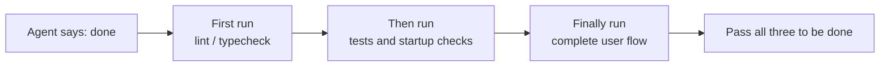
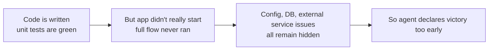

[中文版本 →](../../../zh/lectures/lecture-09-why-agents-declare-victory-too-early/)

> Code examples for this lecture: [code/](https://github.com/walkinglabs/learn-harness-engineering/blob/main/docs/ar/lectures/lecture-09-why-agents-declare-victory-too-early/code/)
> Hands-on practice: [Project 05. Let the agent verify its own work](./../../projects/project-05-grounded-qa-verification/index.md)

# المحاضرة 09. منع الوكلاء من إعلان النجاح مبكرًا

تطلب من agent تنفيذ ميزة "إعادة تعيين كلمة المرور". يُعدّل مخطط قاعدة البيانات، ويكتب نقطة نهاية API، ويضيف قالب البريد الإلكتروني، ويشغّل اختبارات الوحدة (جميعها تجتاز)، ثم يخبرك بثقة "انتهيت." عندما تحاول تشغيله فعليًا — لا يمكن إرسال رابط إعادة تعيين كلمة المرور (نقص إعدادات خدمة البريد)، تفشل عملية ترحيل قاعدة البيانات في منتصف الطريق (عدم اتساق المخطط)، ولم يتم تنفيذ التدفق الشامل ولو لمرة واحدة.

هذا الشعور لا ينبغي أن يكون غير مألوف — إنه مثل ملء ورقة الامتحان بالكامل، وأن تكون أول من يسلمها بثقة، فقط لترسب عند خروج الدرجات. مجرد أن الورقة ممتلئة لا يعني أن الإجابات صحيحة.

هذه ليست حادثة معزولة. أثبتت الورقة البحثية الكلاسيكية من ICML 2017 لـ Guo وآخرين: **الشبكات العصبية الحديثة مفرطة الثقة بشكل منهجي** — الثقة التي تُبلغ عنها النماذج أعلى بكثير من دقتها الفعلية. ينطبق الشيء نفسه على وكلاء البرمجة بالذكاء الاصطناعي: هم "يشعرون" أنهم انتهوا، لكن في الواقع، هم بعيدون عن ذلك. يجب أن يحل harness خاصتك محل "مشاعر" agent بتحقق خارجي قائم على التنفيذ.

## المنحدر الزلق

إعلانات الاكتمال المبكر تتبع دائمًا تقريبًا نفس النمط: الكود يبدو جيدًا — البنية صحيحة، المنطق يبدو معقولًا، والتحليل الثابت لا يظهر أخطاء واضحة. لكن harness لا يفرض تحققًا شاملاً قائمًا على التنفيذ، لذا يتخطى agent التشغيل الفعلي أو يشغّل اختبارات جزئية فقط. يشغّل اختبارات الوحدة لكن يتخطى اختبارات التكامل؛ يشغّل الاختبارات لكن لا يتحقق من التغطية. في النهاية، "الكود يبدو جيدًا" يُتخذ كدليل على أن "الميزة مكتملة." وتُسلم ورقة الامتحان.

تُفقد المعلومات في كل خطوة. من مواصفات المهام إلى تنفيذ الكود إلى السلوك وقت التشغيل، كل تحول يمكن أن يُدخل انحيازًا، وكل تحقق متخطع يزيد من تفاقم عدم تماثل المعلومات.

## فحص الإنهاء ثلاثي الطبقات





## المفاهيم الأساسية

- **إعلان الاكتمال المبكر**: يؤكد agent أن المهمة مكتملة، لكن مواصفات الصحة غير المُستوفاة لا تزال قائمة. المشكلة الأساسية: يحكم agent بناءً على الثقة المحلية على مستوى الكود، بينما تتطلب الصحة على مستوى النظام تحققًا شاملاً.
- **انحياز معايرة الثقة**: الفجوة المنهجية بين الثقة المُبلغ عنها ذاتيًا من agent في الاكتمال وجودة الاكتمال الفعلية. للمهام المعقدة متعددة الملفات، هذا الانحياز إيجابي بشكل كبير — agent دائمًا أكثر ثقة مما يؤديه فعليًا. تمامًا مثل الطالب الذي يبالغ دائمًا في تقدير درجته بعد الامتحان.
- **معايير الإنهاء**: مجموعة واضحة وقابلة للتنفيذ من شروط الحكم مُعرّفة في harness. يجب أن يلبي agent جميع الشروط قبل إعلان الاكتمال. يتحول "انتهيت" من حكم ذاتي إلى تحديد موضوعي.
- **البوابة المزدوجة للتحقق والاعتماد**: طبقة التحقق الأولى تتحقق "هل نفّذ الكود السلوك المحدد بشكل صحيح"؛ طبقة الاعتماد الثانية تتحقق "هل يلبي السلوك على مستوى النظام المتطلبات الشاملة". كلتاهما يجب أن تجتاز ليُعتبر مكتملًا.
- **إشارات التغذية الراجعة وقت التشغيل**: السجلات وحالات العمليات وفحوصات الصحة من تنفيذ البرنامج. هذا هو الأساس الموضوعي لـ harness ليحكم على جودة الاكتمال.
- **قيد أولوية الاكتمال**: تحقق أولاً من الصحة الوظيفية، ثم تعامل مع الأداء، وأخيرًا عالج الأسلوب. يُمنع إعادة الهيكلة حتى يتم التحقق من الوظائف الأساسية.

## اجتياز اختبارات الوحدة ≠ المهمة مكتملة

هذا هو الفخ الأكثر شيوعًا، والأخطر. كتب agent الكود، شغّل اختبارات الوحدة، حصل على الأخضر كله، وقال "انتهيت." لكن فلسفة تصميم اختبارات الوحدة — عزل الوحدة قيد الاختبار ومحاكاة التبعيات — هي بالضبط ما يجعلها غير قادرة على اكتشاف مشاكل عبر المكونات:

**عدم تطابق الواجهة**: مسار الملف الذي يمرره عرض (render process) إلى preload script هو مسار نسبي، لكن preload script يتوقع مسارًا مطلقًا. اختبارات الوحدة الخاصة بكل منهما استخدمت محاكيات (mocks) واجتازت. لا تُكتشف المشكلة إلا خلال الاختبار الشامل. مثل كل موسيقي في فرقة يتدرب بشكل مثالي بمفرده، ليدركوا فقط أنهم في مفاتيح مختلفة عند العزف معًا.

**أخطاء انتشار الحالة**: ترحيل قاعدة بيانات يُغيّر مخطط الجدول، لكن طبقة تخزين ORM المؤقت لا تزال تحتفظ بمداخل مخزنة للمخطط القديم. توفر اختبارات الوحدة بيئة محاكاة جديدة في كل مرة، مما لن يكشف عدم اتساق الحالة هذا عبر الطبقات.

**اعتماد البيئة**: يتصرف الكود بشكل صحيح في بيئة الاختبار (حيث كل شيء مُحاكى) لكنه يفشل في البيئة الحقيقية بسبب اختلافات الإعدادات أو زمن استجابة الشبكة أو عدم توفر الخدمة. مثل الغناء بشكل مثالي في غرفة البروفة، لكن مواجهة مشاكل في المعدات الصوتية على المسرح.

### "إعادة الهيكلة أثناء ذلك" سُم ل حكم الاكتمال

لدى Claude Code نمط سلوكي شائع: يبدأ في إعادة هيكلة الكود وتحسين الأداء وتحسين الأسلوب قبل أن تجتاز الوظائف الأساسية التحقق. اقتباس Knuth، "التحسين المبكر هو جذر كل الشرور،" يأخذ معنى جديدًا في سيناريو agent — إعادة الهيكلة تُغيّر الحدود بين الكود المُتحقق منه وغير المُتحقق منه، مما قد يكسر مسارات كود كانت صحيحة ضمنيًا سابقًا. الأمر يشبه إعادة نسخ إجاباتك متعددة الخيارات لتحسين التنسيق قبل أن تنهي أسئلة المقالة الرياضية — ليس فقط يضيع الوقت، بل قد تنسخها بشكل خاطئ.

### الانحياز المنهجي في التقييم الذاتي

اكتشفت Anthropic نمط فشل أعمق في أبحاثها لعام 2026: **عندما يُطلب من agent تقييم عمله الخاص، يقدم تقييمات إيجابية بشكل مفرط بشكل منهجي — حتى عندما يرى مراقب بشري أن الجودة دون المستوى بوضوح.** هذا مثل طلب من طالب تصحيح امتحانه بنفسه — سيكون دائمًا متساهلاً بشكل خاص مع إجاباته الخاصة.

هذه المشكلة شديدة بشكل خاص في المهام الذاتية (مثل جماليات التصميم) — ما إذا كان "التصميم متقنًا" هو حكم تقديري، وagent يميل بشكل موثوق إلى الإيجابية. حتى في المهام ذات النتائج القابلة للتحقق، يمكن أن يتأثر أداء agent بسبب ضعف الحكم.

الحل ليس جعل agent "أكثر موضوعية" — النموذج نفسه الذي يُنشئ ويُقيّم يميل بطبيعته إلى الكرم مع نفسه. **الحل هو فصل "العامل" عن "المدقق".** تمامًا كما لا ينبغي للطالب تصحيح امتحانه — تحتاج إلى مصحح مستقل.

agent تقييم مستقل، مُضبوط خصيصًا ليكون "صارمًا"، أكثر فعالية بكثير من جعل agent المُنشئ يُقيّم نفسه. بيانات تجريبية من Anthropic:

| Architecture | Runtime | Cost | Core Features Working? |
|--------------|---------|------|------------------------|
| Single Agent (bare run) | 20 mins | $9 | No (game entities unresponsive to input) |
| Three Agents (planner + generator + evaluator) | 6 hours | $200 | Yes (game is fully playable) |

هذا هو نفس النموذج بالضبط (Opus 4.5) مع نفس الموجه بالضبط ("build a 2D retro game editor"). الفرق الوحيد هو harness — من "التشغيل المجرّد" إلى "المخطط يُوسّع المتطلبات ← المُنشئ ينفذ ميزة بميزة ← المُقيّم يقوم باختبار النقر الفعلي باستخدام Playwright".

> المصدر: [Anthropic: Harness design for long-running application development](https://www.anthropic.com/engineering/harness-design-long-running-apps)

## كيف تمنع التسليم المبكر

### 1. خارجنة حكم الإنهاء

لا ينبغي أن يُصدر حكم الاكتمال من agent نفسه. يجب أن ينفذ harness بشكل مستقل تحقق الإنهاء، مستخدمًا إشارات وقت التشغيل كمدخلات، وليس ثقة agent. اكتب هذا بوضوح في `CLAUDE.md`:

```
## Definition of Done
- Feature complete = end-to-end verification passed, not "code is written"
- Required verification levels:
  1. Unit tests pass
  2. Integration tests pass
  3. End-to-end flow verification passes
- Do not proceed to level 2 if level 1 fails
- Do not proceed to level 3 if level 2 fails
```

### 2. ابنِ تحقق إنهاء ثلاثي الطبقات

- **الطبقة 1: التحليل البنيوي والثابت**. الأقل تكلفة، الأقل معلومات، لكن يجب أن تجتاز. هذا هو الحد الأدنى من الفحص — يجب أن تهجو الكلمات بشكل صحيح قبل أن ننظر إلى أي شيء آخر.
- **الطبقة 2: تحقق السلوك وقت التشغيل**. تنفيذ الاختبارات، فحوصات بدء التطبيق، التحقق من المسارات الحرجة. هذا هو الدليل الأساسي على الاكتمال. لا يكفي أن تكتبه فقط؛ يجب أن يعمل.
- **الطبقة 3: التأكيد على مستوى النظام**. الاختبار الشامل، تحقق التكامل، محاكاة سيناريوهات المستخدم. الخط الدفاعي الأخير ضد الإعلانات المبكرة. لا يكفي أن يعمل؛ يجب أن يعمل بشكل صحيح.

### 3. صمم "تعليمات بالقلم الأحمر" جيدة للوكلاء

قدمت OpenAI نمطًا فعالًا بشكل خاص خلال ممارسات Codex الخاصة بها: **يجب أن تتضمن رسائل الخطأ للوكلاء تعليمات الإصلاح**. لا ترسم فقط علامة حمراء كبيرة مثل مصحح كسول؛ كن مثل معلم جيد واكتب "هكذا يجب أن تُغيّر هذا" في الهوامش. لا تستخدم `"Test failed"`، بل استخدم `"Test failed: POST /api/reset-password returned 500. Check that the email service config exists in environment variables. The template file should be at templates/reset-email.html."` هذه التغذية الراجعة المحددة والقابلة للتنفيذ تسمح لـ agent بتصحيح نفسه بدون تدخل بشري.

### 4. التقط إشارات وقت التشغيل

تشمل إشارات وقت التشغيل الفعالة:
- هل بدأ التطبيق بنجاح ووصل إلى حالة الاستعداد؟
- هل نُفذت مسارات الميزات الحرجة بنجاح وقت التشغيل؟
- هل كانت عمليات كتابة قاعدة البيانات وعمليات الملفات والآثار الجانبية الأخرى صحيحة؟
- هل تم تنظيف الموارد المؤقتة؟

## حالة من العالم الحقيقي

**المهمة**: تنفيذ وظيفة إعادة تعيين كلمة مرور المستخدم. تتضمن عمليات قاعدة البيانات وإرسال البريد الإلكتروني وتعديلات نقطة نهاية API.

**مسار التسليم المبكر**: يُعدّل agent مخطط قاعدة البيانات، يكتب نقطة نهاية API، يضيف قالب بريد إلكتروني، يشغّل اختبارات الوحدة (تجتاز)، ويُعلن الاكتمال. ورقة الامتحان ممتلئة بالكامل.

**خصومات الدرجات الفعلية**: (1) التدفق الشامل غير مُختبَر — لم يتم تأكيد الإرسال والتحقق الفعلي لرابط إعادة التعيين أبدًا. (2) فشل ترحيل قاعدة البيانات بعد التنفيذ الجزئي، مما تسبب في عدم اتساق المخطط. (3) إعدادات خدمة البريد الإلكتروني كانت مفقودة في البيئة المستهدفة.

**تدخل harness**: فُرض تحقق الإنهاء — (1) بدء التطبيق الكامل للتحقق من إمكانية الوصول لنقطة نهاية إعادة التعيين؛ (2) تنفيذ تدفق إعادة التعيين الكامل؛ (3) التحقق من اتساق حالة قاعدة البيانات. وُجدت جميع العيوب خلال الجلسة، مما وفر 5-10 أضعاف تكلفة الإصلاحات اللاحقة. المصحح المستقل وجد المشاكل الحقيقية.

## الخلاصات الأساسية

- **الوكلاء مفرطو الثقة بشكل منهجي** — انحياز معايرة الثقة هو حقيقة موضوعية. ملء ورقة الامتحان لا يعني أن إجاباتك صحيحة.
- **يجب خارجنة حكم الاكتمال** — harness يتحقق بشكل مستقل؛ لا تثق بـ "مشاعر" agent. لا يمكن للطلاب تصحيح امتحاناتهم بأنفسهم.
- **جميع طبقات التحقق الثلاث ضرورية** — اجتياز البنية، اجتياز السلوك، اجتياز النظام، التقدم طبقة تلو طبقة.
- **يجب أن تكون رسائل الخطأ مثل تعليمات القلم الأحمر لمعلم جيد** — تتضمن خطوات إصلاح محددة حتى يتمكن agent من تصحيح نفسه.
- **لا إعادة هيكلة حتى يتم التحقق من الوظائف الأساسية** — قيد أولوية الاكتمال هو المفتاح لمنع التحسين المبكر.

## قراءات إضافية

- [On Calibration of Modern Neural Networks - Guo et al.](https://arxiv.org/abs/1706.04599) — يثبت أن الشبكات العصبية العميقة الحديثة مفرطة الثقة بشكل منهجي
- [Building Effective Agents - Anthropic](https://www.anthropic.com/research/building-effective-agents) — الدور الحاسم لأدلة وقت التشغيل في حكم الاكتمال
- [Harness Engineering - OpenAI](https://openai.com/index/harness-engineering/) — إعلان الاكتمال المبكر هو أحد أنماط الفشل الرئيسية للوكلاء
- [The Art of Software Testing - Myers](https://www.goodreads.com/book/show/137543.The_Art_of_Software_Testing) — مرجع كلاسيكي حول تدرجات منهجية الاختبار وفعاليتها

## تمارين

1. **تصميم وظيفة تحقق الإنهاء**: صمم تحقق إنهاء كامل لمهمة تتضمن ترحيل قاعدة بيانات وتعديل API. اذكر إشارات وقت التشغيل المطلوبة ومعايير النجاح/الفشل لكل إشارة. شغّله على مهمة حقيقية وسجّل المشاكل المخفية التي يجدها.

2. **قياس انحياز المعايرة**: اختر 10 مهام برمجية من أنواع مختلفة، وسجّل ثقة agent المُبلغ عنها ذاتيًا في الاكتمال مقابل جودة الاكتمال الفعلية. احسب قيمة الانحياز وحلل علاقتها بتعقيد المهمة.

3. **تجربة الدفاع متعدد الطبقات**: شغّل ثلاثة تكوينات على نفس مجموعة المهام — (أ) تحليل ثابت فقط، (ب) إضافة اختبار الوحدات، (ج) تحقق ثلاثي الطبقات كامل. قارن نسبة إعلانات الاكتمال المبكر وعدد العيوب غير المُكتشفة.
