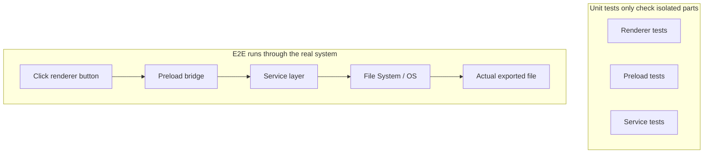
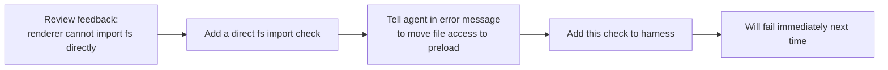

[中文版本 →](../../../zh/lectures/lecture-10-why-end-to-end-testing-changes-results/)

> Code examples for this lecture: [code/](https://github.com/walkinglabs/learn-harness-engineering/blob/main/docs/ar/lectures/lecture-10-why-end-to-end-testing-changes-results/code/)
> Hands-on practice: [Project 05. Let the agent verify its own work](./../../projects/project-05-grounded-qa-verification/index.md)

# المحاضرة 10. الاختبار end-to-end هو التحقق الحقيقي

تطلب من agent إضافة ميزة تصدير ملفات إلى تطبيق Electron. يكتب مكوّن عرض (render process) وpreload script ومنطق طبقة الخدمة. اختبارات الوحدة لكل مكون تجتاز بشكل مثالي. يقول agent "انتهيت." عندما تنقر فعليًا على زر التصدير — تنسيق مسار الملف خاطئ، شريط التقدم لا يُحدَّث، وتصدير الملفات الكبيرة يسبب تسربًا في الذاكرة. خمسة عيوب في حدود المكونات، واختبارات الوحدة لم تكتشف أيًا منها.

إنه مثل بروفة جوقة — كل جزء صوتي يبدو مثاليًا عند الغناء بشكل فردي، لكن عند الغناء معًا، السوبرانو أسرع بنصف نبضة من الباصات، والمرافقة بعيدة نصف نغمة عن اللحن الرئيسي. كل جزء "صحيح" بمفرده، لكن الكل غير متناغم.

يخبرنا هرم اختبار Google: عدد كبير من اختبارات الوحدة هو الأساس، لكن إذا توقفت هناك، ستفوت بشكل منهجي مشاكل تفاعل المكونات. بالنسبة لوكلاء البرمجة بالذكاء الاصطناعي، هذه المشكلة أكثر حدة — agent يميل إلى تشغيل أسرع الاختبارات فقط ثم إعلان الاكتمال. **فقط الاختبار end-to-end يمكنه إثبات أن العيوب على مستوى النظام غير موجودة.**

## النقاط العمياء لاختبار الوحدات

فلسفة تصميم اختبار الوحدات هي العزل — محاكاة التبعيات والتركيز فقط على الوحدة قيد الاختبار. هذه الفلسفة تجعل اختبار الوحدات سريعًا ودقيقًا، لكنها تخلق أيضًا نقاطًا عمياء منهجية. الأمر كمثل جعل كل جزء صوتي يتدرب بسماعات أثناء بروفة الجوقة — يبدو جيدًا لهم، لكن المشاكل تظهر فقط عندما يجتمعون:

**عدم تطابق الواجهة**: مسار الملف الذي يمرره عرض (render process) إلى preload script هو مسار نسبي، لكن preload script يتوقع مسارًا مطلقًا. اختبارات الوحدة الخاصة بكل منهما استخدمت محاكيات (mocks) واجتازت. لا تُكتشف المشكلة إلا عند تنفيذ التدفق الشامل — مثل جزأين صوتيين يتدربان بشكل مستقل ويشعران بالرضا، ليدركا فقط أثناء الأداء الجماعي أن أحدهما يغني بنظام 4/4 والآخر بنظام 3/4.

**أخطاء انتشار الحالة**: ترحيل قاعدة بيانات يُغيّر مخطط الجدول، لكن طبقة تخزين ORM المؤقت لا تزال تحتفظ بمداخل مخزنة للمخطط القديم. توفر اختبارات الوحدة بيئة محاكاة جديدة بالكامل في كل مرة، مما لن يكشف عدم اتساق الحالة هذا عبر الطبقات. إنه مثل تغيير كلمات أغنية، لكن شخصًا ما لا يزال يغني النسخة القديمة.

**مشاكل دورة حياة الموارد**: الحصول على مقابض الملفات وتحريرها واتصالات قاعدة البيانات ومنافذ الشبكة تمتد عبر مكونات متعددة. تنشئ اختبارات الوحدات وتدمر موارد مستقلة لكل اختبار، مما يفشل في كشف تنازع الموارد أو تسربها. إنه مثل كل جزء صوتي يتناوب استخدام الميكروفونات أثناء البروفة، لكن عندما يصعد الجميع إلى المسرح معًا، لا توجد ميكروفونات كافية.

**اعتماد البيئة**: يتصرف الكود بشكل صحيح في بيئة الاختبار (حيث كل شيء مُحاكى) لكنه يفشل في البيئة الحقيقية بسبب اختلافات الإعدادات أو زمن استجابة الشبكة أو عدم توفر الخدمة. مثل الغناء بشكل مثالي في غرفة البروفة، لكن مواجهة ارتداد صوتي وتداخل الرياح في مهرجان خارجي.

## الاختبار end-to-end لا يُغيّر النتائج فقط، بل يُغيّر السلوك أيضًا

هذا شيء لا يدركه الكثيرون: عندما يعرف agent أن عمله سيخضع لاختبار end-to-end، يتغير سلوكه في البرمجة.

1. **النظر في تفاعلات المكونات**: أثناء كتابة الكود، سيفكر في "كيف تتصل هذه الواجهة مع المنبع،" بدلاً من التركيز فقط على دالة واحدة. مثل معرفتك أنك ستغني معًا في النهاية، ستنتبه للأجزاء الصوتية الأخرى أثناء التدريب.
2. **احترام حدود البنية**: في الأنظمة ذات قيود البنية المعمارية، يُجبر الاختبار end-to-end agent على الالتزام بقواعد الحدود. مثل النوتات الموسيقية الموسومة بـ "تدرج صعودي هنا،" عليك أن تتبعها.
3. **معالجة مسارات الأخطاء**: تتضمن اختبارات end-to-end عادةً سيناريوهات الفشل، مما يُجبر agent على النظر في معالجة الاستثناءات. إنه مثل محاكاة "ماذا لو مات الميكروفون فجأة" أثناء البروفة، لتعرف ماذا تفعل.

## هرم الاختبار وتعزيز تغذية المراجعة





في ممارسات هندسة Codex، تشدد OpenAI: **يجب أن تتضمن رسائل الخطأ المكتوبة للوكلاء تعليمات إصلاح.** لا تكتب فقط `"Direct filesystem access in renderer"`؛ اكتب `"Direct filesystem access in renderer. All file operations must go through the preload bridge. Move this call to preload/file-ops.ts and invoke it via window.api."` هذا يحول القواعد المعمارية إلى حلقة تصحيح تلقائي. مثل قائد جوقة لا يقول فقط "لقد غنيت ذلك بشكل خاطئ،" بل يقول بدلاً من ذلك "كنت أسرع بنصف نبضة هنا، استمع إلى إيقاع الألتو، وادخل في المازورة 32."

## المفاهيم الأساسية

- **عيوب حدود المكونات**: المكون أ والمكون ب يجتازان اختبارات الوحدات الخاصة بهما، لكن تفاعلهما يُنتج سلوكًا غير صحيح. هذا هو نوع المشاكل التي ي best الاختبار end-to-end في اكتشافها — مثل أجزاء جوقة صحيحة بشكل فردي لكن غير متناغمة معًا.
- **تدرج كفاية الاختبار**: العيوب التي تكتشفها اختبارات الوحدات <= العيوب التي تكتشفها اختبارات التكامل <= العيوب التي تكتشفها اختبارات end-to-end. كل طبقة تصعد تزيد من قدرة الكشف.
- **قواعد فرض حدود البنية**: تحويل القواعد من مستندات البنية (مثل "لا يمكن لعرض (render process) الوصول إلى نظام الملفات مباشرة") إلى فحوصات قابلة للتنفيذ والآلية. من "مكتوبة على الورق" إلى "تعمل في CI."
- **تعزيز تغذية المراجعة**: تحويل تعليقات مراجعة الكود المتكررة إلى اختبارات آلية. في كل مرة يُعثر على مشكلة متكررة، أضف قاعدة، وينمو harness تلقائيًا أقوى. مثل قائد يحول أخطاء البروفة الشائعة إلى تمارين إحماء — في المرة القادمة التي يُرتكب فيها نفس الخطأ، التمرين نفسه يكشفها بدون الحاجة للقائد أن يقول كلمة.
- **رسائل الخطأ الموجهة للوكلاء**: يجب ألا تذكر رسائل الفشل فقط "ما الخطأ،" بل تخبر agent بالضبط كيف يصلحه. هذا يحول فشل الاختبار إلى حلقات تغذية راجعة ذاتية التصحيح.

## كيفية التنفيذ

### 0. حدد حدود البنية أولاً، ثم اكتب اختبارات E2E

المتطلب الأساسي للاختبار end-to-end هو حدود نظام واضحة. إذا كانت البنية المعمارية طبقًا من السباغيتي، فسيثبت الاختبار end-to-end فقط "هذا الطبق من السباغيتي يعمل،" ولن يخبرك أين انتهكت نوايا التصميم. إنه مثل جوقة لم تقسم حتى إلى أجزاء صوتية — أي قدر من البروفة لن يجعلها تبدو جيدة.

تجربة OpenAI: **لقواعد البيانات البرمجية التي ينشئها الوكلاء، يجب أن تكون القيود المعمارية متطلبات أساسية مبكرة تُؤسس في اليوم الأول، وليس شيئًا للنظر فيه عندما يكبر الفريق.** السبب بسيط — الوكلاء سينسخون الأنماط الموجودة في المستودع، حتى لو كانت تلك الأنماط غير متساوية أو دون المستوى الأمثل. بدون قيود معمارية، سيُدخل agent المزيد من الانحرافات في كل جلسة.

اعتمدت OpenAI "بنية النطاق الطبقية" — كل نطاق أعمال يُقسم إلى طبقات ثابتة: Types ← Config ← Repo ← Service ← Runtime ← UI. تتدفق التبعيات للأمام بشكل صارم، ويدخل القلق عبر النطاقات من خلال واجهات Providers صريحة. أي تبعيات أخرى ممنوعة وتُفرض آليًا عبر linting مخصص.

المبدأ الأساسي: **فرض الثوابت، لا تُدارة التنفيذ بدقة.** على سبيل المثال، اطلب "تُحلل البيانات عند الحدود،" لكن لا تحدد أي مكتبة لاستخدامها. يجب أن تتضمن رسائل الخطأ تعليمات إصلاح — لا تقول فقط "انتهاك،" بل تخبر agent بالضبط كيف يُغيّره.

> المصدر: [OpenAI: Harness engineering: leveraging Codex in an agent-first world](https://openai.com/index/harness-engineering/)

### 1. يجب أن يتضمن harness طبقة end-to-end

اجعل ذلك صريحًا في تدفق التحقق: للمهام التي تتضمن تغييرات عبر المكونات، اجتياز اختبارات end-to-end هو متطلب أساسي للاكتمال:

```
## Validation Hierarchy
- Level 1: Unit tests (Must pass)
- Level 2: Integration tests (Must pass)
- Level 3: End-to-end tests (Must pass when cross-component changes are involved)
- Skipping any required level = Not Complete
```

### 2. حوّل القواعد المعمارية إلى فحوصات قابلة للتنفيذ

كل قيد معماري يجب أن يكون له اختبار أو قاعدة lint مقابلة:

```bash
# Check if the render process directly calls Node.js APIs
grep -r "require('fs')" src/renderer/ && exit 1 || echo "OK: no direct fs access in renderer"
```

### 3. صمم رسائل خطأ موجهة للوكلاء

يجب أن تحتوي رسائل الفشل على ثلاثة عناصر: ما الخطأ، ولماذا، وكيف تُصلحه:

```
ERROR: Found direct import of 'fs' in src/renderer/App.tsx:12
WHY: Renderer process has no access to Node.js APIs for security
FIX: Move file operations to src/preload/file-ops.ts and call via window.api.readFile()
```

### 4. أسّس عملية تعزيز تغذية المراجعة

في كل مرة يُعثر على نوع جديد من أخطاء agent أثناء مراجعة الكود، حوّله إلى فحص آلي. بعد شهر، سيكون harness أقوى بكثير مما كان في بداية الشهر. إنه مثل ملاحظات بروفة الجوقة — تسجيل المشاكل الموجودة في كل بروفة حتى يمكن فحصها قبل البروفة التالية. بمرور الوقت، تنخفض الأخطاء الشائعة، وتصبح الموسيقى أكثر تناغمًا.

## حالة من العالم الحقيقي

**المهمة**: تنفيذ ميزة تصدير ملفات في تطبيق Electron. تتضمن واجهة مستخدم عرض (render process) ووكيل نظام ملفات preload script وتحويل بيانات طبقة الخدمة.

**الغناء بشكل فردي (اجتازت اختبارات الوحدات)**: اختبارات مكوّن العرض (اجتازت، عمليات الملفات مُحاكاة)، اختبارات preload script (اجتازت، نظام الملفات مُحاكى)، اختبارات طبقة الخدمة (اجتازت، مصدر البيانات مُحاكى). agent يُعلن الاكتمال.

**الغناء معًا (عيوب كشفها اختبار End-to-End)**:

| Defect | Description | Unit Test | E2E |
|--------|-------------|-----------|-----|
| Interface Mismatch | Inconsistent file path format | Missed | Caught |
| State Propagation | Export progress not sent back to UI via IPC | Missed | Caught |
| Resource Leak | Large file export handles not released | Missed | Caught |
| Permission Issue | Different permissions in packaged environment | Missed | Caught |
| Error Propagation | Service layer exceptions didn't reach UI layer | Missed | Caught |

كل العيوب الخمسة اكتُشفت بواسطة اختبارات end-to-end، بينما لم تكتشف اختبارات الوحدات أيًا منها. كانت التكلفة زيادة في وقت الاختبار من ثانيتين إلى 15 ثانية — مقبولة تمامًا في سير عمل agent. مهما غنى كل جزء بشكل جيد بشكل فردي، لا يمكنه التغلب على بروفة جماعية كاملة.

## الخلاصات الأساسية

- **اختبارات الوحدات عمياء بشكل منهجي عن عيوب حدود المكونات** — تصميم عزلها هو بالضبط ما يمنعها من اكتشاف مشاكل التفاعل. غناء الجميع بشكل صحيح لا يعني أن الجوقة غير نشاز.
- **الاختبار end-to-end لا يكتشف العيوب فقط، بل يُغيّر سلوك برمجة agent** — مما يجعله يركز أكثر على التكامل والحدود.
- **يجب أن تكون القواعد المعمارية قابلة للتنفيذ** — ليست مكتوبة في مستند بانتظار أن تُقرأ، بل تُفحص تلقائيًا مع كل التزام.
- **يجب تصميم رسائل الخطأ للوكلاء** — تتضمن خطوات محددة حول "كيفية الإصلاح" لتشكيل حلقة تصحيح ذاتي.
- **تعزيز تغذية المراجعة يجعل harness أقوى تلقائيًا** — كل فئة من العيوب المُلتقطة تصبح خط دفاع دائم.

## قراءات إضافية

- [How Google Tests Software - Whittaker et al.](https://www.goodreads.com/book/show/13563030-how-google-tests-software) — المصدر الكلاسيكي لنموذج هرم الاختبار
- [Harness Engineering - OpenAI](https://openai.com/index/harness-engineering/) — ممارسات هندسية للتنفيذ الآلي للقيود المعمارية
- [Chaos Engineering - Netflix (Basiri et al.)](https://ieeexplore.ieee.org/document/7466237) — حقن الأعطال استباقيًا للتحقق من مرونة النظام
- [QuickCheck - Claessen & Hughes](https://www.cs.tufts.edu/~nr/cs257/archive/john-hughes/quick.pdf) — منهجية اختبار الخصائص، تقع بين اختبار الأمثلة والتحقق الشكلي

## تمارين

1. **اكتشاف العيوب عبر المكونات**: اختر مهمة تعديل تتضمن ثلاثة مكونات على الأقل. أولاً، شغّل اختبارات الوحدات فقط وسجّل النتائج، ثم شغّل اختبارات end-to-end. حلل نوع مشكلة التفاعل عبر الطبقات التي ينتمي إليها كل عيب إضافي مُكتشف.

2. **أتمتة القواعد المعمارية**: اختر قيدًا معماريًا من مشروعك وحوّله إلى فحص قابل للتنفيذ (مع رسالة خطأ موجهة لـ agent). ادمجه في harness وتحقق من فعاليته بمهمة أساسية.

3. **تعزيز تغذية المراجعة**: اعثر على نوع تعليق متكرر من سجل مراجعة الكود الخاص بك وحوّله إلى فحص آلي باستخدام العملية ذات الخطوات الخمس. قارن تكرار المشكلة قبل وبعد التعزيز.
