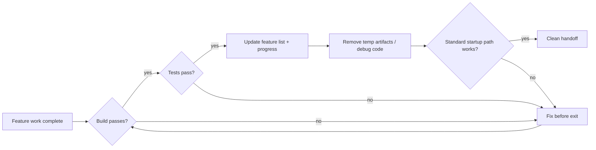
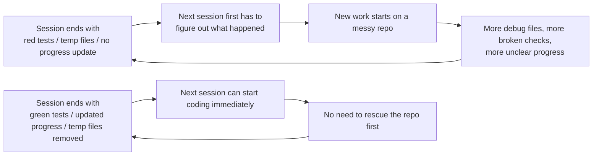

[中文版本 →](../../../zh/lectures/lecture-12-why-every-session-must-leave-a-clean-state/)

> أمثلة الكود: [code/](https://github.com/walkinglabs/learn-harness-engineering/blob/main/docs/ar/lectures/lecture-12-why-every-session-must-leave-a-clean-state/code/)
> مشروع عملي: [Project 06. Complete harness (Capstone)](./../../projects/project-06-runtime-observability-and-debugging/index.md)

# المحاضرة 12. اترك handoff نظيفًا في نهاية كل جلسة

## ما المشكلة التي تحلها هذه المحاضرة؟

يعمل agent طوال فترة بعد الظهر، يُعدّل 20 ملفًا، يُرسل الكود، تنتهي الجلسة. تبدأ جلسة agent التالية وتكتشف فورًا: البناء (build) مكسور، الاختبارات حمراء، ملفات التصحيح المؤقتة في كل مكان، قائمة الميزات لم تُحدَّث، والتقدم غير واضح تمامًا. تقضي الجلسة الجديدة أول 30 دقيقة فقط في محاولة معرفة "ماذا فعلت الجلسة السابقة فعليًا."

تشدد كل من OpenAI و Anthropic بوضوح: **الموثوقية طويلة المدى تعتمد على الانضباط التشغيلي، وليس فقط نجاح التشغيل الفردي.** جودة الحالة عند خروج الجلسة تحدد مباشرة كفاءة الجلسة التالية. فكر في الأمر كممارسات Git الجيدة — كل التزام يجب أن يكون تغييرًا ذريًا قابلًا لل编译، وليس كومة من الكود غير المكتمل.

## المفاهيم الأساسية

- **الحالة النظيفة**: يستوفي النظام خمسة شروط عند انتهاء الجلسة — البناء يجتاز، الاختبارات تجتاز، التقدم مُسجَّل، لا قطع أثرية قديمة، مسار البدء متاح. غياب أي واحد يعني أن الجلسة ليست "منتهية."
- **سلامة الجلسة**: مشابهة لمعاملات قاعدة البيانات — إما الالتزام الكامل وترك حالة نظيفة، أو التراجع إلى آخر حالة متسقة. لا يوجد حل وسط.
- **مستند الجودة**: قطعة أثرية نشطة تسجل باستمرار تقييمات الجودة لكل وحدة. ليس تقييمًا لمرة واحدة، بل متتبع يُظهر ما إذا كانت قاعدة الكود تزداد قوة أم ضعفًا بمرور الوقت.
- **حلقة التنظيف**: جلسة صيانة منتظمة تهدف إلى تقليل الإنتروبيا في قاعدة الكود بشكل منهجي. ليس إصلاحًا طارئًا، بل عمليات روتينية.
- **تبسيط harness**: مع تحسن قدرات النماذج، أزل بشكل دوري مكونات harness التي لم تعد ضرورية. قيد أساسي اليوم قد يكون عبئًا غير ضروري خلال ثلاثة أشهر.
- **التنظيف المتساوي القوة (Idempotent)**: عمليات التنظيف تُنتج نفس النتيجة بغض النظر عن عدد مرات تشغيلها. يضمن بقاء التنظيف آمنًا حتى في سيناريوهات إعادة المحاولة بعد الفشل.

## الأبعاد الخمسة للحالة النظيفة





## لماذا يحدث هذا

### نمو الإنتروبيا هو الحالة الافتراضية

تخبرنا قوانين ليهمان لتطور البرمجيات: الأنظمة التي تخضع لتغيير مستمر ستزداد حتمًا في التعقيد ما لم تُدار بشكل نشط. هذا صحيح بشكل خاص لوكلاء البرمجة بالذكاء الاصطناعي — كل جلسة تُدخل تغييرات، وبدون تنظيف عند الخروج، يتراكم الدين الفني بشكل أسي.

البيانات الحقيقية دالة. مشروع طُوّر باستخدام الوكلاء لمدة 12 أسبوعًا، بدون استراتيجية تنظيف:

- الأسبوع 1: معدل اجتياز البناء 100%، معدل اجتياز الاختبارات 100%، بدء الجلسة الجديدة 5 دقائق
- الأسبوع 4: البناء 95%، الاختبارات 92%، البدء 15 دقيقة
- الأسبوع 8: البناء 82%، الاختبارات 78%، البدء 35 دقيقة
- الأسبوع 12: البناء 68%، الاختبارات 61%، البدء 60+ دقيقة

نفس المشروع مع استراتيجية تنظيف:

- الأسبوع 1: 100%، 100%، 5 دقائق
- الأسبوع 12: 97%، 95%، 9 دقائق

بعد 12 أسبوعًا: معدل اجتياز البناء يختلف بنسبة 29 نقطة مئوية، وقت بدء الجلسة الجديدة يختلف بنسبة 85%. هذا ليس نظريًا — إنه فرق مُلاحظ.

### الأبعاد الخمسة للحالة النظيفة

الحالة النظيفة ليست مجرد "الكود يُبنى." إنها خمسة أبعاد تُقيَّم معًا:

**بُعد البناء**: هل يُبنى الكود بدون أخطاء؟ هذا هو الأساسي — لا ينبغي للجلسة التالية أن تصلح أخطاء البناء أولاً.

**بُعد الاختبار**: هل تجتاز جميع الاختبارات؟ بما فيها الاختبارات التي وُجدت قبل الجلسة — الجلسة مسؤولة عن عدم كسر الوظائف الموجودة. وينبغي التحقق في CI، وليس فقط "يعمل على جهازي."

**بُعد التقدم**: هل التقدم الحالي مُسجَّل في قطعة أثرية قابلة للقراءة آليًا؟ المهام الفرعية المكتملة مع معايير اجتيازها، المهام الفرعية قيد التقدم لكن غير المكتملة مع حالتها الحالية، المهام الفرعية التي لم تبدأ بعد. سجلات التقدم الجيدة تقلل 60-80% من وقت تشخيص بدء الجلسة.

**بُعد القطع الأثرية**: هل توجد قطع أثرية مؤقتة قديمة أو غامضة؟ سجلات التصحيح، الملفات المؤقتة، الكود المُعلَّق، علامات TODO — كل هذه تزيد العبء المعرفي للجلسة التالية.

**بُعد البدء**: هل مسار البدء القياسي متاح؟ هل يمكن للجلسة التالية بدء العمل بدون تدخل يدوي؟ تهيئة البيئة، تحميل قاعدة الكود، اكتساب السياق، اختيار المهام — هذه المسارات يجب ألا تكون مكسورة.

### "التنظيف لاحقًا" يعني عدم التنظيف أبدًا

الفخ الذهني الأكثر شيوعًا هو "لا وقت للتنظيف في هذه الجلسة، سأفعل ذلك في المرة القادمة." لكن جلسة agent التالية لا تعرف ما تركته وراءك — ترى فوضى من الكود وحالة غير مؤكدة. ستقضي وقتًا كبيرًا في استنتاج "أي أجزاء من هذا الكود مقصودة وأيها مؤقتة."

ما هو أسوأ، كل جلسة لها أهداف مهامها الخاصة. الجلسة الجديدة موجودة للقيام بعمل جديد، وليس لتنظيف فوضى الجلسة السابقة. ستتجاهل الفوضى وتبدأ عملاً جديدًا فوقها، مُدخلة فوضى أكثر فوق الفوضى. هذه حلقة التغذية الراجعة الإيجابية للإنتروبيا.

## كيف تفعل ذلك بشكل صحيح

### 1. الحالة النظيفة كمتطلب للإكمال

حدد صراحةً في harness: **اكتمال الجلسة = المهمة تجتاز التحقق وفحص الحالة النظيفة يجتاز.** غياب أي منهما يعني أن الجلسة ليست مكتملة. اكتب في CLAUDE.md:

```
## Session Exit Checklist
- [ ] Build passes (npm run build)
- [ ] All tests pass (npm test)
- [ ] Feature list updated
- [ ] No debug code remaining (console.log, debugger, TODO)
- [ ] Standard startup path available (npm run dev)
```

### 2. استراتيجية التنظيف ذات الوضع المزدوج

اجمع بين وضعي تنظيف:

**التنظيف الفوري (في نهاية كل جلسة)**: تنظيف القطع الأثرية المؤقتة المُنشأة خلال الجلسة، تحديث حالة قائمة الميزات، التأكد من اجتياز البناء والاختبارات. هذا تنظيف "عد المرجع."

**التنظيف الدوري (أسبوعي)**: فحص كامل للنظام — معالجة المشاكل الهيكلية المتراكمة، تحديث مستندات الجودة، تشغيل اختبارات قياسية لاكتشاف الانحراف. هذا تنظيف "التتبع."

### 3. حافظ على مستند جودة

مستند الجودة هو قطعة أثرية نشطة تسجل باستمرار درجات لكل وحدة:

```markdown
# Quality Document

## User Authentication Module (Quality: A)
- Verification passing: Yes
- Agent understandable: Yes
- Test stability: Stable
- Architecture boundaries: Compliant
- Code conventions: Followed

## Payment Module (Quality: C)
- Verification passing: Partial (payment callback untested)
- Agent understandable: Difficult (logic spread across 3 files)
- Test stability: Unstable (2 flaky tests)
- Architecture boundaries: Violations present
- Code conventions: Partially followed
```

الجلسات الجديدة تقرأ هذا المستند وتعرف فورًا أين تعطي الأولوية. أصلح الوحدة ذات الدرجة الأدنى أولاً.

### 4. بسّط harness بشكل دوري

رؤية مهمة من Anthropic: **كل مكون من harness موجود لأن النموذج لا يستطيع فعل شيء بشكل موثوق بمفرده. لكن مع تحسن النماذج، تصبح هذه الافتراضات قديمة.** قيد كان أساسيًا قبل ثلاثة أشهر قد يكون عبئًا غير ضروري اليوم.

الممارسة الموصى بها: كل شهر، اختر مكون harness واحد، عطّله مؤقتًا، وشغّل مهام قياسية. إذا لم تتراجع النتائج، أزله بشكل دائم. إذا تراجعت، استعده أو استبدله ببديل أخف.

### 5. عمليات التنظيف يجب أن تكون متساوية القوة (Idempotent)

يجب أن تكون نصوص التنظيف آمنة للتشغيل المتكرر:

```bash
# Idempotent cleanup operations
rm -f /tmp/debug-*.log  # -f ensures no error when files don't exist
git checkout -- .env.local  # Restore to known state
npm run test  # Verify cleanup didn't break anything
```

## حالة من العالم الحقيقي

تطبيق Electron طُوّر باستخدام الوكلاء على مدار 12 أسبوعًا، مقارنة نهجين:

**بدون استراتيجية تنظيف** (المجموعة الضابطة): الأسبوع 12، معدل اجتياز البناء 68%، معدل اجتياز الاختبارات 61%، بدء الجلسة الجديدة 60+ دقيقة، قطع أثرية قديمة 103.

**مع استراتيجية تنظيف** (المجموعة التجريبية): فحص حالة نظيفة كامل في نهاية كل جلسة + حلقة تنظيف أسبوعية. الأسبوع 12، معدل اجتياز البناء 97%، معدل اجتياز الاختبارات 95%، بدء الجلسة الجديدة 9 دقائق، قطع أثرية قديمة 11.

بنهاية الأسبوع 12، معدل اجتياز البناء للمجموعة التجريبية أعلى بـ 29 نقطة مئوية، معدل اجتياز الاختبارات أعلى بـ 34 نقطة مئوية، ووقت بدء الجلسة الجديدة أقل بنسبة 85%.

## الخلاصات الأساسية

- **الحالة النظيفة شرط ضروري لاكتمال الجلسة** — ليست تنظيفًا اختياريًا، بل جزء من "تعريف الانتهاء."
- **جميع الأبعاد الخمسة مطلوبة** — البناء، الاختبارات، التقدم، القطع الأثرية، البدء — كل منها يجب فحصه صراحةً.
- **مستندات الجودة تجعل صحة قاعدة الكود قابلة للتتبع** — لا يمكنك إصلاح إلا ما تعرف أنه يتراجع.
- **بسّط harness بشكل دوري** — مع تحسن قدرات النماذج، أزل القيود التي لم تعد ضرورية.
- **"التنظيف لاحقًا" يساوي عدم التنظيف أبدًا** — نمو الإنتروبيا هو الافتراضي؛ فقط التنظيف النشط يُبطئه.

## قراءات إضافية

- [Clean Code - Robert C. Martin](https://www.goodreads.com/book/show/3735293-clean-code) — مبادئ منهجية لنظافة الكود
- [Harness Engineering - OpenAI](https://openai.com/index/harness-engineering/) — القابلية للتكرار كمتطلب تصميم أساسي لـ harness
- [Effective Harnesses - Anthropic](https://www.anthropic.com/engineering/effective-harnesses-for-long-running-agents) — الدور الحاسم لعمليات خروج الجلسة النظيفة للموثوقية طويلة المدى
- [Programs, Life Cycles, and Laws of Software Evolution - Lehman](https://ieeexplore.ieee.org/document/1702314) — قوانين تطور البرمجيات تثبت أن تعقيد النظام ينمو حتمًا بدون صيانة نشطة

## تمارين

1. **قائمة فحص الحالة النظيفة**: صمم قائمة فحص خروج الجلسة لقاعدة الكود الخاصة بك تغطي جميع الأبعاد الخمسة. طبّقها عبر 5 جلسات متتالية وسجّل الانتهاكات لكل بُعد.

2. **مقارنة قياسية**: استخدم مجموعة مهام ثابتة مع نوعين من harness (مع/بدون متطلبات الحالة النظيفة). قارن معدل الإكمال وعدد إعادة المحاولات ومعدل تسرب العيوب.

3. **ممارسة تبسيط harness**: اختر مكون harness واحد، عطّله مؤقتًا، وشغّل مهام قياسية. قارن النتائج مع وبدونه. قرر ما إذا كنت ستبقيه أو تزيله أو تستبدله.
