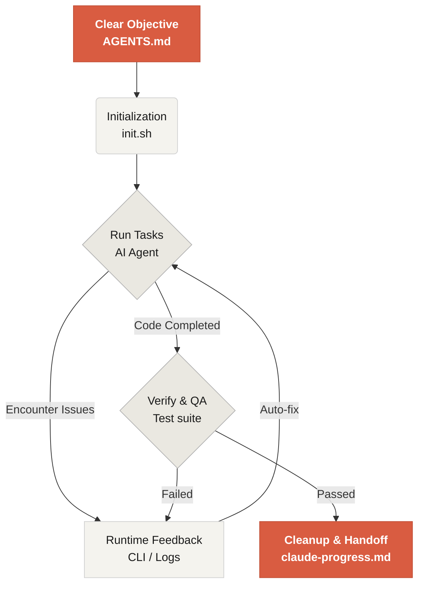

# Willkommen bei Learn Harness Engineering

Learn Harness Engineering ist ein Kurs über die technische Gestaltung von KI-Coding-Agenten. Wir haben fortgeschrittene Theorien und Praktiken des Harness Engineering aus der Industrie untersucht und in eine praktisch nutzbare Form gebracht. Unsere wichtigsten Referenzen sind:
- [OpenAI: Harness engineering: leveraging Codex in an agent-first world](https://openai.com/index/harness-engineering/)
- [Anthropic: Effective harnesses for long-running agents](https://www.anthropic.com/engineering/effective-harnesses-for-long-running-agents)
- [Anthropic: Harness design for long-running application development](https://www.anthropic.com/engineering/harness-design-long-running-apps)
- [Awesome Harness Engineering](https://github.com/walkinglabs/awesome-harness-engineering)

Durch systematisches Umgebungsdesign, Zustandsverwaltung, Verifikation und Kontrollmechanismen zeigt dieser Kurs, wie agentische Coding-Tools wie Codex und Claude Code wirklich zuverlässig werden. Du lernst, Features zu bauen, Bugs zu beheben und Entwicklungsaufgaben zu automatisieren, indem du deinen KI-Coding-Assistenten mit expliziten Regeln und Grenzen führst.

## Erste Schritte

Wähle deinen Lernpfad. Der Kurs besteht aus theoretischen Lektionen, praktischen Projekten und einer sofort nutzbaren Ressourcenbibliothek.

  <a href="./lectures/lecture-01-why-capable-agents-still-fail/" class="card">
    <h3>Lektionen</h3>
    
Verstehe, warum starke Modelle trotzdem scheitern, und lerne die Theorie wirksamer Harnesses.

  </a>
  <a href="./projects/" class="card">
    <h3>Projekte</h3>
    
Praktische Übungen zum Aufbau einer zuverlässigen agentischen Arbeitsumgebung von Grund auf.

  </a>
  <a href="./resources/" class="card">
    <h3>Ressourcenbibliothek</h3>
    
Kopierfertige Vorlagen wie AGENTS.md und feature_list.json für deine eigenen Repositories.

  </a>

## Der Kernmechanismus eines Harness

Ein harness "macht das Modell nicht klüger"; er schafft ein geschlossenes **Arbeitssystem** für das Modell. Der Kernablauf lässt sich mit diesem Diagramm verstehen:

## Was du lernen wirst

Zu den zentralen Konzepten gehören:

<ul class="index-list">
  <li><strong>Agentenverhalten begrenzen</strong> durch explizite Regeln und Grenzen.</li>
  <li><strong>Kontext erhalten</strong> über lange Aufgaben und mehrere Sessions hinweg.</li>
  <li><strong>Agenten davon abhalten</strong>, zu früh Erfolg zu melden.</li>
  <li><strong>Arbeit verifizieren</strong> mit vollständigen Pipeline-Tests und Selbstprüfung.</li>
  <li><strong>Runtime beobachtbar machen</strong> und leichter debuggen.</li>
</ul>

## Nächste Schritte

Wenn du die Grundkonzepte verstanden hast, helfen diese Leitfäden beim Vertiefen:

<ul class="index-list">
  <li><a href="./lectures/lecture-01-why-capable-agents-still-fail/">Lektion 01: Warum fähige Agenten trotzdem scheitern</a>: Beginne mit der Theorie hinter harness engineering.</li>
  <li><a href="./projects/project-01-baseline-vs-minimal-harness/">Projekt 01: Baseline vs minimaler harness</a>: Arbeite deine erste reale Aufgabe durch.</li>
  <li><a href="./resources/templates/">Vorlagen</a>: Hole dir das minimale harness-Paket für deine eigenen Projekte.</li>
</ul>
