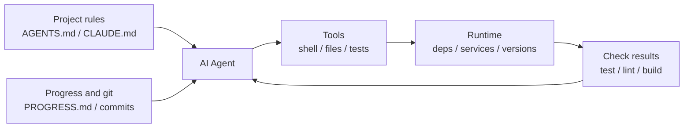

[中文版本 →](../../../zh/lectures/lecture-02-what-a-harness-actually-is/)

> Codebeispiele: [code/](https://github.com/walkinglabs/learn-harness-engineering/blob/main/docs/de/lectures/lecture-02-what-a-harness-actually-is/code/)
> Praxisprojekt: [Project 01. Prompt-only vs. rules-first](./../../projects/project-01-baseline-vs-minimal-harness/index.md)

# Lektion 02. Was harness wirklich bedeutet

Das Wort „harness" wird in Kreisen von KI-Coding-Agenten viel herumgereicht, aber ganz ehrlich: Die meisten Menschen meinen einfach „eine Prompt-Datei", wenn sie harness sagen. Das ist kein harness. Das ist, als würde man ein Restaurant mit nichts als Zutaten eröffnen — kein Herd, keine Messer, keine Rezepte, kein Anrichte-Workflow. Das ist kein Restaurant. Das ist ein Kühlschrank.

Diese Lektion gibt Ihnen eine präzise, umsetzbare harness-Definition. Keine akademische Abstraktion, sondern ein Framework, das Sie heute nutzen können: Ein harness besteht aus fünf Subsystemen, jedes mit klaren Zuständigkeiten und Bewertungskriterien.

## Beginnen wir mit einer Analogie

Stellen Sie sich vor, Sie sind ein neu eingestellter Ingenieur, der ohne jegliche Dokumentation in ein Projekt geworfen wird. Kein README, keine Kommentare im Code, niemand sagt Ihnen, wie man Tests ausführt, die CI-Konfiguration ist irgendwo vergraben. Können Sie guten Code schreiben? Vielleicht — wenn Sie klug und geduldig genug sind. Aber Sie werden enorme Zeit damit verbringen, herauszufinden, „worum es in diesem Projekt geht", anstatt „das Problem zu lösen".

Ein KI-Agent steht vor genau derselben Situation. Und es ist noch schlimmer — Sie können wenigstens einen Kollegen fragen. Der Agent kann nur die Dateien sehen, die Sie ihm vorlegen, und die Befehle ausführen, die ihm zur Verfügung stehen. Er kann niemanden auf die Schulter tippen und fragen: „Hey, welche Version des ORMs verwendet dieses Projekt?"

OpenAI formuliert das Kernprinzip als „the repo IS the spec" — der gesamte notwendige Kontext sollte im Repository enthalten sein, geliefert durch strukturierte Instruktionsdateien, explizite Verifizierungsbefehle und eine klare Verzeichnisorganisation. Anthropics Dokumentation zu langlebigen Agenten betont Zustandspersistenz, explizite Wiederherstellungspfade und strukturiertes Fortschritts-Tracking. Die beiden Unternehmen konzentrieren sich auf unterschiedliche Aspekte, aber sie sagen dasselbe: **alles in der Engineering-Infrastruktur außerhalb des Modells bestimmt, wie viel der Modelfähigkeiten tatsächlich realisiert werden.**

Betrachten Sie einige Tools, die Sie bereits kennen:

**Claude Code** verkörpert das harness-Denken. Es liest `CLAUDE.md` aus Ihrem Repo (Rezeptregal), kann Shell-Befehle ausführen (Messerblock), arbeitet in Ihrer lokalen Umgebung (Herd), verwaltet Sitzungsverläufe (Vorbereitungsstation) und kann Tests ausführen und Ergebnisse sehen (Qualitätskontrollfenster). Aber wenn Sie ihm nicht sagen, wie man Tests ausführt, ist das Qualitätskontrollfenster kaputt — niemand weiß, ob das Gericht gar ist.

**Cursor** folgt einer ähnlichen Logik. Seine `.cursorrules`-Datei ist das Rezeptregal, das Terminal ist der Messerblock, es liest Ihre Projektstruktur und Lint-Konfiguration für den Herd. Aber Cursors Zustandsverwaltung ist relativ schwach — IDE schließen und wieder öffnen, und der vorherige Kontext ist verschwunden.

**Codex** (OpenAIs Coding-Agent) verwendet git worktrees, um die Laufzeitumgebung jeder Aufgabe zu isolieren, gepaart mit einem lokalen Observability-Stack (Logs, Metriken, Traces), sodass jede Änderung in einer unabhängigen Umgebung verifiziert wird. In Repos mit `AGENTS.md` und klaren Verifizierungsbefehlen funktioniert er deutlich besser als in „nackten" Repos.

**AutoGPT** ist das abschreckende Beispiel — fehlendes strukturiertes Zustandsmanagement führt bei langen Aufgaben zu Kontextakkumulation, und fehlende präzise Feedback-Mechanismen verursachen Endlosschleifen beim Agenten. Viele sagen, AutoGPT „funktioniert nicht", aber in Wirklichkeit funktioniert AutoGPTs harness nicht — geben Sie einem Koch einen kaputten Herd, und selbst die besten Zutaten werden kein Essen produzieren.

## Zentrale Konzepte

- **Was ist ein harness**: Alles in der Engineering-Infrastruktur außerhalb der Modellgewichte. OpenAI destilliert die Kernaufgabe des Ingenieurs in drei Dinge: Umgebungen gestalten, Intention ausdrücken und Feedback-Schleifen aufbauen. Anthropic nennt sein Claude Agent SDK ein „general-purpose agent harness."
- **Das Repo ist die einzige Quelle der Wahrheit**: Alles, was der Agent nicht sehen kann, existiert für alle praktischen Zwecke nicht. OpenAI behandelt das Repo als „system of record" — der gesamte notwendige Kontext muss dort leben, durch strukturierte Dateien und klare Verzeichnisorganisation.
- **Eine Karte geben, kein Handbuch**: OpenAIs Erfahrung — `AGENTS.md` sollte eine Übersichtsseite sein, keine Enzyklopädie. Etwa 100 Zeilen reichen aus. Wenn es nicht passt, teilen Sie es in das `docs/`-Verzeichnis auf und lassen Sie den Agenten bei Bedarf lesen.
- **Einschränken, nicht mikroverwalten**: Ein gutes harness verwendet ausführbare Regeln, um den Agenten einzuschränken, anstatt Anweisungen einzeln aufzuzählen. OpenAI sagt „enforce invariants, don't micromanage implementation"; Anthropic hat festgestellt, dass Agenten ihre eigene Arbeit zuversichtlich loben, und die Lösung darin besteht, „die Person, die die Arbeit erledigt" von „der Person, die die Arbeit prüft" zu trennen.
- **Komponenten einzeln entfernen**: Um den Wert jeder harness-Komponente zu quantifizieren, entfernen Sie sie einzeln und prüfen Sie, welche Entfernung den größten Leistungsabfall verursacht. Anthropic hat diese Methode angewandt und festgestellt, dass mit stärker werdenden Modellen einige Komponenten aufhören, kritisch zu sein — aber neue tauchen immer auf.

## Das Fünf-Subsystem-harness-Modell

Zurück zur Küchenanalogie. Eine vollständige Küche hat fünf Funktionsbereiche, und ein harness hat fünf Subsysteme:



**Instruktions-Subsystem (Rezeptregal)**: Erstellen Sie `AGENTS.md` (oder `CLAUDE.md`) mit einer Projektübersicht und einem Zweck (ein Satz), Tech-Stack und Versionen (Python 3.11, FastAPI 0.100+, PostgreSQL 15), Erststart-Befehlen (`make setup`, `make test`), nicht verhandelbaren harten Einschränkungen („Alle APIs müssen OAuth 2.0 verwenden") und Links zu detaillierterer Dokumentation.

**Tool-Subsystem (Messerblock)**: Stellen Sie sicher, dass der Agent ausreichenden Tool-Zugriff hat. Deaktivieren Sie die Shell nicht aus „Sicherheitsgründen" — wenn der Agent nicht einmal `pip install` ausführen kann, wie soll er dann arbeiten? Aber öffnen Sie auch nicht alles — folgen Sie dem Prinzip der geringsten Rechte.

**Umgebungs-Subsystem (Herd)**: Machen Sie den Umgebungszustand selbstbeschreibend. Verwenden Sie `pyproject.toml` oder `package.json` zum Sperren von Abhängigkeiten, `.nvmrc` oder `.python-version` für Laufzeitversionen, Docker oder Devcontainer für Reproduzierbarkeit.

**Zustands-Subsystem (Vorbereitungsstation)**: Lange Aufgaben benötigen Fortschritts-Tracking. Verwenden Sie eine einfache `PROGRESS.md`-Datei, die Folgendes dokumentiert: was erledigt ist, was in Arbeit ist, was blockiert ist. Aktualisieren Sie vor jedem Sitzungsende, lesen Sie beim Start der nächsten Sitzung.

**Feedback-Subsystem (Qualitätskontrollfenster)**: Dies ist das Subsystem mit dem höchsten ROI. Listen Sie Verifizierungsbefehle explizit in `AGENTS.md` auf:
```
Verification commands:
- Tests: pytest tests/ -x
- Type check: mypy src/ --strict
- Lint: ruff check src/
- Full verification: make check (includes all above)
```

Wenn ein Subsystem fehlt, ist das wie ein fehlender Funktionsbereich in der Küche — Sie können immer noch kochen, aber es ist immer umständlich.

**harness-Qualität diagnostizieren**: Verwenden Sie „isometrische Modellkontrolle". Halten Sie das Modell fest, entfernen Sie Subsysteme einzeln, messen Sie, welche Entfernung den größten Leistungsabfall verursacht. Das ist Ihr Engpass — konzentrieren Sie Ihre Mühe darauf. Wie bei der Suche nach dem Engpass in einer Küche: Nehmen Sie das Rezeptregal weg und sehen Sie, wie viel langsamer alles wird, schalten Sie den Herd ab und beobachten Sie die Auswirkungen.

## Die wahre Geschichte eines Teams

Ein Team verwendete GPT-4o für eine TypeScript + React Frontend-App (~20.000 Zeilen Code). Sie durchliefen vier Stufen — im Grunde rüsteten sie die Küche Stück für Stück aus:

**Stufe 1 — Leere Küche**: Nur eine einfache Projektbeschreibung im README. 1 von 5 Durchläufen erfolgreich (20%). Hauptsächliche Fehler: falschen Package-Manager gewählt (npm vs. yarn), Komponenten-Benennungskonventionen nicht befolgt, konnte Tests nicht ausführen.

**Stufe 2 — Rezeptregal installiert**: `AGENTS.md` mit Tech-Stack-Versionen, Namenskonventionen und wichtigen Architekturentscheidungen hinzugefügt. Erfolgsquote stieg auf 60%. Verbleibende Fehler waren hauptsächlich Umgebungsprobleme und fehlende Verifizierung.

**Stufe 3 — Qualitätskontrollfenster geöffnet**: Verifizierungsbefehle in `AGENTS.md` aufgelistet: `yarn test && yarn lint && yarn build`. Erfolgsquote stieg auf 80%.

**Stufe 4 — Vorbereitungsstation bereit**: Fortschrittsdatei-Vorlagen eingeführt, in denen Agenten bei jedem Durchlauf abgeschlossene und nicht abgeschlossene Arbeit dokumentierten. Erfolgsquote stabilisierte sich bei 80–100%.

Vier Iterationen, das Modell hat sich gar nicht geändert, die Erfolgsquote stieg von 20% auf nahezu 100%. Das ist die Macht von harness Engineering. Sie haben keine teureren Zutaten gekauft — Sie haben die Küche einfach richtig organisiert.

## Wichtigste Erkenntnisse

- Harness = Instructions + Tools + Environment + State + Feedback. Fünf Subsysteme, wie die fünf Funktionsbereiche einer Küche — alle unverzichtbar.
- Wenn es keine Modellgewichte sind, ist es harness. Ihr harness bestimmt, wie viel der Modelfähigkeiten realisiert wird.
- Unter den fünf Subsystemen hat das Feedback-Subsystem normalerweise die geringste Investition und die höchste Rendite. Bringen Sie zuerst Ihre Verifizierungsbefehle in Ordnung — das Qualitätskontrollfenster ist das lohnendste Upgrade.
- Verwenden Sie „isometrische Modellkontrolle", um den Grenznutzen jedes Subsystems zu quantifizieren — gehen Sie nicht nach Bauchgefühl.
- Harness verrottet wie Code. Überprüfen Sie regelmäßig und tilgen Sie harness-Schulden wie Sie technische Schulden tilgen.

## Weiterführende Literatur

- [OpenAI: Harness Engineering](https://openai.com/index/harness-engineering/)
- [Anthropic: Effective Harnesses for Long-Running Agents](https://www.anthropic.com/engineering/effective-harnesses-for-long-running-agents)
- [HumanLayer: Harness Engineering for Coding Agents](https://humanlayer.dev/articles/harness-engineering-for-coding-agents/)
- [SWE-agent: Agent-Computer Interfaces](https://github.com/princeton-nlp/SWE-agent)
- [Thoughtworks: Harness Engineering on Technology Radar](https://www.thoughtworks.com/radar)

## Übungen

1. **Fünftupel-harness-Audit**: Nehmen Sie ein Projekt, in dem Sie einen KI-Agenten verwenden, und führen Sie ein vollständiges Audit mit dem Fünftupel-Framework durch. Bewerten Sie jedes Subsystem mit 1–5. Finden Sie das am niedrigsten bewertete Subsystem, investieren Sie 30 Minuten in die Verbesserung und beobachten Sie die Veränderung der Agentenleistung.

2. **Isometrisches Modellkontrollexperiment**: Wählen Sie ein Modell und eine anspruchsvolle Aufgabe. Entfernen Sie nacheinander Instruktionen (AGENTS.md löschen), Feedback entfernen (keine Verifizierungsbefehle angeben), Zustand entfernen (keine Fortschrittsdateien) — entfernen Sie jeweils nur eines und messen Sie den Leistungsabfall. Ordnen Sie basierend auf den Ergebnissen die Subsystem-Wichtigkeit für Ihr Projekt.

3. **Affordanz-Analyse**: Finden Sie ein Szenario, in dem der Agent in Ihrem Projekt „etwas tun möchte, aber nicht kann" (z. B. weiß, dass er parametrisierte Abfragen verwenden sollte, aber die ORM-Muster Ihres Projekts nicht kennt). Analysieren Sie, ob dies eine Gulf of Execution (weiß nicht wie) oder Gulf of Evaluation (weiß nicht, ob es richtig ist) ist, und entwerfen Sie dann eine harness-Verbesserung, um die Lücke zu schließen.
