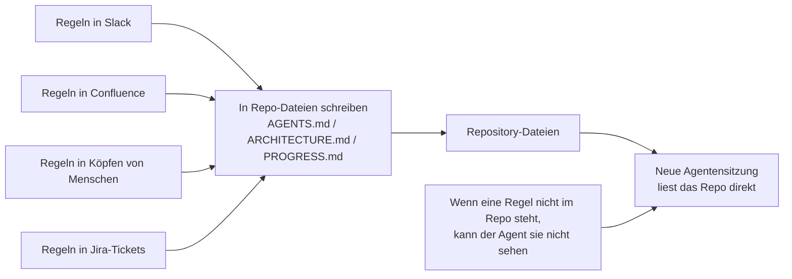
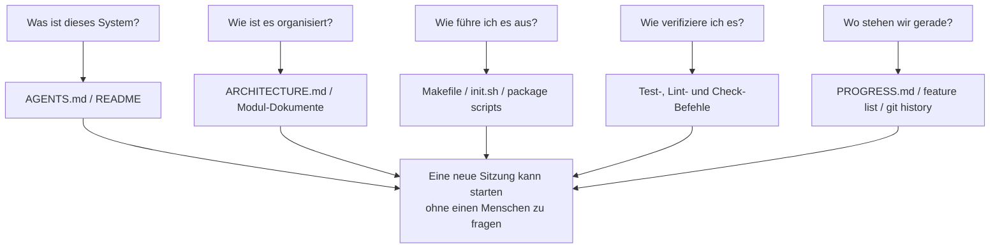

[中文版本 →](../../../zh/lectures/lecture-03-why-the-repository-must-become-the-system-of-record/)

> Codebeispiele: [code/](https://github.com/walkinglabs/learn-harness-engineering/blob/main/docs/de/lectures/lecture-03-why-the-repository-must-become-the-system-of-record/code/)
> Praxisprojekt: [Projekt 02. Agentenlesbarer Workspace](./../../projects/project-02-agent-readable-workspace/index.md)

# Lektion 03. Das Repository zur einzigen Quelle der Wahrheit machen

Die Architekturentscheidungen deines Teams sind über Confluence, Slack, Jira und die Köpfe einiger Senior Engineers verstreut. Für Menschen funktioniert das gerade so: Man kann Kolleginnen fragen, Chatverläufe durchsuchen, Dokumente ausgraben. Wenn alles scheitert, kann man jemanden im Pausenraum abfangen. Für einen KI-Agenten aber existiert Information, die nicht im Repository steht, schlicht nicht.

Das ist keine Übertreibung. Denk darüber nach, was die Eingaben eines Agenten tatsächlich sind: Systemprompts und Aufgabenbeschreibungen, Dateiinhalte aus dem Repository und Tool-Ausgaben. Das war's. Deine Slack-Historie, Jira-Tickets, Confluence-Seiten und die Architekturentscheidung, die du am Freitagnachmittag bei Kaffee mit einem Kollegen besprochen hast - der Agent sieht nichts davon. Er kann nicht "jemanden fragen" oder "den Chatverlauf durchsuchen". Er ist ein Engineer, der im Repository eingeschlossen ist. Alles außerhalb kennt er nicht.

Die Frage lautet also: Gibst du diesem Engineer eine gute Karte?

## Was auf die Karte gehört

OpenAI formuliert es sehr direkt: **Information, die nicht im Repo existiert, existiert für den Agenten nicht.** Sie nennen das das Prinzip "repo as spec" - das Repository selbst ist das Spezifikationsdokument mit der höchsten Autorität.

Anthropics Dokumentation zu lang laufenden Agenten sagt dasselbe: Persistenter Zustand ist eine notwendige Bedingung für Kontinuität bei langen Aufgaben. Die Wiederherstellbarkeit von Wissen über Sitzungen hinweg bestimmt direkt die Erfolgsraten. Und dieser Zustand muss im Repository existieren, denn das ist der einzige stabile, zugängliche Speicher, den der Agent hat.

Vielleicht denkst du: "Unser Team ist klein, das Wissen steckt in allen Köpfen, und das funktioniert." Für Menschen, ja. Aber wenn du einen Agenten nutzt, akzeptiere diese Tatsache: Der Agent kann keine Menschen fragen. Alles, was er wissen muss, muss aufgeschrieben und dort abgelegt sein, wo er es finden kann.

Es geht nicht darum, "mehr Dokumentation zu schreiben". Es geht darum, "Entscheidungsinformationen an den richtigen Ort zu bringen". Eine 50-zeilige `ARCHITECTURE.md` im Verzeichnis `src/api/` ist zehntausendmal nützlicher als ein 500-seitiges Design-Dokument in Confluence, das niemand pflegt. Es ist wie eine handgezeichnete Bürokarte, die an deinem Schreibtisch klebt, gegenüber einem wunderschönen Architekturplan, der in einem Aktenschrank eingeschlossen ist: Erstere ist da, wenn du sie brauchst; Letzterer ist technisch überlegen, aber im Moment nutzlos.

## Wissenssichtbarkeit



Wie testest du, ob deine Karte gut genug ist? Führe einen "Cold-Start-Test" aus: Öffne eine komplett neue Agentensitzung, die nur Repository-Inhalte nutzt, und prüfe, ob sie fünf grundlegende Fragen beantworten kann:



Wenn sie das nicht beantworten kann, hat die Karte weiße Flecken. Wo die Karte leer ist, rät der Agent. Falsche Vermutungen werden zu Bugs, zu viel Raten verschwendet Kontext. Und jede neue Sitzung rät erneut. Die Kosten des Ratens sind immer höher als die Kosten, die Karte gleich richtig zu zeichnen.

## Zentrale Konzepte

- **Knowledge Visibility Gap**: Der Anteil des gesamten Projektwissens, der NICHT im Repository steht. Je größer die Lücke, desto höher die Fehlerrate des Agenten. Wie viel implizites Wissen über dieses Projekt lebt in deinem Kopf? Zähle alles und schau dann, wie viel davon im Repo angekommen ist. Die Differenz ist deine Sichtbarkeitslücke.
- **System of Record**: Das Code-Repository als autoritative Quelle für Projektentscheidungen, Architekturconstraints, Ausführungszustand und Verifikationsstandards. Das Repo hat das letzte Wort; nichts anderes zählt. Wie eine Karte mit "Straße gesperrt": Du fährst diese Straße nicht. Wenn diese Information aber nur im Kopf einer Person existiert, musst du jedes Mal fragen.
- **Cold-Start Test**: Die fünf Fragen oben. Wie viele beantwortet werden können, zeigt, wie vollständig deine Karte ist.
- **Discovery Cost**: Wie viel Kontextbudget der Agent verbrennt, um eine zentrale Information im Repo zu finden. Je versteckter die Information, desto höher die Discovery Cost und desto weniger Budget bleibt für die eigentliche Aufgabe. Kritische Information in einer README zehn Verzeichnisebenen tief zu verstecken ist wie den Feuerlöscher in einem Tresor im Keller einzuschließen: Er existiert, aber du findest ihn nicht, wenn du ihn brauchst.
- **Knowledge Decay Rate**: Der Anteil der Wissenseinträge, der pro Zeiteinheit veraltet. Dokumentation, die nicht mehr mit dem Code synchron ist, ist der größte Feind - schlimmer als gar keine Dokumentation.
- **ACID Analogy**: Datenbank-Transaktionsprinzipien (Atomicity, Consistency, Isolation, Durability) auf Agentenzustandsverwaltung anwenden. Unten wird das ausgeführt.

## Wie man eine gute Karte zeichnet

**Prinzip 1: Wissen lebt neben dem Code.** Eine Regel zur Authentifizierung von API-Endpunkten gehört neben den API-Code, nicht in ein riesiges globales Dokument. Lege in jedem Modulverzeichnis ein kurzes Dokument ab, das Verantwortlichkeiten, Schnittstellen und besondere Constraints des Moduls erklärt. Wie Regalbeschriftungen in einer Bibliothek: Wenn du Geschichtsbücher willst, gehst du direkt zum Regal "History". Du musst nicht die ganze Bibliothek durchsuchen.

**Prinzip 2: Nutze eine standardisierte Einstiegsdatei.** `AGENTS.md` (oder `CLAUDE.md`) ist die Landing Page des Agenten. Sie muss nicht alle Informationen enthalten, aber sie muss dem Agenten erlauben, drei Fragen schnell zu beantworten: "Was ist dieses Projekt?", "Wie führe ich es aus?" und "Wie verifiziere ich es?" 50-100 Zeilen reichen.

**Prinzip 3: Minimal, aber vollständig.** Jedes Wissensstück sollte einen klaren Use Case haben. Wenn das Entfernen einer Regel die Entscheidungsqualität des Agenten nicht beeinträchtigt, sollte diese Regel nicht existieren. Aber jede Frage aus dem Cold-Start-Test muss eine Antwort haben. Das ist ein feines Gleichgewicht: nicht zu viel, nicht zu wenig, genau genug.

**Prinzip 4: Mit Code aktualisieren.** Kopple Wissensupdates an Codeänderungen. Der einfachste Ansatz: Architekturdocs im entsprechenden Modulverzeichnis ablegen. Wenn du Code änderst, siehst du das Dokument natürlich. Nach Codeänderungen kann CI daran erinnern zu prüfen, ob die Docs aktualisiert werden müssen.

**Konkrete Repo-Struktur**:

```
project/
├── AGENTS.md              # Entry: project overview, run commands, hard constraints
├── src/
│   ├── api/
│   │   ├── ARCHITECTURE.md  # API layer architecture decisions
│   │   └── ...
│   ├── db/
│   │   ├── CONSTRAINTS.md   # Database operation hard constraints
│   │   └── ...
│   └── ...
├── PROGRESS.md             # Current progress: done, in-progress, blocked
└── Makefile                # Standardized commands: setup, test, lint, check
```

## Agentenzustand mit ACID-Prinzipien verwalten

Diese Analogie stammt aus dem Datenbank-Transaktionsmanagement. Du könntest denken, dass das überkompliziert ist, aber tatsächlich gibt es dir einen sehr praktischen Rahmen:

- **Atomicity**: Jede "logische Operation" (z. B. "neuen Endpoint hinzufügen und Tests aktualisieren") bekommt einen git commit. Wenn sie auf halbem Weg scheitert, mit `git stash` zurückrollen. Alles oder nichts - kein "halb fertig".
- **Consistency**: Definiere Verifikationsprädikate für einen "konsistenten Zustand": alle Tests grün, Lint meldet null Fehler. Der Agent führt nach jeder Operation Verifikation aus; inkonsistente Zwischenzustände werden nicht committed. Wie bei einer Banküberweisung: Du kannst nicht abbuchen, ohne gutzuschreiben.
- **Isolation**: Wenn mehrere Agenten gleichzeitig arbeiten, entwirf Zustandsdateien so, dass Race Conditions vermieden werden. Einfacher Ansatz: Jeder Agent nutzt seine eigene Progress-Datei, oder git branches sorgen für Isolation. Zwei Köche können nicht gleichzeitig denselben Topf würzen - wer ist verantwortlich, wenn er versalzen ist?
- **Durability**: Kritisches Projektwissen lebt in git-getrackten Dateien. Temporärer Zustand kann im Sitzungspeicher bleiben, aber sitzungsübergreifendes Wissen muss in Dateien persistiert werden. Was in deinem Kopf ist, zählt nicht - nur was auf Papier steht, zählt.

## Eine echte Transformationsgeschichte

Ein Team betreute eine E-Commerce-Plattform mit etwa 30 Microservices. Architekturentscheidungen (Inter-Service-Kommunikationsprotokolle, Datenkonsistenzstrategien, API-Versionierungsregeln) waren verstreut über Confluence (teilweise veraltet), Slack (schwer zu durchsuchen), die Köpfe einiger Senior Engineers (nicht skalierbar) und sporadische Codekommentare (nicht systematisch).

Nach der Einführung von KI-Agenten erforderten 70% der Aufgaben menschliche Intervention. Fast jeder Fehler hing damit zusammen, dass der Agent gegen eine implizite Constraint verstieß, die "alle kennen, aber niemand aufgeschrieben hat". Wie bei einem neuen Mitarbeitenden, dem niemand gesagt hat: "Du musst deine Essensbestellung in den Gruppenchat posten." Er rät falsch, wird zurechtgewiesen, aber danach schreibt immer noch niemand die Regel auf.

Das Team führte eine Transformation durch:
1. `AGENTS.md` im Repo-Root erstellt, mit Projektüberblick, Tech-Stack-Versionen und globalen harten Constraints
2. `ARCHITECTURE.md` in jedem Microservice-Verzeichnis hinzugefügt, mit Verantwortlichkeiten, Schnittstellen und Abhängigkeiten
3. Zentrales `CONSTRAINTS.md` mit harten Constraints in expliziter "MUST/MUST NOT"-Sprache erstellt
4. `PROGRESS.md` in jedem Service-Verzeichnis hinzugefügt, um aktuellen Arbeitsstatus zu verfolgen

Nach der Transformation konnte derselbe Agent beim Cold Start alle zentralen Projektfragen beantworten, und die Qualität der Aufgabenabschlüsse verbesserte sich deutlich.

## Wichtigste Erkenntnisse

- Wissen, das nicht im Repo steht, existiert für den Agenten nicht. Kritische Entscheidungen ins Repo zu legen ist die grundlegendste Harness-Investition: Zeichne eine gute Karte, damit du dich nicht verläufst.
- Nutze den "Cold-Start-Test", um Repo-Qualität zu bewerten: Kann eine frische Sitzung fünf grundlegende Fragen nur mit Repo-Inhalten beantworten?
- Wissen sollte nahe am Code liegen, minimal aber vollständig sein und mit dem Code aktualisiert werden. Es geht nicht darum, mehr Docs zu schreiben, sondern Information an den richtigen Ort zu bringen.
- Nutze ACID-Prinzipien für Agentenzustand: atomare Commits, Konsistenzverifikation, Parallelitätsisolation, dauerhaftes kritisches Wissen.
- Wissensverfall ist der größte Feind. Dokumentation, die nicht mit dem Code synchron ist, ist gefährlicher als keine Dokumentation: Sie schickt den Agenten in die falsche Richtung, während er glaubt, richtig zu liegen.

## Weiterführende Literatur

- [OpenAI: Harness Engineering](https://openai.com/index/harness-engineering/)
- [Anthropic: Effective Harnesses for Long-Running Agents](https://www.anthropic.com/engineering/effective-harnesses-for-long-running-agents)
- [Infrastructure as Code — Martin Fowler](https://martinfowler.com/bliki/InfrastructureAsCode.html)
- [ADR: Architecture Decision Records](https://adr.github.io/)
- [The Twelve-Factor App](https://12factor.net/)

## Übungen

1. **Cold-Start-Test**: Öffne in deinem Projekt eine komplett frische Agentensitzung (kein verbaler Kontext, nur Repo-Inhalte). Stelle fünf Fragen: Was ist dieses System? Wie ist es organisiert? Wie führe ich es aus? Wie verifiziere ich es? Was ist der aktuelle Fortschritt? Notiere, was nicht beantwortet werden kann, und verbessere das Repo, bis es geht.

2. **Quantifizierung der Wissensexternalisierung**: Liste alle Entscheidungen und Constraints auf, die für Entwicklungsarbeit in deinem Projekt wichtig sind. Markiere jedes Element als innerhalb oder außerhalb des Repos. Berechne deine Knowledge Visibility Gap (Anteil außerhalb des Repos). Erstelle einen Plan, um sie unter 10% zu bringen.

3. **ACID-Bewertung**: Bewerte die Zustandsverwaltung deines Projekts anhand der ACID-Analogie dieser Lektion. Atomicity - Können Agentenoperationen sauber zurückgerollt werden? Consistency - Gibt es Verifikation eines "konsistenten Zustands"? Isolation - Treten sich parallele Agenten gegenseitig auf die Füße? Durability - Ist alles sitzungsübergreifende Wissen persistiert?
