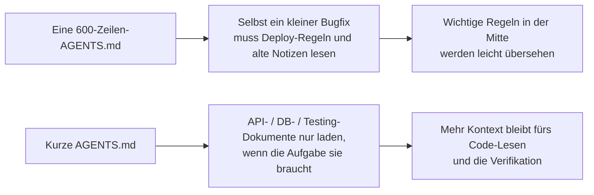
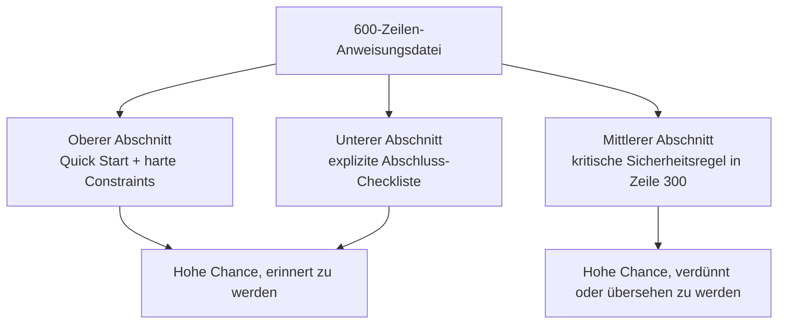

[中文版本 →](../../../zh/lectures/lecture-04-why-one-giant-instruction-file-fails/)

> Codebeispiele: [code/](https://github.com/walkinglabs/learn-harness-engineering/blob/main/docs/de/lectures/lecture-04-why-one-giant-instruction-file-fails/code/)
> Praxisprojekt: [Projekt 02. Agentenlesbarer Workspace](./../../projects/project-02-agent-readable-workspace/index.md)

# Lektion 04. Anweisungen auf Dateien verteilen

Du hast Harness Engineering ernst genommen. Du hast eine `AGENTS.md` erstellt und jede Regel, jede Einschränkung und jede gelernte Lektion hineingepackt, die dir eingefallen ist. Einen Monat später war die Datei auf 300 Zeilen angewachsen, nach zwei Monaten auf 450, nach drei Monaten auf 600. Dann merkst du, dass die Leistung des Agenten tatsächlich schlechter wird: Bei einem einfachen Bugfix verbrennt er massenhaft Kontext für irrelevante Deployment-Anweisungen; eine kritische Sicherheitsregel in Zeile 300 wird komplett ignoriert; drei widersprüchliche Code-Style-Regeln führen dazu, dass der Agent jedes Mal zufällig eine auswählt.

Das ist die Falle der "riesigen Anweisungsdatei". Es ist wie ein überfüllter Koffer: Alles scheint nützlich, also stopfst du es hinein, bis der Reißverschluss fast platzt. Um frische Unterwäsche zu finden, musst du den ganzen Koffer ausleeren. Du trägst einen vollen Koffer, nutzt aber vielleicht nur ein Drittel des Inhalts.

## Der Teufelskreis an der Wurzel

Der häufigste Teufelskreis läuft so: Der Agent macht einen Fehler, du sagst "füge eine Regel hinzu, damit das nicht wieder passiert", du packst sie in `AGENTS.md`, sie hilft vorübergehend, der Agent macht einen anderen Fehler, du fügst noch eine Regel hinzu, und so weiter. Die Datei bläht sich unkontrolliert auf.

Das ist nicht deine Schuld. Es ist eine sehr natürliche Reaktion: Jedes Mal, wenn etwas schiefgeht, eine Regel hinzuzufügen, fühlt sich vernünftig an, wie wenn man beim Verlassen des Hauses "nur für den Fall" noch etwas in die Tasche wirft. Aber der kumulative Effekt ist katastrophal. Schauen wir uns konkret an, was schiefgeht.

**Das Kontextbudget wird aufgefressen.** Das Kontextfenster des Agenten ist endlich. Angenommen, dein Agent hat ein 200K-Token-Fenster (ein typischer Claude-Wert). Eine aufgeblähte Anweisungsdatei kann 10-20K Tokens verbrauchen. Klingt, als wäre noch viel Platz? Aber eine komplexe Aufgabe muss vielleicht Dutzende Quelldateien lesen, Tool-Ausgaben benötigen ebenfalls Kontext, und Gesprächshistorie sammelt sich an. Wenn der Agent den Code wirklich verstehen muss, ist das Budget bereits knapp - wie ein Koffer voller "nur für den Fall"-Dinge, in dem kein Platz mehr für den Laptop bleibt.

**In der Mitte verloren.** Das Paper "Lost in the Middle" (Liu et al., 2023) zeigte klar, dass LLMs Informationen in der Mitte langer Texte deutlich schlechter nutzen als Informationen am Anfang oder Ende. Deine `AGENTS.md` hat 600 Zeilen, und Zeile 300 sagt "alle Datenbankabfragen müssen parametrisierte Queries verwenden" - eine harte Sicherheitsregel. Aber sie ist in der Mitte vergraben, und der Agent wird sie mit hoher Wahrscheinlichkeit ignorieren. Wie die Sonnencreme am Boden eines überfüllten Koffers: Du weißt, sie ist da, du suchst dreimal, findest sie nicht und kaufst am Ende eine neue.

**Prioritätskonflikte.** Die Datei mischt nicht verhandelbare harte Constraints ("never use eval()"), wichtige Designrichtlinien ("prefer functional style") und eine konkrete historische Lektion ("letzte Woche WebSocket-Memory-Leak behoben, auf ähnliche Muster achten"). Diese drei Regeln haben völlig unterschiedliche Wichtigkeit, sehen in der Datei aber identisch aus. Der Agent hat kein zuverlässiges Signal zur Unterscheidung - wie Reisepass und Ladekabel durcheinander im Koffer, ohne Hinweis, was dringender ist.

**Wartungsverfall.** Große Dateien sind inhärent schwer zu warten. Veraltete Anweisungen werden selten gelöscht, weil die Folgen unklar sind ("vielleicht hängt etwas anderes von dieser Regel ab"), während neue Anweisungen hinzuzufügen kostenlos wirkt. Ergebnis: Die Datei wächst nur, schrumpft nie, und das Signal-Rausch-Verhältnis sinkt kontinuierlich. Das ist genau die Akkumulation technischer Schulden, nur bei Anweisungen.

**Widersprüche sammeln sich an.** Anweisungen, die zu unterschiedlichen Zeiten hinzugefügt wurden, beginnen einander zu widersprechen: Eine sagt "TypeScript strict mode verwenden", eine andere sagt "einige Legacy-Dateien dürfen any-Typen nutzen". Der Agent wählt jedes Mal zufällig eine aus. Wie wenn deine Mutter sagt "zieh dich warm an" und dein Vater sagt "zieh nicht zu viel an", und du an der Tür stehst und nicht weißt, auf wen du hören sollst.

## Zentrale Konzepte

- **Instruction Bloat**: Wenn eine Anweisungsdatei mehr als 10-15% des Kontextfensters belegt, verdrängt sie Budget für Code-Lesen und Aufgabenlogik. Eine 600-Zeilen-`AGENTS.md` kann 10.000-20.000 Tokens verbrauchen - 8-15% eines 128K-Fensters, bevor der Agent überhaupt beginnt.
- **Lost in the Middle Effect**: Liu et al. zeigten 2023, dass LLMs Informationen in der Mitte langer Texte deutlich schlechter nutzen als Informationen am Anfang oder Ende. Eine kritische Regel in Zeile 300 einer 600-Zeilen-Datei wird mit hoher Wahrscheinlichkeit praktisch ignoriert.
- **Instruction Signal-to-Noise Ratio (SNR)**: Der Anteil der Anweisungen in einer Datei, der für die aktuelle Aufgabe relevant ist. Bei einem Bugfix 50 Zeilen Deployment-Anweisungen lesen zu müssen, ist niedriger SNR.
- **Routing File**: Eine kurze Einstiegsdatei, deren Kernfunktion darin besteht, den Agenten auf detailliertere Dokumente zu verweisen, statt alles selbst zu enthalten. 50-200 Zeilen reichen.
- **Progressive Disclosure**: Erst Überblick geben, Details bei Bedarf. Gutes Harness-Design ist wie gutes UI-Design: nicht alle Optionen auf einmal über den Nutzer kippen.
- **Priority Ambiguity**: Wenn alle Anweisungen im gleichen Format und am gleichen Ort erscheinen, kann der Agent nicht zwischen nicht verhandelbaren harten Constraints und weichen Empfehlungen unterscheiden.

## Anweisungsarchitektur





## Wie man aufteilt

Kernprinzip: Häufig benötigte Informationen griffbereit halten, gelegentlich benötigte Informationen auslagern und Dinge, die du nie nutzt, entfernen.

Die Einstiegsdatei `AGENTS.md` bleibt bei 50-200 Zeilen und enthält nur die am häufigsten benötigten Elemente: Projektüberblick (ein bis zwei Sätze), Erststart-Befehle (`make setup && make test`), globale harte Constraints (höchstens 15 nicht verhandelbare Regeln) und Links zu Themendokumenten (Ein-Zeilen-Beschreibung + Anwendungsbedingung).

```markdown
# AGENTS.md

## Projektüberblick
Python 3.11 FastAPI backend, PostgreSQL 15 database.

## Quick Start
- Install: `make setup`
- Test: `make test`
- Full verification: `make check`

## Hard Constraints
- All APIs must use OAuth 2.0 authentication
- All database queries must use SQLAlchemy 2.0 syntax
- All PRs must pass pytest + mypy --strict + ruff check

## Topic Docs
- [API Design Patterns](docs/api-patterns.md) — Required reading when adding endpoints
- [Database Rules](docs/database-rules.md) — Required when modifying database operations
- [Testing Standards](docs/testing-standards.md) — Reference when writing tests
```

Jedes Themendokument umfasst 50-150 Zeilen, nach Thema im `docs/`-Verzeichnis oder neben dem entsprechenden Modul organisiert. Der Agent liest es nur bei Bedarf. Wie Packwürfel im Koffer: Unterwäsche in einem, Toilettenartikel in einem anderen, Ladegeräte in einem dritten. Um etwas zu finden, musst du nicht den ganzen Koffer ausleeren.

Manche Informationen gehören besser direkt in den Code: Typdefinitionen, Interface-Kommentare, Erklärungen in Konfigurationsdateien. Der Agent sieht sie natürlich beim Lesen des Codes, ohne dass sie in den Anweisungen dupliziert werden müssen.

Jede Anweisung sollte eine Quelle haben ("warum wurde diese Regel hinzugefügt?"), eine Anwendungsbedingung ("wann wird sie gebraucht?") und eine Ablaufbedingung ("unter welchen Umständen kann sie entfernt werden?"). Prüfe regelmäßig und entferne veraltete, redundante und widersprüchliche Einträge. Verwalte Anweisungen wie Code-Abhängigkeiten: Unbenutzte Abhängigkeiten sollten gelöscht werden, sonst bremsen sie nur das System.

Wenn eine Anweisung unbedingt in die Einstiegsdatei muss, platziere sie oben oder unten - niemals in der Mitte. Der "lost in the middle"-Effekt sagt uns, dass LLMs Informationen an den Rändern deutlich besser nutzen als im Zentrum. Besser ist jedoch, Anweisungen in Themendokumente zu verschieben, die bei Bedarf geladen werden.

OpenAI und Anthropic unterstützen implizit den Aufteilungsansatz. OpenAI sagt, Einstiegsdateien sollten "kurz und routing-orientiert" sein; Anthropic sagt, Kontrollinformationen für lang laufende Agenten sollten "prägnant und hoch priorisiert" sein. Beide sagen dasselbe: Stopf nicht alles in eine Datei. Ein Koffer braucht Organisation, nicht brutales Hineinpressen.

## Beispiel aus der Praxis

Die `AGENTS.md` eines SaaS-Teams wuchs von 50 auf 600 Zeilen. Der Inhalt mischte Tech-Stack-Versionen, Coding-Standards, historische Bugfix-Notizen, API-Nutzungsleitfäden, Deployment-Prozeduren und persönliche Präferenzen von Teammitgliedern - der ganze Koffer stand kurz vorm Platzen.

Die Agentenleistung sank spürbar: Bei einfachen Bugfixes verbrachte der Agent viel Kontext mit irrelevanten Deployment-Anweisungen; die Sicherheitsregel "alle Datenbankabfragen müssen parametrisierte Queries verwenden" war in Zeile 300 vergraben und wurde häufig ignoriert; drei widersprüchliche Code-Style-Regeln führten zu zufälligem Verhalten.

Das Team führte eine "Koffer-Neuorganisation" durch:
1. `AGENTS.md` auf 80 Zeilen gekürzt: nur Projektüberblick, Ausführungsbefehle und 15 globale harte Constraints
2. Themendokumente erstellt: `docs/api-patterns.md` (120 Zeilen), `docs/database-rules.md` (60 Zeilen), `docs/testing-standards.md` (80 Zeilen)
3. Links zu Themendokumenten in der Routing-Datei ergänzt
4. Historische Notizen entweder in Testfälle umgewandelt oder gelöscht

Nach dem Refactoring stieg die Erfolgsrate desselben Aufgabensatzes von 45% auf 72%. Die Einhaltung der Sicherheitsregel stieg von 60% auf 95%, weil sie aus der Dateimitte an den Anfang der Routing-Datei verschoben wurde und nicht mehr "in der Mitte verloren" ging.

## Wichtigste Erkenntnisse

- "Eine Regel hinzufügen" ist kurzfristige Schmerzlinderung und langfristig Gift. Bevor du eine Regel hinzufügst, frage: Wäre das besser in einem Themendokument? Stopf nicht einfach weiter Dinge in den Koffer.
- Die Einstiegsdatei ist ein Router, keine Enzyklopädie. 50-200 Zeilen mit Überblick, harten Constraints und Links reichen.
- Nutze den "lost in the middle"-Effekt: Wichtige Informationen kommen nach oben oder unten; weniger wichtige Informationen wandern in Themendokumente.
- Behandle Instruction Bloat wie technische Schulden. Regelmäßige Audits; jede Anweisung braucht Quelle, Anwendungsbedingung und Ablaufbedingung.
- Nach dem Aufteilen steigt der SNR, und der Agent verwendet mehr Kontextbudget auf die echte Aufgabe statt auf irrelevante Anweisungen.

## Weiterführende Literatur

- [OpenAI: Harness Engineering](https://openai.com/index/harness-engineering/)
- [Anthropic: Effective Harnesses for Long-Running Agents](https://www.anthropic.com/engineering/effective-harnesses-for-long-running-agents)
- [Lost in the Middle: How Language Models Use Long Contexts](https://arxiv.org/abs/2307.03172)
- [HumanLayer: Harness Engineering for Coding Agents](https://humanlayer.dev/articles/harness-engineering-for-coding-agents/)
- [Nielsen Norman Group: Progressive Disclosure](https://www.nngroup.com/articles/progressive-disclosure/)

## Übungen

1. **SNR-Audit**: Nimm deine aktuelle Einstiegs-Anweisungsdatei und liste alle Anweisungseinträge auf. Wähle 5 häufige Aufgabentypen und markiere, ob jede Anweisung für diese Aufgabe relevant ist. Berechne den SNR pro Aufgabentyp. Anweisungen, die für die meisten Aufgaben Rauschen sind, sollten in Themendokumente verschoben werden.

2. **Progressive-Disclosure-Refactoring**: Wenn du eine Anweisungsdatei mit mehr als 300 Zeilen hast, teile sie auf in: (a) eine Routing-Datei unter 100 Zeilen, (b) 3-5 Themendokumente. Führe denselben Aufgabensatz (mindestens 5 Aufgaben) vor und nach der Aufteilung aus und vergleiche die Erfolgsraten.

3. **Lost-in-the-Middle-Verifikation**: Platziere in einer langen Anweisungsdatei eine kritische Regel jeweils oben, in der Mitte und unten und führe jedes Mal denselben Aufgabensatz aus (mindestens 5 Läufe pro Position). Prüfe, ob sich die Einhaltungsrate unterscheidet. Der Positionseffekt kann überraschend stark sein.
