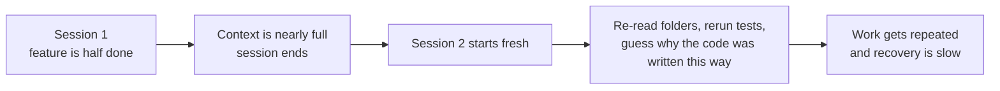
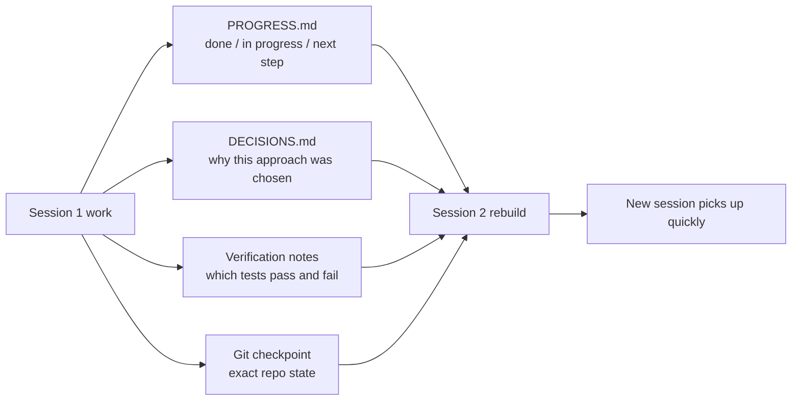

[中文版本 →](../../../zh/lectures/lecture-05-why-long-running-tasks-lose-continuity/)

> Codebeispiele: [code/](https://github.com/walkinglabs/learn-harness-engineering/blob/main/docs/de/lectures/lecture-05-why-long-running-tasks-lose-continuity/code/)
> Praxisprojekt: [Project 03. Multi-session continuity](./../../projects/project-03-multi-session-continuity/index.md)

# Lektion 05. Kontext über Sessions hinweg erhalten

Sie bitten Claude Code, ein vollständiges Feature zu implementieren. Es läuft 30 Minuten, erledigt den Großteil der Arbeit, aber der Kontext wird knapp. Sie starten eine neue Session, um fortzufahren — und stellen fest, dass es sich nicht an die Entscheidungen der letzten Session erinnert, warum Option A gegenüber Option B gewählt wurde, welche Dateien bereits geändert wurden oder in welchem Zustand sich die Tests befinden. Es verbringt 15 Minuten damit, das Projekt neu zu erkunden, und könnte inkonsistent zum vorherigen Ansatz sein.

Stellen Sie sich vor, Sie wären ein Handwerker, der jeden Morgen beim Aufwachen alles vergisst. Sie müssten sich die gesamte Baustelle neu vertraut machen — welche Mauer halb fertig ist, warum rote statt blaue Ziegel gewählt wurden, wo die Rohrleitungen verlaufen. Schlimmer noch, Sie könnten ein Fenster herausreißen, das gestern bereits eingebaut wurde, einfach weil Sie sich nicht erinnern, dass es erledigt war.

Genau in dieser Situation befinden sich KI-Coding-Agenten bei übergreifenden Aufgaben. Diese Lektion erklärt, warum Agenten bei langen Aufgaben „aussteigen" und wie strukturierte Zustandspersistenz sie wie einen Handwerker machen kann, der ein zuverlässiges Tagebuch führt — immer noch amnesisch, aber das Tagebuch erinnert sich an alles.

## Kontextfenster: Nicht unendlich

Kontextfenster sind endlich. Das lässt sich nicht durch Modell-Upgrades lösen — selbst wenn Fenstergrößen auf 1M Token anwachsen, werden komplexe Aufgaben sie dennoch erschöpfen. Denn Agenten generieren nicht nur Code; sie verstehen Codebases, verfolgen ihre eigene Entscheidungsgeschichte, verarbeiten Tool-Ausgaben und pflegen den Gesprächskontext. All diese Informationen wachsen schneller als die Fenstervergrößerung.

Ein tieferes Problem: Die Informationen, die der Agent produziert, sind nicht gleichmäßig wichtig. Zwischen den Reasoning-Schritten steckt das „warum" der Entscheidungen — warum Option B gegenüber A gewählt wurde, warum diese Bibliothek statt jener, warum eine bestimmte Optimierung übersprungen wurde. Die endgültige Ausgabe enthält nur das „was" — den Code selbst. Kompressionsstrategien bewahren normalerweise letzteres, verlieren aber ersteres. Die nächste Session sieht den Code, weiß aber nicht, warum er so geschrieben wurde, und „optimiert" möglicherweise eine bewusste Designentscheidung weg.

Anthropic hat in seiner Forschung zu langlebigen Agenten etwas Faszinierendes entdeckt: Wenn Agenten spüren, dass der Kontext knapp wird, zeigen sie ein „voreilige Konvergenz"-Verhalten — sie hetzen, die aktuelle Arbeit abzuschließen, überspringen Verifizierungsschritte oder wählen eine einfache Lösung statt der optimalen. Es ist, als würde man merken, dass die Zeit im Exam abläuft, und schnell die restlichen Multiple-Choice-Fragen raten. Anthropic nennt dies „context anxiety".

## Session-Kontinuitätsfluss

Ohne Kontinuitäts-Artefakte ist jede neue Session eine Katastrophe:



Mit Kontinuitäts-Artefakten können neue Sessions schnell aufsetzen:



## Zentrale Konzepte

- **Kontextfenster sind endlich**: Egal welche Fenstergröße behauptet wird (128K, 200K, 1M) — lange Aufgaben werden sie schließlich erschöpfen. Nach der Erschöpfung ist entweder Kompression (Informationsverlust) oder ein Reset (neue Session) erforderlich. Beide verlieren etwas.
- **Kontinuitäts-Artefakte**: Persistierte Zustandsdateien, die es einer neuen Session ermöglichen, eindeutig dort fortzufahren, wo die letzte aufgehört hat. Die Grundform: Fortschrittsprotokoll + Verifizierungsdatensatz + nächste Aktionen. Das Tagebuch dieses Handwerkers.
- **Rebuild-Kosten**: Die Zeit, die eine neue Session benötigt, um einen ausführbaren Zustand zu erreichen. Gute harness-Konstruktionen können die Rebuild-Kosten von 15 Minuten auf 3 Minuten komprimieren.
- **Drift**: Die Lücke zwischen dem Verständnis des Agenten und dem tatsächlichen Zustand des Code-Repositorys. Jede Sitzungsgrenze führt Drift ein; ohne Kontrolle summiert er sich.
- **Context Anxiety**: Ein von Anthropic beobachtetes Phänomen — Agenten zeigen voreiliges Konvergenzverhalten, wenn sie sich wahrgenommenen Kontextgrenzen nähern, und beenden Aufgaben vorzeitig, um Informationsverlust zu vermeiden. Es ist eine irrationale Ressourcenangst.
- **Kompression vs. Reset**: Kompression fasst den Kontext innerhalb derselben Session zusammen (behält das „was", verliert möglicherweise das „warum"); Reset öffnet eine neue Session, die aus persistiertem Zustand wieder aufgebaut wird (sauber, aber abhängig von der Vollständigkeit der Artefakte).

## Was passiert, wenn die Kontinuität abbricht

Die vorherige Session hat bedeutende Kontextbudgets für die Analyse dreier Ansätze und die Wahl von Option B aufgewendet. Der Agent dieser Session weiß nichts von dieser Analyse und könnte auf Basis unvollständiger Informationen neu entscheiden — möglicherweise wählt er Option A. Wie der amnestische Handwerker, der sich nicht erinnert, warum rote Ziegel gewählt wurden, die blauen heute schöner findet und die Mauer von gestern abreißt, um sie neu zu bauen.

Noch schlimmer ist doppelte Arbeit. Der Agent ist sich nicht sicher, ob bestimmte Arbeit bereits erledigt wurde, und macht sie noch einmal. Oder noch schlimmer — erledigt die Hälfte, entdeckt einen Konflikt mit der bestehenden Implementierung und muss nacharbeiten. Auf einer Baustelle können nicht zwei Teams gleichzeitig dieselbe Mauer bauen — aber ohne Fortschrittsaufzeichnungen hat die neue Mannschaft keine Ahnung, dass bereits jemand daran arbeitet.

Über mehrere Sessions hinweg kann die Implementierungsrichtung still von den ursprünglichen Anforderungen abgedriftet sein. Jede neue Session hat ein leicht anderes Verständnis der Projektziele. Wie bei einem Flüsternachrichtenspiel — nachdem zehn Menschen die Nachricht weitergegeben haben, könnte „hol mir einen Kaffee" zu „kauf mir eine Kaffeemaschine" geworden sein.

Es gibt auch die Verifizierungslücke. Die Verifizierungsergebnisse der vorherigen Session (welche Tests durchlaufen, welche fehlschlagen, warum sie fehlschlagen) wurden nicht dokumentiert. Die neue Session muss alle Verifizierungen erneut ausführen, um den aktuellen Zustand zu verstehen. Jede Session diagnostiziert von Grund auf neu, jedes Mal wertvollen Kontext verschwendend.

Sowohl OpenAI als auch Anthropic betonen strukturierte Zustandspersistenz in ihrer Dokumentation. OpenAIs Artikel zum harness Engineering behandelt das Repository als „operational record" — die Ergebnisse jeder Operation sollten nachvollziehbare Spuren im Repo hinterlassen. Anthropics Dokumentation zu langlebigen Agenten empfiehlt ausdrücklich „handoff files" — strukturierte Dokumente mit aktuellem Zustand, bekannten Problemen und nächsten Aktionen.

## Ein Tagebuch für den amnestischen Handwerker

Kernansatz: **Behandeln Sie den Agenten wie einen brillanten Ingenieur mit Amnesie.** Bevor er „aussticht", muss er kritische Informationen aufschreiben, damit der Agent der nächsten „Schicht" schnell aufsetzen kann.

**Tool 1: Fortschrittsdatei (PROGRESS.md).** Das grundlegendste Kontinuitäts-Artefakt — der Kern des Tagebuchs:

```markdown
# Project Progress

## Current State
- Latest commit: abc1234 (feat: add user preferences endpoint)
- Test status: 42/43 passing (test_pagination_edge_case failing)
- Lint: passing

## Completed
- [x] User model and database migration
- [x] Basic CRUD endpoints
- [x] Auth middleware integration

## In Progress
- [ ] Pagination feature (90% - edge case test failing)

## Known Issues
- test_pagination_edge_case returns 500 on empty result sets
- Need to confirm whether deleted users should appear in listings

## Next Steps
1. Fix pagination edge case bug
2. Add "include deleted users" query parameter
3. Update API documentation
```

**Tool 2: Entscheidungsprotokoll (DECISIONS.md).** Dokumentiert wichtige Designentscheidungen und deren Gründe. Keine detaillierten Designdokumente nötig — nur „welche Entscheidung, warum, wann" — die Notizen im Tagebuch:

```markdown
# Design Decisions

## 2024-01-15: Use Redis for user preferences caching
- Reason: High read frequency (every API call), small data size
- Rejected alternative: PostgreSQL materialized view (high change frequency makes maintenance cost not worthwhile)
- Constraint: Cache TTL of 5 minutes, active invalidation on write
```

**Tool 3: Git-Commits als Kontrollpunkte.** Committen Sie nach Abschluss jeder atomaren Arbeitseinheit. Commit-Nachrichten sollten erklären, was getan wurde und warum. Diese sind kostenlose, automatisch versionierte Zustandsschnappschüsse.

**Tool 4: init.sh oder harness-Initialisierungsfluss.** Spezifizieren Sie in `AGENTS.md` die „Einstich"- und „Ausstich"-Routinen:

```markdown
## At session start (clock in)
1. Read PROGRESS.md for current state
2. Read DECISIONS.md for important decisions
3. Run make check to confirm repo is in consistent state
4. Continue from PROGRESS.md "Next Steps" section

## Before session end (clock out)
1. Update PROGRESS.md
2. Run make check to confirm consistent state
3. Commit all completed work
```

**Gemischte Strategie**: Nicht jede Aufgabe benötigt einen Kontext-Reset. Kurze Aufgaben (unter 30 Minuten) können innerhalb einer Session abgeschlossen werden. Lange Aufgaben (sessionübergreifend) müssen Fortschrittsdateien und Entscheidungsprotokolle für die Kontinuität verwenden. Entscheidungsregel: Wenn eine Aufgabe mehr als 60% des Fensters benötigt, beginnen Sie mit der Vorbereitung der Übergabe.

### Tieferer Einblick in Context Anxiety

Anthropics Forschung von März 2026 offenbarte weitere Details zur Context Anxiety: Bei Sonnet 4.5 zeigt der Agent starkes „voreilige Konvergenz"-Verhalten, wenn der Kontext sich der Fenstergrenze nähert. Es ist, als würde man merken, dass die Zeit fast abgelaufen ist, und schnell zufällige Antworten bei der Multiple Choice ausfüllen.

Zwei Strategien helfen dagegen:

**Kompression**: Frühzeitige Gesprächszusammenfassung innerhalb derselben Session. Vorteil: erhält Kontinuität, der Agent kann das „was" sehen. Nachteil: das „warum" geht in Zusammenfassungen oft verloren — warum Option B gegenüber A gewählt wurde, warum eine bestimmte Optimierung übersprungen wurde. Kritischer noch: Kompression beseitigt die Context Anxiety nicht — der Agent weiß, dass der Kontext einmal groß war, und neigt psychologisch weiterhin zum voreiligen Abschluss.

**Kontext-Reset**: Vollständiges Leeren des Kontexts, Öffnen einer neuen Session, Wiederherstellung aus persistierten Artefakten. Vorteil: sauberer mentaler Zustand — die neue Session hat keine „mir geht die Zeit aus"-Angst. Nachteil: abhängig von der Vollständigkeit der Übergabe-Artefakte. Wenn im Tagebuch kritische Informationen fehlen, kann die neue Session Zeit in die falsche Richtung verschwenden.

Anthropics tatsächliche Daten: Bei Sonnet 4.5 ist die Context Anxiety so stark, dass Kompression allein nicht ausreicht — Kontext-Reset wird zu einer kritischen Komponente des harness-Designs. Bei Opus 4.5 ist dieses Verhalten jedoch stark abgeschwächt, und Kompression kann den Kontext verwalten, ohne auf Resets angewiesen zu sein. Das bedeutet: **harness-Design benötigt spezifisches Verständnis des Zielmodells, keine Einheitslösung.**

> Quelle: [Anthropic: Harness design for long-running application development](https://www.anthropic.com/engineering/harness-design-long-running-apps)

## Praxisbeispiel

Ein Agent wurde beauftragt, ein Blog-System mit Benutzerauthentifizierung zu implementieren — 12 Feature-Punkte, geschätzte 5 Sessions nötig.

**Baseline ohne Tagebuch**: Session 1 implementierte das Benutzermodell und grundlegende Routen. Session 2 startete ohne dass sich der Agent an den Interface-Vertrag der Auth-Middleware erinnerte und verbrachte ~15 Minuten damit, die vorherige Designabsicht zu erschließen. In Session 3 führte akkumulierter Drift dazu, dass der Agent bereits abgeschlossene Features neu zu implementieren begann. In Session 5 enthielt das Repo viel redundanten Code, aber das Kern-Auth-Feature hatte die End-to-End-Tests noch nicht bestanden. Nur 7 von 12 Feature-Punkten abgeschlossen, 3 mit versteckten Korrektheitsproblemen. Wie der Handwerker, der nie in sein Tagebuch schreibt — an Tag fünf ist die Baustelle das Chaos, einige Mauern doppelt gebaut, einige, die hätten gebaut werden sollen, nie begonnen.

**Mit Tagebuch**: Unter Verwendung von Fortschrittsdateien, Entscheidungsprotokollen, Verifizierungsaufzeichnungen und Git-Kontrollpunkten. Zustandsbericht automatisch am Ende jeder Session aktualisiert. Session 2s Rebuild-Kosten fielen auf ~3 Minuten. Bis Session 5 waren alle 12 Feature-Punkte abgeschlossen und verifiziert.

Quantitativer Vergleich: Rebuild-Zeit um ~78% reduziert, Feature-Abschlussrate von 58% auf 100%, versteckte Fehlerrate von 43% auf 8%. Der Handwerker ist immer noch amnestisch, aber mit dem Tagebuch beginnt jeder Tag dort, wo der vorherige aufgehört hat — nicht bei null.

## Wichtigste Erkenntnisse

- Kontextfenster sind eine endliche Ressource. Lange Aufgaben werden Sessions überspannen, und Sessions werden Informationen verlieren — wie der Handwerker, der jeden Tag vergisst, ist das objektive Realität.
- Die Lösung sind nicht größere Fenster — sondern bessere Zustandspersistenz. Fortschrittsdateien + Entscheidungsprotokolle + Git-Kontrollpunkte — geben Sie dem amnestischen Handwerker ein zuverlässiges Tagebuch.
- Behandeln Sie den Agenten wie einen Ingenieur mit Amnesie: Bevor er „aussticht", schreibt er auf, was getan wurde, warum und was als Nächstes ansteht.
- Rebuild-Kosten sind die zentrale Kennzahl. Gute harness-Konstruktionen sollten neue Sessions innerhalb von 3 Minuten in einen ausführbaren Zustand bringen.
- Gemischte Strategie: kurze Aufgaben innerhalb von Sessions, lange Aufgaben mit strukturierten Artefakten für Kontinuität.

## Weiterführende Literatur

- [Anthropic: Effective Harnesses for Long-Running Agents](https://www.anthropic.com/engineering/effective-harnesses-for-long-running-agents)
- [OpenAI: Harness Engineering](https://openai.com/index/harness-engineering/)
- [Lost in the Middle: How Language Models Use Long Contexts](https://arxiv.org/abs/2307.03172)
- [Claude Code Documentation](https://docs.anthropic.com/de/docs/claude-code)
- [HumanLayer: Harness Engineering for Coding Agents](https://humanlayer.dev/articles/harness-engineering-for-coding-agents/)

## Übungen

1. **Kontinuitätsverlust-Messung**: Wählen Sie eine Entwicklungsaufgabe, die mindestens 3 Sessions benötigt. Ohne Kontinuitäts-Artefakte anzubieten, notieren Sie zu Beginn jeder Session, wie viel Kontext der Agent darauf verwendet, „herauszufinden, was beim letzten Mal passiert ist." Erstellen Sie nach jeder Session eine Fortschrittsdatei und lassen Sie die nächste Session daraus starten. Vergleichen Sie die Rebuild-Kosten mit und ohne Fortschrittsdateien.

2. **Übergabe-Vorlage entwerfen**: Entwerfen Sie eine minimale Übergabe-Vorlage mit vier Feldern: Repo-Zustand (Commit-Hash), Laufzeitzustand (Test-Pass-Rate), Blockaden, nächste Aktionen. Lassen Sie eine komplett neue Agenten-Session den Projektzustand nur anhand dieser Vorlage wiederherstellen. Dokumentieren Sie Mehrdeutigkeiten bei der Wiederherstellung und iterieren Sie zur Verbesserung der Vorlage.

3. **Gemischte Strategie experimentieren**: In einer 5-Session-Entwicklungsaufgabe vergleichen Sie drei Strategien: (a) immer neue Sessions starten + Fortschrittsdateien, (b) so viel wie möglich in einer Session erledigen (Kontext-Kompression), (c) gemischte Strategie (kurze Aufgaben in der Session, lange Aufgaben sessionübergreifend + Fortschrittsdateien). Vergleichen Sie Rebuild-Zeit, Feature-Abschlussrate und Entscheidungs konsistenz.
