[中文版本 →](../../../zh/lectures/lecture-06-why-initialization-needs-its-own-phase/)

> Codebeispiele: [code/](https://github.com/walkinglabs/learn-harness-engineering/blob/main/docs/de/lectures/lecture-06-why-initialization-needs-its-own-phase/code/)
> Praxisprojekt: [Project 03. Multi-session continuity](./../../projects/project-03-multi-session-continuity/index.md)

# Lektion 06. Vor jeder Agenten-Session initialisieren

Sie starten eine neue Agenten-Session und sagen „Füge eine Suchfunktion hinzu." Es stürzt sich direkt ins Programmieren — bewundernswerte Begeisterung. Nach 20 Minuten stellt es fest, dass das Test-Framework nicht richtig konfiguriert ist, verbringt weitere 10 Minuten mit der Reparatur, dann ist das Format des Datenbankmigrationsskripts falsch, weiteres Herumgefummel. Die Suchfunktion wird schließlich hinzugefügt, aber die gesamte Session war ineffizient — die meiste Zeit floss in „herausfinden, wie dieses Projekt funktioniert" anstatt die Suchfunktion zu schreiben.

Der bessere Ansatz: Bevor der Agent mit der Arbeit beginnt, eine separate Phase nutzen, um die Basisumgebung vorzubereiten, Verifizierungsbefehle zum Laufen zu bringen und die Projektstruktur zu verstehen. Es ist wie beim Hausbau — man gießt nicht das Fundament und stellt gleichzeitig die Wände auf. Wenn man es doch tut, stehen die Wände, bevor das Fundament ausgehärtet ist, und das gesamte Gebäude muss abgerissen und neu begonnen werden. Erst das Fundament gießen, aushärten lassen, dann die Wände bauen — sauber und effizient.

Diese Lektion erklärt, warum die Initialisierung eine separate Phase sein muss, nicht mit der Implementierung vermischt.

## Fundament und Wände: Zwei grundverschiedene Aufgaben

Initialisierung und Implementierung haben völlig unterschiedliche Optimierungsziele. Die Implementierungsphase optimiert auf: Maximierung der Menge und Qualität verifizierter Features. Die Initialisierungsphase optimiert auf: Maximierung der Zuverlässigkeit und Effizienz aller nachfolgenden Implementierungen.

Wenn man Initialisierung und Implementierung vermischt, steht der Agent vor einem Multi-Objective-Optimierungsproblem — gleichzeitig Infrastruktur aufbauen und Feature-Code schreiben. Ohne explizite Prioritätensetzung neigt der Agent natürlicherweise zum Schreiben von Code (weil das direkt sichtbare Ausgabe ist) und opfert die Infrastruktur (weil ihr Wert sich erst in nachfolgenden Sessions zeigt). Es ist, als würde man einer Baumannschaft sagen, sie soll gleichzeitig das Fundament gießen und die Wände bauen — sie werden wahrscheinlich eilig Wände bauen, weil Wände sichtbar und vorzeigbar sind. Aber ein Haus mit einem schlechten Fundament hat systemische Probleme später.

## Initialisierungs-Lebenszyklus

```mermaid
flowchart TB
    subgraph Wrong["Mixed session (wrong)"]
        W1["Start feature work immediately"] --> W2["Discover env and test gaps mid-task"]
        W2 --> W3["Accumulate unverified code"]
        W3 --> W4["Next session must rediscover project state"]
    end

    subgraph Right["Dedicated initialization (right)"]
        R1["Session 1: environment runnable"] --> R2["Example test passing"]
        R2 --> R3["Bootstrap contract + task list written"]
        R3 --> R4["Clean checkpoint committed"]
        R4 --> R5["Later sessions start directly on verified tasks"]
    end
```



## Was passiert, wenn man beides vermischt

Das direkteste Problem: Das Fundament härtet nicht richtig aus. Der Agent verbringt 80% seiner Mühe auf Feature-Code und 20% mit beiläufigem Aufbau etwas Infrastruktur. Das Test-Framework ist konfiguriert, aber nie verifiziert, Lint-Regeln sind gesetzt, aber zu lasch, keine Fortschrittsdatei erstellt. Diese Mängel sind in der ersten Session nicht offensichtlich (weil der Agent sich noch an das erinnert, was er getan hat), aber sie tauchen in der zweiten Session auf — der neue Agent weiß nicht, wie man ausführt, testet oder wo die Dinge stehen. Schlechtes Fundament, wackeliges Gebäude.

Ein noch verborgenerer Kostenfaktor ist die „unverifizierte Akkumulation" — Feature-Code, der geschrieben wurde, bevor das Test-Framework konfiguriert ist, ist Code ohne Verifizierung. Wenn man schließlich zurückgeht, um Tests für diesen Code hinzuzufügen, könnte man feststellen, dass das Design von Anfang an falsch war — hätte man es gewusst, hätte man es anders implementiert. Wie Fliesen auf nassem Beton — wenn man entdeckt, dass der Boden nicht eben ist, müssen alle Fliesen herausgebrochen und neu verlegt werden.

Das Session-Budget wird ebenfalls verschwendet. Initialisierungsarbeit (Umgebungen konfigurieren, Tests einrichten, Projektstruktur verstehen) verbraucht signifikantes Budget und lässt weniger für die eigentliche Feature-Implementierung. Ergebnis: Die erste Session schließt nur die Hälfte der Features ab, und die zweite Session muss das Projektverständnis von vorne beginnen. Budget für das Fundament ausgegeben, aber das Fundament ist auch nicht solide — keines der beiden Ziele erreicht.

Das am leichtesten übersehene Problem sind implizite Annahmen-Landminen. Entscheidungen, die der Agent während der Initialisierung trifft (welches Test-Framework, wie Verzeichnisse organisieren, Abhängigkeitsverwaltung) — wenn sie nicht explizit dokumentiert werden, können nachfolgende Sessions diese Entscheidungen nicht nachvollziehen. Schlimmer noch, nachfolgende Sessions könnten widersprüchliche Entscheidungen treffen. Die erste Baumannschaft hat ein Betonfundament verwendet, die zweite weiß es nicht und hat Holzpfähle hineingetrieben — das Fundament reißt.

Anthropics Forschung zur Entwicklung langlebiger Anwendungen empfiehlt ausdrücklich die Trennung von Initialisierung und Implementierung. Ihre experimentellen Daten: Projekte mit einer dedizierten Initialisierungsphase zeigten in Multi-Session-Szenarien eine um 31% höhere Feature-Abschlussrate im Vergleich zu gemischten Ansätzen. Die zentrale Erkenntnis — die in die Initialisierungsphase investierte Zeit wird in den nächsten 3–4 Sessions vollständig zurückgewonnen. Je solider das Fundament, desto schneller gehen die Wände hoch.

OpenAIs Codex harness Engineering-Leitfaden betont ebenfalls das Prinzip „Repository als operativer Datensatz" — etablieren Sie von Anfang an eine klare Betriebsstruktur, sonst muss jede neue Session Projektkonventionen neu erschließen.

## Zentrale Konzepte

- **Initialisierungsphase**: Die erste Phase im Lebenszyklus des Agenten — keine Feature-Implementierung, nur die Schaffung von Voraussetzungen für alle nachfolgenden Implementierungsphasen. Die Ausgabe ist kein Code, sondern Infrastruktur.
- **Bootstrap-Vertrag**: Die Bedingungen, unter denen ein Projekt von einer neuen Agenten-Session eindeutig betrieben werden kann — kann starten, kann testen, kann Fortschritt sehen, kann nächste Schritte aufnehmen. Vier Bedingungen, alle erforderlich.
- **Kaltstart vs. Warmstart**: Kaltstart bedeutet ein leeres Verzeichnis, in dem der Agent die Projektstruktur erraten muss; Warmstart bedeutet eine Vorlage oder ein bestehendes Projekt, in dem die Infrastruktur bereits vorhanden ist. Warmstart schneidet deutlich besser ab — wie das Arbeiten auf einer Baustelle mit fließendem Wasser und Strom versus dem Beginn auf einer kargen Brache.
- **Übergabebereitschaft**: Das Projekt befindet sich jederzeit in einem Zustand, in dem ein neuer Agent übernehmen kann. Keine mündliche Erklärung nötig — nur der Repo-Inhalt.
- **Zeit bis zur ersten Verifizierung**: Die Zeit vom Projektstart bis zum ersten bestandenen Feature-Verifizierungspunkt. Dies ist die Kernkennzahl zur Messung der Initialisierungseffizienz.
- **Downstream-Verwendbarkeit**: Das beste Maß für die Initialisierungsqualität — der Anteil nachfolgender Sessions, die erfolgreich Aufgaben ausführen können, ohne auf implizites Wissen angewiesen zu sein.

## Wie man Initialisierung richtig durchführt

**Behandeln Sie Initialisierung als dedizierte Phase.** Die erste Session führt nur Initialisierung durch — überhaupt kein Geschäfts-Feature-Code. Initialisierung produziert:

**1. Ausführbare Umgebung.** Das Projekt startet, Abhängigkeiten sind installiert, keine Umgebungsprobleme. Fundament gegossen, keine Risse.

**2. Verifizierbares Test-Framework.** Mindestens ein Beispieltest ist bestanden. Das beweist, dass das Test-Framework selbst richtig konfiguriert ist — wie das Aufstellen einer Säule auf dem Fundament, um zu beweisen, dass es Gewicht tragen kann.

**3. Bootstrap-Vertragsdokument.** Ein klares Dokument, das nachfolgenden Sessions sagt:
```markdown
# Initialization Contract

## Start Commands
- Install dependencies: `make setup`
- Start dev server: `make dev`
- Run tests: `make test`
- Full verification: `make check`

## Current State
- All dependencies installed and locked
- Test framework configured (Vitest + React Testing Library)
- Example test passing (1/1)
- Lint rules configured (ESLint + Prettier)

## Project Structure
- src/ — Source code
- src/components/ — React components
- src/api/ — API client
- tests/ — Test files
```

**4. Aufgaben-Aufschlüsselung.** Teilen Sie das gesamte Projekt in eine geordnete Aufgabenliste auf, jede Aufgabe mit klaren Akzeptanzkriterien:
```markdown
# Task Breakdown

## Task 1: User Authentication Basics
- Implement JWT auth middleware
- Add login/register endpoints
- Acceptance: pytest tests/test_auth.py all passing

## Task 2: User Profile Page
- Implement user profile CRUD
- Add profile edit form
- Acceptance: pytest tests/test_profile.py all passing

## Task 3: Search Feature
- ...
```

**5. Git-Commit als Kontrollpunkt.** Nach Abschluss der Initialisierung einen sauberen Kontrollpunkt committen. Alle nachfolgende Arbeit beginnt ab diesem Kontrollpunkt.

**Warmstart-Strategie**: Nicht mit einem leeren Verzeichnis beginnen. Verwenden Sie eine Projektvorlage (create-react-app, fastapi-template, etc.), um eine Standardverzeichnisstruktur, Abhängigkeitskonfiguration und Test-Framework vorzugeben. Backen Sie häufige Initialisierungsschritte in die Vorlage ein und lassen Sie nur projektspezifische Initialisierungsarbeit übrig. Wie das Arbeiten auf einer Baustelle mit fließendem Wasser und Strom — zehntausendmal besser als der Beginn auf einer kargen Brache.

**Initialisierungs-Abschlusskriterien**: Nicht „wie viel Code geschrieben wurde", sondern ob die vier Bedingungen des Bootstrap-Vertrags erfüllt sind — kann starten, kann testen, kann Fortschritt sehen, kann nächste Schritte aufnehmen. Verwenden Sie diese Checkliste zur Validierung der Initialisierung:

```markdown
## Initialization Acceptance Checklist
- [ ] `make setup` succeeds from scratch
- [ ] `make test` has at least one passing test
- [ ] A new agent session can answer "how to run" and "how to test" from repo contents alone
- [ ] Task breakdown file exists with at least 3 tasks
- [ ] Everything committed to git
```

## Praxisbeispiel

Zwei Initialisierungsansätze für ein React-Frontend-Projekt:

**Gemischter Ansatz (Fundament gießen und Wände gleichzeitig bauen)**: Der Agent erstellte gleichzeitig Projektgerüst und implementierte das erste Feature in Session 1. Am Session-Ende hatte das Repo ausführbaren Code, aber: keine explizite Start-/Test-Befehlsdokumentation, keine Fortschritts-Tracking-Datei, keine Aufgaben-Aufschlüsselung. Session 2 verbrachte ~20 Minuten damit, Projektstruktur, Test-Framework und Build-Prozess zu erschließen — wie eine neue Baumannschaft, die auf einer Baustelle ankommt, nicht weiß, wie weit das Fundament ist oder wo die Rohre verlaufen, und Loch für Loch graben muss, um es herauszufinden.

**Dedizierte Initialisierung (erst das Fundament)**: Session 1 führte nur Initialisierung durch — erstellte Verzeichnisstruktur aus einer Vorlage, konfigurierte das Test-Framework (Vitest + React Testing Library), schrieb und verifizierte einen Beispieltest, erstellte das Bootstrap-Vertragsdokument und die Aufgaben-Aufschlüsselungsdatei, committete den initialen Kontrollpunkt. Session 2s Rebuild-Zeit lag unter 3 Minuten, und sie begann direkt aus der Aufgabenliste zu arbeiten — die Mannschaft kommt an, wirft einen Blick auf den Bauplan und weiß genau, wo sie ansetzen muss.

Vergleich über den gesamten Projektzyklus: Die gesamte Rebuild-Zeit des gemischten Ansatzes (über alle Sessions) lag ~60% höher als beim dedizierten Initialisierungsansatz. Die zusätzlichen 20 Minuten für die Initialisierung wurden in nachfolgenden Sessions vielfach zurückgewonnen. Wie ein solides Fundament, das die Wände schneller hochgehen lässt — langsam ist schnell.

## Wichtigste Erkenntnisse

- Initialisierung und Implementierung haben unterschiedliche Optimierungsziele — ihre Vermischung zieht nur beide herunter. Erst das Fundament gießen, dann die Wände bauen.
- Die Ausgabe der Initialisierung ist kein Code, sondern Infrastruktur: ausführbare Umgebung, verifizierbare Tests, Bootstrap-Vertrag, Aufgaben-Aufschlüsselung.
- Validieren Sie die Initialisierung anhand der vier Bedingungen des Bootstrap-Vertrags: kann starten, kann testen, kann Fortschritt sehen, kann nächste Schritte aufnehmen.
- Warmstart schlägt Kaltstart. Verwenden Sie Projektvorlagen, um standardisierte Infrastruktur vorzugeben.
- Die in die Initialisierung investierte Zeit wird in den nächsten 3–4 Sessions vollständig zurückgewonnen. Das sind keine Mehrkosten — sondern eine Vorab-Investition. Je solider das Fundament, desto schneller geht das Gebäude hoch.

## Weiterführende Literatur

- [Anthropic: Effective Harnesses for Long-Running Agents](https://www.anthropic.com/engineering/effective-harnesses-for-long-running-agents)
- [OpenAI: Harness Engineering](https://openai.com/index/harness-engineering/)
- [HumanLayer: Harness Engineering for Coding Agents](https://humanlayer.dev/articles/harness-engineering-for-coding-agents/)
- [Infrastructure as Code — Martin Fowler](https://martinfowler.com/bliki/InfrastructureAsCode.html)
- [SWE-agent: Agent-Computer Interfaces](https://github.com/princeton-nlp/SWE-agent)

## Übungen

1. **Bootstrap-Vertrag entwerfen**: Schreiben Sie einen vollständigen Bootstrap-Vertrag für ein Projekt, das Sie entwickeln. Öffnen Sie dann eine komplett neue Agenten-Session, zeigen Sie ihr nur den Repo-Inhalt (kein mündlicher Kontext), und lassen Sie sie versuchen, das Projekt zu starten, Tests auszuführen und den aktuellen Fortschritt zu verstehen. Notieren Sie jedes Problem, auf das sie stößt — jedes entspricht einer fehlenden Klausel in Ihrem Bootstrap-Vertrag.

2. **Vergleichsexperiment**: Wählen Sie ein moderat komplexes neues Projekt. Ansatz A: Den Agenten gleichzeitig initialisieren und die erste Implementierung durchführen lassen. Ansatz B: Eine Session für dedizierte Initialisierung aufwenden, Implementierung in Session 2 beginnen. Nach 4 Sessions vergleichen: Zeit bis zur ersten Verifizierung, Rebuild-Kosten, Feature-Abschlussrate.

3. **Initialisierungs-Akzeptanz-Checkliste**: Entwerfen Sie eine Initialisierungs-Akzeptanz-Checkliste für Ihr Projekt. Lassen Sie eine neue Agenten-Session jeden Checklistenpunkt ausführen und notieren Sie, welche bestehen und welche fehlschlagen. Die fehlschlagenden Punkte sind die Stellen, an denen Ihr harness verstärkt werden muss.
