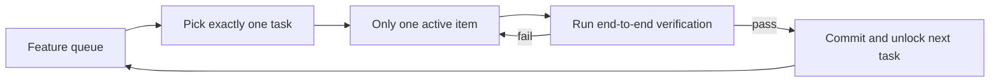
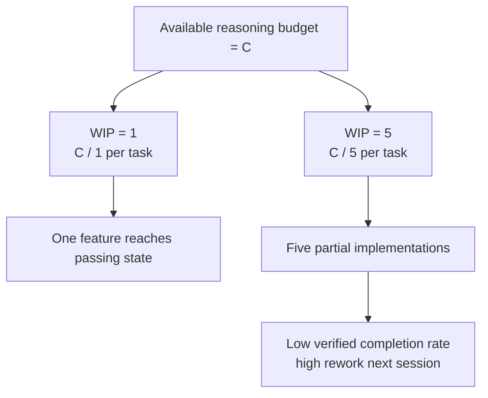

[中文版本 →](../../../zh/lectures/lecture-07-why-agents-overreach-and-under-finish/)

> Codebeispiele: [code/](https://github.com/walkinglabs/learn-harness-engineering/blob/main/docs/de/lectures/lecture-07-why-agents-overreach-and-under-finish/code/)
> Praxisprojekt: [Project 04. Runtime feedback and scope control](./../../projects/project-04-incremental-indexing/index.md)

# Lektion 07. Klare Aufgabengrenzen für Agenten ziehen

Sie sagen Claude Code, es soll „Benutzerauthentifizierung zu diesem Projekt hinzufügen", und es beginnt, das Datenbankschema zu ändern, Routen zu schreiben, Frontend-Komponenten zu bearbeiten und — während es gerade dabei ist — die Fehlerbehandlungs-Middleware zu refactoren. Zwei Stunden später überprüfen Sie: 12 Dateien geändert, 800 Zeilen neuer Code, und kein einziges Feature funktioniert End-to-End.

Sich mehr auf den Teller laden, als man bewältigen kann — dieses Sprichwort gilt für KI-Agenten ganz besonders. Agenten werden mit einem Impuls geboren, „noch etwas Extra zu erledigen" — sie sehen verwandte Dinge und erledigen sie einfach nebenbei, wie jemand, der für eine Flasche Sojasauce in den Supermarkt geht und mit einem vollen Einkaufswagen herauskommt. Das Problem ist: Menschen, die zu viel kaufen, verschwenden nur Geld; Agenten, die zu viele Dinge gleichzeitig tun, bedeuten, dass keines davon richtig erledigt wird.

Anthropics Engineering-Blog „Effective harnesses for long-running agents" stellt klar: Wenn Prompts zu breit gefasst sind, neigen Agenten dazu, „mehrere Dinge gleichzeitig zu beginnen" anstatt „erst eins zu Ende zu bringen." OpenAIs Codex-Engineering-Praktiken fanden dasselbe — Aufgaben ohne explizite Scope-Kontrollen sehen Abschlussraten einbrechen. Das ist kein Modellproblem — es ist ein harness-Problem. Sie haben die Grenze nicht gezogen.

## Aufmerksamkeit ist eine endliche Ressource

Das ist keine Metapher — es ist Mathematik. Angenommen, die Kontextkapazität des Agenten ist C und er aktiviert gleichzeitig k Aufgaben. Jede Aufgabe bekommt durchschnittlich C/k Reasoning-Ressourcen. Wenn C/k unter den Mindestschwellenwert fällt, der zum Abschluss einer einzelnen Aufgabe benötigt wird, wird keine davon fertig. Ihr Magen ist nur so groß — stopfen Sie zehn Knödel auf einmal hinein, und Sie verdauen sie nicht alle, Sie bekommen einfach zehnmal Verdauungsprobleme.

Claude Codes tatsächliches Verhalten ist aufschlussreich. Bitten Sie es, „Benutzerregistrierung hinzuzufügen", und es könnte:

1. Ein User-Modell erstellen
2. Die Registrierungsroute schreiben
3. Bemerken, dass E-Mail-Verifizierung nötig ist, also einen Mail-Service hinzufügen
4. Sehen, dass Passwörter gehasht werden müssen, also bcrypt einbinden
5. Bemerken, dass die Fehlerbehandlung inkonsistent ist, also die globale Error-Middleware refactoren
6. Sehen, dass die Testdateistruktur unordentlich ist, also das Verzeichnis reorganisieren

Sechs Schritte später ist jeder halb fertig. Keine End-to-End-Verifizierung, komplexe Kopplung zwischen dem halbfertigen Code, und die nächste Session, die alles aufarbeiten muss, wird völlig verloren sein. Wie jemand, der sechs Gerichte gleichzeitig kocht — jedes Gericht ist in der Pfanne, aber keines ist angerichtet. Sie alle verbrennen.

Anthropics experimentelle Daten unterstützen dies direkt: Agenten mit einer „kleiner nächster Schritt"-Strategie (entspricht WIP=1) zeigen eine um 37% höhere Aufgaben-Abschlussrate als Agenten mit breiten Prompts. Noch interessanter: Die Anzahl der vom Agenten generierten Codezeilen ist schwach negativ korreliert mit dem tatsächlichen Feature-Abschluss — mehr Code geschrieben, weniger Features abgeschlossen. Sich mehr auf den Teller laden, als man bewältigen kann, datenbewiesen.

## WIP=1-Workflow





## Zentrale Konzepte

- **Overreach**: Der Agent aktiviert in einer einzelnen Session mehr Aufgaben als optimal. Es ist quantifizierbar — 5 Features mit 0 bestandenen End-to-End-Tests ist Overreach.
- **Under-finish**: Das Verhältnis von Aufgaben, die End-to-End-Verifizierung bestehen, zu allen aktivierten Aufgaben, fällt unter den Schwellenwert. Geschriebener Code, aber keine bestandenen Tests, ist Under-finish.
- **WIP-Limit (Work-in-Progress-Limit)**: Aus der Kanban-Methodik. Kernidee: Begrenzen Sie, wie viele Aufgaben gleichzeitig in Bearbeitung sind. Für Agenten ist WIP=1 die sicherste Standardeinstellung — erst eins beenden, dann das nächste beginnen. Wie an einem Buffet — nicht den Teller überladen, erst einen Teller essen, dann zum nächsten gehen.
- **Abschluss-Evidenz**: Die verifizierbare Bedingung, die eine Aufgabe erfüllen muss, um von „in Bearbeitung" auf „erledigt" zu wechseln. Ohne dies substituieren Agenten „der Code sieht gut aus" durch „das Verhalten besteht die Tests."
- **Scope Surface**: Eine DAG-Struktur, bei der jeder Knoten eine Arbeitseinheit und die Kanten Abhängigkeiten sind. Zustände sind auf vier beschränkt: not_started, active, blocked, passing.
- **Abschluss-Druck**: Die einschränkende Kraft, die das harness durch WIP-Limits und Abschluss-Evidenz-Anforderungen ausübt und den Agenten zwingt, die aktuelle Aufgabe abzuschließen, bevor eine neue begonnen wird.

## Overreach und Under-finish sind symbiotisch

Diese beiden Probleme sind nicht unabhängig — sie verstärken sich gegenseitig. Overreach verdünnt die Aufmerksamkeit, verdünnte Aufmerksamkeit verursacht Under-finish, und der halbfertige Code, der zurückbleibt, erhöht die Systemkomplexität, was den Overreach bei der nächsten Aufgabe weiter treibt. Ein Teufelskreis.

In Kanban-Begriffen: Littles Gesetz besagt L = lambda * W. Wenn die Work-in-Progress L zu hoch ist (zu viele Dinge gleichzeitig), erhöht sich die Durchlaufzeit W für jede Aufgabe unvermeidlich. Für Agenten bedeutet das: Jedes Feature dauert länger vom Start bis zur verifizierten Fertigstellung, und die Wahrscheinlichkeit des Scheiterns wächst.

Dies ist auch in der menschlichen Welt ein altes Problem — Steve McConnell dokumentierte in *Rapid Development*, dass Scope Creep die häufigste Ursache für Projektversagen ist. Aber Menschen haben zumindest die Intuition „ich habe genug getan." Agenten haben das nicht. Die Generierung der nächsten Idee kostet das Modell fast keine zusätzlichen Token — „lass mich das auch noch reparieren, während ich hier bin" fällt kaum auf — aber jede zusätzliche Modifikation verdünnt die Aufmerksamkeit des Agenten. Wie an einem Buffet, wo jeder zusätzliche Teller nahezu grenzkostenfrei ist, aber Ihr Magen nur begrenzte Kapazität hat.

## Wie man es richtig macht

### 1. WIP=1 erzwingen

Das ist die direkteste und wirksamste Methode. Sagen Sie dem Agenten in Ihrem harness explizit: **zu jedem Zeitpunkt ist nur eine Aufgabe im Status „active" erlaubt.** In Claude Codes `CLAUDE.md` oder Codex' `AGENTS.md` schreiben Sie:

```
## Work Rules
- Work on one feature at a time
- Only start the next feature after the current one passes end-to-end verification
- Don't "also refactor" feature B while implementing feature A
```

Wie am Buffet essen — ein Teller nach dem anderen, erst essen, dann nachholen.

### 2. Explizite Abschluss-Evidenz für jede Aufgabe definieren

Fertig ist nicht „Code ist geschrieben" — es ist „Verhaltensverifizierung bestanden." In Ihrer feature list benötigt jeder Eintrag einen Verifizierungsbefehl:

```
F01: User Registration
  Verification: curl -X POST /api/register -d '{"email":"test@example.com","password":"123456"}' | jq .status == 201
  State: passing
```

### 3. Die Scope Surface externalisieren

Verwenden Sie eine maschinenlesbare Datei (JSON oder Markdown), um alle Aufgaben zustände zu dokumentieren. Jede neue Session kann diese Datei lesen und sofort wissen: Welche Aufgabe ist aktiv? Welches Verhalten gilt als erledigt? Welche Verifizierungen wurden bestanden?

### 4. Die verifizierte Abschlussrate überwachen

Das harness sollte kontinuierlich VCR (Verified Completion Rate) = verifizierte Aufgaben / aktivierte Aufgaben verfolgen. Blockieren Sie neue Aufgabenaktivierungen, wenn VCR < 1.0.

## Praxisbeispiel

Ein REST-API-Projekt mit 8 Features, zwei Strategien im Vergleich:

**Buffet-Modus (uneingeschränkt)**: Der Agent aktiviert 5 Features gleichzeitig in Session 1. Produziert ~800 Zeilen über 12 Dateien. End-to-End-Test-Bestehensrate: 20% — nur Benutzerregistrierung funktioniert. Die anderen 4 Features: Datenbankschema erstellt, aber Validierungslogik fehlt, Routen definiert, aber falsches Antwortformat. Wie jemand, der sechs Gerichte gleichzeitig kocht, nur eines ist kaum essbar. Ende Session 3 sind nur 3 von 8 Features abgeschlossen.

**Ein-Teller-Modus (WIP=1)**: Der Agent arbeitet in Session 1 nur an der Benutzerregistrierung. Produziert ~200 Zeilen über 4 Dateien. End-to-End-Tests: 100% bestanden. Committet eine saubere, verifizierte Implementierung. Ende Session 4 sind 7 von 8 Features abgeschlossen (das 8. blockiert durch eine externe Abhängigkeit).

Ergebnis: weniger Gesamtcodes (800 vs. 1200 Zeilen), aber mehr wirksamer Code. Abschlussrate: 87,5% vs. 37,5%. Einen Bissen nach dem anderen, und man isst tatsächlich mehr.

## Wichtigste Erkenntnisse

- **WIP=1 ist die sichere Standardeinstellung für Agenten-harnesses** — erst eines beenden, dann das nächste beginnen; nicht versuchen zu parallelisieren. Man wird nicht in einem Biss dick.
- **Abschluss-Evidenz muss ausführbar sein** — „der Code sieht gut aus" zählt nicht; „curl liefert 201" schon.
- **Die Scope Surface muss als Datei externalisiert werden** — nicht nur im Gespräch erwähnt, sondern in einem maschinenlesbaren Format im Repo dokumentiert.
- **Overreach und Under-finish sind symbiotisch** — die Lösung des einen löst das andere.
- **„Weniger tun, aber beenden" schlägt immer „mehr tun, aber halbfertig lassen"** — Agenten-Codezeilen und Feature-Abschlussrate sind negativ korreliert. Qualität schlägt immer Quantität.

## Weiterführende Literatur

- [Effective harnesses for long-running agents - Anthropic](https://www.anthropic.com/engineering/effective-harnesses-for-long-running-agents) — Anthropics Engineering-Blog, detaillierte Diskussion der „kleiner nächster Schritt"-Strategie
- [Harness Engineering - OpenAI](https://openai.com/index/harness-engineering/) — OpenAIs umfassende Abhandlung zum harness Engineering
- [Kanban: Successful Evolutionary Change - David Anderson](https://www.goodreads.com/book/show/1070822.Kanban) — Die klassische Quelle zu WIP-Limits
- [Rapid Development - Steve McConnell](https://www.goodreads.com/book/show/125171.Rapid_Development) — Empirische Daten zu Scope Creep als häufigster Ursache für Projektversagen

## Übungen

1. **Aufgaben-Atomisierung**: Wählen Sie eine breite Anforderung (z. B. „implementiere ein Benutzerverwaltungssystem") und brechen Sie sie in mindestens 5 atomare Arbeitseinheiten auf. Geben Sie für jede Einheit an: (a) eine einzelne Verhaltensbeschreibung, (b) einen ausführbaren Verifizierungsbefehl, (c) Abhängigkeiten. Prüfen Sie, ob die Zerlegung der WIP=1-Einschränkung genügt.

2. **Vergleichsexperiment**: Führen Sie dasselbe Projekt zweimal aus — einmal ohne Einschränkungen, einmal mit erzwungenem WIP=1. Vergleichen Sie: verifizierte Abschlussrate, Gesamtcodeszeilen, effektives Code-Verhältnis.

3. **Abschluss-Evidenz-Audit**: Überprüfen Sie die Ausgabe eines recenten Agenten-Laufs und klassifizieren Sie jede Code-Änderung als „abgeschlossenes Verhalten", „unvollständiges Verhalten" oder „Gerüstbau". Fügen Sie fehlende Verifizierungsbefehle für jedes unvollständige Verhalten hinzu.
