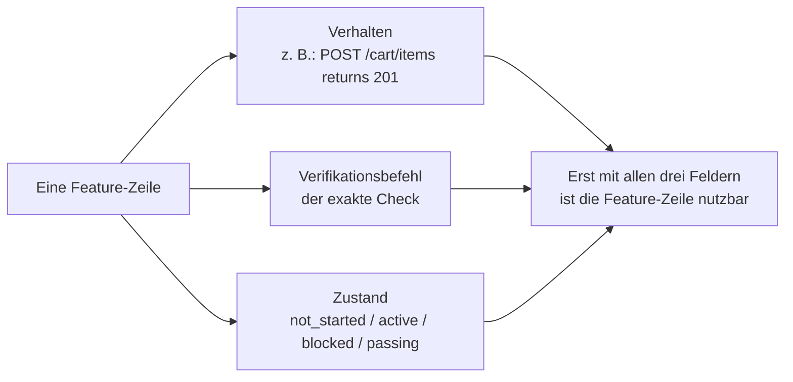
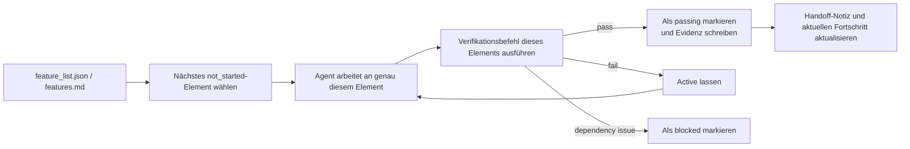

[中文版本 →](../../../zh/lectures/lecture-08-why-feature-lists-are-harness-primitives/)

> Codebeispiele: [code/](https://github.com/walkinglabs/learn-harness-engineering/blob/main/docs/de/lectures/lecture-08-why-feature-lists-are-harness-primitives/code/)
> Praxisprojekt: [Projekt 04. Runtime-Feedback und Scope-Kontrolle](./../../projects/project-04-incremental-indexing/index.md)

# Lektion 08. Feature-Listen nutzen, um Agentenarbeit zu begrenzen

Du bittest einen Agenten, eine E-Commerce-Seite zu bauen. Nachdem er fertig ist, sagt er "done". Du schaust in den Code: Die Benutzeranmeldung funktioniert, aber der Checkout-Button im Warenkorb macht nichts, und der Zahlungsfluss ist gar nicht verbunden. Das Problem: Du hast nie gesagt, was "done" bedeutet. Also verwendet der Agent seinen eigenen Standard: "Ich habe viel Code geschrieben, und es sieht ziemlich vollständig aus."

In den Augen vieler Menschen sind Feature-Listen nur Notizzettel: Dinge aufschreiben, damit man sie nicht vergisst, und dann beiseitelegen. In der Harness-Welt aber ist eine Feature-Liste kein Memo für Menschen, sondern das Rückgrat des gesamten Harness. Der Scheduler nutzt sie, um Aufgaben auszuwählen; der Verifier nutzt sie, um Abschluss zu beurteilen; der Handoff Reporter nutzt sie, um Zusammenfassungen zu erzeugen. Bricht das Rückgrat, ist der ganze Körper gelähmt.

Anthropic und OpenAI betonen beide: **Artefakte müssen externalisiert werden.** Feature-Zustand muss in einer maschinenlesbaren Datei im Repo liegen, nicht in unstrukturiertem Konversationstext.

## Agenten wissen nicht, was "done" bedeutet

Weder Claude Code noch Codex wissen automatisch, was du mit "done" meinst. Du sagst "füge eine Warenkorb-Funktion hinzu", und das Modell interpretiert das vielleicht als "schreibe eine Cart-Komponente und eine addToCart-Methode". Du meinst aber: "Der Nutzer kann Produkte ansehen, in den Warenkorb legen und den Checkout end-to-end abschließen." Ohne Feature-Liste bleibt diese Verständnislücke bestehen. Der Agent nutzt seinen impliziten Standard, meistens "der Code hat keine offensichtlichen Syntaxfehler". Was du brauchst, ist end-to-end-Verifikation des Verhaltens. Wie wenn du einen Freund bittest, Obst zu kaufen: Du sagst "bring etwas Obst mit", und er kommt mit Zitronen zurück. Sein Obst und dein Obst sind nicht dasselbe.

Sieh dir diese typische Fortschrittsnotiz an:

```
Did user auth, shopping cart mostly done, still need payments
```

Kann eine neue Agentensitzung daraus diese Fragen beantworten? Was bedeutet "mostly done"? Welche Tests hat der Warenkorb bestanden? Was blockiert Payments? Die Antwort auf alles lautet: "Niemand weiß es." Wie wenn du deinem Arzt sagst: "Mein Bauch tut weh, war in letzter Zeit schon okay" - welches Medikament soll er verschreiben?

Das Ergebnis: Die neue Sitzung verbringt 20 Minuten damit, den Projektzustand zu erschließen, und implementiert möglicherweise bereits fertige Features erneut. Anthropics Engineering-Daten zeigen, dass gute Fortschrittsaufzeichnungen die Diagnosezeit beim Sitzungsstart um 60-80% reduzieren.

## Feature-Zustandsmaschine





## Zentrale Konzepte

- **Feature-Listen sind Harness-Primitives**: Keine "optionalen Planungstools", sondern grundlegende Datenstrukturen, von denen alle anderen Harness-Komponenten abhängen. Wie Datenbanktabellenstrukturen: Man kann nicht sagen "lassen wir Primärschlüssel weg".
- **Dreifachstruktur**: Jedes Feature-Element ist ein Tripel `(Verhaltensbeschreibung, Verifikationsbefehl, aktueller Zustand)`. Fehlt ein Element, ist das Element unvollständig.
- **Zustandsmaschinenmodell**: Jedes Feature-Element hat vier Zustände: `not_started`, `active`, `blocked`, `passing`. Zustandsübergänge werden vom Harness kontrolliert, nicht frei vom Agenten geändert.
- **Pass-state gating**: Der einzige Weg von `active` zu `passing` ist ein erfolgreich ausgeführter Verifikationsbefehl. Das ist irreversibel: Einmal `passing`, kein Zurück. Wie bei einer bestandenen Prüfung: Bestanden ist bestanden; die Note wird nicht rückwirkend geändert.
- **Single source of truth**: Alle Informationen darüber, "was zu tun ist", müssen aus einer einzigen Feature-Liste stammen. Keine Widersprüche zwischen Feature-Liste und Gesprächsverlauf.
- **Back-pressure**: Die Anzahl der noch nicht bestandenen Features ist der Druck, den der Harness auf den Agenten ausübt. Druck null = Projekt abgeschlossen.

## Warum Feature-Listen "Primitives" sein müssen

Dokumente sind zum Lesen durch Menschen da; Primitives sind zur Ausführung durch Systeme da. Dokumente können ignoriert werden; Primitives kann man nicht umgehen.

Denke an Datenbank-Trigger-Constraints im Vergleich zu Checks auf Anwendungsebene: Erstere werden von der Datenbank-Engine erzwungen, kein SQL kann sie überspringen; Letztere hängen von der Korrektheit des Anwendungscodes ab und können versehentlich umgangen werden. Als Harness-Primitive dient die Feature-Liste vier Komponenten:

1. **Scheduler**: Liest Zustände und wählt das nächste `not_started`-Feature. Wie ein Produktionsplanungssystem in einer Fabrik.
2. **Verifier**: Führt Verifikationsbefehle aus und entscheidet, ob Zustandsübergänge erlaubt sind. Wie Qualitätskontrolle.
3. **Handoff reporter**: Erzeugt automatisch Übergabezusammenfassungen aus der Feature-Liste. Wie ein automatischer Schichtwechselbericht.
4. **Progress tracker**: Zählt Zustandsverteilungen und liefert Gesundheitsmetriken des Projekts. Wie ein Dashboard.

## Wie man es richtig macht

### 1. Ein minimales Feature-Listen-Format definieren

Du brauchst kein komplexes System. Eine strukturierte Markdown- oder JSON-Datei reicht. Entscheidend ist, dass jeder Eintrag das Tripel enthält:

```json
{
  "id": "F03",
  "behavior": "POST /cart/items with {product_id, quantity} returns 201",
  "verification": "curl -X POST http://localhost:3000/api/cart/items -H 'Content-Type: application/json' -d '{\"product_id\":1,\"quantity\":2}' | jq .status == 201",
  "state": "passing",
  "evidence": "commit abc123, test output log"
}
```

### 2. Den Harness Zustandsübergänge kontrollieren lassen

Der Agent kann den Zustand eines Features nicht direkt auf `passing` setzen. Er kann nur eine Verifikationsanfrage stellen. Der Harness führt den Verifikationsbefehl aus und entscheidet, ob der Übergang erlaubt ist. Das ist pass-state gating.

### 3. Die Regeln in CLAUDE.md schreiben

```
## Feature List Rules
- Feature list file: /docs/features.md
- Only one feature active at a time
- Verification command must pass before marking as passing
- Don't modify feature list states yourself — the verification script updates them automatically
```

### 4. Granularität kalibrieren

Jedes Feature-Element sollte auf "in einer Sitzung abschließbar" zugeschnitten sein. Zu breit, und es wird nicht fertig; zu eng, und der Verwaltungsaufwand steigt. "Nutzer kann Artikel in den Warenkorb legen" ist gute Granularität. "Den Warenkorb implementieren" ist zu breit. "Das name-Feld im Cart-Modell erstellen" ist zu eng. Wie ein Steak schneiden: nicht das ganze Stück und nicht Hackfleisch.

## Praxisfall

Eine E-Commerce-Plattform mit 10 Features. Zwei Tracking-Ansätze wurden verglichen:

**Memo-Modus**: Der Agent nutzt unstrukturierte Notizen. Nach 3 Sitzungen lauten sie: "user auth und product list erledigt, shopping cart mostly done, aber Bugs, payments nicht begonnen." Eine neue Sitzung braucht 20 Minuten, um den Zustand zu erschließen, und implementiert am Ende abgeschlossene Features erneut. Wie eine Einkaufsliste mit "Milch, Brot und dieses Ding" - im Laden weißt du immer noch nicht, was du kaufen sollst.

**Rückgrat-Modus**: Jedes Feature hat einen klaren Zustand und einen Verifikationsbefehl. Eine neue Sitzung liest die Feature-Liste und weiß in 3 Minuten: F01-F05 sind `passing`, F06 ist `active`, F07-F10 sind `not_started`. Sie macht direkt bei F06 weiter, ohne Nacharbeit.

Quantifiziertes Ergebnis: Projekte mit strukturierten Feature-Listen zeigen eine 45% höhere Feature-Abschlussrate als Freiform-Tracking, bei null doppelten Implementierungen.

## Wichtigste Erkenntnisse

- **Feature-Listen sind das Rückgrat des Harness**, keine Memos für Menschen. Scheduler, Verifier und Handoff Reporter hängen alle davon ab.
- **Jedes Feature-Element braucht das Tripel**: Verhaltensbeschreibung + Verifikationsbefehl + aktueller Zustand. Fehlt ein Element, ist es unvollständig - wie ein dreibeiniger Hocker, dem ein Bein fehlt.
- **Zustandsübergänge werden vom Harness kontrolliert**; der Agent kann Zustände nicht selbst ändern. Erfolgreiche Verifikation ist der einzige Aufstiegspfad.
- **Die Feature-Liste ist die single source of truth des Projekts**; alle "was tun"-Informationen stammen aus einer Liste.
- **Kalibriere Granularität auf "in einer Sitzung abschließbar".**

## Weiterführende Literatur

- [Building Effective Agents - Anthropic](https://www.anthropic.com/research/building-effective-agents) — Identifiziert die Feature-Liste ausdrücklich als "core data structure" zur Kontrolle des Agenten-Scopes
- [Harness Engineering - OpenAI](https://openai.com/index/harness-engineering/) — Betont das Prinzip der "externalizing artifacts"
- [Design by Contract - Bertrand Meyer](https://www.goodreads.com/book/show/130439.Object_Oriented_Software_Construction) — Contract-Design-Prinzipien, theoretische Grundlage von Feature-Listen
- [How Google Tests Software](https://www.goodreads.com/book/show/13563030-how-google-tests-software) — Testpyramide und Praktiken für verhaltensbasierte Spezifikation

## Übungen

1. **Feature-Listen-Design**: Definiere ein minimales JSON-Schema für Feature-Listen. Enthalten: id, Verhaltensbeschreibung, Verifikationsbefehl, aktueller Zustand, Evidenzreferenz. Beschreibe damit ein echtes Projekt mit 5 Features.

2. **Vergleich der Verifikationsstrenge**: Wähle 3 Features und entwirf sowohl eine "lockere" Verifikation (z. B. "Code hat keine Syntaxfehler") als auch eine "strenge" Verifikation (z. B. "End-to-End-Test besteht"). Vergleiche die False-Positive-Rate.

3. **Audit des Single-Source-Prinzips**: Prüfe ein bestehendes Agentenprojekt auf Scope-Informationen, die der Feature-Liste widersprechen (implizite Anforderungen in Gesprächen, TODO-Kommentare im Code usw.). Entwirf einen Plan, um alle Informationen in der Feature-Liste zu vereinheitlichen.
