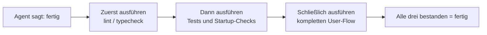
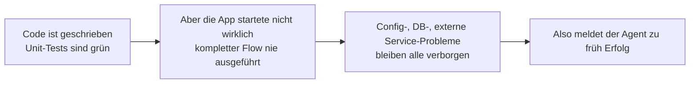

[中文版本 →](../../../zh/lectures/lecture-09-why-agents-declare-victory-too-early/)

> Codebeispiele für diese Lektion: [code/](https://github.com/walkinglabs/learn-harness-engineering/blob/main/docs/de/lectures/lecture-09-why-agents-declare-victory-too-early/code/)
> Praxisprojekt: [Project 05. Lassen Sie den Agenten seine eigene Arbeit überprüfen](./../../projects/project-05-grounded-qa-verification/index.md)

# Lektion 09. Verhindern, dass Agenten zu früh Erfolg melden

Sie bitten einen Agenten, eine „Passwort zurücksetzen"-Funktion zu implementieren. Er ändert das Datenbankschema, schreibt den API-Endpunkt, fügt die E-Mail-Vorlage hinzu, führt Unit-Tests aus (alle bestanden) und teilt Ihnen zuversichtlich mit: „Es ist fertig." Wenn Sie es tatsächlich ausprobieren — der Link zum Zurücksetzen des Passworts kann nicht gesendet werden (E-Mail-Service-Konfiguration fehlt), die Datenbankmigration scheitert zur Hälfte (Schemainkonsistenz), und der End-to-End-Ablauf wurde kein einziges Mal ausgeführt.

Dieses Gefühl sollte nicht un vertraut sein — es ist, als würde man das gesamte Klausurheft ausfüllen, zuversichtlich als Erster abgeben und dann durchfallen, wenn die Noten kommen. Nur weil das Heft voll ist, heißt das nicht, dass die Antworten richtig sind.

Dies ist kein Einzelfall. Das klassische ICML-Papier von Guo et al. (2017) hat bewiesen: **Moderne neuronale Netze sind systematisch über confident** — die von Modellen berichtete Zuversicht ist deutlich höher als ihre tatsächliche Genauigkeit. Dasselbe gilt für KI-Coding-Agenten: Sie „fühlen", dass sie fertig sind, aber in Wirklichkeit sind sie weit davon entfernt. Ihr Harness muss die „Gefühle" des Agenten durch externalisierte, ausführungsbasierte Verifikation ersetzen.

## Die rutschige Abwärtsspirale

Voreilige Fertigstellungsmeldungen folgen fast immer demselben Muster: Der Code sieht in Ordnung aus — Syntax ist korrekt, Logik erscheint plausibel, und die statische Analyse zeigt keine offensichtlichen Fehler. Aber der Harness erzwingt keine umfassende Ausführungs verifikation, also überspringt der Agent das tatsächliche Ausführen oder führt nur teilweise Tests durch. Er führt Unit-Tests durch, überspringt aber Integrationstests; er führt Tests durch, prüft aber keine Abdeckung. Letztendlich wird „der Code sieht gut aus" als Beweis dafür genommen, dass „die Funktion vollständig ist". Und das Klausurheft wird abgegeben.

Bei jedem Schritt geht Information verloren. Von der Aufgaben spezifikation über die Code-Implementierung bis zum Laufzeitverhalten — jede Transformation kann Verzerrungen einführen, und jede übersprungene Verifikation verschärft die Informationsasymmetrie.

## Drei-Schichten-Abschlussprüfung





## Zentrale Konzepte

- **Voreilige Fertigstellungsmeldung**: Der Agent behauptet, die Aufgabe sei abgeschlossen, aber es existieren noch immer nicht erfüllte Korrektheitsspezifikationen. Das Kernproblem: Der Agent urteilt auf Basis lokaler Zuversicht auf Code-Ebene, während systemweite Korrektheit globale Verifikation erfordert.
- **Confidence-Calibration-Bias**: Die systematische Lücke zwischen der selbst berichteten Zuversicht des Agenten bezüglich der Fertigstellung und der tatsächlichen Qualitäts der Fertigstellung. Bei komplexen Multi-Datei-Aufgaben ist dieser Bias signifikant positiv — der Agent ist immer zuversichtlicher, als er tatsächlich leistet. Wie ein Student, der seine Klausurnote nach der Prüfung immer überschätzt.
- **Terminierungskriterien**: Eine klare, ausführbare Menge von Beurteilungsbedingungen, die im Harness definiert sind. Der Agent muss alle Bedingungen erfüllen, bevor er die Fertigstellung meldet. „Fertig" wandelt sich von einem subjektiven Urteil zu einer objektiven Feststellung.
- **Verifikation-Validierung-Doppeltor**: Die erste Verifikationsschicht prüft „hat der Code das spezifizierte Verhalten korrekt implementiert"; die zweite Validierungsschicht prüft „entspricht das Systemverhalten den End-to-End-Anforderungen". Beide müssen bestanden werden, um als vollständig zu gelten.
- **Laufzeit-Feedback-Signale**: Logs, Prozesszustände und Health-Checks aus der Programmausführung. Dies ist die objektive Grundlage für den Harness, um die Qualität der Fertigstellung zu beurteilen.
- **Abschlussprioritäts-Einschränkung**: Zuerst funktionale Korrektheit verifizieren, dann Performance behandeln und schließlich Stil ansprechen. Refactoring ist verboten, bis die Kernfunktionalität verifiziert ist.

## Bestandene Unit-Tests ≠ Aufgabe erledigt

Das ist die häufigste Falle und die gefährlichste. Der Agent hat den Code geschrieben, die Unit-Tests ausgeführt, alles grün bekommen und „fertig" gesagt. Aber die Entwurfsphilosophie von Unit-Tests — Isolierung der getesteten Einheit und Mocking von Abhängigkeiten — ist genau das, was sie unfähig macht, komponentenübergreifende Probleme zu erkennen:

**Schnittstellen-Inkonsistenz**: Der vom Render-Prozess an das Preload-Skript übergebene Dateipfad ist ein relativer Pfad, aber das Preload-Skript erwartet einen absoluten Pfad. Ihre jeweiligen Unit-Tests haben beide Mocks verwendet und bestanden. Das Problem wird erst beim End-to-End-Testing entdeckt. Wie Musiker in einer Band, die jeweils für sich perfekt proben, nur um beim Zusammenspiel festzustellen, dass sie in verschiedenen Tonarten spielen.

**Zustandspropagationsfehler**: Eine Datenbankmigration ändert das Tabellenschema, aber die ORM-Zwischenspeicher schicht enthält noch Cache-Einträge für das alte Schema. Unit-Tests stellen jedes Mal eine frische Mock-Umgebung bereit, was diese schichtenübergreifende Zustandsinkonsistenz nicht aufdeckt.

**Umgebungsabhängigkeit**: Der Code verhält sich in der Testumgebung korrekt (wo alles gemockt ist), scheitert aber in der realen Umgebung aufgrund von Konfigurationsunterschieden, Netzwerklatenz oder Dienstverfügbarkeit. Wie man im Probenraum perfekt singt, aber auf der Bühne mit Audioequipment-Problemen kämpft.

### „Beim Refactoring gleich mit erledigen" ist Gift für die Abschlussbeurteilung

Claude Code zeigt ein häufiges Verhaltensmuster: Es beginnt mit dem Refactoring von Code, der Optimierung der Performance und der Verbesserung des Stils, bevor die Kernfunktionalität die Verifikation bestanden hat. Knuths Zitat, „Premature optimization is the root of all evil", bekommt im Agenten-Szenario eine neue Bedeutung — Refactoring verschiebt die Grenze zwischen verifiziertem und nicht verifiziertem Code und kann zuvor implizit korrekte Codepfade zerstören. Es ist, als würde man seine Multiple-Choice-Antworten für eine bessere Formatierung neu abschreiben, bevor man die Matheaufgabe beendet hat — nicht nur verschwendet es Zeit, man könnte sie auch noch falsch abschreiben.

### Systematischer Bias bei der Selbstevaluation

Anthropic entdeckte 2026 in seiner Forschung ein tieferes Fehlermuster: **Wenn ein Agent gebeten wird, seine eigene Arbeit zu evaluieren, liefert er systematisch zu positive Bewertungen — selbst wenn ein menschlicher Beobachter die Qualität als eindeutig mangelhaft betrachten würde.** Das ist, als würde man einen Studenten bitten, seine eigene Klausur zu benoten — er wird bei seinen eigenen Antworten immer besonders nachsichtig sein.

Dieses Problem ist besonders gravierend bei subjektiven Aufgaben (wie Design-Ästhetik) — ob ein „Layout exquisit" ist, ist eine Frage der Beurteilung, und der Agent neigt zuverlässig zu positiven Bewertungen. Selbst bei Aufgaben mit überprüfbaren Ergebnissen kann die Leistung des Agenten durch schlechtes Urteilsvermögen beeinträchtigt werden.

Die Lösung besteht nicht darin, den Agenten „objektiver" zu machen — dasselbe Modell, das generiert und evaluiert, begünstigt von Natur aus Nachsicht gegenüber sich selbst. **Die Lösung ist die Trennung von „Arbeiter" und „Prüfer".** Wie ein Student seine eigene Klausur nicht benoten sollte — man braucht einen unabhängigen Korrektor.

Ein unabhängiger evaluierender Agent, der speziell darauf abgestimmt ist, „pingelig" zu sein, ist weitaus effektiver, als den generierenden Agenten sich selbst evaluieren zu lassen. Experimentelle Daten von Anthropic:

| Architektur | Laufzeit | Kosten | Kernfunktionen funktionsfähig? |
|--------------|---------|------|------------------------|
| Einzelner Agent (ohne Harness) | 20 Min. | $9 | Nein (Spiel-Entitäten reagieren nicht auf Eingabe) |
| Drei Agenten (Planer + Generator + Evaluator) | 6 Stunden | $200 | Ja (Spiel ist vollständig spielbar) |

Dies ist exakt dasselbe Modell (Opus 4.5) mit exakt demselben Prompt („build a 2D retro game editor"). Der einzige Unterschied ist der Harness — vom „nackten Ausführen" zu „Planer entfaltet Anforderungen → Generator implementiert Feature für Feature → Evaluator führt tatsächliches Klick-Testing mit Playwright durch".

> Quelle: [Anthropic: Harness design for long-running application development](https://www.anthropic.com/engineering/harness-design-long-running-apps)

## Wie man voreilige Abgaben verhindert

### 1. Abschlussbeurteilung externalisieren

Die Abschlussbeurteilung sollte nicht vom Agenten selbst vorgenommen werden. Der Harness muss unabhängig eine Terminierungsvalidierung durchführen, wobei Laufzeit-Signale als Eingabe dienen, nicht die Zuversicht des Agenten. Schreiben Sie dies klar in `CLAUDE.md`:

```
## Definition of Done
- Feature complete = end-to-end verification passed, not "code is written"
- Required verification levels:
  1. Unit tests pass
  2. Integration tests pass
  3. End-to-end flow verification passes
- Do not proceed to level 2 if level 1 fails
- Do not proceed to level 3 if level 2 fails
```

### 2. Eine Drei-Schichten-Terminierungsvalidierung aufbauen

- **Schicht 1: Syntax und statische Analyse**. Geringste Kosten, wenigste Informationen, aber muss bestanden werden. Das ist die Mindestprüfung — man muss die Wörter erst einmal richtig schreiben, bevor wir uns etwas anderes ansehen.
- **Schicht 2: Laufzeitverhaltens-Verifikation**. Testausführung, App-Startup-Checks, Validierung kritischer Pfade. Dies ist der zentrale Beweis für die Fertigstellung. Es reicht nicht, es nur zu schreiben; es muss laufen.
- **Schicht 3: Systemebene-Bestätigung**. End-to-End-Testing, Integrationsvalidierung, Nutzer szenario-Simulation. Die letzte Verteidigungslinie gegen voreilige Meldungen. Es reicht nicht zu laufen; es muss korrekt laufen.

### 3. Gute „Rotstift-Korrekturen" für Agenten entwerfen

OpenAI hat während seiner Codex-Praxis ein besonders wirksames Muster eingeführt: **Fehlermeldungen für Agenten sollten Korrekturanweisungen enthalten**. Nicht nur ein großes rotes Kreuz wie ein fauler Korrektor ziehen; wie ein guter Lehrer an den Rand schreiben „So sollten Sie das ändern". Nicht `"Test failed"` verwenden, sondern `"Test failed: POST /api/reset-password returned 500. Check that the email service config exists in environment variables. The template file should be at templates/reset-email.html."` Dieses spezifische, umsetzbare Feedback ermöglicht dem Agenten, sich ohne menschliches Eingreifen selbst zu korrigieren.

### 4. Laufzeit-Signale erfassen

Wirksame Laufzeit-Signale umfassen:
- Ist die Anwendung erfolgreich gestartet und hat einen bereiten Zustand erreicht?
- Haben die Pfade der kritischen Funktionen zur Laufzeit erfolgreich ausgeführt?
- Waren Datenbank-Schreibvorgänge, Dateioperationen und andere Seiteneffekte korrekt?
- Wurden temporäre Ressourcen bereinigt?

## Fallbeispiel aus der Praxis

**Aufgabe**: Passwort-Zurücksetzen-Funktionalität für Benutzer implementieren. Umfasst Datenbankoperationen, E-Mail-Versand und API-Endpunkt-Änderungen.

**Voreiliger Abgabeweg**: Agent ändert Datenbankschema, schreibt API-Endpunkt, fügt E-Mail-Vorlage hinzu, führt Unit-Tests durch (bestanden) und meldet Fertigstellung. Das Klausurheft ist komplett ausgefüllt.

**Tatsächliche Punkteabzüge**: (1) End-to-End-Ablauf ungetestet — das tatsächliche Senden und Verifizieren des Zurücksetzungslinks wurde nie bestätigt. (2) Datenbankmigration scheiterte nach teilweiser Ausführung, was eine Schemainkonsistenz verursachte. (3) E-Mail-Service-Konfiguration fehlte in der Zielumgebung.

**Harness-Intervention**: Terminierungsvalidierung erzwungen — (1) Vollständige App starten, um die Erreichbarkeit des Reset-Endpunkts zu verifizieren; (2) Den vollständigen Reset-Flow ausführen; (3) Datenbankzustandskonsistenz verifizieren. Alle Defekte wurden innerhalb der Session gefunden, was 5-10x der Kosten für spätere Reparaturen einsparte. Der unabhängige Korrektor fand die echten Probleme.

## Wichtigste Erkenntnisse

- **Agenten sind systematisch über confident** — der Confidence-Calibration-Bias ist eine objektive Realität. Das Klausurheft ausgefüllt zu haben bedeutet nicht, dass man alles richtig gemacht hat.
- **Die Abschlussbeurteilung muss externalisiert werden** — der Harness verifiziert unabhängig; vertrauen Sie nicht den „Gefühlen" des Agenten. Studenten können ihre eigenen Klausuren nicht benoten.
- **Alle drei Validierungsschichten sind unerlässlich** — Syntax bestanden, Verhalten bestanden, System bestanden, Schicht für Schicht fortschreitend.
- **Fehlermeldungen sollten wie die Rotstift-Korrektur eines guten Lehrers sein** — spezifische Korrekturschritte enthalten, damit der Agent sich selbst korrigieren kann.
- **Kein Refactoring, bis die Kernfunktionalität verifiziert ist** — die Abschlussprioritäts-Einschränkung ist der Schlüssel zur Verhinderung vorzeitiger Optimierung.

## Weiterführende Literatur

- [On Calibration of Modern Neural Networks - Guo et al.](https://arxiv.org/abs/1706.04599) — Beweist, dass moderne Deep Networks systematisch über confident sind
- [Building Effective Agents - Anthropic](https://www.anthropic.com/research/building-effective-agents) — Die kritische Rolle von Laufzeit-Evidenz bei der Abschlussbeurteilung
- [Harness Engineering - OpenAI](https://openai.com/index/harness-engineering/) — Voreilige Fertigstellungsmeldung ist einer der Haupt-Fehlmodi von Agenten
- [The Art of Software Testing - Myers](https://www.goodreads.com/book/show/137543.The_Art_of_Software_Testing) — Klassisches Referenzwerk über Testmethoden-Hierarchien und deren Wirksamkeit

## Übungen

1. **Terminierungsvalidierungs-Funktion entwerfen**: Entwerfen Sie eine vollständige Terminierungsvalidierung für eine Aufgabe, die eine Datenbankmigration und API-Änderung umfasst. Listen Sie die erforderlichen Laufzeit-Signale und die Bestehens-/Durchfall-Kriterien für jedes Signal auf. Führen Sie es mit einer realen Aufgabe durch und dokumentieren Sie, welche verborgenen Probleme es findet.

2. **Calibration-Bias-Messung**: Wählen Sie 10 verschiedene Arten von Codierungsaufgaben und dokumentieren Sie die selbst berichtete Abschlusszuversicht des Agenten versus die tatsächliche Qualität des Abschlusses. Berechnen Sie den Bias-Wert und analysieren Sie seine Beziehung zur Aufgabenkomplexität.

3. **Mehrschichtige-Verteidigung-Experiment**: Führen Sie drei Konfigurationen mit demselben Aufgabensatz durch — (a) nur statische Analyse, (b) zusätzlich Unit-Testing, (c) vollständige Drei-Schichten-Validierung. Vergleichen Sie den Anteil voreiliger Fertigstellungsmeldungen und die Anzahl unentdeckter Defekte.
