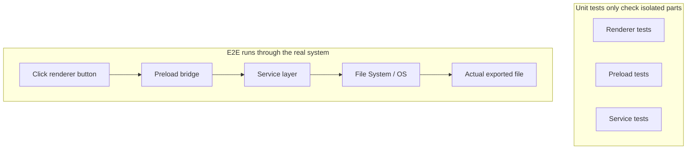
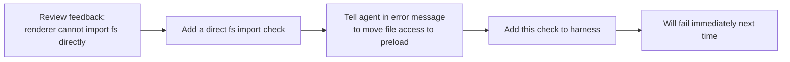

[中文版本 →](../../../zh/lectures/lecture-10-why-end-to-end-testing-changes-results/)

> Codebeispiele für diese Lektion: [code/](https://github.com/walkinglabs/learn-harness-engineering/blob/main/docs/de/lectures/lecture-10-why-end-to-end-testing-changes-results/code/)
> Praxisprojekt: [Project 05. Lassen Sie den Agenten seine eigene Arbeit überprüfen](./../../projects/project-05-grounded-qa-verification/index.md)

# Lektion 10. Nur End-to-End-Tests sind echte Verifikation

Sie bitten den Agenten, eine Datei-Export-Funktion zu einer Electron-App hinzuzufügen. Er schreibt die Render-Prozess-Komponente, das Preload-Skript und die Service-Layer-Logik. Die Unit-Tests für jede Komponente bestehen perfekt. Der Agent sagt: „Es ist fertig." Wenn Sie tatsächlich auf den Export-Button klicken — das Dateipfad-Format ist falsch, die Fortschrittsanzeige aktualisiert sich nicht und der Export großer Dateien verursacht einen Memory-Leak. Fünf Komponenten-Grenzfläche-Defekte, und die Unit-Tests haben keinen einzigen davon erkannt.

Es ist wie bei einer Chorprobe — jede Stimme klingt einzeln perfekt, aber wenn sie zusammen singen, sind die Soprane einen halben Takt schneller als die Bässe, und die Begleitung ist einen Halbton von der Hauptmelodie entfernt. Jede Stimme ist für sich „korrekt", aber das Ganze ist nicht harmonisch.

Googles Testing-Pyramid sagt uns: Eine große Anzahl von Unit-Tests ist das Fundament, aber wenn man dort stehen bleibt, wird man systematisch Komponenten-Interaktionsprobleme übersehen. Für KI-Coding-Agenten ist dieses Problem noch gravierender — Agenten neigen dazu, nur die schnellsten Tests auszuführen und dann die Fertigstellung zu melden. **Nur End-to-End-Testing kann beweisen, dass systemweite Defekte nicht existieren.**

## Die blinden Flecken von Unit-Tests

Die Entwurfsphilosophie von Unit-Tests ist Isolation — Abhängigkeiten werden gemockt und der Fokus liegt ausschließlich auf der zu testenden Einheit. Diese Philosophie macht Unit-Tests schnell und präzise, erzeugt aber auch systematische blinde Flecken. Es ist, als würde bei einer Chorprobe jede Stimme mit Kopfhörern proben — es klingt für sie gut, aber die Probleme tauchen erst auf, wenn sie zusammen kommen:

**Schnittstellen-Inkonsistenz**: Der vom Render-Prozess an das Preload-Skript übergebene Dateipfad ist ein relativer Pfad, aber das Preload-Skript erwartet einen absoluten Pfad. Ihre jeweiligen Unit-Tests haben beide Mocks verwendet und bestanden. Das Problem wird erst entdeckt, wenn der End-to-End-Flow ausgeführt wird — wie zwei Stimmen, die unabhängig voneinander proben und sich wohl fühlen, nur um beim Ensemble festzustellen, dass die eine im 4/4-Takt und die andere im 3/4-Takt singt.

**Zustandspropagationsfehler**: Eine Datenbankmigration ändert das Tabellenschema, aber die ORM-Cache-Schicht enthält noch Cache-Einträge für das alte Schema. Unit-Tests stellen jedes Mal eine völlig neue Mock-Umgebung bereit, was diese schichtenübergreifende Zustandsinkonsistenz nicht aufdeckt. Es ist, als würde man den Text eines Liedes ändern, aber jemand singt immer noch die alte Version.

**Ressourcen-Lebenszyklus-Probleme**: Die Beschaffung und Freigabe von Datei-Handles, Datenbankverbindungen und Netzwerk-Sockets erstreckt sich über mehrere Komponenten. Unit-Tests erstellen und zerstören für jeden Test unabhängige Ressourcen, was Ressourcenkonkurrenz oder Lecks nicht aufdeckt. Es ist, als würde bei der Probe jede Stimme abwechselnd die Mikrofone nutzen, aber wenn alle zusammen auf die Bühne gehen, gibt es nicht genug Mikros.

**Umgebungsabhängigkeit**: Der Code verhält sich in der Testumgebung korrekt (wo alles gemockt ist), scheitert aber in der realen Umgebung aufgrund von Konfigurationsunterschieden, Netzwerklatenz oder Dienstverfügbarkeit. Wie man im Probenraum perfekt singt, aber auf einem Festival im Freien mit Audio-Rückkopplung und Windeinfluss kämpft.

## End-to-End-Testing verändert nicht nur Ergebnisse, es verändert das Verhalten

Das ist etwas, das viele Menschen nicht erkennen: Wenn ein Agent weiß, dass seine Arbeit einem End-to-End-Test unterzogen wird, ändert sich sein Codierungsverhalten.

1. **Komponenten-Interaktionen berücksichtigen**: Beim Schreiben von Code wird er darüber nachdenken, „wie sich diese Schnittstelle mit Upstream verbindet", anstatt sich nur auf eine einzelne Funktion zu konzentrieren. Wie wenn man weiß, dass man schließlich zusammen singen wird — man achtet beim Üben auf die anderen Stimmen.
2. **Architektur-Grenzen respektieren**: In Systemen mit Architektur-Einschränkungen erzwingt End-to-End-Testing, dass der Agent die Grenzregeln einhält. Wie in einer Partitur, die mit „hier Crescendo" markiert ist — man muss sich daran halten.
3. **Fehlerpfade behandeln**: End-to-End-Tests umfassen in der Regel Fehler-Szenarien und zwingen den Agenten, die Ausnahmebehandlung zu berücksichtigen. Es ist, als würde man bei der Probe simulieren, „was wäre, wenn das Mikro plötzlich ausfällt", damit man weiß, was zu tun ist.

## Testing-Pyramid und Review-Feedback-Beförderung





In den Codex-Engineering-Praktiken betont OpenAI: **Fehlermeldungen für Agenten müssen Korrekturanweisungen enthalten.** Schreiben Sie nicht nur `"Direct filesystem access in renderer"`; schreiben Sie `"Direct filesystem access in renderer. All file operations must go through the preload bridge. Move this call to preload/file-ops.ts and invoke it via window.api."` Dies verwandelt Architekturregeln in eine automatische Korrekturschleife. Wie ein Chorleiter, der nicht nur sagt „das hast du falsch gesungen", sondern stattdessen sagt „du warst hier einen halben Takt zu schnell, hör auf den Rhythmus der Altstimmen und setze bei Takt 32 ein".

## Zentrale Konzepte

- **Komponenten-Grenzflächen-Defekte**: Komponente A und B bestehen jeweils ihre Unit-Tests, aber ihre Interaktion erzeugt fehlerhaftes Verhalten. Dies ist die Art von Problem, die End-to-End-Testing am besten erkennt — wie Chorstimmen, die einzeln korrekt sind, aber zusammen nicht harmonisch klingen.
- **Test-Angemessenheits-Gradient**: Von Unit-Tests erkannte Defekte <= von Integrationstests erkannte Defekte <= von End-to-End-Tests erkannte Defekte. Jede Schicht nach oben erhöht die Erkennungsfähigkeit.
- **Architektur-Grenz-Erzwingungsregeln**: Umwandlung von Regeln aus Architektur-Dokumenten (wie „Render-Prozess kann nicht direkt auf das Dateisystem zugreifen") in ausführbare, automatisierte Checks. Vom „auf Papier geschrieben" zum „laufend in CI".
- **Review-Feedback-Beförderung**: Umwandlung wiederholter Code-Review-Kommentare in automatisierte Tests. Jedes Mal, wenn ein wiederkehrendes Problem gefunden wird, eine Regel hinzufügen, und der Harness wird automatisch stärker. Wie ein Dirigent, der häufige Probenfehler in Aufwärmübungen verwandelt — beim nächsten Mal, wenn derselbe Fehler gemacht wird, deckt die Übung selbst ihn auf, ohne dass der Dirigent ein Wort sagen muss.
- **Agenten-orientierte Fehlermeldungen**: Fehlermeldungen sollten nicht nur „was schiefgelaufen ist" feststellen, sondern dem Agenten auch genau sagen, wie er es beheben kann. Dies verwandelt Testfehler in selbst-korrigierende Feedback-Schleifen.

## Vorgehen

### 0. Zuerst Architektur-Grenzen definieren, dann E2E-Tests schreiben

Voraussetzung für End-to-End-Testing sind klare Systemgrenzen. Wenn die Architektur ein Teller Spaghetti ist, wird End-to-End-Testing nur beweisen, dass „dieser Teller Spaghetti läuft", aber nicht aufzeigen, wo Design-Absichten verletzt wurden. Es ist wie ein Chor, der sich noch nicht einmal in Stimmen aufgeteilt hat — keine Menge an Probe wird gut klingen lassen.

OpenAIs Erfahrung: **Für von Agenten generierte Codebases müssen Architektur-Einschränkungen von Anfang an als frühe Voraussetzungen etabliert werden, nicht erst in Betracht gezogen werden, wenn das Team wächst.** Der Grund ist einfach — Agenten kopieren existierende Muster im Repository, selbst wenn diese Muster uneinheitlich oder suboptimal sind. Ohne Architektur-Einschränkungen wird der Agent in jeder Session weitere Abweichungen einführen.

OpenAI übernahm eine „Layered Domain Architecture" — jede Geschäftsdomäne ist in feste Schichten unterteilt: Types → Config → Repo → Service → Runtime → UI. Abhängigkeiten fließen streng vorwärts, und domänenübergreifende Belange treten über explizite Provider-Schnittstellen ein. Alle anderen Abhängigkeiten sind verboten und werden durch Custom-Linting mechanisch erzwungen.

Schlüsselprinzip: **Invarianten erzwingen, nicht Implementierung mikromanagen.** Zum Beispiel verlangen, dass „Daten an der Grenze geparst werden", aber nicht vorschreiben, welche Bibliothek verwendet werden soll. Fehlermeldungen müssen Korrekturanweisungen enthalten — nicht nur „Verletzung" sagen, sondern dem Agenten genau sagen, wie er es ändern soll.

> Quelle: [OpenAI: Harness engineering: leveraging Codex in an agent-first world](https://openai.com/index/harness-engineering/)

### 1. Der Harness muss eine End-to-End-Schicht enthalten

Machen Sie es in Ihrem Validierungsflow explizit: Für Aufgaben mit komponentenübergreifenden Änderungen ist das Bestehen von End-to-End-Tests eine Voraussetzung für die Fertigstellung:

```
## Validation Hierarchy
- Level 1: Unit tests (Must pass)
- Level 2: Integration tests (Must pass)
- Level 3: End-to-end tests (Must pass when cross-component changes are involved)
- Skipping any required level = Not Complete
```

### 2. Architektur-Regeln in ausführbare Checks umwandeln

Jede Architektur-Einschränkung sollte einen entsprechenden Test oder eine Lint-Regel haben:

```bash
# Check if the render process directly calls Node.js APIs
grep -r "require('fs')" src/renderer/ && exit 1 || echo "OK: no direct fs access in renderer"
```

### 3. Agenten-orientierte Fehlermeldungen entwerfen

Fehlermeldungen sollten drei Elemente enthalten: was schiefgelaufen ist, warum, und wie man es behebt:

```
ERROR: Found direct import of 'fs' in src/renderer/App.tsx:12
WHY: Renderer process has no access to Node.js APIs for security
FIX: Move file operations to src/preload/file-ops.ts and call via window.api.readFile()
```

### 4. Einen Review-Feedback-Beförderungsprozess etablieren

Jedes Mal, wenn eine neue Art von Agentenfehler beim Code-Review gefunden wird, wandeln Sie ihn in einen automatisierten Check um. Einen Monat später wird Ihr Harness deutlich stärker sein als zu Monatsbeginn. Es ist wie Probenotizen für einen Chor — Probleme aus jeder Probe aufzeichnen, damit sie vor der nächsten überprüft werden können. Im Laufe der Zeit nehmen häufige Fehler ab, und die Musik wird harmonischer.

## Fallbeispiel aus der Praxis

**Aufgabe**: Implementierung einer Datei-Export-Funktion in einer Electron-App. Umfasst Render-Prozess-UI, Preload-Skript-Dateisystem-Proxy und Service-Layer-Datentransformation.

**Stimmen einzeln singen (Unit-Tests bestanden)**: Render-Komponenten-Tests (bestanden, Dateioperationen gemockt), Preload-Skript-Tests (bestanden, Dateisystem gemockt), Service-Layer-Tests (bestanden, Datenquelle gemockt). Agent meldet Fertigstellung.

**Zusammen singen (Defekte durch End-to-End-Tests aufgedeckt)**:

| Defekt | Beschreibung | Unit-Test | E2E |
|--------|-------------|-----------|-----|
| Schnittstellen-Inkonsistenz | Inkonsistentes Dateipfad-Format | Verpasst | Gefunden |
| Zustandspropagation | Export-Fortschritt wird nicht über IPC an UI zurückgesendet | Verpasst | Gefunden |
| Ressourcen-Leak | Datei-Export-Handles großer Dateien nicht freigegeben | Verpasst | Gefunden |
| Berechtigungsproblem | Unterschiedliche Berechtigungen in der Paketumgebung | Verpasst | Gefunden |
| Fehlerpropagation | Service-Layer-Exceptions erreichten UI-Schicht nicht | Verpasst | Gefunden |

Alle 5 Defekte wurden von End-to-End-Tests gefunden, während Unit-Tests keinen einzigen entdeckten. Die Kosten waren ein Anstieg der Testzeit von 2 Sekunden auf 15 Sekunden — in einem Agenten-Workflow völlig akzeptabel. Egal wie gut jeder Teil einzeln singt, es kann nicht mit einer vollständigen Ensemble-Probe mithalten.

## Wichtigste Erkenntnisse

- **Unit-Tests sind systematisch blind für Komponenten-Grenzflächen-Defekte** — ihr Isolationsdesign ist genau das, was sie daran hindert, Interaktionsprobleme zu erkennen. Dass jeder richtig singt, bedeutet nicht, dass der Chor harmonisch klingt.
- **End-to-End-Testing erkennt nicht nur Defekte, es verändert das Codierungsverhalten des Agenten** — es lässt ihn mehr auf Integration und Grenzen fokussieren.
- **Architektur-Regeln müssen ausführbar sein** — nicht in einem Dokument geschrieben, das darauf wartet, gelesen zu werden, sondern automatisch bei jedem Commit überprüft.
- **Fehlermeldungen müssen für Agenten entworfen werden** — einschließlich spezifischer Schritte zur „Behebung", um eine selbst-korrigierende Schleife zu bilden.
- **Review-Feedback-Beförderung macht den Harness automatisch stärker** — jede Kategorie erfasster Defekte wird zu einer permanenten Verteidigungslinie.

## Weiterführende Literatur

- [How Google Tests Software - Whittaker et al.](https://www.goodreads.com/book/show/13563030-how-google-tests-software) — Die klassische Quelle des Testing-Pyramid-Modells
- [Harness Engineering - OpenAI](https://openai.com/index/harness-engineering/) — Engineering-Praktiken für die automatisierte Ausführung von Architektur-Einschränkungen
- [Chaos Engineering - Netflix (Basiri et al.)](https://ieeexplore.ieee.org/document/7466237) — Proaktives Injizieren von Fehlern zur Überprüfung der Systemresilienz
- [QuickCheck - Claessen & Hughes](https://www.cs.tufts.edu/~nr/cs257/archive/john-hughes/quick.pdf) — Property-Testing-Methodik, angesiedelt zwischen Beispiel-Testing und formaler Verifikation

## Übungen

1. **Komponentenübergreifende Defekterkennung**: Wählen Sie eine Änderungsaufgabe, die mindestens drei Komponenten umfasst. Führen Sie zuerst nur Unit-Tests durch und dokumentieren Sie die Ergebnisse, dann führen Sie End-to-End-Tests durch. Analysieren Sie, zu welcher Art von schichtenübergreifendem Interaktionsproblem jeder zusätzlich entdeckte Defekt gehört.

2. **Architektur-Regel-Automatisierung**: Wählen Sie eine Architektur-Einschränkung aus Ihrem Projekt und wandeln Sie sie in einen ausführbaren Check um (mit einer agenten-orientierten Fehlermeldung). Integrieren Sie ihn in den Harness und verifizieren Sie seine Wirksamkeit mit einer Baseline-Aufgabe.

3. **Review-Feedback-Beförderung**: Finden Sie einen wiederkehrenden Kommentar-Typ aus Ihrem Code-Review-Verlauf und wandeln Sie ihn in einen automatisierten Check im Fünf-Schritte-Prozess um. Vergleichen Sie die Häufigkeit des Problems vor und nach der Beförderung.
