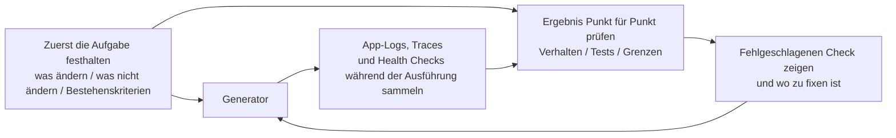

[中文版本 →](../../../zh/lectures/lecture-11-why-observability-belongs-inside-the-harness/)

> Codebeispiele: [code/](https://github.com/walkinglabs/learn-harness-engineering/blob/main/docs/de/lectures/lecture-11-why-observability-belongs-inside-the-harness/code/)
> Praxisprojekt: [Projekt 06. Vollständiger harness (Capstone)](./../../projects/project-06-runtime-observability-and-debugging/index.md)

# Lektion 11. Die Runtime des Agenten beobachtbar machen

## Welches Problem löst diese Lektion?

Du bittest einen Agenten, ein Feature zu implementieren. Er läuft 20 Minuten, ändert viele Dateien und sagt dann: "fertig, aber zwei Tests schlagen fehl." Du fragst, warum sie fehlschlagen: "nicht sicher, vielleicht ein Timing-Problem." Du fragst, welche kritischen Pfade geändert wurden: "ich schaue in den Code..."

Das liegt nicht an fehlender Agentenfähigkeit. Dein harness stellt nicht genug Beobachtbarkeit bereit. **Ohne Beobachtbarkeit treffen Agenten Entscheidungen unter Unsicherheit, Bewertungen werden subjektiv, und retries werden blindes Herumprobieren.** OpenAI und Anthropic definieren Zuverlässigkeit als Evidenzproblem: Der harness muss Runtime-Verhalten und Bewertungssignale in einer Form offenlegen, die die nächste Entscheidung leitet.

## Zentrale Konzepte

- **Runtime-Beobachtbarkeit**: Systemsignale wie Logs, Traces, Prozessereignisse und Health Checks. Beantwortet "was hat das System getan".
- **Prozess-Beobachtbarkeit**: Sichtbarkeit in Entscheidungsartefakte des harness, etwa Pläne, Bewertungsrubriken und Akzeptanzkriterien. Beantwortet "warum sollte diese Änderung akzeptiert werden".
- **Task trace**: Vollständiger Entscheidungsweg vom Start bis zur Fertigstellung, analog zu Request-Tracing in verteilten Systemen.
- **Sprint contract**: Kurzfristige Vereinbarung vor dem Coding, die Scope, Verifikationsstandards und Ausschlüsse festlegt.
- **Evaluator-Rubrik**: Wandelt Qualitätsbewertung von subjektivem Urteil in evidenzbasierte strukturierte Bewertung um.
- **Geschichtete Beobachtbarkeit**: System- und Prozess-Beobachtbarkeit werden gemeinsam entworfen und verstärken sich gegenseitig.

## Geschichtete Beobachtbarkeit



## Warum das passiert

### Die echten Kosten fehlender Beobachtbarkeit

Wenn einem harness Beobachtbarkeit fehlt, treten vier Problemtypen systematisch auf:

**"Korrekt" lässt sich nicht von "sieht korrekt aus" unterscheiden**: Eine Funktion kann im Code-Review perfekt wirken. Zur Laufzeit erzeugt aber ein Edge-Case-Fehler falsche Ergebnisse. Nur Runtime-Traces zeigen, dass der tatsächliche Ausführungspfad von der Erwartung abweicht.

**Bewertung wird Mystik**: Ohne Rubriken und Akzeptanzkriterien verlassen sich Evaluatoren, ob Mensch oder Agent, auf implizite Annahmen. Dieselbe Ausgabe kann stark unterschiedlich bewertet werden. Qualitätsbewertung wird nicht reproduzierbar.

**Retries werden blinde Vermutungen**: Wenn der Agent nicht weiß, warum etwas fehlschlägt, ist die Retry-Richtung zufällig. Er kann irrelevante Codepfade reparieren, während die eigentliche Ursache unberührt bleibt. Jeder blinde retry kostet Tokens und Zeit.

**Informationsklippe beim Handoff**: Wenn unvollständige Arbeit an die nächste Session übergeben wird, muss die neue Session ohne Beobachtbarkeit den Systemzustand von Grund auf diagnostizieren. Anthropic beobachtet, dass diese redundante Diagnose 30-50 % der Sessionzeit verbrauchen kann.

### Ein realistisches Claude-Code-Szenario

Stell dir einen harness mit planner-generator-evaluator-Workflow vor, der "Dark Mode zur App hinzufügen" ausführt.

**Ohne Beobachtbarkeit**: Der planner liefert eine vage Beschreibung. Der generator implementiert Dark Mode auf dieser Basis, trifft aber die impliziten Erwartungen nicht. Der evaluator lehnt nach eigenen impliziten Standards ab, kann aber nicht konkret sagen, was falsch ist. Der generator versucht blind erneut. Der Zyklus wiederholt sich 3-4 Mal, dauert etwa 45 Minuten und liefert ein kaum akzeptables Ergebnis.

**Mit vollständiger Beobachtbarkeit**: Der planner liefert einen sprint contract mit zu ändernden Komponenten, Verifikationsstandards und Ausschlüssen. Der generator implementiert gemäß Vertrag. Runtime-Beobachtbarkeit zeichnet das Laden und Anwenden der Styles jeder Komponente auf. Der evaluator bewertet Dimension für Dimension anhand einer Rubrik und konkreter Evidenz. Eine Iteration liefert ein hochwertiges Ergebnis in etwa 15 Minuten.

3x Effizienzunterschied. Die einzige Änderung ist Beobachtbarkeit.

### Warum Agenten das nicht selbst lösen können

Vielleicht denkst du: "Kann der Agent nicht einfach eigene Logs ausgeben?" Die Probleme sind:

1. Der Agent weiß nicht, was er nicht weiß; er zeichnet Signale nicht proaktiv auf, deren Bedarf er nicht erkennt.
2. Logformate sind inkonsistent; verschiedene Sessions nutzen unterschiedliche Formate, was systematische Analyse verhindert.
3. Prozess-Beobachtbarkeit lässt sich nicht mit Logs lösen; sprint contracts und Bewertungsrubriken sind strukturierte Artefakte auf harness-Ebene.

## Wie man es richtig macht

### 1. Runtime-Signalsammlung in den harness einbauen

Verlass dich nicht darauf, dass der Agent eigene Logs ausgibt. Der harness sollte diese Signale automatisch sammeln:

- **Anwendungslebenszyklus**: Startup, ready, running, shutdown
- **Featurepfad-Ausführung**: Kritische Pfade mit Einstiegspunkten, Checkpoints und Ausgängen
- **Datenfluss**: Datenbewegungen zwischen Komponenten
- **Ressourcennutzung**: Abnormale Muster, etwa stetig wachsender Speicher
- **Fehler und Ausnahmen**: Vollständiger Kontext, nicht nur Fehlermeldungen

### 2. Sprint contracts implementieren

Vor jeder Aufgabe verhandeln generator und evaluator, möglicherweise verschiedene Aufrufe desselben Agenten, einen Vertrag:

```markdown
# Sprint Contract: Dark Mode Support

## Scope
- Modify the theme toggle component
- Update global CSS variables
- Add dark mode tests

## Verification Standards
- Visual regression tests pass for each component
- Main flow end-to-end tests pass
- No flash of unstyled content (FOUC)

## Exclusions
- Not handling print styles
- Not handling third-party component dark mode
```

### 3. Eine Evaluator-Rubrik einführen

Mache aus "ist es gut oder nicht" eine quantifizierbare Bewertung:

```markdown
# Scoring Rubric

| Dimension | A | B | C | D |
|-----------|---|---|---|---|
| Code correctness | All tests pass | Main flow passes | Partial pass | Build fails |
| Architecture compliance | Fully compliant | Minor deviations | Obvious deviations | Serious violations |
| Test coverage | Main + edge cases | Main flow only | Only skeleton | No tests |
```

### 4. Mit OpenTelemetry standardisieren

Erzeuge einen trace für jede harness-Session, einen span für jede Aufgabe und sub-spans für jeden Verifikationsschritt. Standardattribute annotieren wichtige Informationen. So integrieren sich Beobachtbarkeitsdaten in Tools wie Jaeger oder Zipkin.

## Praxisfall

Ein harness mit planner-generator-evaluator-Workflow führt "Dark Mode Support hinzufügen" aus:

**Nicht beobachtbare Version**: 3-4 blinde retry-Runden, 45 Minuten, kaum akzeptables Ergebnis. Der evaluator sagt "fühlt sich nicht richtig an", kann aber nicht konkret werden. Der generator verschwendet Zeit in falschen Richtungen.

**Voll beobachtbare Version**:
- Sprint contract klärt Scope, Standards und Ausschlüsse
- Runtime-Traces zeichnen das Laden der Styles jeder Komponente auf
- Bewertungsrubrik liefert strukturierte Bewertung pro Dimension
- Eine Iteration liefert hochwertige Ergebnisse in 15 Minuten

3x Effizienzgewinn, stabilere Qualität, reproduzierbare Bewertungen.

## Wichtigste Erkenntnisse

- **Beobachtbarkeit ist eine Architektur-Eigenschaft des harness**, keine nachträglich hinzugefügte Funktion.
- **Beide Beobachtbarkeitsschichten sind wesentlich**: Runtime-Signale erklären "was passiert ist", Prozessartefakte erklären "warum es so gemacht wurde".
- **Sprint contracts richten früh aus** und verhindern vorhersehbare Ablehnungen durch evaluator.
- **Rubriken machen Bewertung reproduzierbar**, sodass verschiedene Evaluatoren ähnliche Scores liefern.
- **Fehlende Beobachtbarkeit verschwendet 30-50 % der Sessionzeit für redundante Diagnose.**

## Weiterführende Literatur

- [Observability Engineering - Charity Majors](https://www.honeycomb.io/blog/observability-engineering-book) — Theorie und Praxis moderner observability engineering
- [Dapper - Google (Sigelman et al.)](https://research.google/pubs/pub36356/) — wegweisende Praxis in großskaligem Distributed Tracing
- [Harness Design - Anthropic](https://www.anthropic.com/engineering/harness-design-long-running-apps) — Einführung von sprint contracts und evaluator rubrics
- [Site Reliability Engineering - Google](https://sre.google/sre-book/table-of-contents/) — systematische Anwendung von Beobachtbarkeit in Produktionssystemen

## Übungen

1. **Observability-Gap-Analyse**: Prüfe deinen aktuellen harness auf System- und Prozess-Beobachtbarkeit. Finde Systemzustände, die mit bestehenden Signalen nicht unterscheidbar sind, und schlage Ergänzungen vor.

2. **Sprint-contract-Praxis**: Schreibe einen sprint contract für eine reale Aufgabe. Lass den Agenten danach arbeiten und vergleiche Effizienz und Qualität mit und ohne Vertrag.

3. **Task-trace-Konstruktion**: Zeichne jeden Schritt eines Agenten während einer vollständigen Coding-Aufgabe auf. Annotiere mit OpenTelemetry-Konventionen und analysiere Informationsengpässe.
