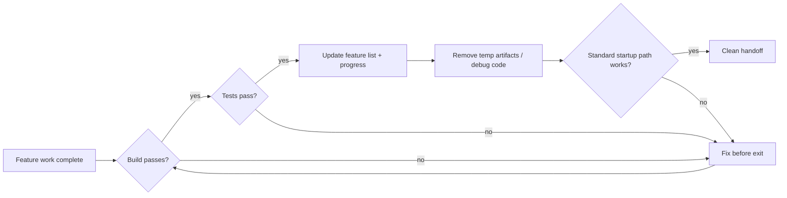
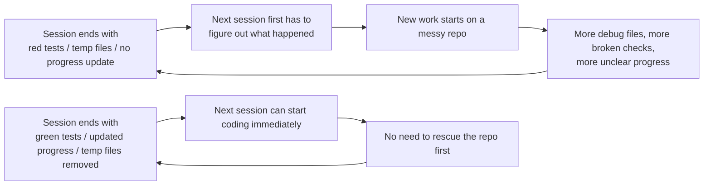

[中文版本 →](../../../zh/lectures/lecture-12-why-every-session-must-leave-a-clean-state/)

> Codebeispiele: [code/](https://github.com/walkinglabs/learn-harness-engineering/blob/main/docs/de/lectures/lecture-12-why-every-session-must-leave-a-clean-state/code/)
> Praxisprojekt: [Project 06. Vollständiger Harness (Capstone)](./../../projects/project-06-runtime-observability-and-debugging/index.md)

# Lektion 12. Sauberes Handoff am Ende jeder Session

Ihr Agent läuft den ganzen Nachmittag, ändert 20 Dateien, committet den Code, die Session endet. Die nächste Agenten-Session startet und stellt sofort fest: der Build ist kaputt, die Tests sind rot, temporäre Debug-Dateien sind überall, die Feature-Liste wurde nicht aktualisiert und der Fortschritt ist völlig unklar. Die neue Session verbringt ihre ersten 30 Minuten nur damit herauszufinden, „was die letzte Session eigentlich gemacht hat."

Sowohl OpenAI als auch Anthropic stellen klar: **Langfristige Zuverlässigkeit hängt von operativer Disziplin ab, nicht nur vom Erfolg einzelner Läufe.** Die Qualität des Zustands beim Session-Exit bestimmt direkt die Effizienz der nächsten Session. Betrachten Sie es wie Git-Best-Practices — jeder Commit sollte eine atomare, kompilierbare Änderung sein, kein Haufen halbfertigen Codes.

## Zentrale Konzepte

- **Clean state**: Das System erfüllt am Session-Ende fünf Bedingungen — Build bestanden, Tests bestanden, Fortschritt dokumentiert, keine veralteten Artefakte, Startup-Pfad verfügbar. Fehlt eine davon, ist die Session nicht „abgeschlossen".
- **Session-Integrität**: Analog zu Datenbanktransaktionen — entweder vollständig committen und einen sauberen Zustand hinterlassen oder auf den letzten konsistenten Zustand zurückrollen. Kein Mittelweg.
- **Qualitätsdokument**: Ein aktives Artefakt, das kontinuierlich Qualitätsbewertungen für jedes Modul aufzeichnet. Keine einmalige Bewertung, sondern ein Tracker, der zeigt, ob die Codebase im Laufe der Zeit stärker oder schwächer wird.
- **Cleanup-Schleife**: Eine regelmäßige Wartungssession, die darauf abzielt, die Entropie in der Codebase systematisch zu reduzieren. Keine Notfallreparatur, sondern routinemäßiger Betrieb.
- **Harness-Vereinfachung**: Wenn sich die Modellfähigkeiten verbessern, regelmäßig Harness-Komponenten entfernen, die nicht mehr notwendig sind. Eine Einschränkung, die heute essenziell ist, kann in drei Monaten unnötiger Overhead sein.
- **Idempotenter Cleanup**: Cleanup-Operationen liefern dasselbe Ergebnis, unabhängig davon, wie oft sie ausgeführt werden. Stellt sicher, dass Cleanup auch in Fehler-Wiederholungs-Szenarien sicher bleibt.

## Fünf Dimensionen des Clean State





## Warum das passiert

### Entropiewachstum ist der Standardzustand

Lehmans Gesetze der Software-Evolution sagen uns: Systeme, die kontinuierlichen Änderungen unterliegen, werden unausweichlich an Komplexität zunehmen, es sei denn, sie werden aktiv verwaltet. Dies gilt insbesondere für KI-Coding-Agenten — jede Session führt Änderungen ein, und ohne Cleanup beim Exit akkumuliert sich technische Schuld exponentiell.

Echte Daten sind aussagekräftig. Ein Projekt, das 12 Wochen lang mit Agenten entwickelt wurde, ohne Cleanup-Strategie:

- Woche 1: Build-Pass-Rate 100%, Test-Pass-Rate 100%, neue Session Startup 5 Min.
- Woche 4: Build 95%, Tests 92%, Startup 15 Min.
- Woche 8: Build 82%, Tests 78%, Startup 35 Min.
- Woche 12: Build 68%, Tests 61%, Startup 60+ Min.

Dasselbe Projekt mit einer Cleanup-Strategie:

- Woche 1: 100%, 100%, 5 Min.
- Woche 12: 97%, 95%, 9 Min.

Nach 12 Wochen: Die Build-Pass-Rate unterscheidet sich um 29 Prozentpunkte, die Startup-Zeit für neue Sessions um 85%. Das ist nicht theoretisch — es ist ein beobachteter Unterschied.

### Fünf Dimensionen des Clean State

Clean State bedeutet nicht nur „der Code kompiliert". Es sind fünf Dimensionen, die zusammen bewertet werden:

**Build-Dimension**: Lässt sich der Code fehlerfrei bauen? Das ist das Grundlegendste — die nächste Session sollte nicht zuerst Build-Fehler beheben müssen.

**Test-Dimension**: Bestehen alle Tests? Einschließlich der Tests, die vor der Session existierten — die Session ist dafür verantwortlich, bestehende Funktionalität nicht zu beschädigen. Und es sollte in CI verifiziert werden, nicht nur „funktioniert auf meinem Rechner".

**Fortschritts-Dimension**: Ist der aktuelle Fortschritt in einem maschinenlesbaren Artefakt dokumentiert? Abgeschlossene Teilaufgaben mit ihren Bestehenskriterien, in Bearbeitung befindliche aber unvollständige Teilaufgaben mit aktuellem Zustand, noch nicht gestartete Teilaufgaben. Gute Fortschrittsaufzeichnungen reduzieren 60-80% der Diagnosezeit beim Session-Startup.

**Artefakt-Dimension**: Gibt es veraltete oder mehrdeutige temporäre Artefakte? Debug-Logs, temporäre Dateien, auskommentierter Code, TODO-Marker — all diese erhöhen die kognitive Belastung für die nächste Session.

**Startup-Dimension**: Ist der Standard-Startup-Pfad verfügbar? Kann die nächste Session ohne manuelles Eingreifen mit der Arbeit beginnen? Umgebungsinitialisierung, Codebase-Laden, Kontextakquise, Aufgabenauswahl — diese Pfade dürfen nicht beschädigt sein.

### „Später aufräumen" bedeutet niemals aufräumen

Die häufigste mentale Falle ist „keine Zeit zum Aufräumen in dieser Session, das mache ich das nächste Mal." Aber die nächste Agenten-Session weiß nicht, was Sie hinterlassen haben — sie sieht ein Chaos aus Code und unsicherem Zustand. Sie wird erhebliche Zeit damit verbringen zu erschließen, „welche Teile dieses Codes beabsichtigt sind und welche temporär."

Schlimmer noch: Jede Session hat ihre eigenen Aufgabenziele. Die neue Session ist da, um neue Arbeit zu erledigen, nicht das Chaos der vorherigen Session aufzuräumen. Sie wird das Chaos ignorieren und neue Arbeit darauf aufbauen, was mehr Chaos über Chaos einführt. Das ist die positive Rückkopplungsschleife der Entropie.

## Wie man es richtig macht

### 1. Clean State als Abschlussvoraussetzung

Definieren Sie explizit im Harness: **Session-Abschluss = Aufgabe besteht die Verifikation UND Clean-State-Check besteht.** Fehlt eines von beiden, ist die Session nicht abgeschlossen. Schreiben Sie in CLAUDE.md:

```
## Session Exit Checklist
- [ ] Build passes (npm run build)
- [ ] All tests pass (npm test)
- [ ] Feature list updated
- [ ] No debug code remaining (console.log, debugger, TODO)
- [ ] Standard startup path available (npm run dev)
```

### 2. Zwei-Modi-Cleanup-Strategie

Kombinieren Sie zwei Cleanup-Modi:

**Sofortiger Cleanup (am Ende jeder Session)**: Temporäre Artefakte bereinigen, die während der Session erstellt wurden, Feature-Liste-Status aktualisieren, sicherstellen, dass Build und Tests bestehen. Das ist „Reference-Counting"-Cleanup.

**Periodischer Cleanup (wöchentlich)**: Vollständiger System-Scan — akkumulierte strukturelle Probleme behandeln, Qualitätsdokumente aktualisieren, Benchmark-Tests ausführen, um Drift zu erkennen. Das ist „Tracing"-Cleanup.

### 3. Ein Qualitätsdokument pflegen

Ein Qualitätsdokument ist ein aktives Artefakt, das jedes Modul kontinuierlich bewertet:

```markdown
# Quality Document

## User Authentication Module (Quality: A)
- Verification passing: Yes
- Agent understandable: Yes
- Test stability: Stable
- Architecture boundaries: Compliant
- Code conventions: Followed

## Payment Module (Quality: C)
- Verification passing: Partial (payment callback untested)
- Agent understandable: Difficult (logic spread across 3 files)
- Test stability: Unstable (2 flaky tests)
- Architecture boundaries: Violations present
- Code conventions: Partially followed
```

Neue Sessions lesen dieses Dokument und wissen sofort, wo Prioritäten gesetzt werden sollten. Das Modul mit der niedrigsten Bewertung zuerst reparieren.

### 4. Den Harness regelmäßig vereinfachen

Eine wichtige Erkenntnis von Anthropic: **Jede Harness-Komponente existiert, weil das Modell etwas nicht zuverlässig alleine kann. Aber wenn sich Modelle verbessern, veralten diese Annahmen.** Eine Einschränkung, die vor drei Monaten essenziell war, kann heute unnötiger Overhead sein.

Empfohlene Praxis: Jeden Monat eine Harness-Komponente auswählen, vorübergehend deaktivieren und Benchmark-Aufgaben ausführen. Wenn die Ergebnisse nicht schlechter werden, dauerhaft entfernen. Wenn doch, wiederherstellen oder durch eine leichtere Alternative ersetzen.

### 5. Cleanup-Operationen müssen idempotent sein

Cleanup-Skripte sollten sicher sein, wiederholt ausgeführt zu werden:

```bash
# Idempotent cleanup operations
rm -f /tmp/debug-*.log  # -f ensures no error when files don't exist
git checkout -- .env.local  # Restore to known state
npm run test  # Verify cleanup didn't break anything
```

## Fallbeispiel aus der Praxis

Eine Electron-App, die über 12 Wochen mit Agenten entwickelt wurde, im Vergleich zweier Ansätze:

**Ohne Cleanup-Strategie** (Kontrollgruppe): Woche 12, Build-Pass-Rate 68%, Test-Pass-Rate 61%, neue Session Startup 60+ Min., veraltete Artefakte 103.

**Mit Cleanup-Strategie** (Versuchsgruppe): Vollständiger Clean-State-Check am Ende jeder Session + wöchentliche Cleanup-Schleife. Woche 12, Build-Pass-Rate 97%, Test-Pass-Rate 95%, neue Session Startup 9 Min., veraltete Artefakte 11.

In Woche 12 liegt die Build-Pass-Rate der Versuchsgruppe um 29 Prozentpunkte höher, die Test-Pass-Rate um 34 Punkte höher und die Startup-Zeit für neue Sessions um 85% niedriger.

## Wichtigste Erkenntnisse

- **Clean State ist eine notwendige Bedingung für den Session-Abschluss** — kein optionales Aufräumen, sondern Teil der „Definition of Done".
- **Alle fünf Dimensionen sind erforderlich** — Build, Tests, Fortschritt, Artefakte, Startup — jede muss explizit überprüft werden.
- **Qualitätsdokumente machen die Codebase-Gesundheit messbar** — man kann nur reparieren, von dem man weiß, dass es sich verschlechtert.
- **Den Harness regelmäßig vereinfachen** — wenn sich die Modellfähigkeiten verbessern, Einschränkungen entfernen, die nicht mehr benötigt werden.
- **„Später aufräumen" bedeutet niemals aufräumen** — Entropiewachstum ist der Standard; nur aktiver Cleanup wirkt dagegen.

## Weiterführende Literatur

- [Clean Code - Robert C. Martin](https://www.goodreads.com/book/show/3735293-clean-code) — Systematische Prinzipien von Code-Sauberkeit
- [Harness Engineering - OpenAI](https://openai.com/index/harness-engineering/) — Reproduzierbarkeit als Kernanforderung des Harness-Designs
- [Effective Harnesses - Anthropic](https://www.anthropic.com/engineering/effective-harnesses-for-long-running-agents) — Die kritische Rolle sauberer Session-Exits für langfristige Zuverlässigkeit
- [Programs, Life Cycles, and Laws of Software Evolution - Lehman](https://ieeexplore.ieee.org/document/1702314) — Software-Evolutionsgesetze, die beweisen, dass Systemkomplexität ohne aktive Wartung unausweichlich wächst

## Übungen

1. **Clean-State-Checkliste**: Entwerfen Sie eine Session-Exit-Checkliste für Ihre Codebase, die alle fünf Dimensionen abdeckt. Wenden Sie sie über 5 aufeinanderfolgende Sessions an und dokumentieren Sie Verstöße pro Dimension.

2. **Benchmark-Vergleich**: Verwenden Sie einen festen Aufgabensatz mit zwei Harness-Varianten (mit/ohne Clean-State-Anforderungen). Vergleichen Sie Abschlussrate, Wiederholungsanzahl und Defekt-Escape-Rate.

3. **Harness-Vereinfachung üben**: Wählen Sie eine Harness-Komponente aus, deaktivieren Sie sie vorübergehend und führen Sie Benchmark-Aufgaben durch. Vergleichen Sie die Ergebnisse mit und ohne sie. Entscheiden Sie, ob Sie sie beibehalten, entfernen oder ersetzen.
