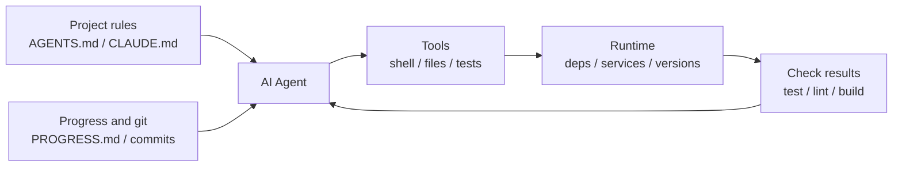

[中文版 →](../../../zh/lectures/lecture-02-what-a-harness-actually-is/)

> Code examples: [code/](https://github.com/walkinglabs/learn-harness-engineering/blob/main/docs/en/lectures/lecture-02-what-a-harness-actually-is/code/)
> Practice project: [Project 01. Prompt-only vs. rules-first](./../../projects/project-01-baseline-vs-minimal-harness/index.md)

# Lecture 02. What a Harness Actually Is

The word "harness" gets thrown around a lot in AI coding agent circles, but most of the time, when people say "harness," they really just mean a prompt file. A prompt file is not a harness.

This lecture gives harness a precise, actionable definition — not an academic abstraction, but a framework you can put to work today. A harness consists of five subsystems: instructions, tools, environment, state, and feedback. Each subsystem has clear responsibilities and evaluation criteria.

## Start with an Analogy

Imagine you are a newly hired engineer, dropped into a project with zero documentation. No README, no comments in the code, nobody tells you how to run tests, CI config is buried somewhere. Can you write good code? Maybe — if you are smart enough and patient enough. But you will spend an enormous amount of time on "figuring out what this project is about" rather than on "solving the problem."

An AI agent faces the exact same predicament, and it is even worse. You can at least ask a colleague. The agent can only see the files you put in front of it and the commands it can execute.

OpenAI frames the core principle of harness engineering as "the repo IS the spec" — all necessary context should live in the repository, delivered through structured instruction files, explicit verification commands, and clear directory organization. Anthropic's long-running agents documentation emphasizes state persistence, explicit recovery paths, and structured progress tracking. The two companies focus on different aspects, but they are saying the same thing: **everything in the engineering infrastructure outside the model determines how much of the model's capability actually gets realized.**

Look at a few tools you already know:

**Claude Code** embodies harness thinking. It reads `CLAUDE.md` from your repo, can run shell commands, executes in your local environment, maintains session history, and can run tests to see results. But if you do not tell it how to run tests, it has no way to verify whether it did things right.

**Cursor** follows similar logic. Its `.cursorrules` file is its instruction source, the terminal is its tool, and it can read your project structure and lint config. However, Cursor's state management is relatively weak — close the IDE and reopen it, and the previous context is gone.

**Codex** (OpenAI's coding agent) uses git worktrees to isolate each task's runtime environment, paired with a local observability stack (logs, metrics, traces), so every change is verified in an independent environment. It performs far better in repos with an `AGENTS.md` and clear verification commands than in "bare" repos.

**AutoGPT** is the cautionary tale. Its lack of structured state management causes context to accumulate endlessly during long tasks, and its lack of precise feedback mechanisms causes the agent to loop. Many people say AutoGPT "doesn't work," but really it is the harness that does not work.

## Core Concepts

- **What is a harness**: Everything in the engineering infrastructure outside the model weights. OpenAI distills the engineer's core job into three things: designing environments, expressing intent, and building feedback loops. Anthropic directly calls their Claude Agent SDK a "general-purpose agent harness."
- **The repo is the single source of truth**: Anything the agent cannot see, for all practical purposes, does not exist. OpenAI treats the repo as the "system of record" — all necessary context must live there, delivered through structured files and clear directory organization.
- **Give a map, not a manual**: OpenAI's experience is that `AGENTS.md` should be a directory page, not an encyclopedia. Around 100 lines is enough. If it does not fit, split it into a `docs/` directory and let the agent read on demand.
- **Constrain, don't micromanage**: A good harness uses executable rules to constrain the agent, rather than enumerating instructions one by one. OpenAI says "enforce invariants, don't micromanage implementation"; Anthropic found that agents confidently praise their own work, and the solution is to separate "the person who does the work" from "the person who checks the work."
- **Remove one at a time and observe**: To quantify each harness component's marginal contribution, remove them one at a time and see which removal causes the biggest performance drop. This tells you which components are most valuable right now, and it also reveals which ones are not yet contributing meaningfully. Anthropic used this method and discovered that as models get stronger, some components stop being critical — but new critical components always emerge.

## The Five-Subsystem Harness Model

Back to the analogy. A harness has five subsystems:



**Instruction subsystem**: Create `AGENTS.md` (or `CLAUDE.md`) containing a project overview and purpose, tech stack and versions, first-run commands, non-negotiable hard constraints, and links to more detailed documentation.

**Tool subsystem**: Ensure the agent has sufficient tool access. Do not disable shell for "security reasons" — if the agent cannot even run `pip install`, how is it supposed to get anything done? But do not open everything either — follow the principle of least privilege.

**Environment subsystem**: Make the environment state self-describing. Use `pyproject.toml` or `package.json` to lock dependencies, `.nvmrc` or `.python-version` to specify runtime versions, and Docker or devcontainers to make the environment reproducible.

**State subsystem**: Long tasks must have progress tracking. Use a simple `PROGRESS.md` file recording: what is done, what is in progress, what is blocked. Update before each session ends; read when the next session starts.

**Feedback subsystem**: This is the highest-ROI subsystem. Explicitly list verification commands in `AGENTS.md`:
```
Verification commands:
- Tests: pytest tests/ -x
- Type check: mypy src/ --strict
- Lint: ruff check src/
- Full verification: make check (includes all above)
```

Missing any one of the five subsystems means an incomplete harness, and the agent will always feel awkward to use.

**Quantifying harness component value**: Use a "controlled variable exclusion test." Keep the model fixed, remove the five subsystems one at a time, and see which subsystem's removal causes the biggest performance drop. The component with the largest drop has the highest marginal contribution for the current task and is worth prioritizing. Whether to strengthen it depends on failure attribution, not just the size of the drop. Components with near-zero impact should not be dismissed outright: they may be redundant, poorly designed, or simply not exercised by the current task. This experiment answers "which component is most valuable right now" — it cannot, by itself, prove "where the bottleneck is." To truly locate a bottleneck, you must first examine failure records and attributions: was the task unclear, was context insufficient, was the environment unreproducible, was verification feedback missing, or was state management broken? Component ablation results can only serve as supporting evidence.

## A Team's Real Story

A team used GPT-4o to develop a TypeScript + React frontend application (~20,000 lines of code). They went through four stages, which were essentially adding harness components one at a time:

**Stage 1**: Only a basic project description in the README. 1 out of 5 runs succeeded (20%). Main failures: chose the wrong package manager (npm vs yarn), did not follow component naming conventions, could not run tests.

**Stage 2**: Added `AGENTS.md` specifying tech stack versions, naming conventions, and key architecture decisions. Success rate rose to 60%. Remaining failures were mainly from environment issues and missing verification.

**Stage 3**: Listed verification commands in `AGENTS.md`: `yarn test && yarn lint && yarn build`. Success rate rose to 80%.

**Stage 4**: Introduced progress file templates where the agent recorded completed and incomplete work each run. Success rate stabilized at 80-100%.

Four iterations, the model did not change at all, and success rate went from 20% to near 100%. You did not switch to a better model — what changed was the harness.

## Key Takeaways

- Harness = Instructions + Tools + Environment + State + Feedback. All five subsystems are essential.
- If it is not model weights, it is harness. Your harness determines how much of the model's capability gets realized.
- Among the five subsystems, the feedback subsystem usually has the lowest investment and highest return. Get your verification commands right first.
- Use "controlled variable exclusion tests" to quantify each subsystem's marginal contribution; to locate the real bottleneck, rely on failure records and attribution, not ablation alone.
- Harness rots like code does. Audit regularly, and pay down harness debt just like you pay down technical debt.

## Further Reading

- [OpenAI: Harness Engineering](https://openai.com/index/harness-engineering/)
- [Anthropic: Effective Harnesses for Long-Running Agents](https://www.anthropic.com/engineering/effective-harnesses-for-long-running-agents)
- [HumanLayer: Harness Engineering for Coding Agents](https://humanlayer.dev/articles/harness-engineering-for-coding-agents/)
- [SWE-agent: Agent-Computer Interfaces](https://github.com/princeton-nlp/SWE-agent)
- [Thoughtworks: Harness Engineering on Technology Radar](https://www.thoughtworks.com/radar)

## Exercises

1. **Five-tuple harness audit**: Take a project where you currently use an AI agent and do a complete audit using the five-tuple framework. Score each subsystem 1-5. Find the lowest-scoring subsystem, spend 30 minutes improving it, and then observe the change in agent performance.

2. **Controlled variable exclusion test**: Pick one model and one challenging task. Sequentially remove instructions (delete AGENTS.md), remove feedback (do not provide verification commands), remove state (no progress files) — removing only one at a time, and measure the performance drop. Use the results to rank each subsystem's marginal value for the current task. If you want to find the bottleneck, you must also record failure logs and do root-cause attribution alongside the ablation.

3. **Affordance analysis**: Find a scenario in your project where the agent "wants to do something but can't" (e.g., knows it should use parameterized queries but does not know your project's ORM patterns). Analyze whether this is a Gulf of Execution (does not know how to operate) or a Gulf of Evaluation (does not know whether it did things right), then design a harness improvement to bridge the gap.
