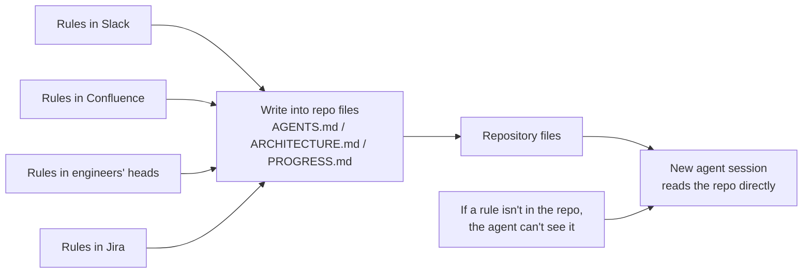
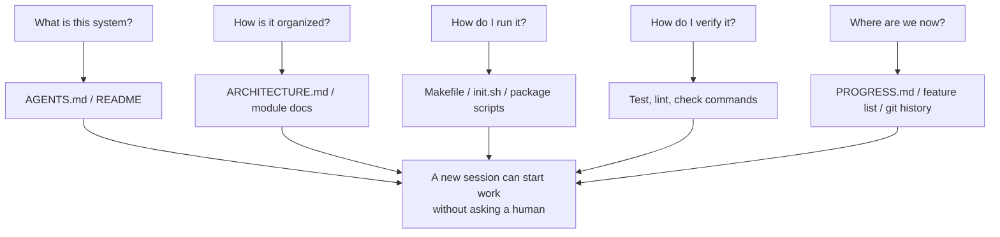

[中文版 →](../../../zh/lectures/lecture-03-why-the-repository-must-become-the-system-of-record/)

> Code examples: [code/](https://github.com/walkinglabs/learn-harness-engineering/blob/main/docs/en/lectures/lecture-03-why-the-repository-must-become-the-system-of-record/code/)
> Practice project: [Project 02. Make the Agent Read the Project and Pick Up Where It Left Off](./../../projects/project-02-agent-readable-workspace/index.md)

# Lecture 03. Making the Repository the Single Source of Truth

Your team's architecture decisions are scattered across Confluence, Slack, Jira, and a few senior engineers' heads. For humans this barely works — you can ask a colleague, search chat logs, dig through documentation, and if all else fails, you can corner someone in the break room. But for an AI agent, information that's not in the repository simply does not exist.

This isn't an exaggeration. An agent has only three sources of input: system prompts and task descriptions, file contents from the repository, and tool execution output. Your Slack history, Jira tickets, Confluence pages, and that architecture decision you hashed out with a colleague on Friday afternoon — the agent can't see any of it. It can't "go ask someone" or "search the chat logs." Its entire working world is the repository itself. Everything outside, it knows nothing about.

So the real question is: are you going to give it a map that's good enough?

## What Belongs on the Map

OpenAI states this plainly in their harness engineering article: **information that doesn't exist in the repo, doesn't exist for the agent.** They call this the "repo as spec" principle — the repository itself is the highest-authority specification document.

Anthropic's long-running agents documentation echoes a similar point: persistent state is a necessary condition for long-task continuity, and cross-session knowledge recoverability directly determines task success rates. And this state must exist in the repository — because that's the only stable, reliably accessible storage the agent has.

You might think: "Our team is small, knowledge lives in everyone's heads, and it works fine." True enough — for humans. But if you want to use an agent, you have to accept one fact: the agent can't ask people. Everything it needs to know must be written down, placed somewhere it can find it.

This isn't a "write more documentation" problem — it's a "put decision information in the right place" problem. A 50-line `ARCHITECTURE.md` sitting in the `src/api/` directory is far more useful than a 500-page design document in Confluence that nobody maintains. Proximity matters more than length, because information is only truly useful when it's right at hand the moment you need it.

## Knowledge Visibility



How do you test whether your map is good enough? Run a "fresh session test": open a brand-new agent session, give it only the repository contents, and see if it can answer five basic questions.



If it can't answer, the map has blank spots. Where the map is blank, the agent has to guess — wrong guesses become bugs, excessive guessing wastes context. And every new session has to guess all over again. The cost of guessing is always far higher than the cost of drawing the map properly in the first place.

## Core Concepts

- **Knowledge Visibility Gap**: The proportion of total project knowledge that's NOT in the repository. The bigger the gap, the higher the agent's failure rate. You can estimate it like this: count all the implicit knowledge about this project that lives in people's heads, then see how much of it actually made it into the repo. The difference is your visibility gap.
- **System of Record**: The code repository as the authoritative source for project decisions, architecture constraints, execution state, and verification standards. The repo has the final say — nowhere else counts. If the information "this road is closed" only lives in Old Zhang's head, then every single time you have to ask Old Zhang. Write it in the repo, and nobody has to ask.
- **Fresh Session Test**: The five questions from the previous section. How many the agent can answer is how complete your map is.
- **Discovery Cost**: How much context budget the agent burns to find a single key piece of information in the repo. The more hidden the information, the higher the discovery cost, and the less budget remains for the actual task. Critical information should be placed where the agent sees it first — not buried ten directory levels deep.
- **Knowledge Decay Rate**: The proportion of knowledge entries in the repo that become stale per unit of time. Documentation drifting out of sync with code is the biggest enemy — worse than no documentation at all is documentation that's out of date.
- **ACID Analogy**: Applying database transaction principles (Atomicity, Consistency, Isolation, Durability) to agent state management. We'll expand on this below.

## How to Draw a Good Map

**Principle 1: Knowledge lives next to code.** A rule about API endpoint authentication belongs next to the API code, not buried in a giant global document. Put a short doc in each module directory explaining that module's responsibilities, interfaces, and special constraints. The module directory itself is a natural index — when the agent reaches the code, it also reaches the constraints, no searching required.

**Principle 2: Use a standardized entry file.** `AGENTS.md` (or `CLAUDE.md`) is the agent's "landing page." It doesn't need to contain all information, but it must let the agent quickly answer three questions: "What is this project," "How do I run it," and "How do I verify it." 50–100 lines is enough.

**Principle 3: Minimal but complete.** Every piece of knowledge should have a clear use case. If removing a rule doesn't affect the agent's decision quality, that rule shouldn't exist. But every question from the fresh session test must have an answer. This is an ongoing balance to maintain — not too much, not too little, just enough.

**Principle 4: Update with code.** Bind knowledge updates to code changes. The simplest approach: put architecture docs in the corresponding module directory. When you modify code, you naturally notice the doc. After code changes, CI can remind you to check whether the docs need updating.

**Concrete repo structure**:

```
project/
├── AGENTS.md              # Entry: project overview, run commands, hard constraints
├── src/
│   ├── api/
│   │   ├── ARCHITECTURE.md  # API layer architecture decisions
│   │   └── ...
│   ├── db/
│   │   ├── CONSTRAINTS.md   # Database operation hard constraints
│   │   └── ...
│   └── ...
├── PROGRESS.md             # Current progress: done, in-progress, blocked
└── Makefile                # Standardized commands: setup, test, lint, check
```

## Managing Agent State with ACID Principles

This analogy comes from database transaction management. You might feel like this is overcomplicating things, but it actually provides a very practical framework:

- **Atomicity**: Each "logical operation" (e.g., "add new endpoint and update tests") gets one git commit. If it fails midway, `git stash` to roll back. All or nothing — no "half done."
- **Consistency**: Define "consistent state" verification predicates — all tests pass, lint reports zero errors. The agent runs verification after each operation; inconsistent intermediate states should not be committed. After an operation, the system should be in a verifiably correct state.
- **Isolation**: When multiple agents work concurrently, design state files to avoid race conditions. Simple approach: each agent uses its own progress file, or use git branches for isolation. Concurrent writes to the same file are a common source of trouble.
- **Durability**: Critical project knowledge lives in git-tracked files. Temporary state can stay in session memory, but knowledge that must survive across sessions has to be written to files. What's in your head doesn't count — only what's written down counts.

## A Real Transformation Story

A team maintained an e-commerce platform with roughly 30 microservices. Architecture decisions — inter-service communication protocols, data consistency strategies, API versioning rules — were scattered across: Confluence (partially outdated), Slack (hard to search), a few senior engineers' heads (not scalable), and sporadic code comments (not systematic).

After introducing AI agents, 70% of tasks required human intervention. Nearly every failure involved the agent violating some implicit constraint that "everyone knows but nobody ever wrote down." The agent had no way to know what it didn't know — it could only act on its own understanding, and then step right into the trap.

The team executed a transformation:
1. Created `AGENTS.md` in the repo root with project overview, tech stack versions, and global hard constraints
2. Added `ARCHITECTURE.md` in each microservice directory describing that service's responsibilities, interfaces, and dependencies
3. Created a centralized `CONSTRAINTS.md` using explicit "MUST / MUST NOT" language for hard constraints
4. Added `PROGRESS.md` in each service directory tracking current work status

After transformation: the same agent could answer all key project questions on a fresh session, and task completion quality improved significantly.

## Key Takeaways

- Knowledge not in the repo doesn't exist for the agent. Putting critical decision information into the repository is the most fundamental harness investment — draw a good map so you don't get lost.
- Use the "fresh session test" to evaluate repo quality: can a brand-new session answer five basic questions using only repo contents?
- Knowledge should be near code, minimal but complete, and updated together with code. It's not about writing more docs — it's about putting information in the right place.
- Use ACID principles for agent state: atomic commits, consistency verification, concurrency isolation, and durable critical knowledge.
- Knowledge decay is the biggest enemy. Out-of-date documentation is more dangerous than no documentation at all — it sends the agent in the wrong direction while the agent thinks it's on the right track.

## Further Reading

- [OpenAI: Harness Engineering](https://openai.com/index/harness-engineering/)
- [Anthropic: Effective Harnesses for Long-Running Agents](https://www.anthropic.com/engineering/effective-harnesses-for-long-running-agents)
- [Infrastructure as Code — Martin Fowler](https://martinfowler.com/bliki/InfrastructureAsCode.html)
- [ADR: Architecture Decision Records](https://adr.github.io/)
- [The Twelve-Factor App](https://12factor.net/)

## Exercises

1. **Fresh session test**: Open a completely fresh agent session in your project (provide no verbal context whatsoever), let it see only the repository contents, then ask it five questions: What is this system? How is it organized? How do I run it? How do I verify it? What's the current progress? Record which ones it can't answer, then improve the repo until it can answer all of them.

2. **Knowledge externalization quantification**: List all decisions and constraints important to development work in your project. Mark each item as inside or outside the repo. Calculate your knowledge visibility gap (the proportion of items outside the repo). Make a plan to bring the gap below 10%.

3. **ACID assessment**: Evaluate your project's state management using this lecture's ACID analogy. Atomicity — can agent operations be cleanly rolled back? Consistency — does the repo have "consistent state" verification? Isolation — do multiple concurrent agents step on each other's toes? Durability — is all cross-session knowledge properly persisted?
