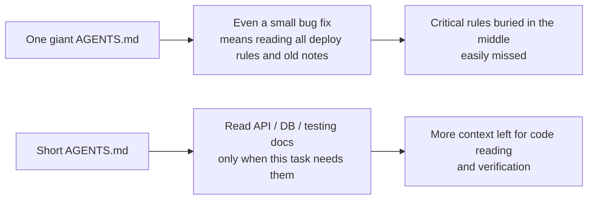
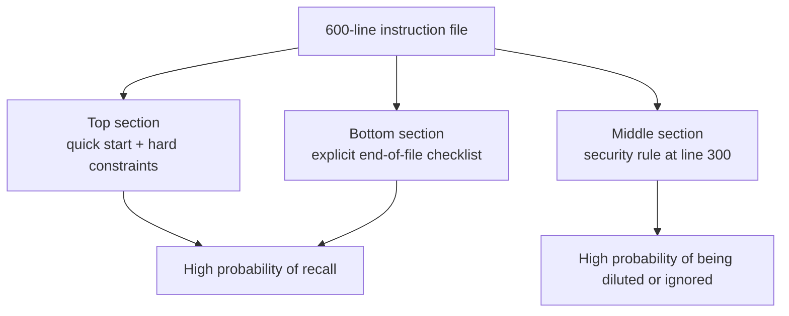

[中文版 →](../../../zh/lectures/lecture-04-why-one-giant-instruction-file-fails/)

> Code examples: [code/](https://github.com/walkinglabs/learn-harness-engineering/blob/main/docs/en/lectures/lecture-04-why-one-giant-instruction-file-fails/code/)
> Practice project: [Project 02. Agent-readable workspace](./../../projects/project-02-agent-readable-workspace/index.md)

# Lecture 04. Split Instructions Across Files

You started taking harness engineering seriously — good. You created an `AGENTS.md` and packed in every rule, constraint, and lesson learned you could think of. One month later the file had ballooned to 300 lines, two months 450, three months 600. Then you notice the agent's performance is actually getting worse: on a simple bug fix, the agent burns through huge amounts of context processing irrelevant deployment instructions; a critical security constraint buried at line 300 gets ignored outright; three contradictory code style rules mean the agent picks one at random each time.

This is the "giant instruction file" trap. Everything seems useful, so you cram it all in, and finding one specific rule means rifling through the entire file. You wrote 600 lines, but only a third of it is relevant to the task at hand.

## The Vicious Cycle at the Root

The most common vicious cycle goes like this: the agent makes a mistake, you say "add a rule to prevent this," you add it to AGENTS.md, and it works — temporarily. Then the agent makes a different mistake, so you add another rule. Repeat until the file bloats out of control.

This is a perfectly natural reaction. "Add a rule" every time something goes wrong feels reasonable. But the cumulative effect is disastrous. Let's look at exactly what goes wrong.

**Context budget gets eaten alive.** The agent's context window is finite. Say your agent has a 200K token window (Claude's standard). A bloated instruction file might consume 10-20K tokens. Seems like there's still plenty of headroom? But a complex task might need to read dozens of source files, tool execution output also takes up context, and conversation history keeps accumulating. By the time the agent actually needs to understand the code, the budget is already exhausted.

**Lost in the middle.** The "Lost in the Middle" paper (Liu et al., 2023) clearly demonstrated that LLMs utilize information in the middle of long texts significantly less effectively than at the beginning or end. Your AGENTS.md is 600 lines long, and line 300 says "all database queries must use parameterized queries" — that's a security hard constraint. But it's buried in the middle, and the agent will almost certainly ignore it.

**Priority conflicts.** The file mixes non-negotiable hard constraints ("never use eval()"), important design guidelines ("prefer functional style"), and a specific historical lesson ("fixed a WebSocket memory leak last week, watch for similar patterns"). These three rules have completely different importance levels, but in the file they all look identical. The agent has no reliable signal to distinguish which is a red line and which is merely a suggestion.

**Maintenance decay.** Large files are inherently hard to maintain. Outdated instructions rarely get deleted, because the consequences of deletion are uncertain ("maybe something else depends on this rule?"), but adding new instructions feels cost-free. The result: the file only grows, never shrinks, and the signal-to-noise ratio steadily declines. This is the same problem as technical debt accumulation in software.

**Contradiction accumulation.** Instructions added at different times start contradicting each other — one says "use TypeScript strict mode," another says "some legacy files are allowed to use any." The agent picks one at random each time.

## Core Concepts

- **Instruction Bloat**: When an instruction file occupies 10-15% of the context window, it starts crowding out budget for code reading and task reasoning. A 600-line `AGENTS.md` might consume 10,000-20,000 tokens — that's 8-15% of a 128K window.
- **Lost in the Middle**: Information in the middle of long texts is easily overlooked. Liu et al.'s 2023 research showed that LLMs utilize information in the middle of long texts significantly less effectively than information at the beginning or end. A critical constraint buried at line 300 of a 600-line file has a very high probability of being ignored.
- **Instruction Signal-to-Noise Ratio (SNR)**: The proportion of instructions in a file that are relevant to the current task. Being forced to read 50 lines of deployment instructions during a bug fix — that's low SNR.
- **Entry File**: A short entry file whose purpose is to guide the agent toward more detailed documentation, rather than containing everything itself. 50-200 lines is sufficient.
- **Reveal on Demand**: Give overview information first, detailed information when needed. Good harness design is like good UI design — don't dump all options on the user at once.
- **Can't Tell What Matters**: When all instructions appear in the same format and location, the agent cannot distinguish non-negotiable hard constraints from suggestive soft guidelines.

## Instruction Architecture





## How to Split

Core principle: keep frequently-needed information at hand, tuck away occasionally-needed information, and don't carry what you'll never use.

The entry file `AGENTS.md` stays at 50-200 lines, containing only the most essential items: a project overview (one or two sentences that make it clear what this is), first-run commands (`make setup && make test`), global hard constraints (no more than 15 non-negotiable rules), and links to topic documents (one-line description plus applicability condition).

```markdown
# AGENTS.md

## Project Overview
Python 3.11 FastAPI backend, PostgreSQL 15 database.

## Quick Start
- Install: `make setup`
- Test: `make test`
- Full verification: `make check`

## Hard Constraints
- All APIs must use OAuth 2.0 authentication
- All database queries must use SQLAlchemy 2.0 syntax
- All PRs must pass pytest + mypy --strict + ruff check

## Topic Docs
- API Design Patterns (`docs/api-patterns.md`) — Required reading when adding endpoints
- Database Rules (`docs/database-rules.md`) — Required when modifying database operations
- Testing Standards (`docs/testing-standards.md`) — Reference when writing tests
```

Each topic document is 50-150 lines, organized by subject in the `docs/` directory or next to the corresponding module. The agent only reads them when needed. Think of it like packing cubes for your luggage — underwear in one cube, toiletries in another, chargers in a third. Finding what you need doesn't require emptying the entire bag.

Some information is better placed directly in the code — type definitions, interface comments, explanations in config files. The agent naturally sees these when reading code, so there's no need to duplicate them in instructions.

Every instruction should document its source ("why was this rule added?"), applicability condition ("when is this rule needed?"), and expiry condition ("under what circumstances can this rule be removed?"). Audit regularly and delete outdated, redundant, or contradictory entries. Manage your instructions the way you manage code dependencies — unused dependencies should be removed, otherwise they only slow the system down.

If an instruction absolutely must be in the entry file, put it at the top or bottom, never in the middle. The "lost in the middle" effect tells us that LLMs utilize information at the extremes of a long text significantly better than in the center. But the better approach is to move instructions into topic documents for on-demand loading.

Both OpenAI and Anthropic implicitly endorse this split approach. OpenAI says entry files should be "short and routing-oriented," while Anthropic says control information for long-running agents should be "concise and high-priority." Both are saying the same thing: don't stuff everything into a single file.

## Real-World Example

A SaaS team's `AGENTS.md` ballooned from 50 lines to 600. The contents mixed together tech stack versions, coding standards, historical bug fix notes, API usage guides, deployment procedures, and team members' personal preferences — everything was in there, but finding the part relevant to the current task was a slog.

Agent performance started declining noticeably: during simple bug fixes the agent spent significant context processing irrelevant deployment instructions; the security constraint "all database queries must use parameterized queries" was buried at line 300 and frequently ignored; three contradictory code style rules caused the agent to pick one at random.

The team executed a split refactoring:
1. `AGENTS.md` trimmed to 80 lines: only project overview, run commands, and 15 global hard constraints
2. Created topic documents: `docs/api-patterns.md` (120 lines), `docs/database-rules.md` (60 lines), `docs/testing-standards.md` (80 lines)
3. Added topic document links in the entry file
4. Historical notes either converted to test cases or deleted outright

After refactoring: success rate on the same task set improved from 45% to 72%. Security constraint compliance rose from 60% to 95%, because the rule moved from the middle of the file to the top of the entry file — no longer "lost in the middle."

## Key Takeaways

- "Add a rule" is short-term pain relief and long-term poison. Before adding any rule, consider whether it belongs in a topic document instead.
- The entry file is a router, not an encyclopedia. 50-200 lines — overview, hard constraints, and links only.
- Leverage the "lost in the middle" effect: put important information at the top or bottom, and move less critical items to topic documents.
- Manage instruction bloat the way you manage technical debt. Regular audits, and every instruction should have a source, applicability condition, and expiry condition.
- After splitting, SNR improves and the agent spends more of its context budget on the actual task instead of processing irrelevant instructions.

## Further Reading

- [OpenAI: Harness Engineering](https://openai.com/index/harness-engineering/)
- [Anthropic: Effective Harnesses for Long-Running Agents](https://www.anthropic.com/engineering/effective-harnesses-for-long-running-agents)
- [Lost in the Middle: How Language Models Use Long Contexts](https://arxiv.org/abs/2307.03172)
- [HumanLayer: Harness Engineering for Coding Agents](https://humanlayer.dev/articles/harness-engineering-for-coding-agents/)
- [Nielsen Norman Group: Progressive Disclosure](https://www.nngroup.com/articles/progressive-disclosure/)

## Exercises

1. **SNR Audit**: Take your current entry instruction file and list all instruction entries. Pick 5 different common task types and mark whether each instruction is relevant to that task. Calculate the SNR for each task type. Instructions that are noise for most tasks should be moved to topic documents.

2. **Reveal on Demand Refactor**: If you have an instruction file over 300 lines, split it into: (a) an entry file under 100 lines, (b) 3-5 topic documents. Run the same set of tasks (at least 5) before and after refactoring, and compare success rates.

3. **Lost in the Middle Verification**: In a long instruction file, place a critical constraint at the top, middle, and bottom respectively, running the same task set each time (at least 5 runs per position). See if there's a difference in compliance rate. You might be surprised by how strong the position effect is.
