[中文版 →](../../../zh/lectures/lecture-06-why-initialization-needs-its-own-phase/)

> Code examples: [code/](https://github.com/walkinglabs/learn-harness-engineering/blob/main/docs/en/lectures/lecture-06-why-initialization-needs-its-own-phase/code/)
> Practice project: [Project 03. Multi-session continuity](./../../projects/project-03-multi-session-continuity/index.md)

# Lecture 06. Make the Agent Initialize Before Every Work Session

You start a new agent session and tell it "add a search feature." It jumps straight into coding — admirable enthusiasm. After 20 minutes it discovers the test framework isn't configured properly, spends another 10 minutes fixing that, then finds the database migration script format is wrong, more fiddling. The search feature does get added in the end, but the whole session was inefficient. Most of the time went to "figuring out how this project works" rather than writing the search feature itself.

The better approach: before letting the agent start working, use a separate phase to get the base environment ready, run verification commands through, and understand the project structure. Initialization work should not be crammed together with feature implementation — they are two fundamentally different kinds of tasks.

This lecture discusses why initialization must be a separate phase, not mixed in with implementation.

## Two Fundamentally Different Kinds of Work

Initialization and implementation have completely different optimization targets. The implementation phase aims to maximize the quantity and quality of verified features. The initialization phase aims to maximize the reliability and efficiency of all subsequent implementation.

When you mix initialization and implementation, the agent faces a multi-objective optimization problem: it has to simultaneously build infrastructure and write feature code. Without explicit priority setting, the agent naturally gravitates toward writing code (because that's directly visible output) while sacrificing infrastructure (because its value only shows up in subsequent sessions). The result: infrastructure doesn't get built solidly, and the reliability of the feature code suffers as well.

## Initialization Lifecycle

```mermaid
flowchart TB
    subgraph Wrong["Mixed into one session (wrong)"]
        W1["Start feature work immediately"] --> W2["Discover env and test gaps mid-task"]
        W2 --> W3["Accumulate unverified code"]
        W3 --> W4["Next session must rediscover project state"]
    end

    subgraph Right["Dedicated initialization phase (right)"]
        R1["Session 1: environment runnable"] --> R2["Example test passing"]
        R2 --> R3["Startup readiness checklist + task list written"]
        R3 --> R4["Clean checkpoint committed"]
        R4 --> R5["Later sessions start directly on verified tasks"]
    end
```



## What Happens When You Mix Them

The most direct problem: infrastructure doesn't get built solidly. The agent spends 80% of its effort on feature code and the remaining 20% casually setting up some infrastructure. The test framework is configured but never verified, lint rules are set but too loose, no progress file created. These defects aren't obvious in the first session (because the agent still remembers what it did), but they surface in the second session: the new agent doesn't know how to run the project, how to test, or where things stand.

A more hidden cost is "unverified accumulation." Feature code written before the test framework is properly configured — when you finally go back to add tests, you might discover the design itself was flawed. Had you known earlier, you would have implemented it differently. The more code written up front, the more has to be torn down and redone later.

Context budget is being wasted too. Initialization work (configuring environments, setting up tests, understanding project structure) consumes a large chunk of the budget, leaving less for actual feature implementation. The result: the first session only completes half the features, and the second session still has to start from scratch understanding the project. Budget was spent on initialization, but initialization wasn't done well either — the worst of both worlds.

The most easily overlooked problem is implicit assumption landmines. Decisions the agent makes during initialization (which test framework, how to organize directories, dependency management) — if not explicitly recorded, subsequent sessions may make contradictory choices. The first session chose Vitest as the test framework, but the second session's agent doesn't know and introduces Jest. Two test frameworks coexist, and maintenance costs double.

Anthropic's long-running application development research explicitly recommends separating initialization from implementation. Their experimental data: projects using a dedicated initialization phase showed 31% higher feature completion rates in multi-session scenarios compared to mixed approaches. And the time invested in the initialization phase is fully recovered within the next 3-4 sessions.

OpenAI's Codex harness engineering guide also emphasizes the "repository as operational record" principle: establish clear operational structure from the very first run, or every new session has to re-infer project conventions.

## Core Concepts

- **Initialization Phase**: The first phase in the agent's lifecycle — it only establishes the prerequisites for subsequent implementation, with no feature development. Its output is infrastructure, not business code.
- **Startup Readiness Checklist**: The conditions under which a project can be unambiguously operated by a fresh agent session: can start, can test, can see progress, can pick up next steps. Four conditions, all required.
- **From Scratch vs From Template**: Starting from scratch means the agent must infer project structure on its own from an empty directory; starting from a template means infrastructure is already in place. Starting from a template far outperforms starting from scratch.
- **Always Ready to Hand Off**: The project is in a state at any given moment where a fresh agent can take over. No verbal explanation needed — just looking at the repo contents is enough to continue working.
- **Time from Start to First Passing Test**: The time from project start until the first feature point passes verification. This is the core metric for measuring initialization efficiency.
- **Success Rate of Subsequent Sessions**: The proportion of subsequent sessions that can successfully execute tasks without relying on implicit knowledge. This is the best measure of initialization quality.

## How to Do Initialization Right

**Treat initialization as a dedicated phase.** The first session does only initialization — no business feature code at all. Initialization produces:

**1. Runnable environment.** The project starts, dependencies are installed, no environment issues.

**2. Verifiable test framework.** At least one example test passes, proving the test framework itself is properly configured.

**3. Startup readiness checklist document.** A clear document telling subsequent sessions:
```markdown
# Startup Readiness Checklist

## Start Commands
- Install dependencies: `make setup`
- Start dev server: `make dev`
- Run tests: `make test`
- Full verification: `make check`

## Current State
- All dependencies installed and locked
- Test framework configured (Vitest + React Testing Library)
- Example test passing (1/1)
- Lint rules configured (ESLint + Prettier)

## Project Structure
- src/ — Source code
- src/components/ — React components
- src/api/ — API client
- tests/ — Test files
```

**4. Task breakdown.** Split the entire project into an ordered task list, each task with clear acceptance criteria:
```markdown
# Task Breakdown

## Task 1: User Authentication Basics
- Implement JWT auth middleware
- Add login/register endpoints
- Acceptance: pytest tests/test_auth.py all passing

## Task 2: User Profile Page
- Implement user profile CRUD
- Add profile edit form
- Acceptance: pytest tests/test_profile.py all passing

## Task 3: Search Feature
- ...
```

**5. Git commit as checkpoint.** After initialization completes, commit a clean checkpoint. All subsequent work starts from this checkpoint.

**Starting from a template**: Don't start from an empty directory. Use a project template (create-react-app, fastapi-template, etc.) to preset standard directory structure, dependency configuration, and test framework. Bake common initialization steps into the template, leaving only project-specific initialization work.

**Initialization completion criteria**: Not "how much code was written," but whether the startup readiness checklist's four conditions are all met: can start, can test, can see progress, can pick up next steps. Use this checklist to validate initialization:

```markdown
## Initialization Acceptance Checklist
- [ ] `make setup` succeeds from scratch
- [ ] `make test` has at least one passing test
- [ ] A new agent session can answer "how to run" and "how to test" from repo contents alone
- [ ] Task breakdown file exists with at least 3 tasks
- [ ] Everything committed to git
```

## Real-World Example

Two initialization approaches for a React frontend project, compared:

**Mixed approach**: The agent simultaneously created project scaffolding and implemented the first feature in session 1. At session end, the repo had runnable code but no explicit start/test command documentation, no progress tracking file, no task breakdown. Session 2 spent about 20 minutes inferring project structure, test framework, and build process.

**Dedicated initialization**: Session 1 did only initialization — created directory structure from a template, configured the test framework (Vitest + React Testing Library), wrote and verified one example test, created the startup readiness checklist and task breakdown file, committed the initial checkpoint. Session 2's rebuild time was under 3 minutes, and it started working directly from the task list.

Full project cycle comparison: the mixed approach's total rebuild time (across all sessions) was about 60% more than the dedicated initialization approach. The extra 20 minutes spent on initialization was recovered many times over in subsequent sessions. Invest a bit more time up front to do initialization properly, and subsequent efficiency is actually higher.

## Key Takeaways

- Initialization and implementation have different optimization targets — mixing them only drags both down.
- Initialization's output isn't business code, it's infrastructure: runnable environment, verifiable tests, startup readiness checklist, task breakdown.
- Validate initialization with the startup readiness checklist's four conditions: can start, can test, can see progress, can pick up next steps.
- Starting from a template beats starting from scratch. Use project templates to preset standardized infrastructure.
- Time invested in initialization is fully recovered in the next 3-4 sessions. This isn't extra cost — it's upfront investment.

## Further Reading

- [Anthropic: Effective Harnesses for Long-Running Agents](https://www.anthropic.com/engineering/effective-harnesses-for-long-running-agents)
- [OpenAI: Harness Engineering](https://openai.com/index/harness-engineering/)
- [HumanLayer: Harness Engineering for Coding Agents](https://humanlayer.dev/articles/harness-engineering-for-coding-agents/)
- [Infrastructure as Code — Martin Fowler](https://martinfowler.com/bliki/InfrastructureAsCode.html)
- [SWE-agent: Agent-Computer Interfaces](https://github.com/princeton-nlp/SWE-agent)

## Exercises

1. **Startup readiness checklist design**: Write a complete startup readiness checklist for a project you're developing. Then open a completely fresh agent session, show it only repo contents (no verbal context at all), and have it try to start the project, run tests, and understand current progress. Record every problem it encounters — each one corresponds to a missing clause in your startup readiness checklist.

2. **Comparison experiment**: Pick a moderately complex new project. Approach A: let the agent initialize and do first implementation simultaneously. Approach B: spend one session on dedicated initialization, start implementation in session 2. After 4 sessions, compare time from start to first passing test, rebuild cost, and feature completion rate.

3. **Initialization acceptance checklist**: Design an initialization acceptance checklist for your project. Have a fresh agent session execute each checklist item and record which pass and which fail. The failing items are where your harness needs strengthening.
