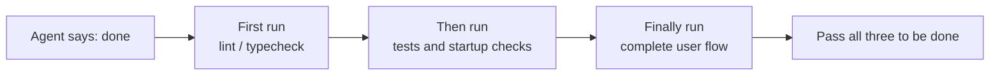
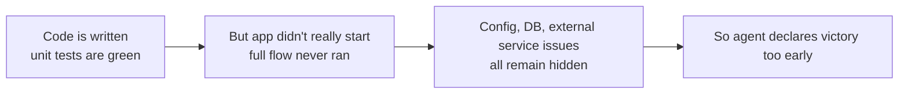

[中文版 →](../../../zh/lectures/lecture-09-why-agents-declare-victory-too-early/)

> Code examples for this lecture: [code/](https://github.com/walkinglabs/learn-harness-engineering/blob/main/docs/en/lectures/lecture-09-why-agents-declare-victory-too-early/code/)
> Hands-on practice: [Project 05. Let the agent verify its own work](./../../projects/project-05-grounded-qa-verification/index.md)

# Lecture 9. Preventing Agents from Declaring Victory Too Early

You ask an agent to implement a "password reset" feature. It modifies the database schema, writes the API endpoint, adds the email template, runs the unit tests (all pass), and then confidently tells you "it's done." But when you actually try to run it—the password reset link can't be sent because the email service config is missing; the database migration fails halfway through, leaving the schema in an inconsistent state; and the end-to-end flow hasn't been executed even once.

This isn't an isolated incident. The classic 2017 ICML paper by Guo et al. proved: **modern neural networks are systematically overconfident**—the confidence reported by models is significantly higher than their actual accuracy. AI coding agents are no different. They "feel" done, but in reality they're far from it. Your harness must replace the agent's "feelings" with externalized, execution-based verification.

## The Slippery Slope

Premature completion declarations almost always follow the same playbook: the code looks okay—syntax is correct, logic seems reasonable, static analysis shows no obvious errors. But the harness doesn't enforce comprehensive execution verification, so the agent skips actually running it or only runs partial tests. It runs unit tests but skips integration tests; it runs tests but doesn't check coverage. In the end, "the code looks fine" is taken as evidence that "the feature is complete."

Information is lost at every step. From task specification to code implementation to runtime behavior, every transformation can introduce bias, and every skipped verification compounds the information asymmetry.

## Three-Layer Termination Check





## Core Concepts

- **Premature Completion Declaration**: The agent asserts the task is complete, but unmet correctness specifications remain. The core problem is that the agent judges based on local, code-level confidence, while system-level correctness requires global verification.
- **Confidence Calibration Bias**: A systematic gap between the agent's self-reported completion confidence and the actual completion quality. For complex multi-file tasks, this bias is significantly positive—the agent is consistently more confident than its actual performance warrants.
- **Termination Criteria**: A clear, executable set of judgment conditions defined in the harness. The agent must satisfy all conditions before declaring completion. "Done" shifts from a subjective judgment to an objective determination.
- **Verification-Validation Dual Gate**: The first layer (verification) checks whether the code correctly implements the specified behavior; the second layer (validation) checks whether system-level behavior meets end-to-end requirements. Both must pass before the task is considered complete.
- **Runtime Feedback Signals**: Logs, process states, and health checks from program execution—these form the objective basis for the harness to judge completion quality.
- **Completion Priority Constraint**: First verify functional correctness, then address performance, and finally handle style. No refactoring is allowed until core functionality has been verified.

## Passing Unit Tests ≠ Task Complete

This is the most common trap, and the most dangerous one. The agent writes code, runs unit tests, sees all greens, and says "done." But the design philosophy of unit tests—isolating the tested unit and mocking dependencies—is precisely what makes them incapable of detecting cross-component issues:

**Interface Mismatch**: The renderer passes a relative file path to the preload script, but the preload script expects an absolute path. Their respective unit tests both use mocks and both pass. The issue only surfaces during end-to-end testing.

**State Propagation Errors**: A database migration changes the table schema, but the ORM's caching layer still holds cache entries for the old schema. Unit tests run in a fresh mock environment every time, so this kind of cross-layer state inconsistency never surfaces.

**Environment Dependency**: Code behaves correctly in the test environment (where everything is mocked) but fails in the real environment due to configuration differences, network latency, or service unavailability.

### "Refactoring While We're at It" is Poison to Completion Judgment

Claude Code has a common behavioral pattern: it starts refactoring code, optimizing performance, and improving style before the core functionality has passed verification. Knuth's adage that "premature optimization is the root of all evil" takes on new meaning in the agent scenario—refactoring shifts the boundary between verified and unverified code, potentially breaking code paths that were previously implicitly correct.

### Systematic Bias in Self-Evaluation

Anthropic discovered a deeper failure pattern in their 2026 research: **when an agent is asked to evaluate its own work, it systematically provides overly positive assessments—even when a human observer would judge the quality as clearly substandard.**

This problem is especially severe on subjective tasks (such as design aesthetics). Whether a "layout is polished" is a judgment call, and the agent reliably skews positive. Even on tasks with verifiable outcomes, the agent's poor judgment degrades its performance.

The solution isn't to make the agent "more objective." The same model both generates and evaluates, so it is inherently inclined to be generous with itself. **The solution is to separate the "worker" from the "checker."**

An independent evaluation agent, specifically tuned to be "nitpicky," is far more effective than having the generating agent evaluate itself. Anthropic's experimental data:

| Architecture | Runtime | Cost | Core Features Working? |
|--------------|---------|------|------------------------|
| Single agent (bare run) | 20 mins | $9 | No (game entities unresponsive to input) |
| Three agents (planner + generator + evaluator) | 6 hours | $200 | Yes (game is fully playable) |

This is the exact same model (Opus 4.5) with the exact same prompt ("build a 2D retro game editor"). The only difference is the harness: from "running bare" to "planner expands requirements → generator implements feature by feature → evaluator performs actual click testing using Playwright."

> Source: [Anthropic: Harness design for long-running application development](https://www.anthropic.com/engineering/harness-design-long-running-apps)

## How to Prevent Premature Completion Declarations

### 1. Externalize Termination Judgment

The completion judgment should not be made by the agent itself. The harness independently executes termination validation, using runtime signals as input rather than the agent's confidence. In CLAUDE.md, you can spell this out:

```
## Definition of Done
- Feature complete = end-to-end verification passed, not "code is written"
- Required verification levels:
  1. Unit tests pass
  2. Integration tests pass
  3. End-to-end flow verification passes
- Do not proceed to level 2 if level 1 fails
- Do not proceed to level 3 if level 2 fails
```

### 2. Build a Three-Layer Termination Validation

- **Layer 1: Syntax and Static Analysis**. Lowest cost, least information, but must pass. This is the bare minimum—you need to spell the words correctly before reading further.
- **Layer 2: Runtime Behavior Verification**. Test execution, application startup checks, critical path validation. This is the core evidence of completion—not just written, but runnable.
- **Layer 3: System-Level Confirmation**. End-to-end testing, integration validation, user scenario simulation. The last line of defense against premature declarations—not just runnable, but correct.

### 3. Provide Actionable Error Feedback to the Agent

OpenAI introduced a particularly effective pattern in their Codex practice: **error messages written for agents should include repair instructions**. Don't just tell the agent "it's wrong"—point out exactly what's wrong and how to fix it. Don't use `"Test failed"`, use `"Test failed: POST /api/reset-password returned 500. Check that the email service config exists in environment variables. The template file should be at templates/reset-email.html."` This kind of specific, actionable feedback lets the agent self-correct without human intervention.

### 4. Capture Runtime Signals

Effective runtime signals include:
- Did the application successfully start and reach a ready state?
- Did critical feature paths execute successfully at runtime?
- Were database writes, file operations, and other side effects correct?
- Were temporary resources cleaned up?

## Real-World Case

**Task**: Implement user password reset functionality. Involves database operations, email sending, and API endpoint modifications.

**Premature hand-in path**: The agent modifies the database schema, writes the API endpoint, adds the email template, runs unit tests (all pass), and declares completion. It looks like a lot was done, but the critical steps were all skipped.

**Actual omissions**: (1) End-to-end flow untested—the actual sending and verification of the reset link was never confirmed. (2) Database migration failed after partial execution, leaving the schema inconsistent. (3) Email service configuration was missing in the target environment.

**Harness intervention**: Termination validation is enforced—(1) start the full application to verify the reset endpoint is accessible; (2) execute the complete reset flow; (3) verify database state consistency. All defects were discovered within the session, saving 5-10x the cost of post-hoc fixes.

## Key Takeaways

- **Agents are systematically overconfident**—confidence calibration bias is an objective reality. Code being written doesn't mean it was written correctly.
- **Completion judgment must be externalized**—the harness verifies independently. Don't trust the agent's "feelings."
- **All three layers of validation are essential**: syntax passes, behavior passes, system passes—layer by layer, no shortcuts.
- **Error messages should include specific repair steps**, enabling the agent to self-correct rather than just telling it "it's wrong."
- **No refactoring until core functionality is verified**—the completion priority constraint is the key to preventing premature optimization.

## Further Reading

- [On Calibration of Modern Neural Networks - Guo et al.](https://arxiv.org/abs/1706.04599) — Proves modern deep networks are systematically overconfident
- [Building Effective Agents - Anthropic](https://www.anthropic.com/research/building-effective-agents) — The critical role of runtime evidence in completion judgment
- [Harness Engineering - OpenAI](https://openai.com/index/harness-engineering/) — Premature completion declaration is one of the main failure modes of agents
- [The Art of Software Testing - Myers](https://www.goodreads.com/book/show/137543.The_Art_of_Software_Testing) — Classic reference on testing method hierarchies and effectiveness

## Exercises

1. **Termination Validation Function Design**: Design a complete termination validation for a task involving database migration and API modifications. List the required runtime signals and the pass/fail criteria for each. Run it on a real task and record which hidden issues it discovers.

2. **Calibration Bias Measurement**: Select 10 coding tasks of different types. Record the agent's self-reported completion confidence versus the actual completion quality. Calculate the bias and analyze its relationship with task complexity.

3. **Multi-Layer Defense Experiment**: Run three configurations on the same set of tasks: (a) static analysis only, (b) add unit testing, (c) full three-layer validation. Compare the proportion of premature completion declarations and the number of uncaught defects.
