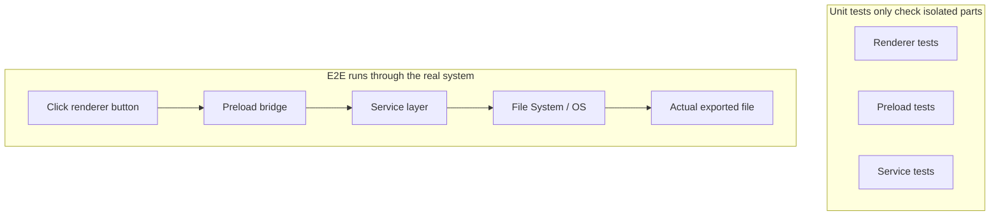
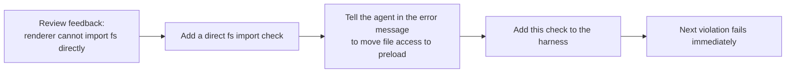

[中文版 →](../../../zh/lectures/lecture-10-why-end-to-end-testing-changes-results/)

> Code examples for this lecture: [code/](https://github.com/walkinglabs/learn-harness-engineering/blob/main/docs/en/lectures/lecture-10-why-end-to-end-testing-changes-results/code/)
> Hands-on practice: [Project 05. Let the agent verify its own work](./../../projects/project-05-grounded-qa-verification/index.md)

# Lecture 10. Only a Full Pipeline Run Counts as Real Verification

You ask the agent to add a file export feature to an Electron app. It writes the renderer component, the preload script, and the service layer logic. Unit tests for every component pass. The agent says "done." You actually click the export button — the file path format is wrong, the progress bar doesn't respond, and exporting large files leaks memory. Five component boundary defects, and unit tests didn't catch a single one.

Each part looks "correct" on its own, but problems surface the moment they are wired together. Google's Testing Pyramid tells us that a large base of unit tests is essential, but stopping there means you will systematically miss component interaction issues. For AI coding agents this problem is even worse, because agents tend to run only the fastest tests and then declare completion. **Only end-to-end testing can prove the absence of system-level defects.**

## The Blind Spots of Unit Tests

The design philosophy of unit testing is isolation: mock dependencies, focus on the unit under test. This philosophy makes unit tests fast and precise, but it also creates systematic blind spots. Every module performs perfectly in isolation, yet the following categories of problems only surface when everything actually runs together:

**Interface Mismatch**: The renderer passes the preload script a relative file path, but the preload script expects an absolute path. Their respective unit tests both use mocks and both pass. The problem is only discovered when the end-to-end flow is exercised.

**State Propagation Errors**: A database migration changes the table schema, but the ORM caching layer still holds cache entries with the old schema. Unit tests spin up a fresh mock environment every time, so they never expose this kind of cross-layer state inconsistency.

**Resource Lifecycle Issues**: The acquisition and release of file handles, database connections, and network sockets span multiple components. Unit tests create and tear down independent resources for each test case, so they never surface resource contention or leaks.

**Environment Dependency**: Code behaves correctly in the test environment (where everything is mocked) but fails in the real environment due to configuration differences, network latency, or service unavailability.

## End-to-End Testing Not Only Changes Results — It Changes Behavior

This is something many people overlook: when an agent knows its work will be validated by end-to-end tests, its coding behavior shifts.

1. **Considering component interactions**: While writing code it starts asking "how does this interface connect with the upstream?" rather than focusing on a single function in isolation.
2. **Respecting architectural boundaries**: In systems with architectural constraints, end-to-end tests force the agent to follow boundary rules.
3. **Handling error paths**: End-to-end tests typically include failure scenarios, which pushes the agent to think about exception handling.

## Testing Pyramid and Review Feedback Promotion





OpenAI emphasizes in its Codex engineering practices: **error messages written for agents must include fix instructions.** Instead of writing `"Direct filesystem access in renderer"`, write `"Direct filesystem access in renderer. All file operations must go through the preload bridge. Move this call to preload/file-ops.ts and invoke it via window.api."` This turns architectural rules into an auto-correction loop. Error messages don't just tell you "what went wrong" — they tell you "how to fix it," enabling the agent to correct itself autonomously.

## Core Concepts

- **Component Boundary Defects**: Component A and B each pass their unit tests, but their interaction produces incorrect behavior. This is the category of issue that end-to-end testing excels at catching.
- **Testing Adequacy Gradient**: Defects detectable by unit tests <= defects detectable by integration tests <= defects detectable by end-to-end tests. Detection capability increases with each layer.
- **Architectural Boundary Enforcement Rules**: Turning rules from architecture documents (such as "the renderer process must not access the filesystem directly") into executable, automated checks — going from "written on paper" to "running in CI."
- **Review Feedback Promotion**: Converting recurring code review comments into automated tests. Every time a new category of repeated issue is found, add a rule, and the harness grows stronger automatically.
- **Agent-Oriented Error Messages**: Failure messages should not merely state "what went wrong" but also tell the agent exactly how to fix it, turning test failures into self-correcting feedback loops.

## How to Do It

### 0. Define Architectural Boundaries Before Writing E2E Tests

The prerequisite for end-to-end testing is that the system has clear boundaries. If the architecture is a tangled mess, end-to-end testing will only prove "the whole mess runs" without telling you where design intent was violated.

OpenAI's experience: **for agent-generated codebases, architectural constraints must be established as early prerequisites on day one — not something to think about once the team has grown.** The reason is straightforward: agents copy existing patterns in the repository, even when those patterns are inconsistent or suboptimal. Without architectural constraints, agents introduce more drift with every session.

OpenAI adopted a "Layered Domain Architecture," where each business domain is divided into fixed layers: Types -> Config -> Repo -> Service -> Runtime -> UI. Dependencies flow strictly forward, and cross-domain concerns enter through explicit Providers interfaces. Any other dependency is forbidden and mechanically enforced via custom linting.

Key principle: **Enforce invariants; don't micromanage implementation.** For example, require that "data is parsed at the boundary," but don't prescribe which library to use. Error messages must include fix instructions — not just saying "violation," but telling the agent concretely how to change it.

> Source: [OpenAI: Harness engineering: leveraging Codex in an agent-first world](https://openai.com/index/harness-engineering/)

### 1. The Harness Must Include an End-to-End Layer

Make it explicit in your validation flow: for tasks involving cross-component changes, passing end-to-end tests is a prerequisite for completion:

```
## Validation Hierarchy
- Level 1: Unit tests (Must pass)
- Level 2: Integration tests (Must pass)
- Level 3: End-to-end tests (Must pass when cross-component changes are involved)
- Skipping any required level = Not Complete
```

### 2. Turn Architectural Rules into Executable Checks

Every architectural constraint should have a corresponding test or lint rule:

```bash
# Check whether the renderer process directly calls Node.js APIs
grep -r "require('fs')" src/renderer/ && exit 1 || echo "OK: no direct fs access in renderer"
```

### 3. Design Agent-Oriented Error Messages

Failure messages should contain three elements: what went wrong, why, and how to fix it:

```
ERROR: Found direct import of 'fs' in src/renderer/App.tsx:12
WHY: Renderer process has no access to Node.js APIs for security
FIX: Move file operations to src/preload/file-ops.ts and call via window.api.readFile()
```

### 4. Establish a Review Feedback Promotion Process

Every time you discover a new category of agent error during code review, turn it into an automated check. A month later your harness will be far stronger than it was at the start of the month.

## Real-World Case

**Task**: Implement a file export feature in an Electron app. Involves renderer process UI, preload script filesystem proxy, and service layer data transformation.

**Unit test phase**: Renderer component tests (passed, file operations mocked), preload script tests (passed, filesystem mocked), service layer tests (passed, data source mocked). Agent declares completion.

**Defects revealed by end-to-end tests**:

| Defect | Description | Unit Test | E2E |
|--------|-------------|-----------|-----|
| Interface Mismatch | Inconsistent file path format | Missed | Caught |
| State Propagation | Export progress not sent back to UI via IPC | Missed | Caught |
| Resource Leak | Large file export handles not released | Missed | Caught |
| Permission Issue | Different permissions in packaged environment | Missed | Caught |
| Error Propagation | Service layer exceptions didn't reach UI layer | Missed | Caught |

All 5 defects were caught by end-to-end tests; unit tests caught none. The trade-off was test time increasing from 2 seconds to 15 seconds — perfectly acceptable in an agent workflow.

## Key Takeaways

- **Unit tests are systematically blind to component boundary defects**: their isolation design is precisely what prevents them from detecting interaction issues.
- **End-to-end testing not only detects defects, it changes how agents write code**: it shifts focus toward integration and boundaries.
- **Architectural rules must be executable**: not written in a document waiting for someone to read them, but automatically checked on every commit.
- **Error messages must be designed for agents**: include concrete "how to fix" steps to form a self-correcting feedback loop.
- **Review feedback promotion makes the harness automatically stronger**: every captured defect category becomes a permanent line of defense.

## Further Reading

- [How Google Tests Software - Whittaker et al.](https://www.goodreads.com/book/show/13563030-how-google-tests-software) — The classic source of the Testing Pyramid model
- [Harness Engineering - OpenAI](https://openai.com/index/harness-engineering/) — Engineering practices for automated enforcement of architectural constraints
- [Chaos Engineering - Netflix (Basiri et al.)](https://ieeexplore.ieee.org/document/7466237) — Proactively injecting failures to verify system resilience
- [QuickCheck - Claessen & Hughes](https://www.cs.tufts.edu/~nr/cs257/archive/john-hughes/quick.pdf) — Property testing methodology, sitting between example-based testing and formal verification

## Exercises

1. **Cross-Component Defect Detection**: Pick a modification task involving at least three components. First run only unit tests and record the results, then run end-to-end tests. Analyze each additionally discovered defect and classify which type of cross-layer interaction issue it represents.

2. **Architectural Rule Automation**: Pick an architectural constraint from your project and turn it into an executable check (complete with an agent-oriented error message). Integrate it into the harness and verify its effectiveness using a baseline task.

3. **Review Feedback Promotion**: Find a recurring comment type from code review history and convert it into an automated check following the five-step process. Compare the frequency of that issue category before and after the promotion.
