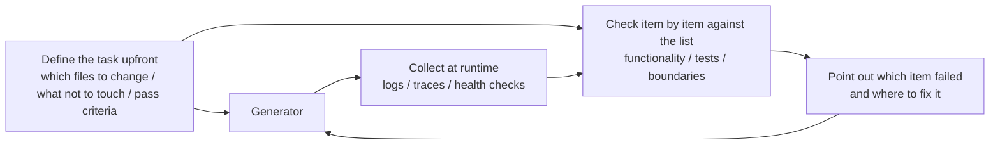

[中文版 →](../../../zh/lectures/lecture-11-why-observability-belongs-inside-the-harness/)

> Code examples: [code/](https://github.com/walkinglabs/learn-harness-engineering/blob/main/docs/en/lectures/lecture-11-why-observability-belongs-inside-the-harness/code/)
> Practice project: [Project 06. Build a Complete Agent Harness](./../../projects/project-06-runtime-observability-and-debugging/index.md)

# Lecture 11. Making the Agent's Runtime Observable

You ask an agent to implement a feature. It runs for 20 minutes, touches a pile of files, then tells you "done, but two tests are failing." You ask why — "not sure, might be a timing issue." You ask which critical paths it changed — "let me look at the code..."

This scenario is all too common, and the root cause isn't the agent's capability — it's the harness's lack of observability. When an agent executes a task without visibility into the actual runtime state, every decision it makes is essentially a guess.

**Without observability, agents make decisions under uncertainty, evaluations become subjective judgments, and retries become blind wandering.** Both OpenAI and Anthropic frame reliability as an evidence problem: the harness must expose runtime behavior and evaluation signals in a form that can actually guide the next decision.

## The Real Cost of Missing Observability

When a harness lacks observability, four categories of problems appear systematically.

**Cannot distinguish "correct" from "looks correct."** A function looks perfectly right in code review — correct syntax, sound logic. But at runtime, a boundary-condition handling error produces incorrect results under specific inputs. Only runtime traces can reveal that the actual execution path deviated from expectations. Code review shows "what was written"; runtime tracing shows "what actually ran." You need both.

**Evaluation becomes mysticism.** Without scoring rubrics and acceptance criteria, evaluators (human or agent) have to rely on implicit assumptions. The same output can get wildly different assessments from different evaluators. Quality evaluation becomes non-reproducible.

**Retries become blind guesses.** When the agent doesn't know why something failed, its retry direction is random. It might hammer away in the wrong direction — fixing unrelated code paths while ignoring the real root cause. Every blind retry burns tokens and time.

**Session handoff information cliff.** When incomplete work is handed to the next session, missing observability means the new session has to diagnose the system state from scratch. Anthropic's observations of long-running agents show that this redundant diagnosis can eat up 30-50% of total session time.

## A Real Claude Code Scenario

Consider a harness using a "planner-generator-evaluator" three-role workflow, executing the task "add dark mode to the app."

**Without observability:** The planner outputs a vague description. The generator implements dark mode based on that vagueness, but the result doesn't match the planner's implicit expectations. The evaluator rejects it based on their own implicit standards but can't articulate what's specifically wrong — just "it doesn't feel right." The generator retries blindly on vague rejection reasons. The cycle repeats 3-4 times, taking about 45 minutes, and barely produces an acceptable output.

**With full observability:** The planner outputs a sprint contract listing which components to modify, verification standards for each, and exclusions (e.g., no print styles). The generator implements according to the contract, and runtime observability records each component's style loading and application process. The evaluator uses a scoring rubric to evaluate dimension by dimension, citing specific evidence: "Button color contrast is insufficient (WCAG AA standard 4.5:1, measured 2.1:1)." One iteration produces a high-quality result, in about 15 minutes.

3x efficiency difference. The only variable is observability.

## Layered Observability

Observability isn't just "add more logging." It operates on two layers, and both are essential.



**Runtime observability:** System-level signals — logs, traces, process events, health checks. Answers "what did the system do."

**Process observability:** Visibility into harness decision artifacts — plans, scoring rubrics, acceptance criteria. Answers "why should this change be accepted."

## Core Concepts

- **Runtime observability**: System-level signals including logs, traces, process events, and health checks. Answers "what did the system do."
- **Process observability**: Visibility into harness decision artifacts including plans, scoring rubrics, and acceptance criteria. Answers "why should this change be accepted."
- **Task trace**: A complete decision-path record from task start to completion, analogous to request tracing in distributed systems. Every step the agent takes, along with its context, is recorded — so when something goes wrong, you can replay the entire process.
- **Sprint contract**: A short-term agreement negotiated before coding begins, specifying task scope, verification standards, and exclusions. The core tool for process observability.
- **Evaluator rubric**: Transforms quality evaluation from subjective judgment into evidence-based structured scoring, enabling different evaluators to reach similar conclusions for the same output.
- **Layered observability**: System-layer and process-layer observability designed simultaneously and reinforcing each other. Runtime signals explain behavior; process artifacts explain intent.

## Why Agents Can't Solve This Themselves

You might be thinking: "Can't the agent just print its own logs?" The problem is:

1. **Agents don't know what they don't know.** They won't proactively record signals they don't realize they need. Without harness-level constraints, agents only log what they think is important — and what they think is important is usually not enough.
2. **Log formats are inconsistent.** Different sessions use different log formats, making systematic analysis impossible.
3. **Process observability can't be solved by logging.** Sprint contracts and scoring rubrics are structured artifacts that require harness-level support — adding a few print statements won't cut it.

## How to Build Observability

### 1. Build Runtime Signal Collection into the Harness

Don't rely on the agent to print its own logs. The harness should automatically collect the following signals:

- **Application lifecycle**: Startup, ready, running, shutdown phase states
- **Feature path execution**: Execution records for critical paths, including entry points, checkpoints, and exits
- **Data flow**: Records of data flowing between components
- **Resource utilization**: Abnormal resource usage patterns (e.g., continuously growing memory)
- **Errors and exceptions**: Full error context, not just error messages

### 2. Implement Sprint Contracts

Before each task begins, the generator and evaluator (which may be different invocations of the same agent) negotiate a contract that defines what to build and what "done" looks like:

```markdown
# Sprint Contract: Dark Mode Support

## Scope
- Modify the theme toggle component
- Update global CSS variables
- Add dark mode tests

## Verification Standards
- Visual regression tests pass for each component
- Main flow end-to-end tests pass
- No flash of unstyled content (FOUC)

## Exclusions
- Not handling print styles
- Not handling third-party component dark mode
```

### 3. Establish an Evaluator Rubric

Turn "is it good or not" into quantifiable scoring:

```markdown
# Scoring Rubric

| Dimension | A | B | C | D |
|-----------|---|---|---|---|
| Code correctness | All tests pass | Main flow passes | Partial pass | Build fails |
| Architecture compliance | Fully compliant | Minor deviations | Obvious deviations | Serious violations |
| Test coverage | Main + edge cases | Main flow only | Only skeleton | No tests |
```

### 4. Standardize with OpenTelemetry

Create a trace for each harness session, a span for each task, and sub-spans for each verification step. Use standard attributes to annotate key information. This way observability data integrates with standard toolchains (Jaeger, Zipkin).

## Anthropic's Three-Agent Architecture Experiment

In March 2026, Anthropic published a systematic harness experiment. They ran the same task ("build a browser-based DAW using the Web Audio API") with three different architectures and recorded detailed phase-by-phase data:

| Agent & Phase | Duration | Cost |
|---------------|----------|------|
| Planner | 4.7 min | $0.46 |
| Build round 1 | 2 hr 7 min | $71.08 |
| QA round 1 | 8.8 min | $3.24 |
| Build round 2 | 1 hr 2 min | $36.89 |
| QA round 2 | 6.8 min | $3.09 |
| Build round 3 | 10.9 min | $5.88 |
| QA round 3 | 9.6 min | $4.06 |
| **Total** | **3 hr 50 min** | **$124.70** |

Each of the three agents had a distinct role, and each played a clear part in observability:

**Planner:** Receives a 1-4 sentence user requirement and expands it into a full product spec. It was instructed to "be bold in scope" and "focus on product context and high-level technical design rather than detailed technical implementation." The reasoning: if the planner prematurely specifies granular technical details and gets them wrong, those errors cascade downstream. A better approach is to constrain deliverables and let the agent find its own path during execution.

**Generator:** Implements feature by feature, sprint by sprint. Before each sprint, it negotiates a sprint contract with the evaluator defining what "done" means for that feature block. It then implements according to the contract, self-evaluates, and hands off to QA.

**Evaluator:** Uses Playwright MCP to interact with the running app like a real user — testing UI functionality, API endpoints, and database state. It scores each sprint across four dimensions: product depth, functionality, visual design, and code quality. Each dimension has a hard threshold — if any falls short, the sprint fails and the generator receives detailed feedback for fixes.

Example feedback from QA round 1: "This is a visually impressive app with good AI integration, but several core DAW features are presentational only, lacking interaction depth: clips can't be dragged/moved, there's no instrument UI panel (synth knobs, drum pads), and no visual effects editor (EQ curves, compressor meters)." These aren't edge cases — they're the core interactions that make a DAW usable. Specific, evidence-backed feedback — not "it doesn't feel right."

The evaluator wasn't always this sharp. Early versions would identify reasonable issues, then talk themselves into dismissing those issues as not severe, ultimately approving the work. The fix: read the evaluator's logs, find the points where its judgment diverged from human judgment, and update the QA prompt to address those specific problems. After several rounds of this development loop, the evaluator's scoring became reliable.

> Source: [Anthropic: Harness design for long-running application development](https://www.anthropic.com/engineering/harness-design-long-running-apps)

## Key Takeaways

- **Observability is a harness architecture property.** It's not a feature you add after the fact — it's a core capability that must be designed in from the start.
- **Both observability layers are essential.** Runtime signals explain "what happened," process artifacts explain "why it was done this way."
- **Sprint contracts front-load alignment.** They prevent the generator from building something the evaluator immediately rejects for foreseeable reasons.
- **Scoring rubrics make evaluation reproducible.** Different evaluators produce similar scores for the same output.
- **Missing observability wastes 30-50% of session time on redundant diagnosis.**

## Further Reading

- [Observability Engineering - Charity Majors](https://www.honeycomb.io/blog/observability-engineering-book) — Theory and practice framework for modern observability engineering
- [Dapper - Google (Sigelman et al.)](https://research.google/pubs/pub36356/) — Groundbreaking practice in large-scale distributed tracing
- [Harness Design - Anthropic](https://www.anthropic.com/engineering/harness-design-long-running-apps) — Introducing sprint contracts and evaluator rubrics
- [Site Reliability Engineering - Google](https://sre.google/sre-book/table-of-contents/) — Systematic application of observability in production systems

## Exercises

1. **Observability Gap Analysis**: Audit your current harness for system-layer and process-layer observability. Find system states that can't be distinguished from existing signals, and propose additions.

2. **Sprint Contract Practice**: Write a sprint contract for a real task. Have the agent execute according to the contract, and compare efficiency and quality with and without the contract.

3. **Task Trace Construction**: Record every step an agent takes during a complete coding task. Annotate using OpenTelemetry semantic conventions. Analyze the trace for information bottlenecks — which steps lack sufficient signal support for their decisions.
