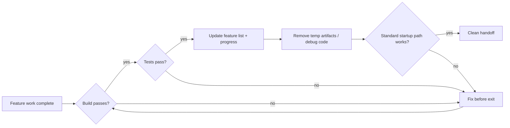
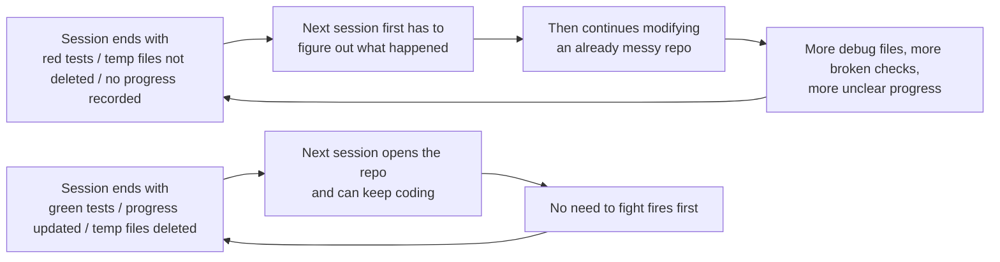

[中文版 →](../../../zh/lectures/lecture-12-why-every-session-must-leave-a-clean-state/)

> Code examples: [code/](https://github.com/walkinglabs/learn-harness-engineering/blob/main/docs/en/lectures/lecture-12-why-every-session-must-leave-a-clean-state/code/)
> Practice project: [Project 06. Build a Complete Agent Workspace](./../../projects/project-06-runtime-observability-and-debugging/index.md)

# Lecture 12. Leave a Clean Handoff at the End of Every Session

Your agent runs all afternoon, modifies 20 files, commits the code, and the session ends. The next agent session starts up and immediately discovers: build is broken, tests are red, temporary debug files are scattered everywhere, the feature list hasn't been updated, and progress is completely opaque. The first 30 minutes of the new session are spent entirely on "figuring out what the last session actually did."

Both OpenAI and Anthropic state clearly: **long-term reliability depends on operational discipline, not just single-run success.** The quality of state at the end of each session directly determines the next session's efficiency.

## Entropy Growth Is the Default State

Lehman's laws of software evolution tell us that systems undergoing continuous change will inevitably grow more complex unless actively managed. This is especially true for AI coding agents. Every session introduces changes, and without cleanup at exit, technical debt accumulates exponentially.

During five months of Codex experiments, OpenAI observed something striking: **agents copy patterns already present in the repository, even when those patterns are inconsistent or suboptimal.** Over time, this copying inevitably leads to drift. The first person leaves a coffee cup in the common area; the second person figures "it's already messy" and leaves another; a week later the table is buried under cups. A codebase works the same way.

The OpenAI team initially spent 20% of every Friday manually cleaning up "AI slop," but this approach clearly doesn't scale. They eventually arrived at a systematic solution:

1. **Encode "golden rules" into the repository**: Rules like "prefer the shared utility package over hand-rolled ad-hoc helpers" (keep invariants centralized) and "don't YOLO-guess data structures" (validate boundaries or depend on typed SDKs). These rules are concrete, mechanical, and automatically checkable.
2. **Establish periodic cleanup workflows**: A fleet of background Codex tasks that regularly scan for deviations, update quality scores, and open targeted refactoring PRs. Most can be reviewed and auto-merged within a minute.
3. **Capture human taste once, enforce it continuously**: Review comments, refactoring PRs, and user-facing bugs are all translated into documentation updates or encoded directly into tooling. When documentation isn't enough, promote the rule into code.

Technical debt is a high-interest loan. Continuously paying it off in small increments is almost always better than letting it accumulate into one massive payoff event.

> Source: [OpenAI: Harness engineering: leveraging Codex in an agent-first world](https://openai.com/index/harness-engineering/)

## Clean State: More Than "The Code Compiles"

Clean state isn't simply "the code compiles." Building without errors is the most basic requirement — the next session shouldn't have to fix build errors first. All tests must pass too, including tests that existed before the session; the session is responsible for not breaking existing functionality. And this should be verified in CI, not just "works on my machine."



But that's still not enough. Current progress must be recorded in machine-readable artifacts: completed subtasks with their passing criteria, in-progress but incomplete subtasks with current state, and not-yet-started subtasks. Good progress records can reduce session startup diagnostic time by 60–80%. Temporary artifacts — debug logs, temporary files, commented-out code, TODO markers — must also be cleaned up, because they increase cognitive load for the next session. The standard startup path must remain functional too. Can the next session start working without manual intervention? Environment initialization, codebase loading, context acquisition, task selection — none of these paths can be broken.



## Core Concepts

- **Clean state**: The system must satisfy five conditions at session end — build passes, tests pass, progress recorded, no stale artifacts, startup path available. Missing any one means the session isn't "done."
- **Session integrity**: Analogous to database transactions — either fully commit and leave a clean state, or roll back to the last consistent state. No middle ground.
- **Quality document**: An active artifact that continuously records quality ratings for each module. Not a one-time assessment, but a tracker showing whether the codebase is getting stronger or weaker over time.
- **Cleanup loop**: A regular maintenance session aimed at systematically reducing entropy in the codebase. Not an emergency fix, but routine operations.
- **Harness simplification**: As model capabilities improve, periodically remove harness components that are no longer necessary. A constraint essential today may be unnecessary overhead in three months.
- **Idempotent cleanup**: Cleanup operations produce the same result regardless of how many times they run, ensuring cleanup remains safe even in failure-retry scenarios.

## "Clean Up Later" Means Never Clean Up

The most common mental trap is "no time to clean up this session, I'll do it next time." But the next agent session doesn't know what you left behind — it sees a mess of code and uncertain state. It'll spend significant time inferring "which parts of this code are intentional and which are temporary."

Worse, every session has its own task objectives. The new session is there to do new work, not clean up the previous session's mess. It'll ignore the chaos and start new work on top of it, introducing even more chaos. This is entropy's positive feedback loop.

The numbers tell the story. A project developed with agents for 12 weeks, without a cleanup strategy:

- Week 1: Build pass rate 100%, test pass rate 100%, new session startup 5 min
- Week 4: Build 95%, tests 92%, startup 15 min
- Week 8: Build 82%, tests 78%, startup 35 min
- Week 12: Build 68%, tests 61%, startup 60+ min

Same project with a cleanup strategy:

- Week 1: 100%, 100%, 5 min
- Week 12: 97%, 95%, 9 min

After 12 weeks: build pass rate differs by 29 percentage points, new session startup time differs by 85%. This is not theoretical — it's an observed difference.

## How to Do It

### 1. Clean State Is a Necessary Condition for Completion

Define explicitly in the harness: **session completion = task passes verification AND clean state check passes.** Missing either one means the session isn't complete. Write in CLAUDE.md:

```
## Session Exit Checklist
- [ ] Build passes (npm run build)
- [ ] All tests pass (npm test)
- [ ] Feature list updated
- [ ] No debug code remaining (console.log, debugger, TODO)
- [ ] Standard startup path available (npm run dev)
```

### 2. Dual-Mode Cleanup Strategy

Combine two cleanup modes:

**Immediate cleanup (at end of every session)**: Clean up temporary artifacts created during the session, update feature list state, ensure build and tests pass. This is "reference counting" cleanup — clean up as soon as you're done using something.

**Periodic cleanup (weekly)**: Full-system scan — handle accumulated structural issues, update quality documents, run benchmark tests to detect drift. This is "tracing" cleanup — a comprehensive maintenance pass done on a regular cadence.

### 3. Maintain a Quality Document

A quality document is an active artifact that continuously scores each module:

```markdown
# Quality Document

## User Authentication Module (Quality: A)
- Verification passing: Yes
- Agent understandable: Yes
- Test stability: Stable
- Architecture boundaries: Compliant
- Code conventions: Followed

## Payment Module (Quality: C)
- Verification passing: Partial (payment callback untested)
- Agent understandable: Difficult (logic spread across 3 files)
- Test stability: Unstable (2 flaky tests)
- Architecture boundaries: Violations present
- Code conventions: Partially followed
```

New sessions read this document and immediately know where to prioritize. Fix the lowest-scoring module first.

### 4. Periodically Simplify the Harness

Every harness component exists because the model couldn't reliably do something on its own. But as models improve, these assumptions become outdated.

Anthropic's experiments demonstrated this directly. Their initial harness included a sprint-splitting mechanism — breaking work into small chunks for Sonnet 4.5 to complete one at a time. When Opus 4.6 shipped, the model's native capabilities could handle work decomposition autonomously, making sprint construction unnecessary overhead. After removing it, the builder agent could work continuously for over two hours without drifting — and was actually smoother.

But the evaluator told a different story. Even with Opus 4.6's stronger capabilities, when tasks approached the model's capability boundary, the evaluator still provided real value — catching the generator's missing functionality and stub implementations. This means the evaluator isn't a fixed yes/no decision; it depends on where task difficulty sits relative to model capability.

**Recommended practice**: Every month, pick one harness component, temporarily disable it, and run benchmark tasks. If results don't degrade, remove it permanently. If they do, restore it or replace it with a lighter alternative.

A deeper principle: **as models improve, the interesting combinations in a harness don't shrink — they shift.** Problems that previously required explicit solutions get absorbed by model capabilities, but new capability boundaries open up harness design spaces that were previously impossible. The AI engineer's job is to continuously find the next valuable combination.

### 5. Cleanup Operations Must Be Idempotent

Cleanup scripts should be safe to run repeatedly — running them one more time shouldn't produce side effects:

```bash
# Idempotent cleanup operations
rm -f /tmp/debug-*.log  # -f ensures no error when files don't exist
git checkout -- .env.local  # Restore to known state
npm run test  # Verify cleanup didn't break anything
```

### 6. High Throughput Changes the Merge Philosophy

When agent output far exceeds human review capacity, the traditional merge philosophy needs adjustment. The OpenAI team's experience: in an environment where an agent opens 3.5 PRs per day (and later even more), minimizing blocking merge gates is the right call. PRs should be short-lived; test flakiness is usually resolved with subsequent runs rather than indefinitely blocking progress. In a system where the cost of fixing is low and the cost of waiting is high, moving fast with fast fixes is a better strategy than slow confirmation.

**Caveat**: This is irresponsible in a low-throughput environment. But when agent output far exceeds human attention, it's often the correct tradeoff. The key criterion: **average cost of fixing a bug vs. average cost of waiting for a human to review a PR.** When the former is lower than the latter, fast merging is the right call.

## Real-World Case

An Electron app developed with agents over 12 weeks, comparing two approaches:

**Without cleanup strategy** (control group): Week 12, build pass rate 68%, test pass rate 61%, new session startup 60+ min, 103 stale artifacts.

**With cleanup strategy** (experimental group): Full clean-state check at every session end, plus a weekly cleanup loop. Week 12, build pass rate 97%, test pass rate 95%, new session startup 9 min, 11 stale artifacts.

By week 12, the experimental group's build pass rate was 29 percentage points higher, test pass rate 34 points higher, and new session startup time 85% lower. Each session spent an extra 5 minutes on cleanup, but over 12 weeks that saved dozens of hours of chaos.

## Key Takeaways

- **Clean state is a necessary condition for session completion** — not optional housekeeping, but part of the "definition of done."
- **All five dimensions are non-negotiable** — build, tests, progress, artifacts, startup — each must be explicitly checked.
- **Quality documents make codebase health trackable** — you can only proactively fix what you know is degrading.
- **Periodically simplify the harness** — as model capabilities improve, remove constraints that are no longer needed.
- **"Clean up later" equals never cleaning up.** Entropy growth is the default state; only active cleanup counteracts it.

## Further Reading

- [Clean Code - Robert C. Martin](https://www.goodreads.com/book/show/3735293-clean-code) — Systematic principles of code cleanliness
- [Harness Engineering - OpenAI](https://openai.com/index/harness-engineering/) — Reproducibility as a core harness design requirement
- [Effective Harnesses - Anthropic](https://www.anthropic.com/engineering/effective-harnesses-for-long-running-agents) — The critical role of clean session exits for long-term reliability
- [Programs, Life Cycles, and Laws of Software Evolution - Lehman](https://ieeexplore.ieee.org/document/1702314) — Software evolution laws proving system complexity inevitably grows without active maintenance

## Exercises

1. **Clean State Checklist**: Design a session exit checklist for your codebase covering all five dimensions. Apply it across 5 consecutive sessions and record the number of violations per dimension.

2. **Benchmark Comparison**: Use a fixed task set with two harness variants (with/without clean state requirements). Compare completion rate, retry count, and defect escape rate.

3. **Harness Simplification Practice**: Pick one harness component, temporarily disable it, and run benchmark tasks. Compare results with and without it. Decide whether to keep, remove, or replace.
