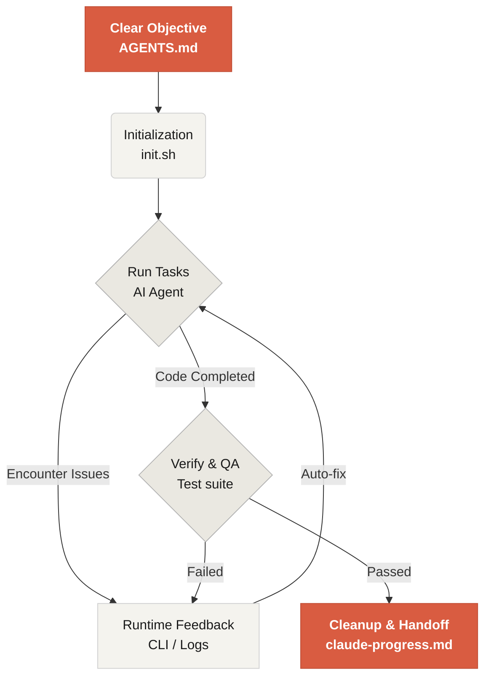

# Bienvenido a Learn Harness Engineering

Learn Harness Engineering es un curso dedicado a la ingeniería de agentes de programación con IA. Hemos estudiado y sintetizado algunas de las teorías y prácticas más avanzadas de Harness Engineering en la industria. Nuestras referencias principales incluyen:
- [OpenAI: Harness engineering: leveraging Codex in an agent-first world](https://openai.com/index/harness-engineering/)
- [Anthropic: Effective harnesses for long-running agents](https://www.anthropic.com/engineering/effective-harnesses-for-long-running-agents)
- [Anthropic: Harness design for long-running application development](https://www.anthropic.com/engineering/harness-design-long-running-apps)
- [Awesome Harness Engineering](https://github.com/walkinglabs/awesome-harness-engineering)

Mediante diseño sistemático del entorno, gestión de estado, verificación y sistemas de control, este curso enseña cómo hacer que herramientas agentic de programación como Codex y Claude Code sean realmente fiables. Aprenderás a construir funciones, corregir errores y automatizar tareas de desarrollo limitando a tu asistente de programación con reglas y límites explícitos.

## Empezar

Elige tu ruta de aprendizaje. El curso se divide en clases teóricas, proyectos prácticos y una biblioteca de recursos lista para copiar.

  <a href="./lectures/lecture-01-why-capable-agents-still-fail/" class="card">
    <h3>Lecciones</h3>
    
Comprende por qué incluso los modelos potentes fallan y aprende la teoría detrás de los harnesses eficaces.

  </a>
  <a href="./projects/" class="card">
    <h3>Proyectos</h3>
    
Práctica guiada para construir desde cero un entorno agentic fiable.

  </a>
  <a href="./resources/" class="card">
    <h3>Biblioteca de recursos</h3>
    
Plantillas listas para copiar, como AGENTS.md y feature_list.json, para tus propios repositorios.

  </a>

## El mecanismo central de un harness

Un harness no "vuelve más inteligente al modelo"; establece un **sistema de trabajo** de ciclo cerrado para el modelo. Puedes entender el flujo central con este diagrama:

## Qué aprenderás

Estos son algunos de los conceptos clave que dominarás:

<ul class="index-list">
  <li><strong>Restringir el comportamiento del agente</strong> con reglas y límites explícitos.</li>
  <li><strong>Mantener el contexto</strong> en tareas largas y de varias sesiones.</li>
  <li><strong>Evitar que los agentes</strong> declaren victoria demasiado pronto.</li>
  <li><strong>Verificar el trabajo</strong> con pruebas de pipeline completo y autorreflexión.</li>
  <li><strong>Hacer observable el runtime</strong> y facilitar su depuración.</li>
</ul>

## Siguientes pasos

Cuando entiendas los conceptos básicos, estas guías te ayudarán a profundizar:

<ul class="index-list">
  <li><a href="./lectures/lecture-01-why-capable-agents-still-fail/">Lección 01: Por qué los agentes capaces todavía fallan</a>: empieza por la teoría de harness engineering.</li>
  <li><a href="./projects/project-01-baseline-vs-minimal-harness/">Proyecto 01: Baseline vs harness mínimo</a>: recorre tu primera tarea real.</li>
  <li><a href="./resources/templates/">Plantillas</a>: toma el paquete mínimo de harness para tus propios proyectos.</li>
</ul>
