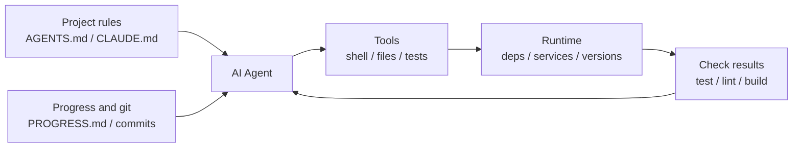

[中文版本 →](../../../zh/lectures/lecture-02-what-a-harness-actually-is/)

> Ejemplos de código: [code/](https://github.com/walkinglabs/learn-harness-engineering/blob/main/docs/es/lectures/lecture-02-what-a-harness-actually-is/code/)
> Proyecto práctico: [Project 01. Prompt-only vs. rules-first](./../../projects/project-01-baseline-vs-minimal-harness/index.md)

# Lección 02. Qué significa realmente harness

La palabra "harness" se usa mucho en los círculos de agentes de codificación con IA, pero honestamente, la mayoría de la gente se refiere a "un archivo de prompt" cuando dice harness. Eso no es un harness. Es como abrir un restaurante con nada más que ingredientes — sin estufa, sin cuchillos, sin recetas, sin flujo de emplatado. Eso no es un restaurante. Es un refrigerador.

Esta lección te da una definición precisa y práctica de harness. No una abstracción académica, sino un marco que puedes usar hoy: un harness consiste en cinco subsistemas, cada uno con responsabilidades claras y criterios de evaluación.

## Comienza con una analogía

Imagina que eres un ingeniero recién contratado que llega a un proyecto sin documentación. Sin README, sin comentarios en el código, nadie te dice cómo ejecutar las pruebas, la configuración de CI está enterrada en algún lugar. ¿Puedes escribir buen código? Tal vez — si eres lo suficientemente inteligente y paciente. Pero pasarás mucho tiempo en "averiguar de qué trata este proyecto" en lugar de "resolver el problema."

Un agente de IA enfrenta exactamente la misma situación. Y es peor — tú al menos puedes preguntarle a un colega. El agente solo puede ver los archivos que le pongas delante y los comandos que pueda ejecutar. No puede tocar a alguien en el hombro y preguntar "oye, ¿qué versión del ORM usa este proyecto?"

OpenAI enmarca el principio central como "el repositorio ES la especificación" — todo el contexto necesario debería estar en el repositorio, entregado a través de archivos de instrucciones estructurados, comandos de verificación explícitos y una organización clara de directorios. La documentación de Anthropic sobre agentes de larga duración enfatiza la persistencia del estado, las rutas de recuperación explícitas y el seguimiento estructurado del progreso. Las dos empresas se enfocan en aspectos diferentes, pero están diciendo lo mismo: **todo en la infraestructura de ingeniería fuera del modelo determina cuánta de la capacidad del modelo se realiza realmente.**

Mira algunas herramientas que ya conoces:

**Claude Code** encarna el pensamiento de harness. Lee `CLAUDE.md` de tu repositorio (estantería de recetas), puede ejecutar comandos de shell (estante de cuchillos), se ejecuta en tu entorno local (estufa), mantiene el historial de sesión (estación de preparación) y puede ejecutar pruebas y ver resultados (ventana de control de calidad). Pero si no le dices cómo ejecutar las pruebas, la ventana de control de calidad está rota — nadie sabe si el plato está completamente cocinado.

**Cursor** sigue una lógica similar. Su archivo `.cursorrules` es la estantería de recetas, la terminal es el estante de cuchillos, lee la estructura de tu proyecto y la configuración de lint como estufa. Pero la gestión de estado de Cursor es relativamente débil — cierra el IDE y vuelve a abrirlo, y el contexto anterior desaparece.

**Codex** (el agente de codificación de OpenAI) usa git worktrees para aislar el entorno de ejecución de cada tarea, junto con una pila de observabilidad local (logs, métricas, trazas), para que cada cambio se verifique en un entorno independiente. En repositorios con `AGENTS.md` y comandos de verificación claros, se desempeña mucho mejor que en repositorios "desnudos".

**AutoGPT** es el cuento de advertencia — la falta de gestión estructurada del estado lleva a la acumulación de contexto en tareas largas, y la falta de mecanismos precisos de retroalimentación hace que el agente entre en bucle. Mucha gente dice que AutoGPT "no funciona," pero en realidad es el harness de AutoGPT el que no funciona — dale a un chef una estufa rota y ni los mejores ingredientes producirán una comida.

## Conceptos clave

- **Qué es un harness**: Todo en la infraestructura de ingeniería fuera de los pesos del modelo. OpenAI destila el trabajo central del ingeniero en tres cosas: diseñar entornos, expresar intenciones y construir ciclos de retroalimentación. Anthropic llama a su Claude Agent SDK un "agent harness de propósito general."
- **El repositorio es la única fuente de verdad**: Cualquier cosa que el agente no pueda ver, para todos los efectos prácticos, no existe. OpenAI trata el repositorio como el "sistema de registro" — todo el contexto necesario debe vivir ahí, a través de archivos estructurados y una organización clara de directorios.
- **Da un mapa, no un manual**: La experiencia de OpenAI — `AGENTS.md` debería ser una página de directorio, no una enciclopedia. Alrededor de 100 líneas es suficiente. Si no cabe, divídelo en el directorio `docs/` y deja que el agente lea bajo demanda.
- **Restringe, no microgestiones**: Un buen harness usa reglas ejecutables para restringir al agente, en lugar de enumerar instrucciones una por una. OpenAI dice "haz cumplir invariantes, no microgestiones la implementación"; Anthropic descubrió que los agentes elogian confiadamente su propio trabajo, y la solución es separar "la persona que hace el trabajo" de "la persona que revisa el trabajo."
- **Elimina componentes uno a la vez**: Para cuantificar el valor de cada componente del harness, elimínalos uno a la vez y observa cuál eliminación causa la mayor caída de rendimiento. Anthropic usó este método y descubrió que a medida que los modelos se vuelven más fuertes, algunos componentes dejan de ser críticos — pero siempre surgen nuevos.

## El modelo de harness de cinco subsistemas

Volviendo a la analogía de la cocina. Una cocina completa tiene cinco áreas funcionales, y un harness tiene cinco subsistemas:



**Subsistema de instrucciones (estantería de recetas)**: Crea `AGENTS.md` (o `CLAUDE.md`) que contenga un resumen y propósito del proyecto (una frase), el stack tecnológico y versiones (Python 3.11, FastAPI 0.100+, PostgreSQL 15), comandos de primera ejecución (`make setup`, `make test`), restricciones fijas innegociables ("Todas las APIs deben usar OAuth 2.0") y enlaces a documentación más detallada.

**Subsistema de herramientas (estante de cuchillos)**: Asegúrate de que el agente tenga acceso suficiente a herramientas. No desactives el shell por "seguridad" — si el agente ni siquiera puede ejecutar `pip install`, ¿cómo se supone que trabaje? Pero tampoco abras todo — sigue principios de mínimo privilegio.

**Subsistema de entorno (estufa)**: Haz que el estado del entorno se describa a sí mismo. Usa `pyproject.toml` o `package.json` para bloquear dependencias, `.nvmrc` o `.python-version` para versiones de runtime, Docker o devcontainers para reproducibilidad.

**Subsistema de estado (estación de preparación)**: Las tareas largas necesitan seguimiento del progreso. Usa un archivo simple `PROGRESS.md` que registre: qué está hecho, qué está en progreso, qué está bloqueado. Actualízalo antes de que termine cada sesión, y léelo cuando comience la siguiente.

**Subsistema de retroalimentación (ventana de control de calidad)**: Este es el subsistema de mayor ROI. Lista explícitamente los comandos de verificación en `AGENTS.md`:
```
Verification commands:
- Tests: pytest tests/ -x
- Type check: mypy src/ --strict
- Lint: ruff check src/
- Full verification: make check (includes all above)
```

Que falte cualquier subsistema es como que falte un área funcional en la cocina — todavía puedes cocinar, pero siempre será incómodo.

**Diagnosticando la calidad del harness**: Usa "control isométrico del modelo." Mantén el modelo fijo, elimina subsistemas uno a la vez, mide cuál eliminación causa la mayor caída de rendimiento. Ese es tu cuello de botella — enfoca tu esfuerzo ahí. Como encontrar el cuello de botella en una cocina: quita la estantería de recetas y mira cuánto más lento se vuelve todo, apaga la estufa y mira el impacto.

## La historia real de un equipo

Un equipo usó GPT-4o en una aplicación frontend de TypeScript + React (~20,000 líneas de código). Pasaron por cuatro etapas — esencialmente añadiendo equipamiento de cocina pieza por pieza:

**Etapa 1 — Cocina vacía**: Solo una descripción básica del proyecto en README. 1 de 5 ejecuciones tuvo éxito (20%). Fallos principales: eligió el gestor de paquetes equivocado (npm vs yarn), no siguió las convenciones de nombres de componentes, no pudo ejecutar las pruebas.

**Etapa 2 — Estantería de recetas instalada**: Añadió `AGENTS.md` con versiones del stack tecnológico, convenciones de nombres, decisiones clave de arquitectura. La tasa de éxito subió al 60%. Los fallos restantes fueron principalmente problemas de entorno y verificación faltante.

**Etapa 3 — Ventana de control de calidad abierta**: Listó los comandos de verificación en `AGENTS.md`: `yarn test && yarn lint && yarn build`. La tasa de éxito subió al 80%.

**Etapa 4 — Estación de preparación lista**: Introdujo plantillas de archivos de progreso donde los agentes registraban el trabajo completado e incompleto en cada ejecución. La tasa de éxito se estabilizó en 80-100%.

Cuatro iteraciones, el modelo no cambió en absoluto, la tasa de éxito pasó del 20% a casi el 100%. Ese es el poder de la ingeniería de harness. No compraste ingredientes más caros — simplemente organizaste la cocina correctamente.

## Ideas clave

- Harness = Instrucciones + Herramientas + Entorno + Estado + Retroalimentación. Cinco subsistemas, como las cinco áreas funcionales de una cocina — todos esenciales.
- Si no son pesos del modelo, es harness. Tu harness determina cuánta capacidad del modelo se realiza.
- Entre los cinco subsistemas, el subsistema de retroalimentación suele tener la menor inversión y el mayor retorno. Configura bien tus comandos de verificación primero — la ventana de control de calidad es la mejora más valiosa.
- Usa "control isométrico del modelo" para cuantificar la contribución marginal de cada subsistema — no te guíes por la intuición.
- El harness se degrada como el código. Audita regularmente, paga la deuda de harness como pagas la deuda técnica.

## Lecturas adicionales

- [OpenAI: Harness Engineering](https://openai.com/index/harness-engineering/)
- [Anthropic: Effective Harnesses for Long-Running Agents](https://www.anthropic.com/engineering/effective-harnesses-for-long-running-agents)
- [HumanLayer: Harness Engineering for Coding Agents](https://humanlayer.dev/articles/harness-engineering-for-coding-agents/)
- [SWE-agent: Agent-Computer Interfaces](https://github.com/princeton-nlp/SWE-agent)
- [Thoughtworks: Harness Engineering on Technology Radar](https://www.thoughtworks.com/radar)

## Ejercicios

1. **Auditoría de harness de cinco componentes**: Toma un proyecto donde uses un agente de IA y haz una auditoría completa usando el marco de cinco componentes. Califica cada subsistema del 1 al 5. Encuentra el subsistema con la calificación más baja, dedica 30 minutos a mejorarlo y luego observa el cambio en el rendimiento del agente.

2. **Experimento de control isométrico del modelo**: Elige un modelo y una tarea desafiante. Secuencialmente elimina las instrucciones (borra AGENTS.md), elimina la retroalimentación (no proporciones comandos de verificación), elimina el estado (sin archivos de progreso) — elimina solo uno a la vez y mide la caída de rendimiento. Basándote en los resultados, clasifica la importancia de los subsistemas para tu proyecto.

3. **Análisis de affordances**: Encuentra un escenario donde el agente en tu proyecto "quiere hacer algo pero no puede" (por ejemplo, sabe que debería usar consultas parametrizadas pero no conoce los patrones ORM de tu proyecto). Analiza si esto es un Gulf of Execution (no sabe cómo) o un Gulf of Evaluation (no sabe si está bien), y luego diseña una mejora del harness para cerrar esa brecha.
