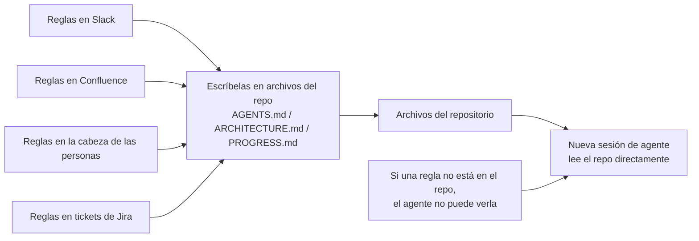
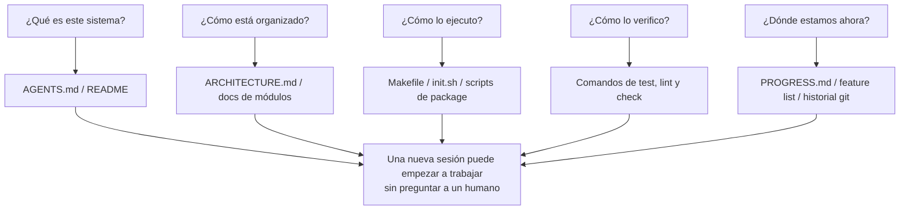

[中文版本 →](../../../zh/lectures/lecture-03-why-the-repository-must-become-the-system-of-record/)

> Ejemplos de código: [code/](https://github.com/walkinglabs/learn-harness-engineering/blob/main/docs/es/lectures/lecture-03-why-the-repository-must-become-the-system-of-record/code/)
> Proyecto práctico: [Proyecto 02. Espacio de trabajo legible para agentes](./../../projects/project-02-agent-readable-workspace/index.md)

# Lección 03. Convierte el repositorio en la fuente única de verdad

Las decisiones de arquitectura de tu equipo están dispersas entre Confluence, Slack, Jira y la cabeza de unos cuantos ingenieros senior. Para los humanos esto apenas funciona: puedes preguntar a un compañero, buscar en el historial del chat, revisar documentación. Si todo falla, puedes acorralar a alguien en la sala de descanso. Pero para un agente de IA, la información que no está en el repositorio simplemente no existe.

No es una exageración. Piensa en cuáles son realmente las entradas de un agente: prompts de sistema y descripciones de tarea, contenidos de archivos del repositorio y salidas de herramientas. Eso es todo. Tu historial de Slack, tickets de Jira, páginas de Confluence y esa decisión de arquitectura que hablaste con un compañero tomando café un viernes por la tarde: el agente no ve nada de eso. No puede "ir a preguntar a alguien" ni "buscar en el historial del chat". Es un ingeniero encerrado dentro del repositorio; de todo lo que queda fuera no sabe nada.

Así que la pregunta es: ¿vas a darle a este ingeniero un buen mapa?

## Qué debe estar en el mapa

OpenAI lo dice sin rodeos: **la información que no existe en el repo no existe para el agente.** Llaman a esto el principio "repo as spec": el propio repositorio es el documento de especificación con mayor autoridad.

La documentación de Anthropic sobre agentes de larga duración apunta en la misma dirección: el estado persistente es una condición necesaria para la continuidad en tareas largas. La recuperabilidad del conocimiento entre sesiones determina directamente las tasas de éxito. Y ese estado debe existir en el repositorio, porque es el único almacenamiento estable y accesible que tiene el agente.

Puedes pensar: "Nuestro equipo es pequeño, el conocimiento está en la cabeza de todos y funciona bien". Para humanos, quizá. Pero si usas un agente, acepta este hecho: el agente no puede preguntar a personas. Todo lo que necesita saber debe estar escrito y colocado donde pueda encontrarlo.

No se trata de "escribir más documentación". Se trata de "poner la información de decisión en el lugar correcto". Un `ARCHITECTURE.md` de 50 líneas dentro de `src/api/` es diez mil veces más útil que un documento de diseño de 500 páginas en Confluence que nadie mantiene. Es como un mapa de oficina dibujado a mano y pegado a tu escritorio frente a un plano arquitectónico precioso guardado bajo llave: el primero está ahí cuando lo necesitas; el segundo puede ser técnicamente superior, pero es inútil en el momento.

## Visibilidad del conocimiento



¿Cómo compruebas si tu mapa es suficientemente bueno? Ejecuta una "prueba de arranque en frío": abre una sesión de agente completamente nueva usando solo el contenido del repo y mira si puede responder cinco preguntas básicas:



Si no puede responder, el mapa tiene zonas en blanco. Donde el mapa está en blanco, el agente adivina: las malas conjeturas se convierten en bugs y adivinar demasiado desperdicia contexto. Y cada sesión nueva vuelve a adivinarlo todo. El coste de adivinar siempre es mayor que el coste de dibujar bien el mapa desde el principio.

## Conceptos clave

- **Knowledge Visibility Gap**: La proporción del conocimiento total del proyecto que NO está en el repositorio. Cuanto mayor sea la brecha, mayor será la tasa de fallos del agente. ¿Cuánto conocimiento implícito sobre este proyecto vive en tu cabeza? Cuéntalo todo y luego mira cuánto llegó al repo: la diferencia es tu brecha de visibilidad.
- **System of Record**: El repositorio de código como fuente autorizada para decisiones de proyecto, restricciones de arquitectura, estado de ejecución y estándares de verificación. El repo tiene la última palabra; lo demás no cuenta. Como un mapa que marca "carretera cerrada": no irás por ahí. Pero si esa información solo está en la cabeza de alguien, tendrás que preguntarle cada vez.
- **Cold-Start Test**: Las cinco preguntas anteriores. Cuántas puede responder indica qué tan completo es tu mapa.
- **Discovery Cost**: Cuánto presupuesto de contexto consume el agente para encontrar una información clave en el repo. Cuanto más escondida esté, mayor será el coste de descubrimiento y menos presupuesto quedará para la tarea real. Esconder información crítica en un README diez niveles de directorios abajo es como guardar el extintor en una caja fuerte del sótano: existe, pero no lo encuentras cuando lo necesitas.
- **Knowledge Decay Rate**: La proporción de entradas de conocimiento que se vuelven obsoletas por unidad de tiempo. Que la documentación deje de estar sincronizada con el código es el enemigo principal, peor incluso que no tener documentación.
- **ACID Analogy**: Aplicar principios de transacciones de base de datos (Atomicity, Consistency, Isolation, Durability) a la gestión del estado de agentes. Lo desarrollamos abajo.

## Cómo dibujar un buen mapa

**Principio 1: El conocimiento vive junto al código.** Una regla sobre autenticación de endpoints API debe estar junto al código de API, no enterrada en un documento global gigante. Pon un documento corto en cada directorio de módulo explicando responsabilidades, interfaces y restricciones especiales. Como etiquetas de estantería en una biblioteca: si quieres libros de historia, vas directo al estante "Historia". No necesitas buscar por toda la biblioteca.

**Principio 2: Usa un archivo de entrada estandarizado.** `AGENTS.md` (o `CLAUDE.md`) es la página de aterrizaje del agente. No necesita contener toda la información, pero debe permitir que el agente responda rápido tres preguntas: "Qué es este proyecto", "Cómo lo ejecuto" y "Cómo lo verifico". 50-100 líneas bastan.

**Principio 3: Mínimo pero completo.** Cada pieza de conocimiento debe tener un caso de uso claro. Si eliminar una regla no afecta la calidad de decisión del agente, esa regla no debería existir. Pero cada pregunta de la prueba de arranque en frío debe tener respuesta. Es un equilibrio delicado: ni demasiado, ni demasiado poco, solo lo suficiente.

**Principio 4: Actualiza junto con el código.** Vincula las actualizaciones de conocimiento a los cambios de código. El enfoque más simple: coloca los documentos de arquitectura en el directorio del módulo correspondiente. Cuando modificas código, ves el documento de forma natural. Después de cambios de código, CI puede recordarte revisar si la documentación necesita actualización.

**Estructura concreta del repo**:

```
project/
├── AGENTS.md              # Entry: project overview, run commands, hard constraints
├── src/
│   ├── api/
│   │   ├── ARCHITECTURE.md  # API layer architecture decisions
│   │   └── ...
│   ├── db/
│   │   ├── CONSTRAINTS.md   # Database operation hard constraints
│   │   └── ...
│   └── ...
├── PROGRESS.md             # Current progress: done, in-progress, blocked
└── Makefile                # Standardized commands: setup, test, lint, check
```

## Gestionar estado de agentes con principios ACID

Esta analogía viene de la gestión de transacciones en bases de datos. Puede parecer una complicación excesiva, pero en realidad da un marco muy práctico:

- **Atomicity**: Cada "operación lógica" (por ejemplo, "añadir nuevo endpoint y actualizar tests") recibe un commit de git. Si falla a mitad de camino, `git stash` para revertir. Todo o nada: no hay "medio hecho".
- **Consistency**: Define predicados de verificación de "estado consistente": todos los tests pasan, lint no reporta errores. El agente ejecuta verificación después de cada operación; los estados intermedios inconsistentes no se commitean. Como una transferencia bancaria: no puedes debitar sin acreditar.
- **Isolation**: Cuando varios agentes trabajan en paralelo, diseña archivos de estado que eviten condiciones de carrera. Enfoque simple: cada agente usa su propio archivo de progreso, o se usan ramas de git para aislar. Dos cocineros no pueden sazonar la misma olla al mismo tiempo: ¿quién se responsabiliza si queda demasiado salada?
- **Durability**: El conocimiento crítico del proyecto vive en archivos versionados por git. El estado temporal puede quedarse en memoria de sesión, pero el conocimiento entre sesiones debe persistirse en archivos. Lo que está en tu cabeza no cuenta; solo cuenta lo que está escrito.

## Una historia real de transformación

Un equipo mantenía una plataforma de e-commerce con unos 30 microservicios. Las decisiones de arquitectura (protocolos de comunicación entre servicios, estrategias de consistencia de datos, reglas de versionado de API) estaban dispersas entre Confluence (parcialmente obsoleto), Slack (difícil de buscar), la cabeza de algunos ingenieros senior (no escalable) y comentarios de código esporádicos (no sistemáticos).

Después de introducir agentes de IA, el 70% de las tareas requería intervención humana. Casi todos los fallos implicaban que el agente violaba alguna restricción implícita de "todo el mundo lo sabe pero nadie lo escribió". Es como un empleado nuevo a quien nadie le dijo "tienes que publicar tu pedido de almuerzo en el chat del grupo": adivina mal, le regañan, pero después de regañarlo nadie escribe la regla.

El equipo ejecutó una transformación:
1. Creó `AGENTS.md` en la raíz del repo con resumen del proyecto, versiones del stack técnico y restricciones globales duras
2. Añadió `ARCHITECTURE.md` en cada directorio de microservicio describiendo responsabilidades, interfaces y dependencias
3. Creó un `CONSTRAINTS.md` centralizado con restricciones duras en lenguaje explícito "MUST/MUST NOT"
4. Añadió `PROGRESS.md` en cada directorio de servicio para seguir el estado actual del trabajo

Después de la transformación, el mismo agente podía responder todas las preguntas clave del proyecto en arranque en frío, y la calidad de finalización de tareas mejoró significativamente.

## Ideas clave

- El conocimiento que no está en el repo no existe para el agente. Poner decisiones críticas en el repo es la inversión más básica en harness: dibuja un buen mapa para no perderte.
- Usa la "prueba de arranque en frío" para evaluar la calidad del repo: ¿puede una sesión fresca responder cinco preguntas básicas usando solo el contenido del repo?
- El conocimiento debe estar cerca del código, ser mínimo pero completo y actualizarse junto con el código. No se trata de escribir más docs, sino de poner la información en el lugar correcto.
- Usa principios ACID para el estado de agentes: commits atómicos, verificación de consistencia, aislamiento de concurrencia y conocimiento crítico durable.
- La degradación del conocimiento es el mayor enemigo. La documentación desincronizada del código es más peligrosa que no tener documentación: envía al agente en la dirección equivocada mientras cree que va bien.

## Lecturas adicionales

- [OpenAI: Harness Engineering](https://openai.com/index/harness-engineering/)
- [Anthropic: Effective Harnesses for Long-Running Agents](https://www.anthropic.com/engineering/effective-harnesses-for-long-running-agents)
- [Infrastructure as Code — Martin Fowler](https://martinfowler.com/bliki/InfrastructureAsCode.html)
- [ADR: Architecture Decision Records](https://adr.github.io/)
- [The Twelve-Factor App](https://12factor.net/)

## Ejercicios

1. **Prueba de arranque en frío**: Abre una sesión de agente completamente nueva en tu proyecto (sin contexto verbal, solo contenido del repo). Hazle cinco preguntas: ¿Qué es este sistema? ¿Cómo está organizado? ¿Cómo lo ejecuto? ¿Cómo lo verifico? ¿Cuál es el progreso actual? Registra lo que no puede responder y mejora el repo hasta que pueda.

2. **Cuantificación de externalización de conocimiento**: Lista todas las decisiones y restricciones importantes para el trabajo de desarrollo en tu proyecto. Marca cada una como dentro o fuera del repo. Calcula tu Knowledge Visibility Gap (proporción fuera del repo). Haz un plan para bajarlo por debajo del 10%.

3. **Evaluación ACID**: Evalúa la gestión de estado de tu proyecto usando la analogía ACID de esta lección. Atomicity: ¿pueden las operaciones del agente revertirse limpiamente? Consistency: ¿existe verificación de "estado consistente"? Isolation: ¿los agentes concurrentes se pisan entre sí? Durability: ¿todo el conocimiento entre sesiones está persistido?
