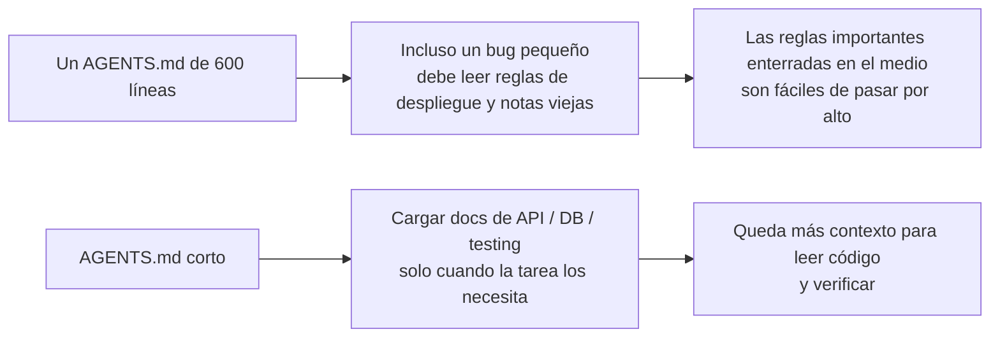
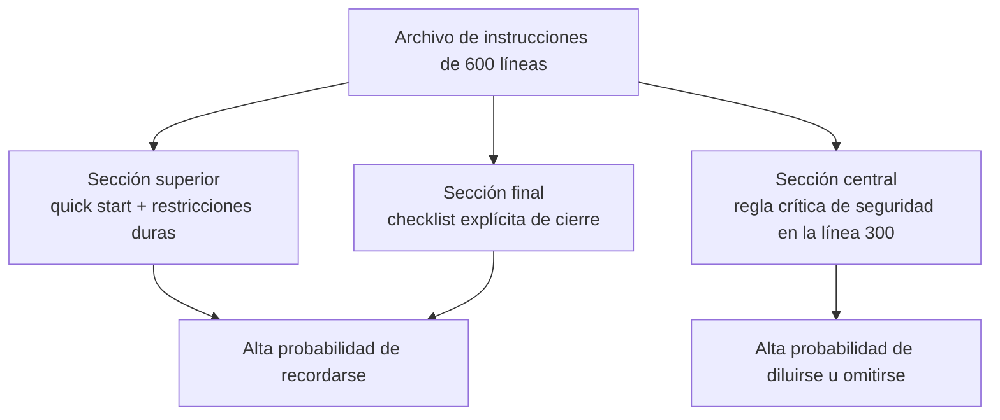

[中文版本 →](../../../zh/lectures/lecture-04-why-one-giant-instruction-file-fails/)

> Ejemplos de código: [code/](https://github.com/walkinglabs/learn-harness-engineering/blob/main/docs/es/lectures/lecture-04-why-one-giant-instruction-file-fails/code/)
> Proyecto práctico: [Proyecto 02. Espacio de trabajo legible para agentes](./../../projects/project-02-agent-readable-workspace/index.md)

# Lección 04. Divide las instrucciones entre archivos

Te tomaste en serio la ingeniería de harness. Creaste un `AGENTS.md` y metiste en él todas las reglas, restricciones y lecciones aprendidas que se te ocurrieron. Un mes después el archivo tenía 300 líneas; dos meses después, 450; tres meses después, 600. Entonces notas que el rendimiento del agente está empeorando: para corregir un bug simple, consume mucho contexto procesando instrucciones de despliegue irrelevantes; una restricción de seguridad crítica enterrada en la línea 300 se ignora por completo; tres reglas contradictorias de estilo hacen que el agente elija una al azar cada vez.

Esta es la trampa del "archivo gigante de instrucciones". Es como sobrecargar una maleta: todo parece útil, así que lo metes hasta que la cremallera está a punto de reventar. Para encontrar ropa interior de cambio tienes que vaciar toda la bolsa. Cargas una maleta llena, pero en realidad usas quizá un tercio de lo que hay dentro.

## El ciclo vicioso de fondo

El ciclo vicioso más común funciona así: el agente comete un error, tú dices "añadamos una regla para evitar esto", la agregas a `AGENTS.md`, funciona temporalmente, el agente comete otro error, agregas otra regla, repites, y el archivo se hincha sin control.

No es culpa tuya. Es una reacción muy natural: añadir una regla cada vez que algo sale mal parece razonable, como meter una cosa más en la bolsa cada vez que sales de casa "por si acaso". Pero el efecto acumulado es desastroso. Veamos qué se rompe exactamente.

**El presupuesto de contexto se consume vivo.** La ventana de contexto del agente es finita. Supón que tu agente tiene una ventana de 200K tokens (un tamaño estándar en Claude). Un archivo de instrucciones inflado puede consumir 10-20K tokens. ¿Parece que todavía queda mucho espacio? Pero una tarea compleja puede requerir leer decenas de archivos fuente, la salida de herramientas también ocupa contexto y el historial de conversación se acumula. Para cuando el agente necesita entender el código, el presupuesto ya está apretado, como una maleta tan llena de cosas "por si acaso" que ya no cabe el portátil.

**Perdido en el medio.** El artículo "Lost in the Middle" (Liu et al., 2023) demostró claramente que los LLM usan la información situada en medio de textos largos con mucha menos eficacia que la del principio o el final. Tu `AGENTS.md` tiene 600 líneas, y en la línea 300 dice "todas las consultas de base de datos deben usar consultas parametrizadas": es una restricción fuerte de seguridad. Pero está enterrada en el medio, y el agente casi seguro la ignorará. Como ese protector solar en el fondo de una maleta demasiado llena: sabes que está ahí, buscas tres veces, no lo encuentras y terminas comprando otro.

**Conflictos de prioridad.** El archivo mezcla restricciones no negociables ("never use eval()"), guías de diseño importantes ("prefer functional style") y una lección histórica concreta ("la semana pasada se corrigió una fuga de memoria en WebSocket, vigilar patrones similares"). Estas tres reglas tienen niveles de importancia completamente distintos, pero se ven iguales en el archivo. El agente no tiene una señal fiable para distinguirlas, como si tu pasaporte y el cable de carga estuvieran mezclados en la maleta sin forma de saber qué es más urgente.

**Deterioro de mantenimiento.** Los archivos grandes son inherentemente difíciles de mantener. Las instrucciones obsoletas rara vez se eliminan, porque las consecuencias de borrarlas son inciertas ("quizá algo depende de esta regla"), mientras que añadir instrucciones nuevas parece gratis. Resultado: el archivo solo crece, nunca se reduce, y la relación señal-ruido cae continuamente. Es exactamente como la acumulación de deuda técnica en software.

**Acumulación de contradicciones.** Instrucciones añadidas en momentos distintos empiezan a contradecirse: una dice "usar TypeScript strict mode", otra dice "algunos archivos legacy permiten tipos any". El agente elige al azar cuál seguir cada vez. Como si tu madre dijera "abrígate" y tu padre dijera "no te pongas demasiada ropa", y tú te quedaras en la puerta sin saber a quién escuchar.

## Conceptos clave

- **Instruction Bloat**: Cuando un archivo de instrucciones ocupa más del 10-15% de la ventana de contexto, empieza a desplazar presupuesto que debería usarse para leer código y razonar sobre la tarea. Un `AGENTS.md` de 600 líneas puede consumir 10.000-20.000 tokens, es decir, 8-15% de una ventana de 128K antes de que el agente empiece.
- **Lost in the Middle Effect**: La investigación de Liu et al. en 2023 mostró que los LLM usan la información en medio de textos largos mucho peor que la información del principio o del final. Una restricción crítica enterrada en la línea 300 de un archivo de 600 líneas tiene alta probabilidad de ser ignorada en la práctica.
- **Instruction Signal-to-Noise Ratio (SNR)**: La proporción de instrucciones del archivo que son relevantes para la tarea actual. Verse obligado a leer 50 líneas de instrucciones de despliegue durante un arreglo de bug es bajo SNR.
- **Routing File**: Un archivo de entrada corto cuya función principal es dirigir al agente hacia documentación más detallada, no contenerlo todo. 50-200 líneas bastan.
- **Progressive Disclosure**: Dar primero la información general y los detalles cuando hacen falta. Un buen diseño de harness se parece a un buen diseño de UI: no vuelca todas las opciones al usuario de una vez.
- **Priority Ambiguity**: Cuando todas las instrucciones aparecen con el mismo formato y en el mismo lugar, el agente no puede distinguir restricciones duras no negociables de guías suaves.

## Arquitectura de instrucciones





## Cómo dividirlo

El principio central: mantén a mano la información que se necesita con frecuencia, guarda aparte la que se necesita ocasionalmente y elimina lo que no vas a usar.

El archivo de entrada `AGENTS.md` debe mantenerse en 50-200 líneas y contener solo lo que se usa con más frecuencia: resumen del proyecto (una o dos frases), comandos de primera ejecución (`make setup && make test`), restricciones globales duras (no más de 15 reglas no negociables) y enlaces a documentos temáticos (descripción de una línea + condición de aplicabilidad).

```markdown
# AGENTS.md

## Resumen del proyecto
Python 3.11 FastAPI backend, PostgreSQL 15 database.

## Quick Start
- Install: `make setup`
- Test: `make test`
- Full verification: `make check`

## Hard Constraints
- All APIs must use OAuth 2.0 authentication
- All database queries must use SQLAlchemy 2.0 syntax
- All PRs must pass pytest + mypy --strict + ruff check

## Topic Docs
- [API Design Patterns](docs/api-patterns.md) — Required reading when adding endpoints
- [Database Rules](docs/database-rules.md) — Required when modifying database operations
- [Testing Standards](docs/testing-standards.md) — Reference when writing tests
```

Cada documento temático debe tener 50-150 líneas, organizado por tema en `docs/` o junto al módulo correspondiente. El agente solo lo lee cuando hace falta. Como cubos de organización dentro de una maleta: ropa interior en uno, artículos de aseo en otro, cargadores en un tercero. Encontrar algo no requiere vaciar toda la bolsa.

Parte de la información conviene ponerla directamente en el código: definiciones de tipos, comentarios de interfaz, explicaciones en archivos de configuración. El agente la ve naturalmente al leer el código, así que no hace falta duplicarla en instrucciones.

Cada instrucción debería tener una fuente ("¿por qué se añadió esta regla?"), una condición de aplicabilidad ("¿cuándo hace falta?") y una condición de caducidad ("¿en qué circunstancias se puede eliminar?"). Audita con regularidad y elimina entradas obsoletas, redundantes o contradictorias. Gestiona tus instrucciones como gestionas dependencias de código: las dependencias no usadas deben borrarse, de lo contrario solo ralentizan el sistema.

Si una instrucción debe estar en el archivo de entrada, ponla arriba o abajo, nunca en el medio. El efecto "lost in the middle" nos dice que los LLM usan mucho mejor la información de los extremos que la del centro. Pero el mejor enfoque es mover las instrucciones a documentos temáticos que se cargan bajo demanda.

OpenAI y Anthropic apoyan implícitamente el enfoque de división. OpenAI dice que los archivos de entrada deben ser "cortos y orientados al enrutamiento"; Anthropic dice que la información de control para agentes de larga duración debe ser "concisa y de alta prioridad". Ambos dicen lo mismo: no metas todo en un solo archivo. Una maleta necesita organización, no fuerza bruta.

## Ejemplo real

El `AGENTS.md` de un equipo SaaS creció de 50 a 600 líneas. Mezclaba versiones del stack técnico, estándares de código, notas históricas de bugs, guías de uso de API, procedimientos de despliegue y preferencias personales de miembros del equipo: la maleta entera estaba a punto de reventar.

El rendimiento del agente empezó a caer de forma visible: durante arreglos de bugs simples gastaba mucho contexto procesando instrucciones de despliegue irrelevantes; la restricción de seguridad "todas las consultas de base de datos deben usar consultas parametrizadas" estaba enterrada en la línea 300 y se ignoraba con frecuencia; tres reglas contradictorias de estilo producían comportamiento aleatorio.

El equipo ejecutó una "reorganización de maleta":
1. `AGENTS.md` se redujo a 80 líneas: solo resumen del proyecto, comandos de ejecución y 15 restricciones globales duras
2. Se crearon documentos temáticos: `docs/api-patterns.md` (120 líneas), `docs/database-rules.md` (60 líneas), `docs/testing-standards.md` (80 líneas)
3. Se añadieron enlaces a esos documentos en el archivo de enrutamiento
4. Las notas históricas se convirtieron en tests o se eliminaron

Después de refactorizar, la tasa de éxito del mismo conjunto de tareas pasó de 45% a 72%. El cumplimiento de la restricción de seguridad pasó de 60% a 95%, porque se movió del medio del archivo a la parte superior del archivo de enrutamiento y dejó de perderse en el medio.

## Ideas clave

- "Añadir una regla" alivia el dolor a corto plazo y envenena a largo plazo. Antes de añadir una regla, pregunta: ¿esto estaría mejor en un documento temático? No sigas metiendo cosas en la maleta.
- El archivo de entrada es un router, no una enciclopedia. 50-200 líneas con resumen, restricciones duras y enlaces.
- Aprovecha el efecto "lost in the middle": la información importante va arriba o abajo; la información menos importante se mueve a documentos temáticos.
- Gestiona el crecimiento de instrucciones como deuda técnica. Auditorías periódicas; cada instrucción necesita fuente, condición de aplicabilidad y condición de caducidad.
- Tras dividir, mejora el SNR y el agente gasta más presupuesto de contexto en la tarea real, no en procesar instrucciones irrelevantes.

## Lecturas adicionales

- [OpenAI: Harness Engineering](https://openai.com/index/harness-engineering/)
- [Anthropic: Effective Harnesses for Long-Running Agents](https://www.anthropic.com/engineering/effective-harnesses-for-long-running-agents)
- [Lost in the Middle: How Language Models Use Long Contexts](https://arxiv.org/abs/2307.03172)
- [HumanLayer: Harness Engineering for Coding Agents](https://humanlayer.dev/articles/harness-engineering-for-coding-agents/)
- [Nielsen Norman Group: Progressive Disclosure](https://www.nngroup.com/articles/progressive-disclosure/)

## Ejercicios

1. **Auditoría de SNR**: Toma tu archivo actual de instrucciones de entrada y lista todas las instrucciones. Elige 5 tipos comunes de tareas y marca si cada instrucción es relevante para cada tarea. Calcula el SNR por tipo de tarea. Las instrucciones que son ruido para la mayoría de tareas deben moverse a documentos temáticos.

2. **Refactor de progressive disclosure**: Si tienes un archivo de instrucciones de más de 300 líneas, divídelo en: (a) un archivo de enrutamiento de menos de 100 líneas, (b) 3-5 documentos temáticos. Ejecuta el mismo conjunto de tareas (al menos 5) antes y después, y compara tasas de éxito.

3. **Verificación de lost in the middle**: En un archivo de instrucciones largo, coloca una restricción crítica arriba, en el medio y abajo respectivamente, ejecutando el mismo conjunto de tareas cada vez (al menos 5 ejecuciones por posición). Mira si cambia la tasa de cumplimiento. Puede sorprenderte la fuerza del efecto de posición.
