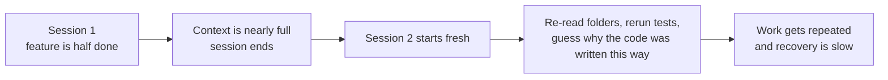
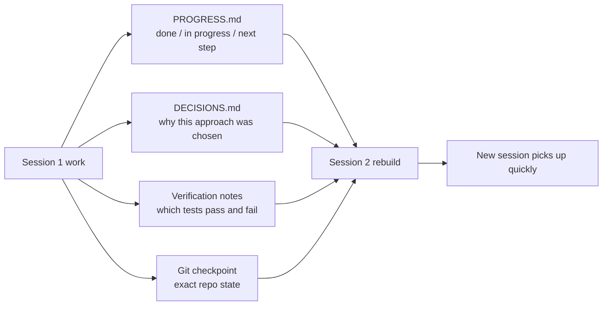

[中文版本 →](../../../zh/lectures/lecture-05-why-long-running-tasks-lose-continuity/)

> Ejemplos de código: [code/](https://github.com/walkinglabs/learn-harness-engineering/blob/main/docs/es/lectures/lecture-05-why-long-running-tasks-lose-continuity/code/)
> Proyecto práctico: [Project 03. Multi-session continuity](./../../projects/project-03-multi-session-continuity/index.md)

# Lección 05. Mantén vivo el contexto entre sesiones

Le pides a Claude Code que implemente una funcionalidad completa. Se ejecuta durante 30 minutos, hace la mayor parte del trabajo, pero el contexto se está agotando. Inicias una nueva sesión para continuar — y descubres que no recuerda qué decisiones se tomaron la última vez, por qué se eligió la opción A sobre la B, qué archivos ya fueron modificados o en qué estado están las pruebas. Dedica 15 minutos a re-explorar el proyecto, y podría ser inconsistente con el enfoque anterior.

Imagina si fueras un artesano que olvida todo cada mañana al despertar. Tendrías que volver a familiarizarte con todo el sitio de construcción — qué pared está a medio construir, por qué se eligieron ladrillos rojos en lugar de azules, dónde llegaron las tuberías. Peor aún, podrías arrancar una ventana que ya fue instalada ayer, simplemente porque no recordabas que ya estaba hecha.

Esta es exactamente la dificultad que enfrentan los agentes de codificación con IA en tareas entre sesiones. Esta lección explica por qué los agentes "se quedan en blanco" durante tareas largas, y cómo la persistencia estructurada del estado puede hacerlos como un artesano que lleva un diario confiable — sigue siendo amnésico, pero el diario lo recuerda todo.

## Las ventanas de contexto no son infinitas

Las ventanas de contexto son finitas. Esto no se resuelve con actualizaciones de modelos — incluso si los tamaños de ventana crecen a 1M tokens, las tareas complejas seguirán agotándolas. Porque los agentes no solo están generando código; están entendiendo bases de código, rastreando su propio historial de decisiones, procesando la salida de herramientas y manteniendo el contexto de conversación. Toda esta información crece más rápido que la expansión de la ventana.

Un problema más profundo: la información que produce el agente no tiene la misma importancia. Los pasos de razonamiento intermedio contienen el "por qué" de las decisiones — por qué se eligió la opción B sobre la A, por qué esta biblioteca en lugar de aquella, por qué se omitió una optimización particular. La salida final solo contiene el "qué" — el código en sí. Las estrategias de compaction suelen preservar lo segundo pero pierden lo primero. La siguiente sesión ve el código pero no sabe por qué está escrito de esa manera, y podría "optimizar" una decisión de diseño deliberada.

Anthropic descubrió algo fascinante en su investigación de agentes de larga duración: cuando los agentes perciben que el contexto se está agotando, exhiben un comportamiento de "convergencia prematura" — apresurándose a terminar el trabajo actual, saltando pasos de verificación o eligiendo una solución simple sobre la óptima. Es como darse cuenta de que se está acabando el tiempo en un examen y adivinar rápidamente las preguntas de opción múltiple restantes. Anthropic llama a esto "ansiedad de contexto."

## Flujo de continuidad entre sesiones

Sin artefactos de continuidad, cada nueva sesión es un desastre:



Con artefactos de continuidad, las nuevas sesiones pueden retomar rápidamente:



## Conceptos clave

- **Las ventanas de contexto son finitas**: No importa qué tamaño de ventana se reclame (128K, 200K, 1M), las tareas largas eventualmente las agotarán. Tras el agotamiento, se requiere compaction (perdiendo información) o reset (nueva sesión). Ambas pierden algo.
- **Artefactos de continuidad**: Archivos de estado persistido que permiten a una nueva sesión retomar sin ambigüedad donde la anterior lo dejó. La forma básica: registro de progreso + registro de verificación + próximas acciones. Ese diario del artesano.
- **Costo de reconstrucción**: El tiempo que una nueva sesión necesita para alcanzar un estado ejecutable. Los buenos harness pueden comprimir el costo de reconstrucción de 15 minutos a 3 minutos.
- **Deriva (Drift)**: La brecha entre la comprensión del agente y el estado real del repositorio de código. Cada límite de sesión introduce deriva; sin control, se acumula.
- **Ansiedad de contexto**: Un fenómeno observado por Anthropic — los agentes exhiben un comportamiento de convergencia prematura cuando se acercan a los límites de contexto percibidos, terminando tareas temprano para evitar pérdida de información. Es una ansiedad irracional por los recursos.
- **Compaction vs reset**: La compaction resume el contexto dentro de la misma sesión (conserva el "qué," puede perder el "por qué"); el reset abre una nueva sesión reconstruyendo desde artefactos persistidos (limpio pero depende de la completitud de los artefactos).

## Qué sucede cuando se rompe la continuidad

La sesión anterior gastó un presupuesto significativo de contexto analizando tres enfoques y eligiendo la opción B. El agente de esta sesión no conoce ese análisis y podría volver a decidir basándose en información incompleta — potencialmente eligiendo la opción A. Como el artesano amnésico que no recuerda por qué se eligieron los ladrillos rojos, mira los azules hoy y piensa que son más bonitos, y derriba la pared de ayer para reconstruirla.

Peor aún es el trabajo duplicado. El agente no está seguro de si cierto trabajo ya fue completado y lo hace de nuevo. O peor — hace la mitad, descubre un conflicto con la implementación existente y tiene que rehacerlo. En un sitio de construcción, dos equipos no pueden construir la misma pared simultáneamente — pero sin registros de progreso, el nuevo equipo no tiene idea de que alguien ya está trabajando en ella.

A lo largo de varias sesiones, la dirección de implementación puede haberse desviado silenciosamente de los requisitos originales. Cada nueva sesión tiene una comprensión ligeramente diferente de los objetivos del proyecto. Como un juego de teléfono roto — después de que diez personas pasan el mensaje, "recógeme un café" podría convertirse "cómprame una cafetera."

También está la brecha de verificación. Los resultados de verificación de la sesión anterior (qué pruebas pasan, cuáles fallan, por qué fallan) no fueron registrados. La nueva sesión tiene que volver a ejecutar toda la verificación para entender el estado actual. Cada sesión vuelve a diagnosticar desde cero, desperdiciando contexto precioso cada vez.

Tanto OpenAI como Anthropic enfatizan la persistencia estructurada del estado en su documentación. El artículo de ingeniería de harness de OpenAI trata el repositorio como un "registro operativo" — los resultados de cada operación deberían dejar evidencia rastreable en el repositorio. La documentación de agentes de larga duración de Anthropic recomienda específicamente "handoff files" — documentos estructurados que contienen el estado actual, problemas conocidos y próximas acciones.

## Un diario para el artesano amnésico

Enfoque central: **Trata al agente como un ingeniero brillante con amnesia.** Antes de que "termine su turno," debe escribir información crítica para que el agente del siguiente "turno" pueda retomar rápidamente.

**Herramienta 1: Archivo de progreso (PROGRESS.md).** El artefacto de continuidad más básico — el núcleo del diario:

```markdown
# Project Progress

## Current State
- Latest commit: abc1234 (feat: add user preferences endpoint)
- Test status: 42/43 passing (test_pagination_edge_case failing)
- Lint: passing

## Completed
- [x] User model and database migration
- [x] Basic CRUD endpoints
- [x] Auth middleware integration

## In Progress
- [ ] Pagination feature (90% - edge case test failing)

## Known Issues
- test_pagination_edge_case returns 500 on empty result sets
- Need to confirm whether deleted users should appear in listings

## Next Steps
1. Fix pagination edge case bug
2. Add "include deleted users" query parameter
3. Update API documentation
```

**Herramienta 2: Registro de decisiones (DECISIONS.md).** Registra decisiones de diseño importantes y sus razones. No necesitas documentos de diseño detallados — solo "qué decisión, por qué, cuándo" — las notas en el diario:

```markdown
# Design Decisions

## 2024-01-15: Use Redis for user preferences caching
- Reason: High read frequency (every API call), small data size
- Rejected alternative: PostgreSQL materialized view (high change frequency makes maintenance cost not worthwhile)
- Constraint: Cache TTL of 5 minutes, active invalidation on write
```

**Herramienta 3: Commits de git como puntos de control.** Haz commit después de completar cada unidad atómica de trabajo. Los mensajes de commit deberían explicar qué se hizo y por qué. Estos son snapshots de estado gratuitos y automáticamente versionados.

**Herramienta 4: init.sh o flujo de inicialización del harness.** Especifica en `AGENTS.md` las rutinas de "entrada" y "salida":

```markdown
## At session start (clock in)
1. Read PROGRESS.md for current state
2. Read DECISIONS.md for important decisions
3. Run make check to confirm repo is in consistent state
4. Continue from PROGRESS.md "Next Steps" section

## Before session end (clock out)
1. Update PROGRESS.md
2. Run make check to confirm consistent state
3. Commit all completed work
```

**Estrategia mixta**: No todas las tareas necesitan un reset de contexto. Las tareas cortas (menos de 30 minutos) pueden completarse dentro de una sesión. Las tareas largas (que abarcan sesiones) deben usar archivos de progreso y registros de decisiones para la continuidad. Criterio de decisión: si una tarea necesita más del 60% de la ventana, comienza a preparar la entrega.

### Profundización en la ansiedad de contexto

La investigación de marzo de 2026 de Anthropic reveló además las manifestaciones específicas de la ansiedad de contexto: en Sonnet 4.5, cuando el contexto se acerca al límite de la ventana, el agente muestra un fuerte comportamiento de "convergencia prematura." Es como darse cuenta de que casi se acaba el tiempo en un examen y llenar rápidamente respuestas aleatorias en las opciones múltiples.

Dos estrategias abordan esto:

**Compaction**: Resumir la conversación temprana dentro de la misma sesión. Ventaja: mantiene la continuidad, el agente puede ver el "qué." Desventaja: el "por qué" se pierde a menudo en los resúmenes — por qué se eligió la opción B sobre la A, por qué se omitió una optimización particular. Más críticamente, la compaction no elimina la ansiedad de contexto — el agente sabe que el contexto fue grande alguna vez, y psicológicamente todavía tiende a apresurarse hacia el cierre.

**Reset de contexto**: Limpiar completamente el contexto, abrir una nueva sesión, reconstruir desde artefactos persistidos. Ventaja: estado mental limpio — la nueva sesión no tiene la ansiedad de "se me está acabando el tiempo." Desventaja: depende de la completitud de los artefactos de entrega. Si el diario falta información crítica, la nueva sesión puede perder tiempo yendo en la dirección equivocada.

Datos reales de Anthropic: para Sonnet 4.5, la ansiedad de contexto es lo suficientemente severa que la compaction por sí sola no es suficiente — el reset de contexto se convierte en un componente crítico del diseño del harness. Pero para Opus 4.5, este comportamiento está muy reducido, y la compaction puede gestionar el contexto sin depender de resets. Esto significa: **el diseño del harness necesita un entendimiento específico del modelo objetivo, no una plantilla de talla única.**

> Fuente: [Anthropic: Harness design for long-running application development](https://www.anthropic.com/engineering/harness-design-long-running-apps)

## Ejemplo del mundo real

Un agente fue encargado de implementar un sistema de blog con autenticación de usuarios — 12 puntos de funcionalidad, estimadas 5 sesiones necesarias.

**Línea base sin el diario**: La sesión 1 implementó el modelo de usuario y las rutas básicas. La sesión 2 comenzó sin que el agente recordara el contrato de interfaz del middleware de autenticación, dedicando ~15 minutos a inferir la intención de diseño anterior. Para la sesión 3, la deriva acumulada hizo que el agente comenzara a reimplementar funcionalidades ya completadas. Para la sesión 5, el repositorio contenía mucho código redundante pero la funcionalidad central de autenticación todavía no había pasado las pruebas end-to-end. Solo 7 de 12 puntos de funcionalidad completados, 3 con problemas ocultos de corrección. Como el artesano que nunca escribe en su diario — para el día cinco, el sitio de construcción es un caos, algunas paredes construidas dos veces, algunas que debieron construirse nunca se empezaron.

**Con el diario**: Usando archivos de progreso, registros de decisiones, registros de verificación y puntos de control de git. El informe de estado se actualizó automáticamente al final de cada sesión. El costo de reconstrucción de la sesión 2 bajó a ~3 minutos. Para la sesión 5, los 12 puntos de funcionalidad fueron completados y verificados.

Comparación cuantitativa: tiempo de reconstrucción reducido ~78%, tasa de completitud de funcionalidades del 58% al 100%, tasa de defectos ocultos del 43% al 8%. El artesano sigue siendo amnésico, pero con el diario, cada día comienza donde el anterior se detuvo, no desde cero.

## Ideas clave

- Las ventanas de contexto son un recurso finito. Las tareas largas abarcarán sesiones, y las sesiones perderán información — como el artesano que olvida cada día, esto es una realidad objetiva.
- La solución no son ventanas más grandes — es mejor persistencia del estado. Archivos de progreso + registros de decisiones + puntos de control de git — dale al artesano amnésico un diario confiable.
- Trata al agente como un ingeniero con amnesia: antes de "terminar el turno," escribe qué se hizo, por qué y qué sigue.
- El costo de reconstrucción es la métrica clave. Los buenos harness deberían llevar a las nuevas sesiones a un estado ejecutable en menos de 3 minutos.
- Estrategia mixta: tareas cortas dentro de las sesiones, tareas largas con artefactos estructurados para la continuidad.

## Lecturas adicionales

- [Anthropic: Effective Harnesses for Long-Running Agents](https://www.anthropic.com/engineering/effective-harnesses-for-long-running-agents)
- [OpenAI: Harness Engineering](https://openai.com/index/harness-engineering/)
- [Lost in the Middle: How Language Models Use Long Contexts](https://arxiv.org/abs/2307.03172)
- [Claude Code Documentation](https://docs.anthropic.com/es/docs/claude-code)
- [HumanLayer: Harness Engineering for Coding Agents](https://humanlayer.dev/articles/harness-engineering-for-coding-agents/)

## Ejercicios

1. **Medición de pérdida de continuidad**: Elige una tarea de desarrollo que necesite al menos 3 sesiones. Sin proporcionar ningún artefacto de continuidad, registra al inicio de cada sesión cuánto contexto gasta el agente en "averiguar qué pasó la última vez." Después de cada sesión, crea un archivo de progreso y deja que la siguiente sesión comience desde él. Compara los costos de reconstrucción con y sin archivos de progreso.

2. **Diseño de plantilla de entrega**: Diseña una plantilla de entrega mínima con cuatro campos: estado del repositorio (commit hash), estado de ejecución (tasa de aprobación de pruebas), bloqueadores, próximas acciones. Deja que una sesión de agente completamente nueva restaure el estado del proyecto usando solo esta plantilla. Registra las ambigüedades encontradas durante la restauración, itera para mejorar la plantilla.

3. **Experimento de estrategia mixta**: En una tarea de desarrollo de 5 sesiones, compara tres estrategias: (a) siempre iniciar sesiones nuevas + archivos de progreso, (b) hacer lo más posible en una sesión (compaction de contexto), (c) estrategia mixta (tareas cortas dentro de la sesión, tareas largas entre sesiones + archivos de progreso). Compara tiempo de reconstrucción, tasa de completitud de funcionalidades y consistencia de decisiones.
