[中文版本 →](../../../zh/lectures/lecture-06-why-initialization-needs-its-own-phase/)

> Ejemplos de código: [code/](https://github.com/walkinglabs/learn-harness-engineering/blob/main/docs/es/lectures/lecture-06-why-initialization-needs-its-own-phase/code/)
> Proyecto práctico: [Project 03. Multi-session continuity](./../../projects/project-03-multi-session-continuity/index.md)

# Lección 06. Inicializa antes de cada sesión del agente

Inicias una nueva sesión de agente y dices "añade una funcionalidad de búsqueda." Salta directamente a codificar — un entusiasmo admirable. Después de 20 minutos descubre que el framework de pruebas no está configurado correctamente, dedica otros 10 a arreglar eso, luego el formato del script de migración de base de datos está mal, más ajustes. La funcionalidad de búsqueda eventualmente se añade, pero toda la sesión fue ineficiente — la mayor parte del tiempo se fue en "averiguar cómo funciona este proyecto" en lugar de escribir la funcionalidad de búsqueda.

El mejor enfoque: antes de dejar que el agente comience a trabajar, usa una fase separada para preparar el entorno base, hacer pasar los comandos de verificación y entender la estructura del proyecto. Es como construir una casa — no viertes los cimientos y levantas paredes simultáneamente. Si lo haces, las paredes se levantan antes de que los cimientos hayan curado, y todo el edificio tiene que ser demolido y empezado de nuevo. Vierte los cimientos primero, deja que curen, luego construye las paredes — limpio y eficiente.

Esta lección explica por qué la inicialización debe ser una fase separada, no mezclada con la implementación.

## Cimientos y paredes: dos trabajos fundamentalmente diferentes

La inicialización y la implementación tienen objetivos de optimización completamente diferentes. La fase de implementación optimiza para: maximizar la cantidad y calidad de las funcionalidades verificadas. La fase de inicialización optimiza para: maximizar la fiabilidad y eficiencia de toda la implementación posterior.

Cuando mezclas inicialización e implementación, el agente enfrenta un problema de optimización multi-objetivo — construir infraestructura simultáneamente y escribir código de funcionalidades. Sin una priorización explícita, el agente naturalmente tiende a escribir código (porque eso es una salida directamente visible) mientras sacrifica la infraestructura (porque su valor solo se muestra en sesiones posteriores). Es como decirle a un equipo de construcción que simultáneamente vierta los cimientos y construya las paredes — probablemente se apresurarán a construir paredes porque las paredes son visibles y demostrables. Pero una casa con cimientos defectuosos tiene problemas sistémicos a largo plazo.

## Ciclo de vida de la inicialización

```mermaid
flowchart TB
    subgraph Wrong["Mixed session (wrong)"]
        W1["Start feature work immediately"] --> W2["Discover env and test gaps mid-task"]
        W2 --> W3["Accumulate unverified code"]
        W3 --> W4["Next session must rediscover project state"]
    end

    subgraph Right["Dedicated initialization (right)"]
        R1["Session 1: environment runnable"] --> R2["Example test passing"]
        R2 --> R3["Bootstrap contract + task list written"]
        R3 --> R4["Clean checkpoint committed"]
        R4 --> R5["Later sessions start directly on verified tasks"]
    end
```



## Qué sucede cuando los mezclas

El problema más directo: los cimientos no se asientan correctamente. El agente gasta el 80% de su esfuerzo en código de funcionalidades y el 20% configurando casualmente algo de infraestructura. El framework de pruebas está configurado pero nunca verificado, las reglas de lint están establecidas pero demasiado laxas, no se creó ningún archivo de progreso. Estos defectos no son obvios en la primera sesión (porque el agente todavía recuerda lo que hizo), pero salen a la luz en la segunda sesión — el nuevo agente no sabe cómo ejecutar, probar o en qué punto están las cosas. Cimientos chapuceros, edificio inestable.

Un costo más oculto es la "acumulación no verificada" — el código de funcionalidades escrito antes de que el framework de pruebas esté configurado es código sin verificación. Cuando finalmente vuelves para añadir pruebas a ese código, podrías descubrir que el diseño estaba mal desde el principio — si lo hubieras sabido, lo habrías implementado de manera diferente. Como colocar baldosas sobre hormigón húmedo — cuando descubres que el suelo no está nivelado, todas las baldosas tienen que ser levantadas y rehechas.

El presupuesto de sesión también se está desperdiciando. El trabajo de inicialización (configurar entornos, preparar pruebas, entender la estructura del proyecto) consume un presupuesto significativo, dejando menos para la implementación real de funcionalidades. Resultado: la primera sesión solo completa la mitad de las funcionalidades, y la segunda sesión tiene que empezar de nuevo a entender el proyecto. Presupuesto gastado en los cimientos, pero los cimientos tampoco están sólidos — ningún objetivo cumplido.

El problema más fácilmente pasado por alto son las minas de suposiciones implícitas. Las decisiones que el agente toma durante la inicialización (qué framework de pruebas, cómo organizar directorios, gestión de dependencias) — si no se registran explícitamente, las sesiones posteriores no pueden entender estas decisiones. Peor aún, las sesiones posteriores podrían tomar decisiones contradictorias. El primer equipo de construcción usó cimientos de hormigón, el segundo equipo no lo sabe y clavó pilotes de madera en ellos — los cimientos se agrietan.

La investigación de Anthropic sobre desarrollo de aplicaciones de larga duración recomienda explícitamente separar la inicialización de la implementación. Sus datos experimentales: los proyectos que usan una fase de inicialización dedicada mostraron un 31% más de tasa de completitud de funcionalidades en escenarios de múltiples sesiones comparado con enfoques mixtos. La perspectiva clave — el tiempo invertido en la fase de inicialización se recupera completamente en las siguientes 3-4 sesiones. Cuanto más sólidos los cimientos, más rápido se levantan las paredes.

La guía de ingeniería de harness de Codex de OpenAI también enfatiza el principio del "repositorio como registro operativo" — establece una estructura operativa clara desde la primera ejecución, o cada nueva sesión tendrá que re-inferir las convenciones del proyecto.

## Conceptos clave

- **Fase de inicialización**: La primera fase en el ciclo de vida del agente — sin implementación de funcionalidades, solo estableciendo los prerrequisitos para todas las fases de implementación posteriores. La salida no es código, es infraestructura.
- **Contrato de bootstrap**: Las condiciones bajo las cuales un proyecto puede ser operado sin ambigüedad por una nueva sesión de agente — puede iniciar, puede probar, puede ver el progreso, puede retomar los siguientes pasos. Cuatro condiciones, todas requeridas.
- **Arranque en frío vs arranque en caliente**: El arranque en frío es desde un directorio vacío donde el agente debe adivinar la estructura del proyecto; el arranque en caliente es desde una plantilla o proyecto existente donde la infraestructura ya está en su lugar. El arranque en caliente supera ampliamente al arranque en frío — como empezar a trabajar en un sitio con agua corriente y electricidad versus comenzar desde un terreno baldío.
- **Preparación para entrega**: El proyecto está en un estado en cualquier momento dado donde un agente nuevo puede tomar el control. No se necesita explicación verbal — solo el contenido del repositorio.
- **Tiempo hasta la primera verificación**: El tiempo desde el inicio del proyecto hasta que el primer punto de funcionalidad pasa la verificación. Esta es la métrica central para medir la eficiencia de inicialización.
- **Usabilidad posterior**: La mejor medida de la calidad de la inicialización — la proporción de sesiones posteriores que pueden ejecutar tareas exitosamente sin depender de conocimiento implícito.

## Cómo hacer bien la inicialización

**Trata la inicialización como una fase dedicada.** La primera sesión solo hace inicialización — nada de código de funcionalidades de negocio. La inicialización produce:

**1. Entorno ejecutable.** El proyecto arranca, las dependencias están instaladas, sin problemas de entorno. Cimientos vertidos, sin grietas.

**2. Framework de pruebas verificable.** Al menos una prueba de ejemplo pasa. Esto demuestra que el framework de pruebas en sí está correctamente configurado — como poner un pilar sobre los cimientos para demostrar que puede soportar peso.

**3. Documento de contrato de bootstrap.** Un documento claro que indica a las sesiones posteriores:
```markdown
# Initialization Contract

## Start Commands
- Install dependencies: `make setup`
- Start dev server: `make dev`
- Run tests: `make test`
- Full verification: `make check`

## Current State
- All dependencies installed and locked
- Test framework configured (Vitest + React Testing Library)
- Example test passing (1/1)
- Lint rules configured (ESLint + Prettier)

## Project Structure
- src/ — Source code
- src/components/ — React components
- src/api/ — API client
- tests/ — Test files
```

**4. Desglose de tareas.** Divide todo el proyecto en una lista ordenada de tareas, cada una con criterios de aceptación claros:
```markdown
# Task Breakdown

## Task 1: User Authentication Basics
- Implement JWT auth middleware
- Add login/register endpoints
- Acceptance: pytest tests/test_auth.py all passing

## Task 2: User Profile Page
- Implement user profile CRUD
- Add profile edit form
- Acceptance: pytest tests/test_profile.py all passing

## Task 3: Search Feature
- ...
```

**5. Commit de git como punto de control.** Después de que se completa la inicialización, haz commit de un punto de control limpio. Todo el trabajo posterior comienza desde este punto de control.

**Estrategia de arranque en caliente**: No comiences desde un directorio vacío. Usa una plantilla de proyecto (create-react-app, fastapi-template, etc.) para preestablecer la estructura de directorios estándar, la configuración de dependencias y el framework de pruebas. Integra los pasos comunes de inicialización en la plantilla, dejando solo el trabajo de inicialización específico del proyecto. Como empezar a trabajar en un sitio con agua corriente y electricidad — diez mil veces mejor que comenzar desde un terreno baldío.

**Criterios de finalización de inicialización**: No "cuánto código se escribió," sino si se cumplen las cuatro condiciones del contrato de bootstrap — puede iniciar, puede probar, puede ver el progreso, puede retomar los siguientes pasos. Usa esta lista de verificación para validar la inicialización:

```markdown
## Initialization Acceptance Checklist
- [ ] `make setup` succeeds from scratch
- [ ] `make test` has at least one passing test
- [ ] A new agent session can answer "how to run" and "how to test" from repo contents alone
- [ ] Task breakdown file exists with at least 3 tasks
- [ ] Everything committed to git
```

## Ejemplo del mundo real

Dos enfoques de inicialización para un proyecto frontend de React:

**Enfoque mixto (verter cimientos y construir paredes simultáneamente)**: El agente simultáneamente creó el scaffolding del proyecto e implementó la primera funcionalidad en la sesión 1. Al final de la sesión, el repositorio tenía código ejecutable pero: sin documentación explícita de comandos de inicio/prueba, sin archivo de seguimiento de progreso, sin desglose de tareas. La sesión 2 dedicó ~20 minutos a inferir la estructura del proyecto, el framework de pruebas y el proceso de construcción — como un nuevo equipo de construcción que llega a un sitio sin saber cuánto avanzaron los cimientos o dónde van las tuberías, teniendo que cavar agujeros uno por uno para averiguarlo.

**Inicialización dedicada (cimientos primero)**: La sesión 1 solo hizo inicialización — creó la estructura de directorios desde una plantilla, configuró el framework de pruebas (Vitest + React Testing Library), escribió y verificó una prueba de ejemplo, creó el documento de contrato de bootstrap y el archivo de desglose de tareas, hizo commit del punto de control inicial. El tiempo de reconstrucción de la sesión 2 fue menos de 3 minutos, y comenzó a trabajar directamente desde la lista de tareas — el equipo llega, echa un vistazo al plano y sabe exactamente dónde retomar.

Comparación del ciclo completo del proyecto: el tiempo total de reconstrucción del enfoque mixto (a través de todas las sesiones) fue ~60% más que el enfoque de inicialización dedicada. Los 20 minutos extra gastados en inicialización fueron recuperados muchas veces en las sesiones posteriores. Como cimientos sólidos haciendo que las paredes se levanten más rápido — lento es rápido.

## Ideas clave

- La inicialización y la implementación tienen diferentes objetivos de optimización — mezclarlas solo arrastra a ambas hacia abajo. Vierte los cimientos primero, luego construye las paredes.
- La salida de la inicialización no es código, es infraestructura: entorno ejecutable, pruebas verificables, contrato de bootstrap, desglose de tareas.
- Valida la inicialización con las cuatro condiciones del contrato de bootstrap: puede iniciar, puede probar, puede ver el progreso, puede retomar los siguientes pasos.
- El arranque en caliente supera al arranque en frío. Usa plantillas de proyecto para preestablecer infraestructura estandarizada.
- El tiempo invertido en inicialización se recupera completamente en las siguientes 3-4 sesiones. Esto no es un costo extra — es una inversión inicial. Cuanto más sólidos los cimientos, más rápido se levanta el edificio.

## Lecturas adicionales

- [Anthropic: Effective Harnesses for Long-Running Agents](https://www.anthropic.com/engineering/effective-harnesses-for-long-running-agents)
- [OpenAI: Harness Engineering](https://openai.com/index/harness-engineering/)
- [HumanLayer: Harness Engineering for Coding Agents](https://humanlayer.dev/articles/harness-engineering-for-coding-agents/)
- [Infrastructure as Code — Martin Fowler](https://martinfowler.com/bliki/InfrastructureAsCode.html)
- [SWE-agent: Agent-Computer Interfaces](https://github.com/princeton-nlp/SWE-agent)

## Ejercicios

1. **Diseño de contrato de bootstrap**: Escribe un contrato de bootstrap completo para un proyecto que estés desarrollando. Luego abre una sesión de agente completamente nueva, muéstrale solo el contenido del repositorio (sin contexto verbal), y haz que intente iniciar el proyecto, ejecutar las pruebas y entender el progreso actual. Registra cada problema que encuentre — cada uno corresponde a una cláusula faltante en tu contrato de bootstrap.

2. **Experimento comparativo**: Elige un proyecto nuevo de complejidad moderada. Enfoque A: deja que el agente inicialice y haga la primera implementación simultáneamente. Enfoque B: dedica una sesión a la inicialización, comienza la implementación en la sesión 2. Después de 4 sesiones, compara: tiempo hasta la primera verificación, costo de reconstrucción, tasa de completitud de funcionalidades.

3. **Lista de verificación de aceptación de inicialización**: Diseña una lista de verificación de aceptación de inicialización para tu proyecto. Haz que una sesión de agente nueva ejecute cada elemento de la lista y registra cuáles pasan y cuáles fallan. Los elementos que fallan son donde tu harness necesita fortalecerse.
