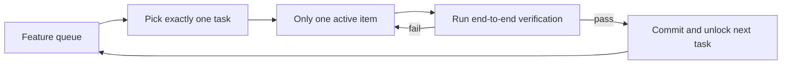
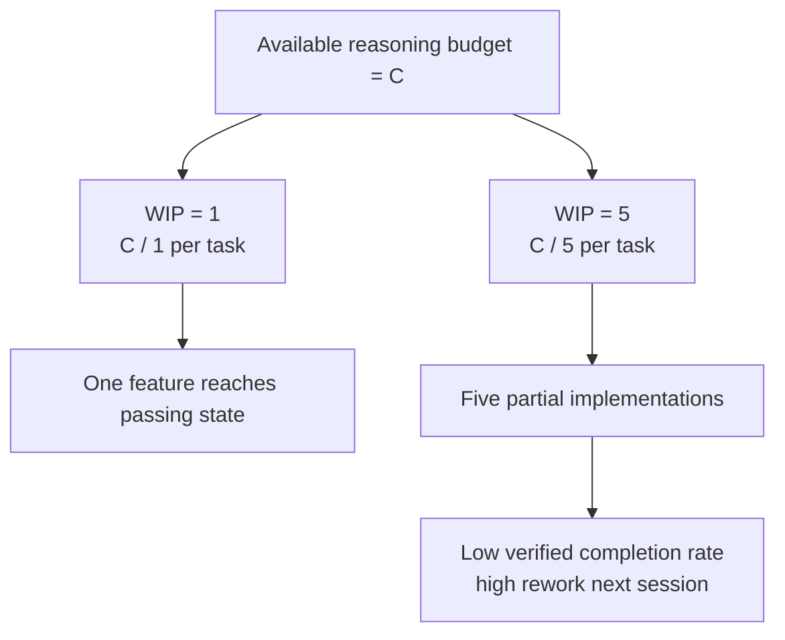

[中文版本 →](../../../zh/lectures/lecture-07-why-agents-overreach-and-under-finish/)

> Ejemplos de código: [code/](https://github.com/walkinglabs/learn-harness-engineering/blob/main/docs/es/lectures/lecture-07-why-agents-overreach-and-under-finish/code/)
> Proyecto práctico: [Project 04. Runtime feedback and scope control](./../../projects/project-04-incremental-indexing/index.md)

# Lección 07. Define límites claros para las tareas del agente

Le dices a Claude Code que "añada autenticación de usuarios a este proyecto," y comienza a modificar el esquema de la base de datos, escribir rutas, cambiar componentes del frontend y — de paso — refactorizar el middleware de manejo de errores. Dos horas después verificas: 12 archivos modificados, 800 líneas de código nuevo, y ni una sola funcionalidad funciona end-to-end.

Morder más de lo que puedes masticar — este dicho se aplica a los agentes de IA especialmente bien. Los agentes nacen con un impulso de "hacer un poco más" — ven cosas relacionadas y simplemente las manejan de paso, como alguien que va al supermercado por una botella de salsa de soya y sale empujando un carrito lleno. El problema es, los humanos que compran demasiado solo desperdician dinero; los agentes haciendo demasiadas cosas simultáneamente significa que ninguna se hace bien.

El blog de ingeniería de Anthropic "Effective harnesses for long-running agents" establece claramente: cuando los prompts son demasiado amplios, los agentes tienden a "comenzar múltiples cosas a la vez" en lugar de "terminar una cosa primero." Las prácticas de ingeniería de Codex de OpenAI encontraron lo mismo — las tareas sin controles explícitos de alcance ven las tasas de completitud desplomarse. Este no es un problema del modelo — es un problema del harness. No trazaste el límite.

## La atención es un recurso finito

Esto no es una metáfora — es matemática. Supón que la capacidad de contexto del agente es C y activa k tareas simultáneamente. Cada tarea recibe un promedio de C/k recursos de razonamiento. Cuando C/k cae por debajo del umbral mínimo necesario para completar una sola tarea, ninguna se termina. Tu estómago solo tiene cierto tamaño — mete diez dumplings de una vez y no los digerirás todos, solo tendrás diez casos de indigestión.

El comportamiento real de Claude Code es revelador. Pídele que "añada registro de usuarios" y podría:

1. Crear un modelo de User
2. Escribir la ruta de registro
3. Notar que necesita verificación de email, así que añadir un servicio de correo
4. Ver que las contraseñas necesitan hashing, así que incorporar bcrypt
5. Notar que el manejo de errores es inconsistente, así que refactorizar el middleware de errores global
6. Ver que la estructura de archivos de prueba está desordenada, así que reorganizar el directorio

Seis pasos después, cada uno está a medio hacer. Sin verificación end-to-end, acoplamiento complejo entre el código a medio cocinar, y la siguiente sesión que tenga que recoger los pedazos estará completamente perdida. Como alguien cocinando seis platos simultáneamente — cada plato está en la sartén pero ninguno ha sido emplatado. Todos se queman.

Los datos experimentales de Anthropic apoyan esto directamente: los agentes que usan una estrategia de "pequeño siguiente paso" (equivalente a WIP=1) muestran un 37% más de tasa de completitud de tareas que los agentes que usan prompts amplios. Más interesante aún, el número de líneas de código generadas por los agentes está débilmente correlacionado negativamente con la completitud real de funcionalidades — más código escrito, menos funcionalidades completadas. Morder más de lo que puedes masticar, comprobado con datos.

## Flujo de trabajo WIP=1





## Conceptos clave

- **Sobrealcance (Overreach)**: El agente activa más tareas en una sola sesión de lo óptimo. Es cuantificable — hacer 5 funcionalidades con 0 pasando end-to-end es sobrealcance.
- **Sub-completitud (Under-finish)**: La proporción de tareas que pasan verificación end-to-end, de todas las tareas activadas, cae por debajo del umbral. Código escrito pero pruebas sin pasar es sub-completitud.
- **Límite WIP (Work-in-Progress Limit)**: De la metodología Kanban. Idea central: limitar cuántas tareas están en progreso a la vez. Para agentes, WIP=1 es el valor predeterminado más seguro — termina una antes de comenzar la siguiente. Como un buffet — no llenes tu plato, termina un plato y luego vuelve por el siguiente.
- **Evidencia de completitud**: La condición verificable que una tarea debe satisfacer para pasar de "en progreso" a "terminada." Sin esto, los agentes sustituyen "el código se ve bien" por "el comportamiento pasa las pruebas."
- **Superficie de alcance (Scope Surface)**: Una estructura DAG donde cada nodo es una unidad de trabajo y las aristas son dependencias. Los estados se limitan a cuatro: not_started, active, blocked, passing.
- **Presión de completitud**: La fuerza restrictiva que el harness ejerce a través de límites WIP y requisitos de evidencia de completitud, forzando al agente a terminar la tarea actual antes de comenzar una nueva.

## El sobrealcance y la sub-completitud son simbióticos

Estos dos problemas no son independientes — se amplifican mutuamente. El sobrealcance diluye la atención, la atención diluida causa sub-completitud, y el código a medio terminar que queda aumenta la complejidad del sistema, lo que a su vez impulsa más sobrealcance en la siguiente tarea. Un ciclo vicioso.

En términos de Kanban: la Ley de Little nos dice L = lambda * W. Si el trabajo en progreso L es demasiado alto (haciendo demasiadas cosas a la vez), el tiempo de entrega W para cada tarea inevitablemente aumenta. Para los agentes, esto significa que cada funcionalidad tarda más desde el inicio hasta la completitud verificada, y la probabilidad de fallo crece.

Este es un problema antiguo en el mundo humano también — Steve McConnell documentó en *Rapid Development* que el scope creep es la principal causa de fracaso de proyectos. Pero los humanos al menos tienen la intuición de "ya he hecho suficiente." Los agentes no tienen ninguna. Generar la siguiente idea le cuesta al modelo casi nada en tokens extra — escribir "déjame arreglar esto también mientras estoy aquí" apenas se nota — pero cada modificación adicional diluye la atención del agente. Como un buffet donde cada plato extra tiene un costo marginal cercano a cero, pero tu estómago solo tiene cierta capacidad.

## Cómo hacerlo bien

### 1. Haz cumplir WIP=1

Este es el método más directo y efectivo. En tu harness, dile al agente explícitamente: **solo una tarea tiene permitido estar en estado "active" en cualquier momento.** En el CLAUDE.md de Claude Code o el AGENTS.md de Codex, escribe:

```
## Work Rules
- Work on one feature at a time
- Only start the next feature after the current one passes end-to-end verification
- Don't "also refactor" feature B while implementing feature A
```

Como comer en un buffet — un plato a la vez, termínalo antes de volver por más.

### 2. Define evidencia de completitud explícita para cada tarea

Terminado no es "el código está escrito" — es "la verificación del comportamiento pasa." En tu feature list, cada entrada necesita un comando de verificación:

```
F01: User Registration
  Verification: curl -X POST /api/register -d '{"email":"test@example.com","password":"123456"}' | jq .status == 201
  State: passing
```

### 3. Externaliza la superficie de alcance

Usa un archivo legible por máquina (JSON o Markdown) para registrar todos los estados de las tareas. Cualquier nueva sesión puede leer este archivo y saber inmediatamente: ¿qué tarea está activa? ¿Qué comportamiento cuenta como terminado? ¿Qué verificaciones han pasado?

### 4. Monitorea la tasa de completitud verificada

El harness debería rastrear continuamente el VCR (Verified Completion Rate) = tareas verificadas / tareas activadas. Bloquea nuevas activaciones de tareas cuando VCR < 1.0.

## Caso del mundo real

Un proyecto de API REST con 8 funcionalidades, se compararon dos estrategias:

**Modo buffet (sin restricciones)**: El agente activa 5 funcionalidades simultáneamente en la sesión 1. Produce ~800 líneas en 12 archivos. Tasa de aprobación de pruebas end-to-end: 20% — solo el registro de usuarios funciona. Las otras 4 funcionalidades: esquema de base de datos creado pero falta lógica de validación, rutas definidas pero devolviendo formatos de respuesta incorrectos. Como alguien cocinando seis platos a la vez, solo uno es apenas comestible. Al final de la sesión 3, solo 3 de 8 funcionalidades completadas.

**Modo plato único (WIP=1)**: El agente trabaja solo en el registro de usuarios en la sesión 1. Produce ~200 líneas en 4 archivos. Pruebas end-to-end: 100% pasando. Hace commit de una implementación limpia y verificada. Al final de la sesión 4, 7 de 8 funcionalidades completadas (la 8va bloqueada por una dependencia externa).

Resultado: menos código total (800 vs 1200 líneas) pero más código efectivo. Tasa de completitud: 87.5% vs 37.5%. Toma un bocado a la vez, y realmente comes más.

## Ideas clave

- **WIP=1 es la configuración predeterminada segura para harness de agentes** — termina una, luego comienza la siguiente; no intentes paralelizar. No te puedes poner gordo en un bocado.
- **La evidencia de completitud debe ser ejecutable** — "el código se ve bien" no cuenta; "curl devuelve 201" sí.
- **La superficie de alcance debe externalizarse como archivo** — no solo mencionada en la conversación, sino registrada en un formato legible por máquina en el repositorio.
- **El sobrealcance y la sub-completitud son simbióticos** — resolver uno resuelve el otro.
- **"Haz menos pero termina" siempre vence a "haz más pero deja a medias"** — las líneas de código del agente y la tasa de completitud de funcionalidades están negativamente correlacionadas. La calidad siempre vence a la cantidad.

## Lecturas adicionales

- [Effective harnesses for long-running agents - Anthropic](https://www.anthropic.com/engineering/effective-harnesses-for-long-running-agents) — Blog de ingeniería de Anthropic, discusión detallada de la estrategia de "pequeño siguiente paso"
- [Harness Engineering - OpenAI](https://openai.com/index/harness-engineering/) — Tratamiento completo de ingeniería de harness de OpenAI
- [Kanban: Successful Evolutionary Change - David Anderson](https://www.goodreads.com/book/show/1070822.Kanban) — La fuente clásica sobre límites WIP
- [Rapid Development - Steve McConnell](https://www.goodreads.com/book/show/125171.Rapid_Development) — Datos empíricos sobre el scope creep como principal causa de fracaso de proyectos

## Ejercicios

1. **Atomización de tareas**: Toma un requisito amplio (por ejemplo, "implementa un sistema de gestión de usuarios") y divídelo en al menos 5 unidades de trabajo atómicas. Para cada unidad, especifica: (a) una descripción de comportamiento única, (b) un comando de verificación ejecutable, (c) dependencias. Verifica si la descomposición satisface la restricción WIP=1.

2. **Experimento comparativo**: Ejecuta el mismo proyecto dos veces — una sin restricciones, otra con WIP=1 impuesto. Compara: tasa de completitud verificada, líneas totales de código, ratio de código efectivo.

3. **Auditoría de evidencia de completitud**: Revisa la salida de una ejecución reciente de un agente, clasificando cada cambio de código como "comportamiento completado," "comportamiento incompleto" o "scaffolding." Añade los comandos de verificación faltantes para cada comportamiento incompleto.
