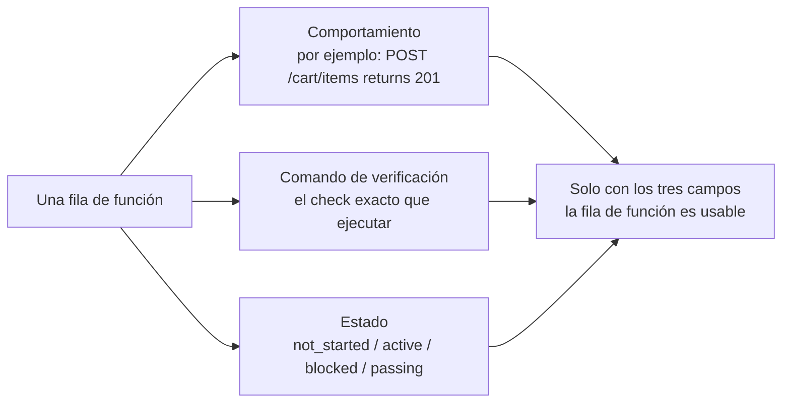
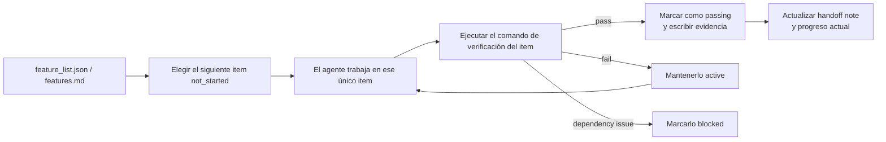

[中文版本 →](../../../zh/lectures/lecture-08-why-feature-lists-are-harness-primitives/)

> Ejemplos de código: [code/](https://github.com/walkinglabs/learn-harness-engineering/blob/main/docs/es/lectures/lecture-08-why-feature-lists-are-harness-primitives/code/)
> Proyecto práctico: [Proyecto 04. Feedback en runtime y control de alcance](./../../projects/project-04-incremental-indexing/index.md)

# Lección 08. Usa listas de funciones para limitar al agente

Pides a un agente que construya un sitio de e-commerce. Cuando termina, te dice "done". Miras el código: la autenticación de usuario funciona, pero el botón de checkout del carrito no hace nada y el flujo de pago no está conectado. El problema: nunca le dijiste qué significa "done", así que usó su propio estándar: "escribí mucho código y parece bastante completo".

Para muchas personas, las listas de funciones son solo una nota: escribes cosas para no olvidarlas y luego las dejas de lado. Pero en el mundo del harness, una lista de funciones no es una nota para humanos: es la columna vertebral de todo el harness. El scheduler depende de ella para elegir tareas, el verifier para juzgar la finalización y el handoff reporter para generar resúmenes. Si rompes la columna, todo el cuerpo queda paralizado.

Anthropic y OpenAI enfatizan lo mismo: **los artefactos deben externalizarse.** El estado de las funciones debe vivir en un archivo machine-readable dentro del repo, no en texto de conversación sin estructura.

## Los agentes no saben qué significa "done"

Ni Claude Code ni Codex saben automáticamente qué quieres decir con "done". Dices "añade una función de carrito de compras", y el modelo puede interpretar eso como "escribe un componente Cart y un método addToCart". Pero tú querías "el usuario puede navegar productos, añadirlos al carrito y completar el checkout end-to-end". Sin una lista de funciones, esta brecha de entendimiento persiste. El agente usa su estándar implícito, normalmente "el código no tiene errores de sintaxis obvios". Lo que necesitas es verificación conductual end-to-end. Es como pedirle a un amigo que compre fruta: dices "compra algo de fruta" y vuelve con limones. Su fruta y tu fruta no son la misma fruta.

Mira esta nota de progreso común:

```
Did user auth, shopping cart mostly done, still need payments
```

¿Puede una nueva sesión de agente responder preguntas a partir de esta nota? ¿Qué significa "mostly done"? ¿Qué tests pasó el carrito? ¿Qué bloquea los pagos? La respuesta a todo es "nadie lo sabe". Es como decirle al médico "me duele el estómago, últimamente más o menos bien": ¿qué medicina puede recetar?

Resultado: la nueva sesión gasta 20 minutos infiriendo el estado del proyecto y quizá reimplementa funciones ya terminadas. Los datos de ingeniería de Anthropic muestran que buenos registros de progreso reducen el tiempo de diagnóstico al iniciar sesión entre 60% y 80%.

## Máquina de estados de funciones





## Conceptos clave

- **Las listas de funciones son primitives del harness**: No son "herramientas opcionales de planificación", sino estructuras de datos fundacionales de las que dependen los demás componentes del harness. Como las estructuras de tablas en una base de datos: no puedes decir "omitamos las primary keys".
- **Estructura triple**: Cada función es una triple `(descripción de comportamiento, comando de verificación, estado actual)`. Si falta cualquier elemento, el item está incompleto.
- **Modelo de máquina de estados**: Cada función tiene cuatro estados: `not_started`, `active`, `blocked`, `passing`. Las transiciones de estado las controla el harness, no las cambia libremente el agente.
- **Pass-state gating**: La única forma de pasar de `active` a `passing` es que el comando de verificación se ejecute con éxito. Esto es irreversible: una vez `passing`, no vuelve atrás. Como aprobar un examen: aprobaste, no puedes cambiar la nota retroactivamente.
- **Single source of truth**: Toda la información sobre "qué hay que hacer" debe derivarse de una sola lista de funciones. Sin contradicciones entre la lista y el historial de conversación.
- **Back-pressure**: El número de funciones que aún no han pasado es la presión que el harness ejerce sobre el agente. Presión cero = proyecto completo.

## Por qué las listas de funciones deben ser "primitives"

Los documentos son para que los lean humanos; los primitives son para que los ejecuten sistemas. Los documentos pueden ignorarse; los primitives no pueden saltarse.

Piensa en restricciones de triggers de base de datos frente a checks en la capa de aplicación: las primeras las impone el motor de base de datos, ningún SQL puede saltarlas; las segundas dependen de la corrección del código de aplicación y pueden omitirse por accidente. Como primitive del harness, la lista de funciones sirve a cuatro componentes:

1. **Scheduler**: Lee estados y elige la siguiente función `not_started`. Como un sistema de planificación de producción en fábrica.
2. **Verifier**: Ejecuta comandos de verificación y decide si permite transiciones de estado. Como inspección de calidad.
3. **Handoff reporter**: Genera automáticamente resúmenes de traspaso de sesión desde la lista. Como un reporte automático de cambio de turno.
4. **Progress tracker**: Cuenta la distribución de estados y ofrece métricas de salud del proyecto. Como un dashboard.

## Cómo hacerlo bien

### 1. Define un formato mínimo de lista de funciones

No necesitas un sistema complejo: sirve un archivo Markdown estructurado o JSON. La clave es que cada entrada tenga la triple:

```json
{
  "id": "F03",
  "behavior": "POST /cart/items with {product_id, quantity} returns 201",
  "verification": "curl -X POST http://localhost:3000/api/cart/items -H 'Content-Type: application/json' -d '{\"product_id\":1,\"quantity\":2}' | jq .status == 201",
  "state": "passing",
  "evidence": "commit abc123, test output log"
}
```

### 2. Deja que el harness controle las transiciones

El agente no puede cambiar directamente el estado de una función a `passing`. Solo puede enviar una solicitud de verificación; el harness ejecuta el comando y decide si permite la transición. Esto es pass-state gating.

### 3. Escribe las reglas en CLAUDE.md

```
## Feature List Rules
- Feature list file: /docs/features.md
- Only one feature active at a time
- Verification command must pass before marking as passing
- Don't modify feature list states yourself — the verification script updates them automatically
```

### 4. Calibra la granularidad

Cada función debe tener alcance "completable en una sesión". Si es demasiado amplia no terminará; si es demasiado pequeña, crece el coste de gestión. "El usuario puede añadir items al carrito" tiene buena granularidad. "Implementar el carrito" es demasiado amplio. "Crear el campo name en el modelo Cart" es demasiado estrecho. Como cortar un filete: ni la pieza entera ni carne molida.

## Caso real

Una plataforma e-commerce con 10 funciones. Se compararon dos enfoques de seguimiento:

**Modo memo**: El agente usa notas sin estructura. Después de 3 sesiones, las notas quedan como "hice user auth y product list, shopping cart casi listo pero con bugs, payments sin empezar". La nueva sesión necesita 20 minutos para inferir estado y acaba reimplementando funciones ya completadas. Como una lista de compras que dice "leche, pan y esa cosa": en la tienda sigues sin saber qué comprar.

**Modo columna vertebral**: Cada función tiene estado claro y comando de verificación. La nueva sesión lee la lista y en 3 minutos sabe: F01-F05 están `passing`, F06 está `active`, F07-F10 están `not_started`. Continúa directamente desde F06, sin retrabajo.

Resultado cuantificado: los proyectos que usan listas de funciones estructuradas muestran una tasa de finalización de funciones 45% mayor que el seguimiento libre, con cero implementaciones duplicadas.

## Ideas clave

- **Las listas de funciones son la columna vertebral del harness**, no notas para humanos. Scheduler, verifier y handoff reporter dependen de ellas.
- **Cada función debe tener la triple**: descripción de comportamiento + comando de verificación + estado actual. Si falta un elemento, está incompleta, como un taburete de tres patas al que le falta una.
- **Las transiciones de estado las controla el harness**: el agente no puede cambiar estados por su cuenta. Pasar verificación es el único camino de promoción.
- **La lista de funciones es el single source of truth del proyecto**: toda la información de "qué hacer" deriva de una lista.
- **Calibra la granularidad a "completable en una sesión".**

## Lecturas adicionales

- [Building Effective Agents - Anthropic](https://www.anthropic.com/research/building-effective-agents) — Identifica explícitamente la lista de funciones como "core data structure" para controlar el alcance del agente
- [Harness Engineering - OpenAI](https://openai.com/index/harness-engineering/) — Enfatiza el principio de "externalizar artefactos"
- [Design by Contract - Bertrand Meyer](https://www.goodreads.com/book/show/130439.Object_Oriented_Software_Construction) — Principios de diseño por contrato, base teórica de las listas de funciones
- [How Google Tests Software](https://www.goodreads.com/book/show/13563030-how-google-tests-software) — Pirámide de tests y prácticas de especificación conductual

## Ejercicios

1. **Diseño de lista de funciones**: Define un esquema JSON mínimo. Incluye id, descripción de comportamiento, comando de verificación, estado actual y referencia de evidencia. Úsalo para describir un proyecto real con 5 funciones.

2. **Comparación de estricticidad de verificación**: Elige 3 funciones y diseña una verificación "laxa" (por ejemplo, "el código no tiene errores de sintaxis") y una "estricta" (por ejemplo, "el test end-to-end pasa"). Compara la tasa de falsos positivos.

3. **Auditoría del principio single source**: Revisa un proyecto con agentes y busca información de alcance que contradiga la lista de funciones (requisitos implícitos en conversaciones, comentarios TODO en código, etc.). Diseña un plan para unificar toda la información en la lista.
