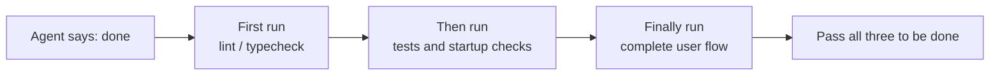
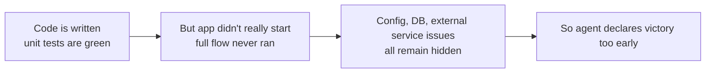

[中文版本 →](../../../zh/lectures/lecture-09-why-agents-declare-victory-too-early/)

> Code examples for this lecture: [code/](https://github.com/walkinglabs/learn-harness-engineering/blob/main/docs/es/lectures/lecture-09-why-agents-declare-victory-too-early/code/)
> Hands-on practice: [Project 05. Let the agent verify its own work](./../../projects/project-05-grounded-qa-verification/index.md)

# Lección 09. Evita que los agentes declaren victoria demasiado pronto

Le pides a un agent que implemente una funcionalidad de "restablecimiento de contraseña". Modifica el esquema de la base de datos, escribe el endpoint de la API, añade la plantilla de correo electrónico, ejecuta las pruebas unitarias (todas pasan) y luego te dice con confianza "ya está". Cuando realmente intentas ejecutarlo—el enlace de restablecimiento no se puede enviar (falta la configuración del servicio de correo electrónico), la migración de la base de datos falla a mitad de camino (inconsistencia en el esquema), y el flujo end-to-end no se ha ejecutado ni una sola vez.

Esta sensación no debería resultar desconocida—es como llenar todo el examen, ser el primero en entregarlo con confianza, y luego suspender cuando salen las notas. Que el examen esté lleno no significa que las respuestas sean correctas.

No es un incidente aislado. El clásico artículo de 2017 en ICML de Guo et al. demostró: **las redes neuronales modernas son sistemáticamente excesivamente seguras**—la confianza reportada por los modelos es significativamente mayor que su precisión real. Lo mismo se aplica a los agentes de codificación con IA: "sienten" que han terminado, pero en realidad, están lejos de hacerlo. Tu harness debe reemplazar los "sentimientos" del agent con verificación externalizada y basada en ejecución.

## La pendiente resbaladiza

Las declaraciones prematuras de finalización casi siempre siguen el mismo patrón: el código parece correcto—la sintaxis es correcta, la lógica parece razonable, y el análisis estático no muestra errores obvios. Pero el harness no impone una verificación de ejecución exhaustiva, así que el agent se salta ejecutarlo realmente o solo ejecuta pruebas parciales. Ejecuta pruebas unitarias pero se salta las de integración; ejecuta pruebas pero no verifica la cobertura. En última instancia, "el código parece bien" se toma como evidencia de que "la funcionalidad está completa". Y el examen se entrega.

Se pierde información en cada paso. Desde las especificaciones de la tarea hasta la implementación del código y el comportamiento en tiempo de ejecución, cada transformación puede introducir sesgos, y cada verificación omitida exacerba la asimetría de información.

## Verificación de terminación en tres capas





## Conceptos clave

- **Declaración prematura de finalización**: El agent afirma que la tarea está completa, pero aún existen especificaciones de corrección sin cumplir. El problema central: el agent juzga basándose en la confianza local a nivel de código, mientras que la corrección a nivel de sistema requiere verificación global.
- **Sesgo de calibración de confianza**: La brecha sistemática entre la confianza auto-reportada por el agent sobre la finalización y la calidad real de la finalización. Para tareas complejas de múltiples archivos, este sesgo es significativamente positivo—el agent siempre está más seguro de lo que realmente rinde. Es como un estudiante que siempre sobreestima su calificación después de un examen.
- **Criterios de terminación**: Un conjunto claro y ejecutable de condiciones de juicio definidas en el harness. El agent debe satisfacer todas las condiciones antes de declarar la finalización. "Hecho" pasa de ser un juicio subjetivo a una determinación objetiva.
- **Verificación-Validación de doble puerta**: La primera capa de verificación comprueba "si el código implementó correctamente el comportamiento especificado"; la segunda capa de validación comprueba "si el comportamiento a nivel de sistema cumple con los requisitos end-to-end". Ambas deben pasar para considerar la tarea completa.
- **Señales de retroalimentación en tiempo de ejecución**: Logs, estados de procesos y health checks de la ejecución del programa. Esta es la base objetiva para que el harness juzgue la calidad de la finalización.
- **Restricción de prioridad de finalización**: Primero verificar la corrección funcional, luego manejar el rendimiento, y finalmente abordar el estilo. Se prohíbe la refactorización hasta que la funcionalidad central esté verificada.

## Pasar las pruebas unitarias ≠ Tarea completada

Esta es la trampa más común, y la más peligrosa. El agent escribió el código, ejecutó las pruebas unitarias, todo está en verde, y dijo "listo". Pero la filosofía de diseño de las pruebas unitarias—aislar la unidad bajo prueba y mockear las dependencias—es precisamente lo que las hace incapaces de detectar problemas entre componentes:

**Incompatibilidad de interfaces**: La ruta de archivo pasada por el proceso de render al preload script es una ruta relativa, pero el preload script espera una ruta absoluta. Sus respectivas pruebas unitarias usaron mocks y pasaron. El problema solo se descubre durante las pruebas end-to-end. Es como cada músico de una banda practicando perfectamente por su cuenta, solo para darse cuenta de que están en tonos diferentes cuando tocan juntos.

**Errores de propagación de estado**: Una migración de base de datos cambia el esquema de la tabla, pero la capa de caché del ORM todavía mantiene entradas de caché para el esquema anterior. Las pruebas unitarias proporcionan un entorno mock fresco cada vez, lo cual no expondrá esta inconsistencia de estado entre capas.

**Dependencia del entorno**: El código se comporta correctamente en el entorno de prueba (donde todo está mockeado) pero falla en el entorno real debido a diferencias de configuración, latencia de red o indisponibilidad del servicio. Es como cantar perfectamente en la sala de ensayo, pero encontrarse con problemas de equipo de audio en el escenario.

### "Refactorizar de paso" es veneno para el juicio de finalización

Claude Code tiene un patrón de comportamiento común: comienza a refactorizar código, optimizar el rendimiento y mejorar el estilo antes de que la funcionalidad central haya pasado la verificación. La cita de Knuth, "La optimización prematura es la raíz de todos los males," adquiere un nuevo significado en el escenario del agent—la refactorización altera la frontera entre el código verificado y el no verificado, potencialmente rompiendo rutas de código que antes eran implícitamente correctas. Es como volver a copiar tus respuestas de opción múltiple para mejorar el formato antes de haber terminado las preguntas de desarrollo—no solo pierdes tiempo, sino que podrías copiarlas mal.

### Sesgo sistemático en la autoevaluación

Anthropic descubrió un patrón de falla más profundo en su investigación de 2026: **cuando se le pide a un agent que evalúe su propio trabajo, proporciona sistemáticamente evaluaciones excesivamente positivas—incluso cuando un observador humano consideraría que la calidad es claramente insuficiente.** Es como pedirle a un estudiante que califique su propio examen—siempre será particularmente indulgente con sus propias respuestas.

Este problema es especialmente grave en tareas subjetivas (como la estética de diseño)—si un "diseño es exquisito" es una cuestión de juicio, y el agent se inclina confiablemente hacia lo positivo. Incluso en tareas con resultados verificables, el rendimiento del agent puede verse afectado por un juicio deficiente.

La solución no es hacer que el agent sea "más objetivo"—el mismo modelo que genera y evalúa inherentemente favorece ser generoso consigo mismo. **La solución es separar al "trabajador" del "verificador".** Así como un estudiante no debería calificar su propio examen—necesitas un calificador independiente.

Un agent evaluador independiente, ajustado específicamente para ser "exigente", es mucho más efectivo que hacer que el agent generador se evalúe a sí mismo. Datos experimentales de Anthropic:

| Architecture | Runtime | Cost | Core Features Working? |
|--------------|---------|------|------------------------|
| Single Agent (bare run) | 20 mins | $9 | No (game entities unresponsive to input) |
| Three Agents (planner + generator + evaluator) | 6 hours | $200 | Yes (game is fully playable) |

Este es exactamente el mismo modelo (Opus 4.5) con exactamente el mismo prompt ("build a 2D retro game editor"). La única diferencia es el harness—desde "ejecución sin arnés" hasta "el planner expande los requisitos → el generador implementa funcionalidad por funcionalidad → el evaluador realiza pruebas reales de clics usando Playwright".

> Fuente: [Anthropic: Harness design for long-running application development](https://www.anthropic.com/engineering/harness-design-long-running-apps)

## Cómo evitar las entregas prematuras

### 1. Externalizar el juicio de terminación

El juicio de finalización no debería ser hecho por el agent mismo. El harness debe ejecutar independientemente la validación de terminación, usando señales en tiempo de ejecución como entrada, no la confianza del agent. Escríbelo claramente en `CLAUDE.md`:

```
## Definition of Done
- Feature complete = end-to-end verification passed, not "code is written"
- Required verification levels:
  1. Unit tests pass
  2. Integration tests pass
  3. End-to-end flow verification passes
- Do not proceed to level 2 if level 1 fails
- Do not proceed to level 3 if level 2 fails
```

### 2. Construir una validación de terminación en tres capas

- **Capa 1: Sintaxis y análisis estático**. Menor costo, menor información, pero debe pasar. Esta es la verificación mínima—debes escribir las palabras correctamente antes de mirar nada más.
- **Capa 2: Verificación de comportamiento en tiempo de ejecución**. Ejecución de pruebas, verificaciones de inicio de la aplicación, validación de rutas críticas. Esta es la evidencia central de finalización. No basta con escribirlo; debe ejecutarse.
- **Capa 3: Confirmación a nivel de sistema**. Pruebas end-to-end, validación de integración, simulación de escenarios de usuario. La última línea de defensa contra declaraciones prematuras. No basta con que se ejecute; debe ejecutarse correctamente.

### 3. Diseñar buenas "correcciones con bolígrafo rojo" para los agentes

OpenAI introdujo un patrón particularmente efectivo durante su práctica con Codex: **los mensajes de error para los agentes deben incluir instrucciones de corrección**. No simplemente dibujes una gran X roja como un calificador perezoso; sé como un buen profesor y escribe "así es como deberías cambiar esto" en los márgenes. No uses `"Test failed"`, sino usa `"Test failed: POST /api/reset-password returned 500. Check that the email service config exists in environment variables. The template file should be at templates/reset-email.html."` Esta retroalimentación específica y accionable permite al agent autocorregirse sin intervención humana.

### 4. Capturar señales en tiempo de ejecución

Las señales efectivas en tiempo de ejecución incluyen:
- ¿La aplicación se inició exitosamente y alcanzó un estado listo?
- ¿Las rutas de funcionalidad crítica se ejecutaron exitosamente en tiempo de ejecución?
- ¿Las escrituras en base de datos, operaciones de archivos y otros efectos secundarios fueron correctos?
- ¿Se limpiaron los recursos temporales?

## Caso del mundo real

**Tarea**: Implementar la funcionalidad de restablecimiento de contraseña de usuario. Involucra operaciones de base de datos, envío de correo electrónico y modificaciones de endpoints de API.

**Ruta de entrega prematura**: El agent modifica el esquema de la base de datos, escribe el endpoint de la API, añade la plantilla de correo electrónico, ejecuta las pruebas unitarias (pasa) y declara la finalización. El examen está completamente lleno.

**Deducciones reales**: (1) Flujo end-to-end sin probar—el envío y verificación real del enlace de restablecimiento nunca se confirmó. (2) La migración de base de datos falló después de una ejecución parcial, causando inconsistencia en el esquema. (3) Faltaba la configuración del servicio de correo electrónico en el entorno destino.

**Intervención del harness**: Validación de terminación impuesta—(1) Iniciar la aplicación completa para verificar la accesibilidad del endpoint de restablecimiento; (2) Ejecutar el flujo completo de restablecimiento; (3) Verificar la consistencia del estado de la base de datos. Todos los defectos se encontraron dentro de la sesión, ahorrando 5-10x el costo de correcciones posteriores. El calificador independiente encontró los problemas reales.

## Ideas clave

- **Los agentes son sistemáticamente excesivamente seguros**—el sesgo de calibración de confianza es una realidad objetiva. Llenar el examen no significa que lo hayas hecho bien.
- **El juicio de finalización debe externalizarse**—el harness verifica independientemente; no confíes en los "sentimientos" del agent. Los estudiantes no pueden calificar sus propios exámenes.
- **Las tres capas de validación son esenciales**—sintaxis pasando, comportamiento pasando, sistema pasando, progresando capa por capa.
- **Los mensajes de error deben ser como las correcciones con bolígrafo rojo de un buen profesor**—incluir pasos específicos de corrección para que el agent pueda autocorregirse.
- **Sin refactorización hasta que la funcionalidad central esté verificada**—la restricción de prioridad de finalización es la clave para prevenir la optimización prematura.

## Lecturas adicionales

- [On Calibration of Modern Neural Networks - Guo et al.](https://arxiv.org/abs/1706.04599) — Demuestra que las redes neuronales modernas son sistemáticamente excesivamente seguras
- [Building Effective Agents - Anthropic](https://www.anthropic.com/research/building-effective-agents) — El papel crítico de la evidencia en tiempo de ejecución en el juicio de finalización
- [Harness Engineering - OpenAI](https://openai.com/index/harness-engineering/) — La declaración prematura de finalización es uno de los principales modos de falla de los agentes
- [The Art of Software Testing - Myers](https://www.goodreads.com/book/show/137543.The_Art_of_Software_Testing) — Referencia clásica sobre jerarquías de métodos de prueba y su efectividad

## Ejercicios

1. **Diseño de función de validación de terminación**: Diseña una validación de terminación completa para una tarea que involucre una migración de base de datos y una modificación de API. Enumera las señales en tiempo de ejecución requeridas y los criterios de aprobación/rechazo para cada señal. Ejecútala en una tarea real y registra qué problemas ocultos encuentra.

2. **Medición del sesgo de calibración**: Elige 10 tipos diferentes de tareas de codificación, y registra la confianza de finalización auto-reportada por el agent versus la calidad real de finalización. Calcula el valor del sesgo y analiza su relación con la complejidad de la tarea.

3. **Experimento de defensa en múltiples capas**: Ejecuta tres configuraciones en el mismo conjunto de tareas—(a) solo análisis estático, (b) añadir pruebas unitarias, (c) validación completa en tres capas. Compara la proporción de declaraciones prematuras de finalización y el número de defectos no detectados.
