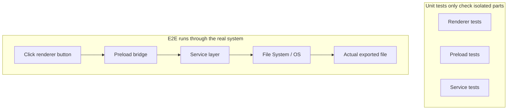
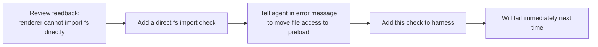

[中文版本 →](../../../zh/lectures/lecture-10-why-end-to-end-testing-changes-results/)

> Code examples for this lecture: [code/](https://github.com/walkinglabs/learn-harness-engineering/blob/main/docs/es/lectures/lecture-10-why-end-to-end-testing-changes-results/code/)
> Hands-on practice: [Project 05. Let the agent verify its own work](./../../projects/project-05-grounded-qa-verification/index.md)

# Lección 10. Solo las pruebas end-to-end son verificación real

Le pides al agent que añada una funcionalidad de exportación de archivos a una aplicación Electron. Escribe el componente del proceso de render, el preload script y la lógica de la capa de servicio. Las pruebas unitarias de cada componente pasan perfectamente. El agent dice: "Ya está." Cuando realmente haces clic en el botón de exportación—el formato de la ruta del archivo es incorrecto, la barra de progreso no se actualiza, y exportar archivos grandes causa una fuga de memoria. Cinco defectos en los límites de componentes, y las pruebas unitarias no detectaron ni uno solo.

Es como un ensayo de coro—cada parte vocal suena perfecta cuando se canta individualmente, pero cuando cantan juntos, las sopranos van medio tiempo más rápido que los bajos, y el acompañamiento está un semitono desfasado de la melodía principal. Cada parte es "correcta" por sí sola, pero el conjunto está desafinado.

La Pirámide de Testing de Google nos dice: un gran número de pruebas unitarias son la base, pero si te detienes ahí, perderás sistemáticamente los problemas de interacción entre componentes. Para los agentes de codificación con IA, este problema es aún más grave—los agentes tienden a ejecutar solo las pruebas más rápidas y luego declarar la finalización. **Solo las pruebas end-to-end pueden demostrar que no existen defectos a nivel de sistema.**

## Los puntos ciegos de las pruebas unitarias

La filosofía de diseño de las pruebas unitarias es el aislamiento—mockear dependencias y enfocarse únicamente en la unidad bajo prueba. Esta filosofía hace que las pruebas unitarias sean rápidas y precisas, pero también crea puntos ciegos sistemáticos. Es como hacer que cada parte vocal practique con auriculares durante un ensayo de coro—suena bien para ellos, pero los problemas solo emergen cuando se unen:

**Incompatibilidad de interfaces**: La ruta de archivo pasada por el proceso de render al preload script es una ruta relativa, pero el preload script espera una ruta absoluta. Sus respectivas pruebas unitarias usaron mocks y pasaron. El problema solo se descubre cuando se ejecuta el flujo end-to-end—como dos partes vocales practicando independientemente y sintiéndose bien, solo para darse cuenta durante el conjunto que una canta en compás de 4/4 y la otra en 3/4.

**Errores de propagación de estado**: Una migración de base de datos cambia el esquema de la tabla, pero la capa de caché del ORM todavía mantiene entradas de caché para el esquema anterior. Las pruebas unitarias proporcionan un entorno mock completamente nuevo cada vez, lo cual no expondrá esta inconsistencia de estado entre capas. Es como cambiar la letra de una canción, pero alguien todavía canta la versión antigua.

**Problemas de ciclo de vida de recursos**: La adquisición y liberación de file handles, conexiones de base de datos y sockets de red abarcan múltiples componentes. Las pruebas unitarias crean y destruyen recursos independientes para cada prueba, sin exponer la contención de recursos o las fugas. Es como cada parte vocal tomando turnos para usar los micrófonos durante el ensayo, pero cuando todos suben al escenario juntos, no hay suficientes micrófonos.

**Dependencia del entorno**: El código se comporta correctamente en el entorno de prueba (donde todo está mockeado) pero falla en el entorno real debido a diferencias de configuración, latencia de red o indisponibilidad del servicio. Como cantar perfectamente en la sala de ensayo, pero encontrar retroalimentación acústica e interferencia del viento en un festival al aire libre.

## Las pruebas end-to-end no solo cambian los resultados, cambian el comportamiento

Esto es algo que muchas personas no logran comprender: cuando un agent sabe que su trabajo será sometido a pruebas end-to-end, su comportamiento de codificación cambia.

1. **Considerar las interacciones entre componentes**: Mientras escribe código, pensará en "cómo se conecta esta interfaz con el upstream", en lugar de enfocarse solo en una única función. Así como saber que eventualmente cantarán juntos, prestarás atención a las otras partes vocales durante la práctica.
2. **Respetar los límites de la arquitectura**: En sistemas con restricciones arquitectónicas, las pruebas end-to-end obligan al agent a adherirse a las reglas de límites. Como una partitura marcada con "crescendo aquí", tienes que seguirla.
3. **Manejar rutas de error**: Las pruebas end-to-end generalmente incluyen escenarios de falla, obligando al agent a considerar el manejo de excepciones. Es como simular "qué pasaría si el micrófono muriera repentinamente" durante el ensayo, para que sepas qué hacer.

## Pirámide de testing y promoción de retroalimentación de revisiones





En las prácticas de ingeniería de Codex, OpenAI enfatiza: **los mensajes de error escritos para agentes deben incluir instrucciones de corrección.** No simplemente escribas `"Direct filesystem access in renderer"`; escribe `"Direct filesystem access in renderer. All file operations must go through the preload bridge. Move this call to preload/file-ops.ts and invoke it via window.api."` Esto convierte las reglas arquitectónicas en un bucle de autocorrección. Como un director de coro que no solo dice "cantaste mal eso", sino que dice "estuviste medio tiempo rápido aquí, escucha el ritmo de los altos, y entra en el compás 32."

## Conceptos clave

- **Defectos en los límites de componentes**: El componente A y B pasan sus pruebas unitarias, pero su interacción produce un comportamiento incorrecto. Este es el tipo de problema que las pruebas end-to-end detectan mejor—como partes del coro que son individualmente correctas pero desafinadas juntas.
- **Gradiente de adecuación de pruebas**: Defectos detectados por pruebas unitarias <= defectos detectados por pruebas de integración <= defectos detectados por pruebas end-to-end. Cada capa superior aumenta la capacidad de detección.
- **Reglas de cumplimiento de límites arquitectónicos**: Convertir reglas de documentos de arquitectura (como "el proceso de render no puede acceder al sistema de archivos directamente") en verificaciones ejecutables y automatizadas. De "escritas en papel" a "ejecutándose en CI."
- **Promoción de retroalimentación de revisiones**: Convertir comentarios repetidos de revisiones de código en pruebas automatizadas. Cada vez que se encuentra un problema recurrente, añadir una regla, y el harness automáticamente se fortalece. Como un director que convierte los errores comunes de ensayo en ejercicios de calentamiento—la próxima vez que se cometa el mismo error, el ejercicio mismo lo expone sin que el director necesite decir nada.
- **Mensajes de error orientados al agent**: Los mensajes de falla no deberían solo indicar "qué salió mal", sino también decirle al agent exactamente cómo solucionarlo. Esto convierte las fallas de pruebas en bucles de retroalimentación autocorrectivos.

## Cómo hacerlo

### 0. Definir los límites arquitectónicos primero, luego escribir pruebas E2E

El prerrequisito para las pruebas end-to-end son límites de sistema claros. Si la arquitectura es un plato de espaguetis, las pruebas end-to-end solo probarán "este plato de espaguetis funciona", no te dirán dónde se violaron las intenciones de diseño. Es como un coro que ni siquiera se ha dividido en partes vocales—por mucho que ensayen, no sonará bien.

La experiencia de OpenAI: **para bases de código generadas por agentes, las restricciones arquitectónicas deben ser prerrequisitos tempranos establecidos desde el primer día, no algo a considerar cuando el equipo crezca.** La razón es simple—los agentes copiarán los patrones existentes en el repositorio, incluso si esos patrones son desiguales o subóptimos. Sin restricciones arquitectónicas, el agent introducirá más desviaciones en cada sesión.

OpenAI adoptó una "Arquitectura de Dominio en Capas"—cada dominio de negocio se divide en capas fijas: Types → Config → Repo → Service → Runtime → UI. Las dependencias fluyen estrictamente hacia adelante, y las preocupaciones entre dominios entran a través de interfaces de Providers explícitas. Cualquier otra dependencia está prohibida y se cumple mecánicamente mediante linting personalizado.

Principio clave: **Impedir invariantes, no microgestionar la implementación.** Por ejemplo, requerir "los datos se analizan en el límite", pero no dictar qué biblioteca usar. Los mensajes de error deben incluir instrucciones de corrección—no solo decir "violación", sino decirle al agent exactamente cómo cambiarlo.

> Fuente: [OpenAI: Harness engineering: leveraging Codex in an agent-first world](https://openai.com/index/harness-engineering/)

### 1. El harness debe incluir una capa end-to-end

Hazlo explícito en tu flujo de validación: para tareas que involucren cambios entre componentes, pasar las pruebas end-to-end es un prerrequisito para la finalización:

```
## Validation Hierarchy
- Level 1: Unit tests (Must pass)
- Level 2: Integration tests (Must pass)
- Level 3: End-to-end tests (Must pass when cross-component changes are involved)
- Skipping any required level = Not Complete
```

### 2. Convertir reglas arquitectónicas en verificaciones ejecutables

Cada restricción arquitectónica debe tener una prueba o regla de lint correspondiente:

```bash
# Check if the render process directly calls Node.js APIs
grep -r "require('fs')" src/renderer/ && exit 1 || echo "OK: no direct fs access in renderer"
```

### 3. Diseñar mensajes de error orientados al agent

Los mensajes de falla deben contener tres elementos: qué salió mal, por qué, y cómo solucionarlo:

```
ERROR: Found direct import of 'fs' in src/renderer/App.tsx:12
WHY: Renderer process has no access to Node.js APIs for security
FIX: Move file operations to src/preload/file-ops.ts and call via window.api.readFile()
```

### 4. Establecer un proceso de promoción de retroalimentación de revisiones

Cada vez que se encuentre un nuevo tipo de error del agent durante una revisión de código, conviértelo en una verificación automatizada. Un mes después, tu harness será significativamente más fuerte que al inicio del mes. Es como las notas de ensayo de un coro—registrar los problemas encontrados en cada ensayo para poder verificarlos antes del siguiente. Con el tiempo, los errores comunes disminuyen, y la música se vuelve más armoniosa.

## Caso del mundo real

**Tarea**: Implementar una funcionalidad de exportación de archivos en una aplicación Electron. Involucra la UI del proceso de render, el proxy del sistema de archivos del preload script y la transformación de datos de la capa de servicio.

**Cantando las partes individualmente (Pruebas unitarias pasaron)**: Pruebas del componente de render (pasaron, operaciones de archivo mockeadas), pruebas del preload script (pasaron, sistema de archivos mockeado), pruebas de la capa de servicio (pasaron, fuente de datos mockeada). El agent declara la finalización.

**Cantando juntos (Defectos revelados por las pruebas end-to-end)**:

| Defect | Description | Unit Test | E2E |
|--------|-------------|-----------|-----|
| Interface Mismatch | Inconsistent file path format | Missed | Caught |
| State Propagation | Export progress not sent back to UI via IPC | Missed | Caught |
| Resource Leak | Large file export handles not released | Missed | Caught |
| Permission Issue | Different permissions in packaged environment | Missed | Caught |
| Error Propagation | Service layer exceptions didn't reach UI layer | Missed | Caught |

Los 5 defectos fueron detectados por las pruebas end-to-end, mientras que las pruebas unitarias no detectaron ninguno. El costo fue un aumento en el tiempo de prueba de 2 segundos a 15 segundos—completamente aceptable en un flujo de trabajo de agent. Por muy bien que cada parte cante individualmente, no puede superar un ensayo completo del conjunto.

## Ideas clave

- **Las pruebas unitarias son sistemáticamente ciegas a los defectos en los límites de componentes**—su diseño de aislamiento es precisamente lo que les impide detectar problemas de interacción. Que todos canten correctamente no significa que el coro no esté desafinado.
- **Las pruebas end-to-end no solo detectan defectos, cambian el comportamiento de codificación del agent**—haciéndolo enfocarse más en la integración y los límites.
- **Las reglas arquitectónicas deben ser ejecutables**—no escritas en un documento esperando ser leídas, sino verificadas automáticamente en cada commit.
- **Los mensajes de error deben estar diseñados para los agentes**—incluyendo pasos específicos sobre "cómo solucionarlo" para formar un bucle autocorrectivo.
- **La promoción de retroalimentación de revisiones hace que el harness se fortalezca automáticamente**—cada categoría de defecto capturado se convierte en una línea de defensa permanente.

## Lecturas adicionales

- [How Google Tests Software - Whittaker et al.](https://www.goodreads.com/book/show/13563030-how-google-tests-software) — La fuente clásica del modelo de Pirámide de Testing
- [Harness Engineering - OpenAI](https://openai.com/index/harness-engineering/) — Prácticas de ingeniería para la ejecución automatizada de restricciones arquitectónicas
- [Chaos Engineering - Netflix (Basiri et al.)](https://ieeexplore.ieee.org/document/7466237) — Inyección proactiva de fallas para verificar la resiliencia del sistema
- [QuickCheck - Claessen & Hughes](https://www.cs.tufts.edu/~nr/cs257/archive/john-hughes/quick.pdf) — Metodología de property testing, situada entre las pruebas de ejemplo y la verificación formal

## Ejercicios

1. **Detección de defectos entre componentes**: Elige una tarea de modificación que involucre al menos tres componentes. Primero, ejecuta solo pruebas unitarias y registra los resultados, luego ejecuta pruebas end-to-end. Analiza a qué tipo de problema de interacción entre capas pertenece cada defecto adicional descubierto.

2. **Automatización de reglas arquitectónicas**: Elige una restricción arquitectónica de tu proyecto y conviértela en una verificación ejecutable (con un mensaje de error orientado al agent). Intégrala en el harness y verifica su efectividad con una tarea de referencia.

3. **Promoción de retroalimentación de revisiones**: Encuentra un tipo de comentario recurrente en tu historial de revisiones de código y conviértelo en una verificación automatizada usando el proceso de cinco pasos. Compara la frecuencia del problema antes y después de la promoción.
