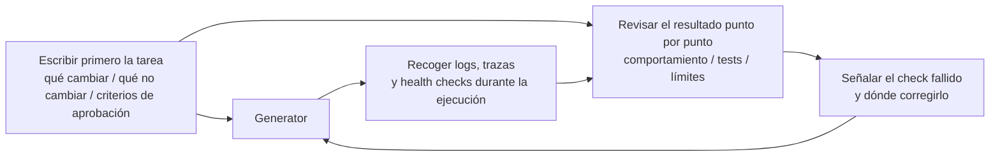

[中文版本 →](../../../zh/lectures/lecture-11-why-observability-belongs-inside-the-harness/)

> Ejemplos de código: [code/](https://github.com/walkinglabs/learn-harness-engineering/blob/main/docs/es/lectures/lecture-11-why-observability-belongs-inside-the-harness/code/)
> Proyecto práctico: [Proyecto 06. Harness completo (capstone)](./../../projects/project-06-runtime-observability-and-debugging/index.md)

# Lección 11. Haz observable el runtime del agente

## Qué problema resuelve esta lección

Le pides a un agente que implemente una función. Corre durante 20 minutos, modifica muchos archivos y luego dice: "terminado, pero fallan dos tests". Preguntas por qué fallan: "no estoy seguro, quizá sea un problema de timing". Preguntas qué rutas críticas cambió: "déjame mirar el código...".

No se trata de que al agente le falte capacidad. El problema es que tu harness no proporciona suficiente observabilidad. **Sin observabilidad, los agentes toman decisiones bajo incertidumbre, las evaluaciones se vuelven juicios subjetivos y los reintentos son tanteos a ciegas.** Tanto OpenAI como Anthropic tratan la fiabilidad como un problema de evidencia: el harness debe exponer el comportamiento en runtime y las señales de evaluación de una forma que guíe la siguiente decisión.

## Conceptos clave

- **Observabilidad de runtime**: señales de sistema como logs, trazas, eventos de proceso y health checks. Responde "qué hizo el sistema".
- **Observabilidad de proceso**: visibilidad sobre artefactos de decisión del harness, como planes, rúbricas de puntuación y criterios de aceptación. Responde "por qué debería aceptarse este cambio".
- **Traza de tarea**: registro completo del camino de decisión desde el inicio hasta la finalización, análogo al tracing de requests en sistemas distribuidos. Cada paso del agente queda registrado con su contexto.
- **Sprint contract**: acuerdo de corto plazo negociado antes de programar, que especifica alcance, estándares de verificación y exclusiones. Es la herramienta central de la observabilidad de proceso.
- **Rúbrica de evaluación**: transforma la evaluación de calidad de juicio subjetivo a puntuación estructurada basada en evidencia. Hace que distintos evaluadores produzcan resultados similares para la misma salida.
- **Observabilidad por capas**: observabilidad de sistema y de proceso diseñadas juntas y reforzándose. Las señales de runtime explican el comportamiento; los artefactos de proceso explican la intención.

## Observabilidad por capas



## Por qué ocurre

### El coste real de no tener observabilidad

Cuando un harness no tiene observabilidad, aparecen sistemáticamente cuatro tipos de problemas:

**No se distingue "correcto" de "parece correcto"**: una función puede verse perfecta en revisión de código — sintaxis correcta, lógica razonable. Pero en runtime, un error en un edge case produce resultados incorrectos con ciertas entradas. Solo las trazas de runtime muestran que la ruta real de ejecución se desvió de lo esperado.

**La evaluación se vuelve mística**: sin rúbricas y criterios de aceptación, los evaluadores, humanos o agentes, dependen de supuestos implícitos. La misma salida puede recibir evaluaciones muy distintas. La calidad deja de ser reproducible.

**Los reintentos se vuelven conjeturas ciegas**: cuando el agente no sabe por qué falló algo, la dirección del reintento es aleatoria. Puede corregir rutas de código irrelevantes mientras ignora la causa raíz. Cada reintento ciego cuesta tokens y tiempo.

**Acantilado de información en el handoff**: cuando se entrega trabajo incompleto a la siguiente sesión, la falta de observabilidad obliga a diagnosticar el estado del sistema desde cero. Las observaciones de Anthropic muestran que ese diagnóstico redundante puede consumir 30-50% del tiempo total de sesión.

### Un escenario realista con Claude Code

Imagina un harness con workflow de tres roles, planner-generator-evaluator, ejecutando la tarea "añadir dark mode a la app".

**Sin observabilidad**: el planner produce una descripción vaga. El generator implementa dark mode con base en esa vaguedad, pero no coincide con las expectativas implícitas del planner. El evaluator rechaza según sus propios estándares implícitos, sin articular qué está mal. El generator reintenta a ciegas. El ciclo se repite 3-4 veces, toma unos 45 minutos y produce algo apenas aceptable.

**Con observabilidad completa**: el planner produce un sprint contract que lista los componentes a modificar, los estándares de verificación y las exclusiones. El generator implementa según el contrato. La observabilidad de runtime registra cómo carga y aplica estilos cada componente. El evaluator usa una rúbrica con evidencias concretas por dimensión. Una iteración produce un resultado de alta calidad en unos 15 minutos.

La diferencia de eficiencia es 3x. Lo único que cambió fue la observabilidad.

### Por qué los agentes no pueden resolverlo solos

Podrías pensar: "¿no puede el agente imprimir sus propios logs?" Los problemas son:

1. El agente no sabe lo que no sabe; no registrará señales que no sabe que necesita.
2. Los formatos de log son inconsistentes; distintas sesiones usan distintos formatos, lo que impide análisis sistemático.
3. La observabilidad de proceso no se resuelve con logs; sprint contracts y rúbricas son artefactos estructurados que necesitan soporte a nivel de harness.

## Cómo hacerlo bien

### 1. Integrar la recogida de señales de runtime en el harness

No dependas de que el agente imprima sus propios logs. El harness debería recoger automáticamente estas señales:

- **Ciclo de vida de la aplicación**: estados de startup, ready, running y shutdown
- **Ejecución de rutas de función**: registros de rutas críticas con puntos de entrada, checkpoints y salidas
- **Flujo de datos**: registros de datos que pasan entre componentes
- **Uso de recursos**: patrones anómalos, por ejemplo memoria que crece sin parar
- **Errores y excepciones**: contexto completo, no solo mensajes de error

### 2. Implementar sprint contracts

Antes de iniciar cada tarea, el generator y el evaluator, que pueden ser invocaciones distintas del mismo agente, negocian un contrato:

```markdown
# Sprint Contract: Dark Mode Support

## Scope
- Modify the theme toggle component
- Update global CSS variables
- Add dark mode tests

## Verification Standards
- Visual regression tests pass for each component
- Main flow end-to-end tests pass
- No flash of unstyled content (FOUC)

## Exclusions
- Not handling print styles
- Not handling third-party component dark mode
```

### 3. Establecer una rúbrica de evaluación

Convierte "¿está bien o no?" en puntuación cuantificable:

```markdown
# Scoring Rubric

| Dimension | A | B | C | D |
|-----------|---|---|---|---|
| Code correctness | All tests pass | Main flow passes | Partial pass | Build fails |
| Architecture compliance | Fully compliant | Minor deviations | Obvious deviations | Serious violations |
| Test coverage | Main + edge cases | Main flow only | Only skeleton | No tests |
```

### 4. Estandarizar con OpenTelemetry

Crea una traza para cada sesión de harness, un span para cada tarea y sub-spans para cada paso de verificación. Usa atributos estándar para anotar información clave. Así, los datos de observabilidad se integran con herramientas como Jaeger o Zipkin.

## Caso real

Un harness con workflow planner-generator-evaluator ejecuta "añadir soporte de dark mode":

**Versión no observable**: 3-4 rondas de reintentos ciegos, 45 minutos, resultado apenas aceptable. El evaluator dice "no se siente bien" pero no puede precisar por qué. El generator pierde tiempo en direcciones equivocadas.

**Versión completamente observable**:
- El sprint contract aclara alcance, estándares y exclusiones
- Las trazas de runtime registran el proceso de carga de estilos de cada componente
- La rúbrica da una evaluación estructurada por dimensiones
- Una iteración produce resultados de alta calidad en 15 minutos

Mejora de eficiencia 3x, calidad más estable y evaluaciones reproducibles.

## Ideas clave

- **La observabilidad es una propiedad arquitectónica del harness**, no una función que se añade al final.
- **Ambas capas de observabilidad son esenciales**: las señales de runtime explican "qué pasó"; los artefactos de proceso explican "por qué se hizo así".
- **Los sprint contracts alinean por adelantado**, evitando que el generator construya algo que el evaluator rechaza por razones previsibles.
- **Las rúbricas hacen reproducible la evaluación**, de modo que distintos evaluadores produzcan puntuaciones parecidas.
- **La falta de observabilidad desperdicia 30-50% del tiempo de sesión en diagnóstico redundante.**

## Lecturas adicionales

- [Observability Engineering - Charity Majors](https://www.honeycomb.io/blog/observability-engineering-book) — marco teórico y práctico para observability engineering moderna
- [Dapper - Google (Sigelman et al.)](https://research.google/pubs/pub36356/) — práctica pionera de tracing distribuido a gran escala
- [Harness Design - Anthropic](https://www.anthropic.com/engineering/harness-design-long-running-apps) — introducción de sprint contracts y rúbricas de evaluación
- [Site Reliability Engineering - Google](https://sre.google/sre-book/table-of-contents/) — aplicación sistemática de observabilidad en producción

## Ejercicios

1. **Análisis de brecha de observabilidad**: audita tu harness actual en la capa de sistema y de proceso. Encuentra estados que no se distinguen con las señales existentes y propone señales nuevas.

2. **Práctica de sprint contract**: escribe un sprint contract para una tarea real. Haz que el agente lo ejecute y compara eficiencia y calidad con y sin contrato.

3. **Construcción de traza de tarea**: registra cada paso de un agente durante una tarea completa de codificación. Anota con convenciones semánticas de OpenTelemetry y analiza dónde falta señal suficiente para decidir.
