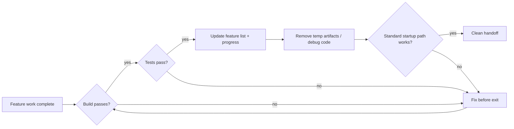
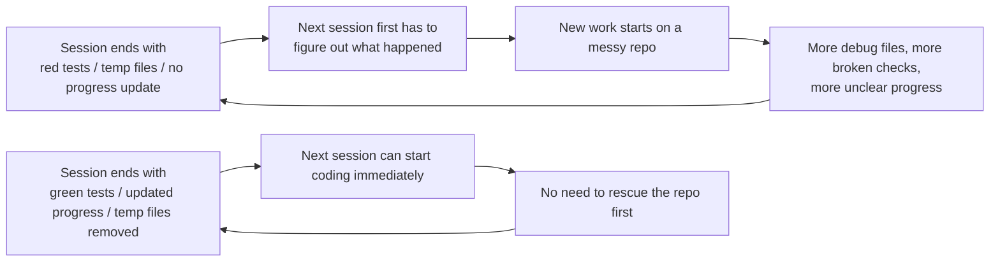

[中文版本 →](../../../zh/lectures/lecture-12-why-every-session-must-leave-a-clean-state/)

> Ejemplos de código: [code/](https://github.com/walkinglabs/learn-harness-engineering/blob/main/docs/es/lectures/lecture-12-why-every-session-must-leave-a-clean-state/code/)
> Proyecto práctico: [Project 06. Complete harness (Capstone)](./../../projects/project-06-runtime-observability-and-debugging/index.md)

# Lección 12. Deja un handoff limpio al final de cada sesión

Tu agent ejecuta toda la tarde, modifica 20 archivos, hace commit del código, la sesión termina. La siguiente sesión del agent comienza y descubre inmediatamente: el build está roto, las pruebas están en rojo, los archivos temporales de debug están por todas partes, la feature list no se actualizó, y el progreso es completamente incierto. La nueva sesión dedica sus primeros 30 minutos solo a averiguar "qué hizo realmente la última sesión."

Tanto OpenAI como Anthropic afirman claramente: **la confiabilidad a largo plazo depende de la disciplina operacional, no solo del éxito en una única ejecución.** La calidad del estado al final de la sesión determina directamente la eficiencia de la siguiente sesión. Piensa en ello como las buenas prácticas de Git—cada commit debería ser un cambio atómico y compilable, no un montón de código a medio terminar.

## Conceptos clave

- **Clean state**: El sistema satisface cinco condiciones al final de la sesión—el build pasa, las pruebas pasan, el progreso está registrado, no hay artefactos obsoletos, y la ruta de inicio está disponible. Faltar cualquiera significa que la sesión no está "terminada."
- **Integridad de sesión**: Análogo a las transacciones de base de datos—o bien se hace commit completo y se deja un clean state, o se hace rollback al último estado consistente. No hay término medio.
- **Documento de calidad**: Un artefacto activo que registra continuamente las calificaciones de calidad de cada módulo. No es una evaluación única, sino un rastreador que muestra si la base de código se está fortaleciendo o debilitando con el tiempo.
- **Bucle de limpieza**: Una sesión de mantenimiento regular orientada a reducir sistemáticamente la entropía en la base de código. No es una corrección de emergencia, sino operaciones rutinarias.
- **Simplificación del harness**: A medida que mejoran las capacidades del modelo, eliminar periódicamente los componentes del harness que ya no son necesarios. Una restricción esencial hoy puede ser una sobrecarga innecesaria en tres meses.
- **Limpieza idempotente**: Las operaciones de limpieza producen el mismo resultado independientemente de cuántas veces se ejecuten. Asegura que la limpieza siga siendo segura incluso en escenarios de reintento tras fallo.

## Cinco dimensiones del clean state





## Por qué ocurre

### El crecimiento de la entropía es el estado por defecto

Las leyes de Lehman sobre la evolución del software nos dicen: los sistemas sometidos a cambios continuos aumentarán inevitablemente en complejidad a menos que se gestionen activamente. Esto es especialmente cierto para los agentes de codificación con IA—cada sesión introduce cambios, y sin limpieza al salir, la deuda técnica se acumula exponencialmente.

Los datos reales son reveladores. Un proyecto desarrollado con agentes durante 12 semanas, sin estrategia de limpieza:

- Semana 1: Tasa de build exitoso 100%, tasa de pruebas exitosas 100%, inicio de nueva sesión 5 min
- Semana 4: Build 95%, pruebas 92%, inicio 15 min
- Semana 8: Build 82%, pruebas 78%, inicio 35 min
- Semana 12: Build 68%, pruebas 61%, inicio 60+ min

Mismo proyecto con una estrategia de limpieza:

- Semana 1: 100%, 100%, 5 min
- Semana 12: 97%, 95%, 9 min

Después de 12 semanas: la tasa de build exitoso difiere en 29 puntos porcentuales, el tiempo de inicio de nueva sesión difiere en un 85%. Esto no es teórico—es una diferencia observada.

### Cinco dimensiones del clean state

El clean state no es solo "el código compila." Son cinco dimensiones evaluadas juntas:

**Dimensión de build**: ¿El código compila sin errores? Esto es lo más básico—la siguiente sesión no debería tener que corregir errores de build primero.

**Dimensión de pruebas**: ¿Pasán todas las pruebas? Incluyendo las pruebas que existían antes de la sesión—la sesión es responsable de no romper la funcionalidad existente. Y debería verificarse en CI, no solo "funciona en mi máquina."

**Dimensión de progreso**: ¿Está el progreso actual registrado en un artefacto legible por máquina? Subtareas completadas con sus criterios de aprobación, subtareas en progreso pero incompletas con su estado actual, subtareas aún no iniciadas. Los buenos registros de progreso reducen un 60-80% del tiempo de diagnóstico al inicio de la sesión.

**Dimensión de artefactos**: ¿Hay artefactos temporales obsoletos o ambiguos? Logs de debug, archivos temporales, código comentado, marcadores TODO—todos estos aumentan la carga cognitiva para la siguiente sesión.

**Dimensión de inicio**: ¿Está disponible la ruta de inicio estándar? ¿Puede la siguiente sesión comenzar a trabajar sin intervención manual? Inicialización del entorno, carga de la base de código, adquisición de contexto, selección de tareas—estas rutas no deben estar rotas.

### "Limpiar después" significa nunca limpiar

La trampa mental más común es "no hay tiempo para limpiar esta sesión, lo haré la próxima vez." Pero la siguiente sesión del agent no sabe lo que dejaste atrás—ve un desorden de código y un estado incierto. Dedicará un tiempo significativo a inferir "qué partes de este código son intencionales y cuáles son temporales."

Peor aún, cada sesión tiene sus propios objetivos de tarea. La nueva sesión está ahí para hacer trabajo nuevo, no para limpiar el desastre de la sesión anterior. Ignorará el caos y comenzará trabajo nuevo encima de él, introduciendo más caos sobre el caos. Este es el bucle de retroalimentación positiva de la entropía.

## Cómo hacerlo bien

### 1. Clean state como requisito de finalización

Define explícitamente en el harness: **finalización de sesión = la tarea pasa la verificación Y la verificación de clean state pasa.** Faltar cualquiera de las dos significa que la sesión no está completa. Escríbelo en CLAUDE.md:

```
## Session Exit Checklist
- [ ] Build passes (npm run build)
- [ ] All tests pass (npm test)
- [ ] Feature list updated
- [ ] No debug code remaining (console.log, debugger, TODO)
- [ ] Standard startup path available (npm run dev)
```

### 2. Estrategia de limpieza en modo dual

Combina dos modos de limpieza:

**Limpieza inmediata (al final de cada sesión)**: Limpiar artefactos temporales creados durante la sesión, actualizar el estado de la feature list, asegurar que el build y las pruebas pasen. Esta es limpieza de "conteo de referencias."

**Limpieza periódica (semanal)**: Escaneo completo del sistema—manejar problemas estructurales acumulados, actualizar documentos de calidad, ejecutar pruebas de referencia para detectar desviaciones. Esta es limpieza de "trazado."

### 3. Mantener un documento de calidad

Un documento de calidad es un artefacto activo que califica continuamente cada módulo:

```markdown
# Quality Document

## User Authentication Module (Quality: A)
- Verification passing: Yes
- Agent understandable: Yes
- Test stability: Stable
- Architecture boundaries: Compliant
- Code conventions: Followed

## Payment Module (Quality: C)
- Verification passing: Partial (payment callback untested)
- Agent understandable: Difficult (logic spread across 3 files)
- Test stability: Unstable (2 flaky tests)
- Architecture boundaries: Violations present
- Code conventions: Partially followed
```

Las nuevas sesiones leen este documento e inmediatamente saben dónde priorizar. Corrige primero el módulo con la calificación más baja.

### 4. Simplificar periódicamente el harness

Una perspectiva importante de Anthropic: **cada componente del harness existe porque el modelo no puede hacer algo de manera confiable por sí solo. Pero a medida que los modelos mejoran, estos supuestos se vuelven obsoletos.** Una restricción esencial hace tres meses puede ser una sobrecarga innecesaria hoy.

Práctica recomendada: Cada mes, elige un componente del harness, desactívalo temporalmente, y ejecuta tareas de referencia. Si los resultados no se degradan, elimínalo permanentemente. Si se degradan, restáuralo o reemplázalo con una alternativa más ligera.

### 5. Las operaciones de limpieza deben ser idempotentes

Los scripts de limpieza deben ser seguros para ejecutar repetidamente:

```bash
# Idempotent cleanup operations
rm -f /tmp/debug-*.log  # -f ensures no error when files don't exist
git checkout -- .env.local  # Restore to known state
npm run test  # Verify cleanup didn't break anything
```

## Caso del mundo real

Una aplicación Electron desarrollada con agentes durante 12 semanas, comparando dos enfoques:

**Sin estrategia de limpieza** (grupo de control): Semana 12, tasa de build exitoso 68%, tasa de pruebas exitosas 61%, inicio de nueva sesión 60+ min, artefactos obsoletos 103.

**Con estrategia de limpieza** (grupo experimental): Verificación completa de clean state al final de cada sesión + bucle de limpieza semanal. Semana 12, tasa de build exitoso 97%, tasa de pruebas exitosas 95%, inicio de nueva sesión 9 min, artefactos obsoletos 11.

En la semana 12, la tasa de build exitoso del grupo experimental es 29 puntos porcentuales más alta, la tasa de pruebas exitosas 34 puntos más alta, y el tiempo de inicio de nueva sesión un 85% menor.

## Ideas clave

- **El clean state es una condición necesaria para la finalización de la sesión**—no es limpieza opcional, sino parte de la "definición de terminado."
- **Las cinco dimensiones son todas necesarias**—build, pruebas, progreso, artefactos, inicio—cada una debe verificarse explícitamente.
- **Los documentos de calidad hacen rastreable la salud de la base de código**—solo puedes arreglar lo que sabes que se está degradando.
- **Simplificar periódicamente el harness**—a medida que mejoran las capacidades del modelo, elimina las restricciones que ya no son necesarias.
- **"Limpiar después" equivale a nunca limpiar**—el crecimiento de la entropía es el estado por defecto; solo la limpieza activa lo contrarresta.

## Lecturas adicionales

- [Clean Code - Robert C. Martin](https://www.goodreads.com/book/show/3735293-clean-code) — Principios sistemáticos de limpieza del código
- [Harness Engineering - OpenAI](https://openai.com/index/harness-engineering/) — Reproducibilidad como requisito central de diseño del harness
- [Effective Harnesses - Anthropic](https://www.anthropic.com/engineering/effective-harnesses-for-long-running-agents) — El papel crítico de las salidas de sesión limpias para la confiabilidad a largo plazo
- [Programs, Life Cycles, and Laws of Software Evolution - Lehman](https://ieeexplore.ieee.org/document/1702314) — Las leyes de evolución del software que demuestran que la complejidad del sistema inevitablemente crece sin mantenimiento activo

## Ejercicios

1. **Checklist de clean state**: Diseña un checklist de salida de sesión para tu base de código que cubra las cinco dimensiones. Aplícalo durante 5 sesiones consecutivas y registra las violaciones por dimensión.

2. **Comparación de referencia**: Usa un conjunto fijo de tareas con dos variantes de harness (con/sin requisitos de clean state). Compara la tasa de finalización, la cantidad de reintentos y la tasa de escape de defectos.

3. **Práctica de simplificación del harness**: Elige un componente del harness, desactívalo temporalmente, y ejecuta tareas de referencia. Compara los resultados con y sin él. Decide si mantenerlo, eliminarlo o reemplazarlo.
