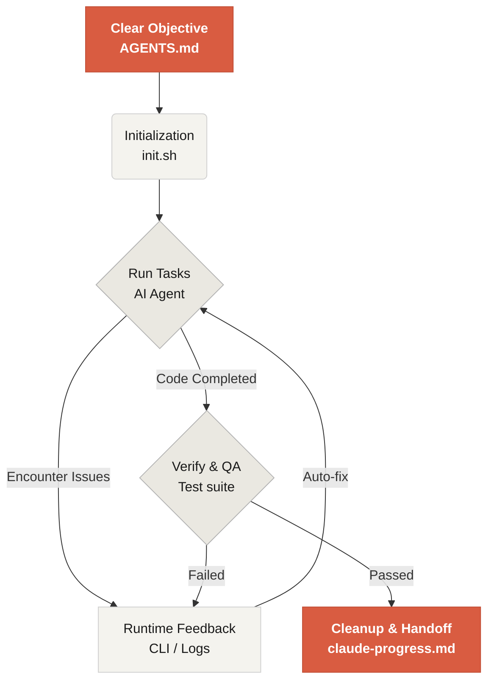

# Bienvenue dans Learn Harness Engineering

Learn Harness Engineering est un cours consacré à l'ingénierie des agents de codage IA. Nous avons étudié et synthétisé des théories et pratiques avancées de Harness Engineering utilisées dans l'industrie. Nos références principales sont :
- [OpenAI: Harness engineering: leveraging Codex in an agent-first world](https://openai.com/index/harness-engineering/)
- [Anthropic: Effective harnesses for long-running agents](https://www.anthropic.com/engineering/effective-harnesses-for-long-running-agents)
- [Anthropic: Harness design for long-running application development](https://www.anthropic.com/engineering/harness-design-long-running-apps)
- [Awesome Harness Engineering](https://github.com/walkinglabs/awesome-harness-engineering)

Grâce à une conception systématique de l'environnement, de l'état, de la vérification et des mécanismes de contrôle, ce cours montre comment rendre réellement fiables des outils agentiques de codage comme Codex et Claude Code. Vous apprendrez à construire des fonctionnalités, corriger des bugs et automatiser des tâches de développement en encadrant votre assistant de codage IA avec des règles et des limites explicites.

## Commencer

Choisissez votre parcours d'apprentissage. Le cours est divisé en leçons théoriques, projets pratiques et bibliothèque de ressources prêtes à copier.

  <a href="./lectures/lecture-01-why-capable-agents-still-fail/" class="card">
    <h3>Leçons</h3>
    
Comprendre pourquoi des modèles puissants échouent encore et apprendre la théorie des harnesses efficaces.

  </a>
  <a href="./projects/" class="card">
    <h3>Projets</h3>
    
Pratique guidée pour construire de zéro un environnement agentique fiable.

  </a>
  <a href="./resources/" class="card">
    <h3>Bibliothèque de ressources</h3>
    
Modèles prêts à copier, comme AGENTS.md et feature_list.json, pour vos propres dépôts.

  </a>

## Le mécanisme central d'un harness

Un harness ne "rend pas le modèle plus intelligent" ; il met en place un **système de travail** en boucle fermée pour le modèle. Le flux central peut être compris avec ce schéma :

## Ce que vous apprendrez

Voici quelques concepts clés que vous maîtriserez :

<ul class="index-list">
  <li><strong>Contraindre le comportement de l'agent</strong> avec des règles et des limites explicites.</li>
  <li><strong>Maintenir le contexte</strong> sur des tâches longues et multi-sessions.</li>
  <li><strong>Empêcher les agents</strong> de déclarer la victoire trop tôt.</li>
  <li><strong>Vérifier le travail</strong> avec des tests de pipeline complet et de l'auto-évaluation.</li>
  <li><strong>Rendre le runtime observable</strong> et débogable.</li>
</ul>

## Étapes suivantes

Une fois les concepts de base compris, ces guides permettent d'aller plus loin :

<ul class="index-list">
  <li><a href="./lectures/lecture-01-why-capable-agents-still-fail/">Leçon 01 : Pourquoi les agents capables échouent encore</a> : commencez par la théorie du harness engineering.</li>
  <li><a href="./projects/project-01-baseline-vs-minimal-harness/">Projet 01 : Baseline vs harness minimal</a> : parcourez votre première tâche réelle.</li>
  <li><a href="./resources/templates/">Modèles</a> : récupérez le pack minimal de harness pour vos propres projets.</li>
</ul>
