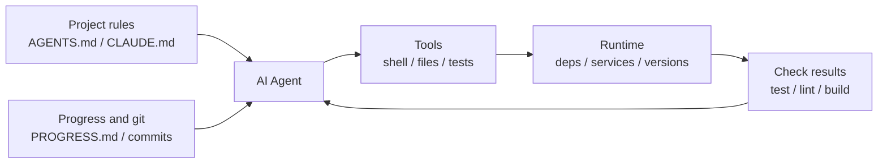

[中文版本 →](../../../zh/lectures/lecture-02-what-a-harness-actually-is/)

> Exemples de code : [code/](https://github.com/walkinglabs/learn-harness-engineering/blob/main/docs/fr/lectures/lecture-02-what-a-harness-actually-is/code/)
> Projet pratique : [Project 01. Prompt-only vs. rules-first](./../../projects/project-01-baseline-vs-minimal-harness/index.md)

# Leçon 02. Ce que signifie vraiment harness

Le mot « harness » est omniprésent dans les cercles d'agents de codage IA, mais honnêtement, la plupart des gens veulent dire « un fichier de prompt » quand ils disent harness. Ce n'est pas un harness. C'est comme ouvrir un restaurant avec seulement des ingrédients — pas de cuisinière, pas de couteaux, pas de recettes, pas de flux de dressage des assiettes. Ce n'est pas un restaurant. C'est un réfrigérateur.

Cette leçon vous donne une définition précise et opérationnelle du harness. Pas une abstraction académique, mais un cadre que vous pouvez utiliser dès aujourd'hui : un harness se compose de cinq sous-systèmes, chacun avec des responsabilités et des critères d'évaluation clairs.

## Commençons par une analogie

Imaginez que vous êtes un ingénieur nouvellement embauché, propulsé dans un projet sans aucune documentation. Pas de README, pas de commentaires dans le code, personne ne vous dit comment lancer les tests, la config CI est enterrée quelque part. Pouvez-vous écrire du bon code ? Peut-être — si vous êtes assez intelligent et patient. Mais vous passerez un temps considérable à « comprendre de quoi parle ce projet » plutôt qu'à « résoudre le problème ».

Un agent IA fait face exactement à la même situation. Et c'est pire — vous pouvez au moins demander à un collègue. L'agent ne peut voir que les fichiers que vous mettez devant lui et les commandes qu'il peut exécuter. Il ne peut pas taper quelqu'un sur l'épaule et demander « hey, quelle version de l'ORM ce projet utilise-t-il ? »

OpenAI formule le principe fondamental ainsi : « le repo EST la spécification » — tout le contexte nécessaire devrait se trouver dans le dépôt, livré via des fichiers d'instructions structurés, des commandes de vérification explicites et une organisation claire des répertoires. La documentation d'Anthropic sur les agents longue durée met l'accent sur la persistance de l'état, les chemins de récupération explicites et le suivi structuré de la progression. Les deux entreprises se concentrent sur des aspects différents, mais elles disent la même chose : **tout ce qui se trouve dans l'infrastructure d'ingénierie en dehors du modèle détermine quelle part de la capacité du modèle est réellement exploitée.**

Regardez quelques outils que vous connaissez déjà :

**Claude Code** incarne la pensée harness. Il lit `CLAUDE.md` depuis votre repo (étagère à recettes), peut exécuter des commandes shell (râtelier à couteaux), s'exécute dans votre environnement local (cuisinière), maintient un historique de session (plan de travail), et peut lancer des tests et voir les résultats (fenêtre de contrôle qualité). Mais si vous ne lui dites pas comment lancer les tests, la fenêtre de contrôle qualité est en panne — personne ne sait si le plat est complètement cuit.

**Cursor** suit une logique similaire. Son fichier `.cursorrules` est l'étagère à recettes, le terminal est le râtelier à couteaux, il lit la structure de votre projet et la config lint pour la cuisinière. Mais la gestion d'état de Cursor est relativement faible — fermez l'IDE et rouvrez-le, et le contexte précédent a disparu.

**Codex** (l'agent de codage d'OpenAI) utilise des git worktrees pour isoler l'environnement d'exécution de chaque tâche, couplé à une pile d'observabilité locale (logs, métriques, traces), de sorte que chaque modification est vérifiée dans un environnement indépendant. Dans les repos avec `AGENTS.md` et des commandes de vérification claires, il performe bien mieux que dans les repos « nus ».

**AutoGPT** est l'exemple à ne pas suivre — l'absence de gestion structurée de l'état conduit à une accumulation de contexte dans les tâches longues, et l'absence de mécanismes de retour précis fait boucler l'agent. Beaucoup de gens disent qu'AutoGPT « ne fonctionne pas », mais en réalité c'est le harness d'AutoGPT qui ne fonctionne pas — donnez à un chef une cuisinière cassée et même les meilleurs ingrédients ne produiront pas un repas.

## Concepts clés

- **Qu'est-ce qu'un harness** : Tout ce qui se trouve dans l'infrastructure d'ingénierie en dehors des poids du modèle. OpenAI résume le travail fondamental de l'ingénieur en trois choses : concevoir des environnements, exprimer l'intention et construire des boucles de retour. Anthropic appelle son Claude Agent SDK un « agent harness généraliste ».
- **Le repo est l'unique source de vérité** : Tout ce que l'agent ne peut pas voir, en pratique, n'existe pas. OpenAI traite le repo comme le « système de référence » — tout le contexte nécessaire doit y vivre, via des fichiers structurés et une organisation claire des répertoires.
- **Donnez un plan, pas un manuel** : L'expérience d'OpenAI — `AGENTS.md` devrait être une page de sommaire, pas une encyclopédie. Une centaine de lignes suffit. Si ça ne tient pas, découpez-le dans le répertoire `docs/` et laissez l'agent lire à la demande.
- **Contraindre, pas micromanager** : Un bon harness utilise des règles exécutables pour contraindre l'agent, plutôt que d'énumérer les instructions une par une. OpenAI dit « imposez des invariants, ne micromanagez pas l'implémentation » ; Anthropic a constaté que les agents font l'éloge de leur propre travail en toute confiance, et la solution est de séparer « celui qui fait le travail » de « celui qui vérifie le travail ».
- **Retirer les composants un par un** : Pour quantifier la valeur de chaque composant du harness, retirez-les un par un et observez quel retrait provoque la plus forte baisse de performance. Anthropic a utilisé cette méthode et a découvert qu'à mesure que les modèles deviennent plus puissants, certains composants cessent d'être critiques — mais de nouveaux apparaissent toujours.

## Le modèle de harness à cinq sous-systèmes

Retour à l'analogie de la cuisine. Une cuisine complète possède cinq zones fonctionnelles, et un harness possède cinq sous-systèmes :



**Sous-système d'instructions (étagère à recettes)** : Créez `AGENTS.md` (ou `CLAUDE.md`) contenant un aperçu du projet et son objectif (une phrase), la stack technique et les versions (Python 3.11, FastAPI 0.100+, PostgreSQL 15), les commandes de premier lancement (`make setup`, `make test`), les contraintes strictes non négociables (« Toutes les API doivent utiliser OAuth 2.0 »), et des liens vers une documentation plus détaillée.

**Sous-système d'outils (râtelier à couteaux)** : Assurez-vous que l'agent dispose d'un accès suffisant aux outils. Ne désactivez pas le shell pour des raisons de « sécurité » — si l'agent ne peut même pas lancer `pip install`, comment est-il censé travailler ? Mais n'ouvrez pas tout non plus — suivez le principe du moindre privilège.

**Sous-système d'environnement (cuisinière)** : Rendez l'état de l'environnement auto-descriptif. Utilisez `pyproject.toml` ou `package.json` pour verrouiller les dépendances, `.nvmrc` ou `.python-version` pour les versions d'exécution, Docker ou devcontainers pour la reproductibilité.

**Sous-système d'état (plan de travail)** : Les tâches longues nécessitent un suivi de progression. Utilisez un simple fichier `PROGRESS.md` enregistrant : ce qui est terminé, ce qui est en cours, ce qui est bloqué. Mettez à jour avant la fin de chaque session, lisez au démarrage de la session suivante.

**Sous-système de retour (fenêtre de contrôle qualité)** : C'est le sous-système au meilleur retour sur investissement. Listez explicitement les commandes de vérification dans `AGENTS.md` :
```
Verification commands:
- Tests: pytest tests/ -x
- Type check: mypy src/ --strict
- Lint: ruff check src/
- Full verification: make check (includes all above)
```

L'absence d'un sous-système est comme l'absence d'une zone fonctionnelle dans la cuisine — vous pouvez toujours cuisiner, mais c'est toujours laborieux.

**Diagnostiquer la qualité du harness** : Utilisez le « contrôle isométrique du modèle ». Gardez le modèle fixe, retirez les sous-systèmes un par un, mesurez quel retrait provoque la plus forte baisse de performance. C'est votre goulot d'étranglement — concentrez vos efforts là-dessus. Comme trouver le goulot d'étranglement dans une cuisine : retirez l'étagère à recettes et voyez combien les choses ralentissent, coupez la cuisinière et observez l'impact.

## L'histoire vraie d'une équipe

Une équipe a utilisé GPT-4o sur une application frontend TypeScript + React (~20 000 lignes de code). Ils ont traversé quatre étapes — essentiellement ajouter des équipements de cuisine un par un :

**Étape 1 — Cuisine vide** : Seulement une description basique du projet dans le README. 1 essai sur 5 a réussi (20 %). Principaux échecs : mauvais choix de gestionnaire de paquets (npm vs yarn), non-respect des conventions de nommage des composants, impossibilité de lancer les tests.

**Étape 2 — Étagère à recettes installée** : Ajout de `AGENTS.md` avec les versions de la stack technique, les conventions de nommage, les décisions architecturales clés. Le taux de réussite est passé à 60 %. Les échecs restants concernaient principalement des problèmes d'environnement et l'absence de vérification.

**Étape 3 — Fenêtre de contrôle qualité ouverte** : Liste des commandes de vérification dans `AGENTS.md` : `yarn test && yarn lint && yarn build`. Le taux de réussite est passé à 80 %.

**Étape 4 — Plan de travail prêt** : Introduction de modèles de fichiers de progression où les agents enregistraient le travail terminé et non terminé à chaque exécution. Le taux de réussite s'est stabilisé entre 80 et 100 %.

Quatre itérations, le modèle n'a pas du tout changé, le taux de réussite est passé de 20 % à près de 100 %. C'est la puissance du harness engineering. Vous n'avez pas acheté d'ingrédients plus chers — vous avez simplement organisé la cuisine correctement.

## Points clés

- Harness = Instructions + Outils + Environnement + État + Retour. Cinq sous-systèmes, comme les cinq zones fonctionnelles d'une cuisine — tous essentiels.
- Si ce ne sont pas les poids du modèle, c'est du harness. Votre harness détermine quelle part de la capacité du modèle est réellement exploitée.
- Parmi les cinq sous-systèmes, le sous-système de retour offre généralement l'investissement le plus faible et le rendement le plus élevé. Configurez d'abord vos commandes de vérification — la fenêtre de contrôle qualité est l'amélioration la plus rentable.
- Utilisez le « contrôle isométrique du modèle » pour quantifier la contribution marginale de chaque sous-système — ne vous fiez pas à votre intuition.
- Le harness se dégrade comme le code. Auditez régulièrement, remboursez la dette de harness comme vous remboursez la dette technique.

## Pour aller plus loin

- [OpenAI: Harness Engineering](https://openai.com/index/harness-engineering/)
- [Anthropic: Effective Harnesses for Long-Running Agents](https://www.anthropic.com/engineering/effective-harnesses-for-long-running-agents)
- [HumanLayer: Harness Engineering for Coding Agents](https://humanlayer.dev/articles/harness-engineering-for-coding-agents/)
- [SWE-agent: Agent-Computer Interfaces](https://github.com/princeton-nlp/SWE-agent)
- [Thoughtworks: Harness Engineering on Technology Radar](https://www.thoughtworks.com/radar)

## Exercices

1. **Audit harness en cinq tuples** : Prenez un projet où vous utilisez un agent IA et faites un audit complet en utilisant le cadre à cinq tuples. Notez chaque sous-système de 1 à 5. Trouvez le sous-système ayant la note la plus basse, passez 30 minutes à l'améliorer, puis observez le changement de performance de l'agent.

2. **Expérience de contrôle isométrique du modèle** : Choisissez un modèle et une tâche difficile. Retirez séquentiellement les instructions (supprimez AGENTS.md), retirez le retour (ne fournissez pas de commandes de vérification), retirez l'état (pas de fichiers de progression) — ne retirez qu'un seul élément à la fois et mesurez la baisse de performance. En fonction des résultats, classez l'importance des sous-systèmes pour votre projet.

3. **Analyse des affordances** : Trouvez un scénario où l'agent dans votre projet « veut faire quelque chose mais ne peut pas » (par ex., sait qu'il devrait utiliser des requêtes paramétrées mais ne connaît pas les patterns ORM de votre projet). Analysez s'il s'agit d'un Golfe d'Exécution (ne sait pas comment) ou d'un Golfe d'Évaluation (ne sait pas si c'est correct), puis concevez une amélioration du harness pour combler ce fossé.
