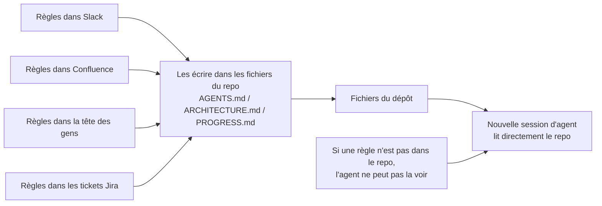
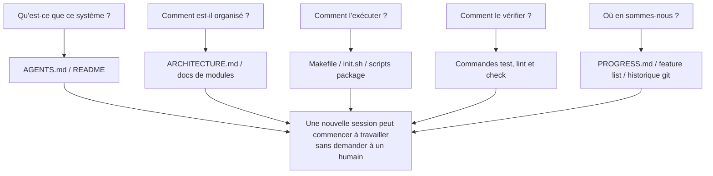

[中文版本 →](../../../zh/lectures/lecture-03-why-the-repository-must-become-the-system-of-record/)

> Exemples de code : [code/](https://github.com/walkinglabs/learn-harness-engineering/blob/main/docs/fr/lectures/lecture-03-why-the-repository-must-become-the-system-of-record/code/)
> Projet pratique : [Projet 02. Espace de travail lisible par les agents](./../../projects/project-02-agent-readable-workspace/index.md)

# Leçon 03. Faire du dépôt la source unique de vérité

Les décisions d'architecture de votre équipe sont dispersées entre Confluence, Slack, Jira et la tête de quelques ingénieurs seniors. Pour les humains, cela fonctionne tout juste : vous pouvez demander à un collègue, chercher dans l'historique du chat, fouiller la documentation. En dernier recours, vous pouvez coincer quelqu'un en salle de pause. Mais pour un agent IA, l'information qui n'est pas dans le dépôt n'existe tout simplement pas.

Ce n'est pas une exagération. Pensez à ce que sont réellement les entrées d'un agent : prompts système et descriptions de tâche, contenu des fichiers du dépôt, sorties d'outils. C'est tout. Votre historique Slack, vos tickets Jira, vos pages Confluence, et cette décision d'architecture discutée autour d'un café un vendredi après-midi : l'agent ne voit rien de tout cela. Il ne peut pas "aller demander à quelqu'un" ni "chercher dans l'historique du chat". C'est un ingénieur enfermé dans le dépôt ; de tout ce qui est dehors, il ne sait rien.

La question devient donc : allez-vous donner une bonne carte à cet ingénieur ?

## Ce qui doit figurer sur la carte

OpenAI le formule clairement : **l'information qui n'existe pas dans le repo n'existe pas pour l'agent.** Ils appellent cela le principe "repo as spec" : le dépôt lui-même est le document de spécification ayant la plus haute autorité.

La documentation d'Anthropic sur les agents de longue durée dit la même chose : l'état persistant est une condition nécessaire à la continuité des tâches longues. La capacité à récupérer les connaissances entre sessions détermine directement les taux de réussite. Et cet état doit exister dans le dépôt, car c'est le seul stockage stable et accessible dont dispose l'agent.

Vous pourriez penser : "Notre équipe est petite, le savoir est dans la tête de tout le monde, et ça marche." Pour les humains, oui. Mais si vous utilisez un agent, acceptez ce fait : l'agent ne peut pas demander aux gens. Tout ce qu'il doit savoir doit être écrit et placé là où il peut le trouver.

Il ne s'agit pas "d'écrire plus de documentation". Il s'agit de "mettre l'information de décision au bon endroit". Un `ARCHITECTURE.md` de 50 lignes dans le répertoire `src/api/` est dix mille fois plus utile qu'un document de conception de 500 pages dans Confluence que personne ne maintient. C'est comme une carte de bureau dessinée à la main et collée sur votre table, comparée à un magnifique plan d'architecte enfermé dans un classeur : la première est là quand vous en avez besoin ; le second est techniquement supérieur, mais inutile dans l'instant.

## Visibilité du savoir



Comment tester si votre carte est suffisante ? Lancez un "test de démarrage à froid" : ouvrez une toute nouvelle session d'agent en utilisant uniquement le contenu du dépôt et voyez si elle peut répondre à cinq questions de base :



Si elle ne peut pas répondre, la carte a des zones blanches. Là où la carte est vide, l'agent devine : les mauvaises suppositions deviennent des bugs, et trop deviner gaspille du contexte. Et chaque nouvelle session recommence à deviner. Le coût de la supposition est toujours supérieur au coût de dessiner correctement la carte dès le départ.

## Concepts clés

- **Knowledge Visibility Gap** : proportion du savoir total du projet qui N'EST PAS dans le dépôt. Plus l'écart est grand, plus le taux d'échec de l'agent augmente. Combien de savoir implicite sur ce projet vit dans votre tête ? Comptez tout, puis voyez ce qui est arrivé dans le repo : la différence est votre écart de visibilité.
- **System of Record** : le dépôt de code comme source autorisée pour les décisions de projet, contraintes d'architecture, état d'exécution et standards de vérification. Le repo a le dernier mot ; rien d'autre ne compte. Comme une carte qui indique "route fermée" : vous n'y allez pas. Mais si cette information n'existe que dans la tête d'une personne, il faut lui demander à chaque fois.
- **Cold-Start Test** : les cinq questions ci-dessus. Le nombre de réponses indique le degré de complétude de votre carte.
- **Discovery Cost** : budget de contexte que l'agent brûle pour trouver une information clé dans le dépôt. Plus l'information est cachée, plus le coût de découverte est élevé, et moins il reste de budget pour la tâche réelle. Cacher une information critique dans un README dix niveaux plus bas, c'est comme enfermer l'extincteur dans un coffre au sous-sol : il existe, mais vous ne le trouvez pas quand vous en avez besoin.
- **Knowledge Decay Rate** : proportion d'entrées de connaissance qui deviennent obsolètes par unité de temps. Une documentation désynchronisée du code est le plus grand ennemi, pire que pas de documentation du tout.
- **ACID Analogy** : appliquer les principes de transaction de base de données (Atomicity, Consistency, Isolation, Durability) à la gestion d'état des agents. Nous détaillons cela ci-dessous.

## Comment dessiner une bonne carte

**Principe 1 : le savoir vit près du code.** Une règle sur l'authentification des endpoints API doit être à côté du code API, pas enterrée dans un énorme document global. Placez un court document dans chaque répertoire de module expliquant ses responsabilités, interfaces et contraintes particulières. Comme les étiquettes de rayons en bibliothèque : vous voulez des livres d'histoire, vous allez directement au rayon "Histoire". Pas besoin de fouiller toute la bibliothèque.

**Principe 2 : utilisez un fichier d'entrée standardisé.** `AGENTS.md` (ou `CLAUDE.md`) est la page d'accueil de l'agent. Il n'a pas besoin de contenir toute l'information, mais il doit permettre à l'agent de répondre vite à trois questions : "Qu'est-ce que ce projet ?", "Comment l'exécuter ?" et "Comment le vérifier ?". 50-100 lignes suffisent.

**Principe 3 : minimal mais complet.** Chaque élément de savoir doit avoir un cas d'usage clair. Si supprimer une règle n'affecte pas la qualité de décision de l'agent, cette règle ne devrait pas exister. Mais chaque question du test de démarrage à froid doit avoir une réponse. C'est un équilibre délicat : ni trop, ni trop peu, juste assez.

**Principe 4 : mettez à jour avec le code.** Liez les mises à jour de connaissance aux changements de code. L'approche la plus simple : placer les documents d'architecture dans le répertoire du module correspondant. Quand vous modifiez le code, vous voyez naturellement le document. Après les changements de code, CI peut vous rappeler de vérifier si les docs doivent être mises à jour.

**Structure concrète du repo** :

```
project/
├── AGENTS.md              # Entry: project overview, run commands, hard constraints
├── src/
│   ├── api/
│   │   ├── ARCHITECTURE.md  # API layer architecture decisions
│   │   └── ...
│   ├── db/
│   │   ├── CONSTRAINTS.md   # Database operation hard constraints
│   │   └── ...
│   └── ...
├── PROGRESS.md             # Current progress: done, in-progress, blocked
└── Makefile                # Standardized commands: setup, test, lint, check
```

## Gérer l'état des agents avec les principes ACID

Cette analogie vient de la gestion des transactions en base de données. Vous pouvez penser que cela complique les choses, mais elle fournit en réalité un cadre très pratique :

- **Atomicity** : chaque "opération logique" (par exemple "ajouter un nouvel endpoint et mettre à jour les tests") correspond à un commit git. Si elle échoue en cours de route, `git stash` permet de revenir en arrière. Tout ou rien : pas de "à moitié fait".
- **Consistency** : définissez des prédicats de vérification d'un "état cohérent" : tous les tests passent, le lint ne rapporte aucune erreur. L'agent exécute la vérification après chaque opération ; les états intermédiaires incohérents ne sont pas commités. Comme un virement bancaire : on ne débite pas sans créditer.
- **Isolation** : quand plusieurs agents travaillent en parallèle, concevez les fichiers d'état pour éviter les conditions de course. Approche simple : chaque agent utilise son propre fichier de progrès, ou des branches git assurent l'isolation. Deux cuisiniers ne peuvent pas assaisonner la même marmite en même temps : qui est responsable si c'est trop salé ?
- **Durability** : le savoir critique du projet vit dans des fichiers suivis par git. L'état temporaire peut rester en mémoire de session, mais le savoir entre sessions doit être persisté dans des fichiers. Ce qui est dans votre tête ne compte pas ; seul ce qui est écrit compte.

## Une vraie histoire de transformation

Une équipe maintenait une plateforme e-commerce avec environ 30 microservices. Les décisions d'architecture (protocoles de communication interservices, stratégies de cohérence des données, règles de versioning API) étaient dispersées entre Confluence (partiellement obsolète), Slack (difficile à rechercher), la tête de quelques ingénieurs seniors (non scalable) et des commentaires de code sporadiques (pas systématiques).

Après l'introduction d'agents IA, 70% des tâches nécessitaient une intervention humaine. Presque chaque échec impliquait que l'agent violait une contrainte implicite que "tout le monde connaît mais que personne n'a écrite". C'est comme un nouvel employé à qui personne n'a dit "tu dois poster ta commande de déjeuner dans le chat du groupe" : il devine mal, se fait reprendre, mais après la remarque personne n'écrit la règle.

L'équipe a mené une transformation :
1. Création d'un `AGENTS.md` à la racine du repo avec aperçu du projet, versions du stack technique et contraintes globales dures
2. Ajout d'un `ARCHITECTURE.md` dans chaque répertoire de microservice décrivant responsabilités, interfaces et dépendances
3. Création d'un `CONSTRAINTS.md` centralisé avec les contraintes dures en langage explicite "MUST/MUST NOT"
4. Ajout d'un `PROGRESS.md` dans chaque répertoire de service pour suivre l'état de travail actuel

Après transformation, le même agent pouvait répondre à toutes les questions clés du projet au démarrage à froid, et la qualité d'achèvement des tâches s'est nettement améliorée.

## Points clés

- Le savoir absent du repo n'existe pas pour l'agent. Mettre les décisions critiques dans le repo est l'investissement harness le plus fondamental : dessinez une bonne carte pour ne pas vous perdre.
- Utilisez le "test de démarrage à froid" pour évaluer la qualité du repo : une session fraîche peut-elle répondre à cinq questions de base avec le seul contenu du dépôt ?
- Le savoir doit être près du code, minimal mais complet, et mis à jour avec le code. Il ne s'agit pas d'écrire plus de docs, mais de mettre l'information au bon endroit.
- Utilisez les principes ACID pour l'état des agents : commits atomiques, vérification de cohérence, isolation de la concurrence, savoir critique durable.
- La dégradation du savoir est le plus grand ennemi. Une documentation désynchronisée du code est plus dangereuse qu'une absence de documentation : elle envoie l'agent dans la mauvaise direction alors qu'il pense avoir raison.

## Pour aller plus loin

- [OpenAI: Harness Engineering](https://openai.com/index/harness-engineering/)
- [Anthropic: Effective Harnesses for Long-Running Agents](https://www.anthropic.com/engineering/effective-harnesses-for-long-running-agents)
- [Infrastructure as Code — Martin Fowler](https://martinfowler.com/bliki/InfrastructureAsCode.html)
- [ADR: Architecture Decision Records](https://adr.github.io/)
- [The Twelve-Factor App](https://12factor.net/)

## Exercices

1. **Test de démarrage à froid** : ouvrez une session d'agent complètement fraîche dans votre projet (aucun contexte verbal, contenu du repo seulement). Posez cinq questions : Qu'est-ce que ce système ? Comment est-il organisé ? Comment l'exécuter ? Comment le vérifier ? Quel est l'avancement actuel ? Notez ce qu'il ne peut pas répondre, puis améliorez le repo jusqu'à ce qu'il puisse.

2. **Quantification de l'externalisation du savoir** : listez toutes les décisions et contraintes importantes pour le travail de développement dans votre projet. Marquez chacune comme étant dans ou hors du repo. Calculez votre Knowledge Visibility Gap (proportion hors repo). Faites un plan pour le descendre sous 10%.

3. **Évaluation ACID** : évaluez la gestion d'état de votre projet avec l'analogie ACID de cette leçon. Atomicity : les opérations d'agent peuvent-elles être annulées proprement ? Consistency : existe-t-il une vérification d'"état cohérent" ? Isolation : les agents concurrents se marchent-ils dessus ? Durability : tout le savoir intersessions est-il persisté ?
