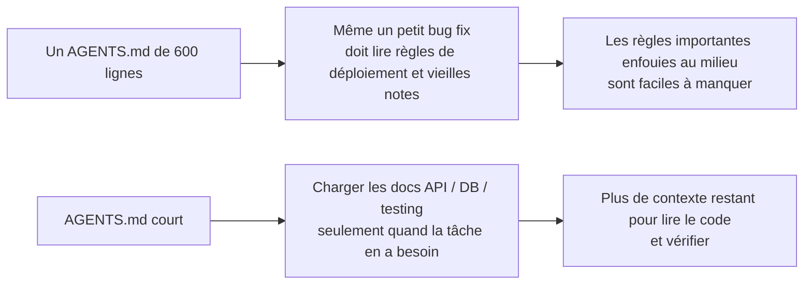
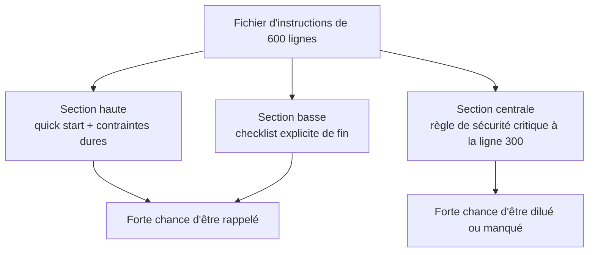

[中文版本 →](../../../zh/lectures/lecture-04-why-one-giant-instruction-file-fails/)

> Exemples de code : [code/](https://github.com/walkinglabs/learn-harness-engineering/blob/main/docs/fr/lectures/lecture-04-why-one-giant-instruction-file-fails/code/)
> Projet pratique : [Projet 02. Espace de travail lisible par les agents](./../../projects/project-02-agent-readable-workspace/index.md)

# Leçon 04. Répartir les instructions entre fichiers

Vous avez pris le harness engineering au sérieux. Vous avez créé un `AGENTS.md` et vous y avez mis toutes les règles, contraintes et leçons apprises auxquelles vous pouviez penser. Un mois plus tard, le fichier faisait 300 lignes ; deux mois plus tard, 450 ; trois mois plus tard, 600. Puis vous remarquez que les performances de l'agent se dégradent : sur une simple correction de bug, il consomme beaucoup de contexte à traiter des instructions de déploiement sans rapport ; une contrainte de sécurité critique enfouie à la ligne 300 est ignorée ; trois règles de style contradictoires font que l'agent en choisit une au hasard à chaque fois.

C'est le piège du "fichier d'instructions géant". C'est comme une valise trop remplie : tout semble utile, donc on tasse jusqu'à ce que la fermeture menace de céder. Pour trouver un sous-vêtement de rechange, il faut vider tout le sac. Vous transportez une valise pleine, mais vous n'utilisez peut-être qu'un tiers de ce qu'elle contient.

## Le cycle vicieux à la racine

Le cycle vicieux le plus courant ressemble à ceci : l'agent fait une erreur, vous dites "ajoutons une règle pour empêcher ça", vous l'ajoutez à `AGENTS.md`, cela fonctionne temporairement, l'agent fait une autre erreur, vous ajoutez une autre règle, vous recommencez, et le fichier enfle hors de contrôle.

Ce n'est pas votre faute. C'est une réaction très naturelle : ajouter une règle chaque fois que quelque chose se passe mal paraît raisonnable, comme mettre un objet de plus dans son sac en sortant "au cas où". Mais l'effet cumulatif est désastreux. Regardons précisément ce qui se dégrade.

**Le budget de contexte se fait dévorer.** La fenêtre de contexte de l'agent est finie. Supposons qu'il dispose d'une fenêtre de 200K tokens (un standard chez Claude). Un fichier d'instructions gonflé peut consommer 10-20K tokens. Il semble rester beaucoup de place ? Mais une tâche complexe peut exiger de lire des dizaines de fichiers source, les sorties d'outils prennent aussi du contexte, et l'historique de conversation s'accumule. Au moment où l'agent doit comprendre le code, le budget est déjà serré, comme une valise tellement pleine d'objets "au cas où" qu'il n'y a plus de place pour l'ordinateur portable.

**Perdu au milieu.** L'article "Lost in the Middle" (Liu et al., 2023) a montré clairement que les LLM utilisent les informations situées au milieu de longs textes nettement moins efficacement que celles du début ou de la fin. Votre `AGENTS.md` fait 600 lignes, et la ligne 300 dit "toutes les requêtes de base de données doivent utiliser des requêtes paramétrées" : c'est une contrainte de sécurité forte. Mais elle est enfouie au milieu, et l'agent l'ignorera très probablement. Comme cette bouteille de crème solaire au fond d'une valise trop pleine : vous savez qu'elle est là, vous fouillez trois fois, vous ne la trouvez pas, et vous finissez par en racheter une.

**Conflits de priorité.** Le fichier mélange des contraintes non négociables ("never use eval()"), des lignes directrices importantes ("prefer functional style") et une leçon historique spécifique ("une fuite mémoire WebSocket a été corrigée la semaine dernière, surveiller les motifs similaires"). Ces trois règles ont des niveaux d'importance complètement différents, mais elles se ressemblent dans le fichier. L'agent n'a aucun signal fiable pour les distinguer, comme si votre passeport et votre câble de charge étaient mélangés dans la valise sans moyen de savoir lequel est le plus urgent.

**Déclin de maintenance.** Les gros fichiers sont intrinsèquement difficiles à maintenir. Les instructions obsolètes sont rarement supprimées, car les conséquences d'une suppression sont incertaines ("peut-être que quelque chose dépend de cette règle"), tandis que l'ajout de nouvelles instructions paraît gratuit. Résultat : le fichier ne fait que grandir, ne rétrécit jamais, et le rapport signal-bruit baisse en continu. C'est exactement l'accumulation de dette technique appliquée aux instructions.

**Accumulation de contradictions.** Les instructions ajoutées à différents moments finissent par se contredire : l'une dit "utiliser TypeScript strict mode", l'autre dit "certains fichiers legacy autorisent les types any". L'agent choisit au hasard laquelle suivre à chaque fois. Comme si votre mère disait "couvre-toi" et votre père "ne mets pas trop de couches", et que vous restiez à la porte sans savoir qui écouter.

## Concepts clés

- **Instruction Bloat** : lorsqu'un fichier d'instructions occupe plus de 10-15% de la fenêtre de contexte, il commence à évincer le budget nécessaire à la lecture du code et au raisonnement sur la tâche. Un `AGENTS.md` de 600 lignes peut consommer 10 000-20 000 tokens, soit 8-15% d'une fenêtre de 128K avant même que l'agent commence.
- **Lost in the Middle Effect** : les travaux de Liu et al. en 2023 ont montré que les LLM utilisent beaucoup moins efficacement les informations au milieu de longs textes que celles du début ou de la fin. Une contrainte critique enfouie à la ligne 300 d'un fichier de 600 lignes a une forte probabilité d'être ignorée en pratique.
- **Instruction Signal-to-Noise Ratio (SNR)** : proportion des instructions d'un fichier qui sont pertinentes pour la tâche actuelle. Être obligé de lire 50 lignes de déploiement pendant une correction de bug, c'est un SNR faible.
- **Routing File** : fichier d'entrée court dont le rôle principal est d'orienter l'agent vers des documents plus détaillés, pas de tout contenir lui-même. 50-200 lignes suffisent.
- **Progressive Disclosure** : donner d'abord la vue d'ensemble, puis les détails quand ils deviennent nécessaires. Un bon design de harness ressemble à un bon design d'interface : ne pas déverser toutes les options d'un coup.
- **Priority Ambiguity** : lorsque toutes les instructions apparaissent au même format et au même endroit, l'agent ne peut pas distinguer les contraintes dures non négociables des simples recommandations.

## Architecture des instructions





## Comment découper

Principe central : gardez à portée de main les informations fréquemment nécessaires, rangez celles qui ne servent qu'occasionnellement, et supprimez ce que vous n'utiliserez jamais.

Le fichier d'entrée `AGENTS.md` reste entre 50 et 200 lignes et ne contient que les éléments les plus souvent utilisés : aperçu du projet (une ou deux phrases), commandes de premier lancement (`make setup && make test`), contraintes globales dures (pas plus de 15 règles non négociables), et liens vers des documents thématiques (description en une ligne + condition d'applicabilité).

```markdown
# AGENTS.md

## Vue d'ensemble du projet
Python 3.11 FastAPI backend, PostgreSQL 15 database.

## Quick Start
- Install: `make setup`
- Test: `make test`
- Full verification: `make check`

## Hard Constraints
- All APIs must use OAuth 2.0 authentication
- All database queries must use SQLAlchemy 2.0 syntax
- All PRs must pass pytest + mypy --strict + ruff check

## Topic Docs
- [API Design Patterns](docs/api-patterns.md) — Required reading when adding endpoints
- [Database Rules](docs/database-rules.md) — Required when modifying database operations
- [Testing Standards](docs/testing-standards.md) — Reference when writing tests
```

Chaque document thématique fait 50-150 lignes, organisé par sujet dans `docs/` ou près du module correspondant. L'agent ne les lit que lorsque c'est nécessaire. Comme des pochettes de rangement dans une valise : les sous-vêtements dans l'une, les produits de toilette dans une autre, les chargeurs dans une troisième. Trouver quelque chose n'exige pas de vider tout le sac.

Certaines informations sont mieux placées directement dans le code : définitions de types, commentaires d'interface, explications dans les fichiers de configuration. L'agent les voit naturellement en lisant le code, inutile de les dupliquer dans les instructions.

Chaque instruction devrait avoir une source ("pourquoi cette règle a-t-elle été ajoutée ?"), une condition d'applicabilité ("quand cette règle est-elle nécessaire ?") et une condition d'expiration ("dans quelles circonstances peut-on la supprimer ?"). Auditez régulièrement, retirez les entrées obsolètes, redondantes et contradictoires. Gérez vos instructions comme vos dépendances de code : les dépendances inutilisées doivent être supprimées, sinon elles ralentissent simplement le système.

Si une instruction doit absolument rester dans le fichier d'entrée, mettez-la en haut ou en bas, jamais au milieu. L'effet "lost in the middle" nous dit que les LLM exploitent bien mieux les informations aux extrémités qu'au centre. Mais la meilleure approche reste de déplacer les instructions dans des documents thématiques chargés à la demande.

OpenAI et Anthropic soutiennent implicitement cette approche de découpage. OpenAI dit que les fichiers d'entrée doivent être "courts et orientés routage", Anthropic dit que les informations de contrôle des agents de longue durée doivent être "concises et prioritaires". Ils disent la même chose : ne mettez pas tout dans un seul fichier. Une valise a besoin d'organisation, pas d'un bourrage en force.

## Exemple réel

Le `AGENTS.md` d'une équipe SaaS est passé de 50 à 600 lignes. Il mélangeait versions du stack technique, standards de code, notes historiques de correction de bugs, guides d'usage d'API, procédures de déploiement et préférences personnelles des membres de l'équipe : toute la valise était prête à éclater.

Les performances de l'agent ont commencé à décliner nettement : pendant de simples corrections de bugs, il dépensait beaucoup de contexte sur des instructions de déploiement sans rapport ; la contrainte de sécurité "toutes les requêtes de base de données doivent utiliser des requêtes paramétrées" était enfouie à la ligne 300 et souvent ignorée ; trois règles de style contradictoires provoquaient un comportement aléatoire.

L'équipe a effectué une "réorganisation de valise" :
1. `AGENTS.md` réduit à 80 lignes : seulement aperçu du projet, commandes d'exécution et 15 contraintes globales dures
2. Création de documents thématiques : `docs/api-patterns.md` (120 lignes), `docs/database-rules.md` (60 lignes), `docs/testing-standards.md` (80 lignes)
3. Ajout de liens vers ces documents dans le fichier de routage
4. Notes historiques converties en tests ou supprimées

Après refactorisation, le taux de réussite du même ensemble de tâches est passé de 45% à 72%. Le respect de la contrainte de sécurité est passé de 60% à 95%, parce qu'elle a été déplacée du milieu du fichier vers le haut du fichier de routage, et n'était plus "perdue au milieu".

## Points clés

- "Ajouter une règle" soulage à court terme, mais empoisonne à long terme. Avant d'ajouter une règle, demandez : serait-elle mieux dans un document thématique ? Ne continuez pas à tasser la valise.
- Le fichier d'entrée est un routeur, pas une encyclopédie. 50-200 lignes avec aperçu, contraintes dures et liens seulement.
- Exploitez l'effet "lost in the middle" : les informations importantes vont en haut ou en bas ; les informations moins importantes vont dans des documents thématiques.
- Gérez le gonflement des instructions comme de la dette technique. Audits réguliers ; chaque instruction a besoin d'une source, d'une condition d'applicabilité et d'une condition d'expiration.
- Après le découpage, le SNR s'améliore et l'agent dépense plus de budget de contexte sur la tâche réelle au lieu de traiter des instructions sans rapport.

## Pour aller plus loin

- [OpenAI: Harness Engineering](https://openai.com/index/harness-engineering/)
- [Anthropic: Effective Harnesses for Long-Running Agents](https://www.anthropic.com/engineering/effective-harnesses-for-long-running-agents)
- [Lost in the Middle: How Language Models Use Long Contexts](https://arxiv.org/abs/2307.03172)
- [HumanLayer: Harness Engineering for Coding Agents](https://humanlayer.dev/articles/harness-engineering-for-coding-agents/)
- [Nielsen Norman Group: Progressive Disclosure](https://www.nngroup.com/articles/progressive-disclosure/)

## Exercices

1. **Audit SNR** : prenez votre fichier actuel d'instructions d'entrée et listez toutes les instructions. Choisissez 5 types de tâches courantes et marquez si chaque instruction est pertinente pour cette tâche. Calculez le SNR pour chaque type de tâche. Les instructions qui sont du bruit pour la plupart des tâches doivent aller dans des documents thématiques.

2. **Refactorisation en progressive disclosure** : si vous avez un fichier d'instructions de plus de 300 lignes, découpez-le en : (a) un fichier de routage de moins de 100 lignes, (b) 3-5 documents thématiques. Exécutez le même ensemble de tâches (au moins 5) avant et après, puis comparez les taux de réussite.

3. **Vérification lost in the middle** : dans un long fichier d'instructions, placez une contrainte critique respectivement au début, au milieu et à la fin, en exécutant le même ensemble de tâches à chaque fois (au moins 5 exécutions par position). Observez s'il existe une différence de taux de conformité. L'effet de position peut être étonnamment fort.
