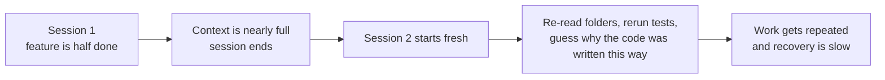
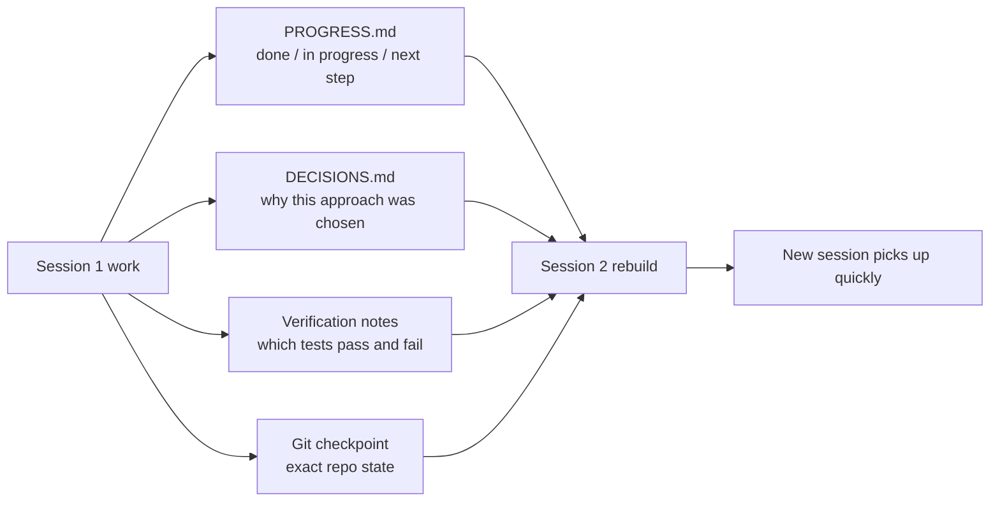

[中文版本 →](../../../zh/lectures/lecture-05-why-long-running-tasks-lose-continuity/)

> Exemples de code : [code/](https://github.com/walkinglabs/learn-harness-engineering/blob/main/docs/fr/lectures/lecture-05-why-long-running-tasks-lose-continuity/code/)
> Projet pratique : [Project 03. Multi-session continuity](./../../projects/project-03-multi-session-continuity/index.md)

# Leçon 05. Garder le contexte vivant entre les sessions

Vous demandez à Claude Code d'implémenter une fonctionnalité complète. Il tourne pendant 30 minutes, fait la majeure partie du travail, mais le contexte commence à manquer. Vous lancez une nouvelle session pour continuer — et découvrez qu'il ne se souvient pas des décisions prises la dernière fois, pourquoi l'option A a été choisie plutôt que l'option B, quels fichiers ont déjà été modifiés, ou dans quel état se trouvent les tests. Il passe 15 minutes à réexplorer le projet, et risque d'être en contradiction avec l'approche précédente.

Imaginez que vous êtes un artisan qui oublie tout chaque matin en vous réveillant. Vous devriez vous refamiliariser avec l'ensemble du chantier — quel mur est à moitié construit, pourquoi des briques rouges ont été choisies plutôt que des bleues, où en sont les passages de plomberie. Pire, vous pourriez arracher une fenêtre qui a déjà été installée hier, simplement parce que vous ne vous souveniez pas que c'était fait.

C'est exactement la situation dans laquelle se trouvent les agents de codage IA lors de tâches multi-sessions. Cette leçon explique pourquoi les agents « perdent le fil » pendant les tâches longues, et comment la persistance structurée de l'état peut les transformer en un artisan qui tient un journal fiable chaque jour — toujours amnésique, mais le journal se souvient de tout.

## Fenêtres de contexte : pas infinies

Les fenêtres de contexte sont finies. Ce n'est pas résolu par les mises à niveau de modèles — même si les tailles de fenêtre atteignent 1M de tokens, les tâches complexes les épuiseront toujours. Parce que les agents ne se contentent pas de générer du code ; ils comprennent les codebases, suivent leur propre historique de décisions, traitent les sorties des outils et maintiennent le contexte de conversation. Toutes ces informations croissent plus vite que l'expansion des fenêtres.

Un problème plus profond : les informations que l'agent produit ne sont pas uniformément importantes. Les étapes de raisonnement intermédiaires contiennent le « pourquoi » des décisions — pourquoi l'option B a été choisie plutôt que A, pourquoi cette bibliothèque plutôt qu'une autre, pourquoi une optimisation particulière a été écartée. La sortie finale ne contient que le « quoi » — le code lui-même. Les stratégies de compaction préservent généralement ce dernier mais perdent le premier. La session suivante voit le code mais ne sait pas pourquoi il est écrit de cette façon, et pourrait « optimiser » à tort une décision de conception délibérée.

Anthropic a découvert quelque chose de fascinant dans sa recherche sur les agents longue durée : quand les agents sentent que le contexte diminue, ils présentent un comportement de « convergence prématurée » — se précipitant pour terminer le travail en cours, sautant les étapes de vérification, ou choisissant une solution simple plutôt qu'optimale. C'est comme réaliser que le temps est presque écoulé à un examen et deviner rapidement les questions à choix multiples restantes. Anthropic appelle cela l'« anxiété de contexte ».

## Flux de continuité entre sessions

Sans artefacts de continuité, chaque nouvelle session est un désastre :



Avec des artefacts de continuité, les nouvelles sessions peuvent reprendre rapidement :



## Concepts clés

- **Les fenêtres de contexte sont finies** : Quelle que soit la taille de fenêtre annoncée (128K, 200K, 1M), les tâches longues finiront par les épuiser. Après épuisement, soit la compaction (perte d'informations) soit la réinitialisation (nouvelle session) est nécessaire. Les deux perdent quelque chose.
- **Artefacts de continuité** : Fichiers d'état persistés qui permettent à une nouvelle session de reprendre sans ambiguïté là où la précédente s'est arrêtée. La forme de base : journal de progression + enregistrement de vérification + actions suivantes. Le journal de l'artisan.
- **Coût de reconstruction** : Le temps nécessaire à une nouvelle session pour atteindre un état exécutable. Les bons harness peuvent comprimer le coût de reconstruction de 15 minutes à 3 minutes.
- **Dérive** : L'écart entre la compréhension de l'agent et l'état réel du dépôt de code. Chaque frontière de session introduit de la dérive ; sans contrôle, elle se cumule.
- **Anxiété de contexte** : Un phénomène observé par Anthropic — les agents présentent un comportement de convergence prématurée à l'approche des limites de contexte perçues, terminant les tâches prématurément pour éviter la perte d'informations. C'est une anxiété irrationnelle face aux ressources.
- **Compaction vs réinitialisation** : La compaction résume le contexte au sein de la même session (conserve le « quoi », peut perdre le « pourquoi ») ; la réinitialisation ouvre une nouvelle session reconstruisant à partir de l'état persisté (propre mais dépend de l'exhaustivité des artefacts).

## Ce qui se passe quand la continuité se brise

La session précédente a dépensé un budget de contexte significatif à analyser trois approches et choisir l'option B. L'agent de cette session ne connaît pas cette analyse et pourrait redécider sur la base d'informations incomplètes — choisissant potentiellement l'option A. Comme l'artisan amnésique qui ne se souvient pas pourquoi des briques rouges ont été choisies, regarde les bleues aujourd'hui et les trouve plus jolies, et démolit le mur d'hier pour reconstruire.

Pire encore est le travail en double. L'agent n'est pas sûr que certains travaux aient déjà été complétés et les refait. Ou pire — en fait la moitié, découvre un conflit avec l'implémentation existante, et doit tout reprendre. Sur un chantier de construction, deux équipes ne peuvent pas construire le même mur simultanément — mais sans registre de progression, la nouvelle équipe ne sait pas que quelqu'un travaille déjà dessus.

Au fil de plusieurs sessions, la direction d'implémentation peut avoir silencieusement dévié des exigences initiales. Chaque nouvelle session a une compréhension légèrement différente des objectifs du projet. Comme un jeu de téléphone arabe — après que dix personnes ont transmis le message, « passe me prendre un café » peut devenir « achète-moi une machine à café ».

Il y a aussi le fossé de vérification. Les résultats de vérification de la session précédente (quels tests passent, lesquels échouent, pourquoi ils échouent) n'ont pas été enregistrés. La nouvelle session doit relancer toutes les vérifications pour comprendre l'état actuel. Chaque session rediagnostique à partir de zéro, gaspillant chaque fois un contexte précieux.

OpenAI et Anthropic soulignent tous deux la persistance structurée de l'état dans leur documentation. L'article sur le harness engineering d'OpenAI traite le dépôt comme un « registre opérationnel » — chaque résultat d'opération devrait laisser une trace vérifiable dans le repo. La documentation d'Anthropic sur les agents longue durée recommande spécifiquement des « fichiers de passation » — des documents structurés contenant l'état actuel, les problèmes connus et les actions suivantes.

## Un journal pour l'artisan amnésique

Approche fondamentale : **Traitez l'agent comme un brillant ingénieur atteint d'amnésie.** Avant qu'il ne « termine sa journée », il doit noter les informations critiques pour que l'agent du « poste » suivant puisse prendre le relais rapidement.

**Outil 1 : Fichier de progression (PROGRESS.md).** L'artefact de continuité le plus basique — le cœur du journal :

```markdown
# Project Progress

## Current State
- Latest commit: abc1234 (feat: add user preferences endpoint)
- Test status: 42/43 passing (test_pagination_edge_case failing)
- Lint: passing

## Completed
- [x] User model and database migration
- [x] Basic CRUD endpoints
- [x] Auth middleware integration

## In Progress
- [ ] Pagination feature (90% - edge case test failing)

## Known Issues
- test_pagination_edge_case returns 500 on empty result sets
- Need to confirm whether deleted users should appear in listings

## Next Steps
1. Fix pagination edge case bug
2. Add "include deleted users" query parameter
3. Update API documentation
```

**Outil 2 : Journal des décisions (DECISIONS.md).** Enregistrez les décisions de conception importantes et leurs raisons. Pas besoin de documents de conception détaillés — juste « quelle décision, pourquoi, quand » — les mémos du journal :

```markdown
# Design Decisions

## 2024-01-15: Use Redis for user preferences caching
- Reason: High read frequency (every API call), small data size
- Rejected alternative: PostgreSQL materialized view (high change frequency makes maintenance cost not worthwhile)
- Constraint: Cache TTL of 5 minutes, active invalidation on write
```

**Outil 3 : Commits git comme points de contrôle.** Commitez après avoir terminé chaque unité de travail atomique. Les messages de commit devraient expliquer ce qui a été fait et pourquoi. Ce sont des instantanés d'état gratuits et automatiquement versionnés.

**Outil 4 : init.sh ou flux d'initialisation du harness.** Spécifiez dans `AGENTS.md` les routines de « prise de poste » et de « fin de service » :

```markdown
## At session start (clock in)
1. Read PROGRESS.md for current state
2. Read DECISIONS.md for important decisions
3. Run make check to confirm repo is in consistent state
4. Continue from PROGRESS.md "Next Steps" section

## Before session end (clock out)
1. Update PROGRESS.md
2. Run make check to confirm consistent state
3. Commit all completed work
```

**Stratégie mixte** : Toutes les tâches n'ont pas besoin d'une réinitialisation de contexte. Les tâches courtes (moins de 30 minutes) peuvent se terminer en une seule session. Les tâches longues (s'étalant sur plusieurs sessions) doivent utiliser des fichiers de progression et des journaux de décisions pour la continuité. Critère de décision : si une tâche nécessite plus de 60 % de la fenêtre, commencez à préparer la passation.

### Plongée approfondie sur l'anxiété de contexte

La recherche de mars 2026 d'Anthropic a révélé plus en détail les manifestations spécifiques de l'anxiété de contexte : sur Sonnet 4.5, lorsque le contexte approche de la limite de la fenêtre, l'agent montre un fort comportement de « convergence prématurée ». C'est comme réaliser que le temps est presque écoulé à un examen et remplir rapidement des réponses au hasard.

Deux stratégies y remédient :

**Compaction** : Résumer la conversation antérieure au sein de la même session. Avantage : maintient la continuité, l'agent peut voir le « quoi ». Inconvénient : le « pourquoi » est souvent perdu dans les résumés — pourquoi l'option B a été choisie plutôt que A, pourquoi une optimisation particulière a été écartée. Plus critiques encore, la compaction n'élimine pas l'anxiété de contexte — l'agent sait que le contexte a déjà été volumineux, et psychologiquement a toujours tendance à se précipiter vers la clôture.

**Réinitialisation de contexte** : Effacement complet du contexte, ouverture d'une nouvelle session, reconstruction à partir des artefacts persistés. Avantage : état mental propre — la nouvelle session n'a pas d'anxiété de « je manque de temps ». Inconvénient : dépend de l'exhaustivité des artefacts de passation. Si le journal manque d'informations critiques, la nouvelle session peut perdre du temps dans une mauvaise direction.

Les données réelles d'Anthropic : pour Sonnet 4.5, l'anxiété de contexte est suffisamment sévère pour que la compaction seule ne suffise pas — la réinitialisation de contexte devient un composant critique de la conception du harness. Mais pour Opus 4.5, ce comportement est grandement réduit, et la compaction peut gérer le contexte sans recourir aux réinitialisations. Cela signifie : **la conception du harness nécessite une compréhension spécifique du modèle cible, pas un modèle universel unique.**

> Source : [Anthropic: Harness design for long-running application development](https://www.anthropic.com/engineering/harness-design-long-running-apps)

## Exemple concret

Un agent a été chargé d'implémenter un système de blog avec authentification utilisateur — 12 points de fonctionnalité, estimation de 5 sessions nécessaires.

**Baseline sans le journal** : La session 1 a implémenté le modèle utilisateur et les routes de base. La session 2 a démarré sans que l'agent se souvienne du contrat d'interface du middleware d'authentification, passant ~15 minutes à déduire l'intention de conception précédente. Dès la session 3, la dérive accumulée a poussé l'agent à réimplémenter des fonctionnalités déjà complétées. À la session 5, le repo contenait beaucoup de code redondant mais la fonctionnalité d'authentification principale n'avait toujours pas passé les tests de bout en bout. Seulement 7 des 12 points de fonctionnalité complétés, dont 3 avec des problèmes de correction cachés. Comme l'artisan qui n'écrit jamais dans son journal — au cinquième jour, le chantier est chaotique, certains murs construits deux fois, d'autres qui auraient dû l'être ne sont même pas commencés.

**Avec le journal** : Utilisation de fichiers de progression, journaux de décisions, enregistrements de vérification et points de contrôle git. Le rapport d'état mis à jour automatiquement à la fin de chaque session. Le coût de reconstruction de la session 2 est tombé à ~3 minutes. À la session 5, les 12 points de fonctionnalité étaient complétés et vérifiés.

Comparaison quantitative : temps de reconstruction réduit de ~78 %, taux de complétion des fonctionnalités de 58 % à 100 %, taux de défauts cachés de 43 % à 8 %. L'artisan est toujours amnésique, mais avec le journal, chaque jour commence là où celui d'hier s'est arrêté, pas à zéro.

## Points clés

- Les fenêtres de contexte sont une ressource finie. Les tâches longues s'étaleront sur plusieurs sessions, et les sessions perdront de l'information — comme l'artisan qui oublie chaque jour, c'est une réalité objective.
- La solution n'est pas des fenêtres plus grandes — c'est une meilleure persistance de l'état. Fichiers de progression + journaux de décisions + points de contrôle git — donnez à l'artisan amnésique un journal fiable.
- Traitez l'agent comme un ingénieur atteint d'amnésie : avant de « terminer sa journée », notez ce qui a été fait, pourquoi, et ce qui reste à faire.
- Le coût de reconstruction est la métrique clé. Les bons harness devraient amener les nouvelles sessions à un état exécutable en moins de 3 minutes.
- Stratégie mixte : tâches courtes en session, tâches longues avec des artefacts structurés pour la continuité.

## Pour aller plus loin

- [Anthropic: Effective Harnesses for Long-Running Agents](https://www.anthropic.com/engineering/effective-harnesses-for-long-running-agents)
- [OpenAI: Harness Engineering](https://openai.com/index/harness-engineering/)
- [Lost in the Middle: How Language Models Use Long Contexts](https://arxiv.org/abs/2307.03172)
- [Claude Code Documentation](https://docs.anthropic.com/fr/docs/claude-code)
- [HumanLayer: Harness Engineering for Coding Agents](https://humanlayer.dev/articles/harness-engineering-for-coding-agents/)

## Exercices

1. **Mesure de la perte de continuité** : Choisissez une tâche de développement nécessitant au moins 3 sessions. Sans fournir aucun artefact de continuité, enregistrez au début de chaque session combien de contexte l'agent dépense à « comprendre ce qui s'est passé la dernière fois ». Après chaque session, créez un fichier de progression et laissez la session suivante démarrer à partir de celui-ci. Comparez les coûts de reconstruction avec et sans fichiers de progression.

2. **Conception d'un modèle de passation** : Concevez un modèle de passation minimal avec quatre champs : état du repo (hash de commit), état d'exécution (taux de réussite des tests), bloqueurs, actions suivantes. Laissez une toute nouvelle session d'agent restaurer l'état du projet en utilisant uniquement ce modèle. Enregistrez les ambiguïtés rencontrées lors de la restauration, itérez pour améliorer le modèle.

3. **Expérience de stratégie mixte** : Dans une tâche de développement en 5 sessions, comparez trois stratégies : (a) toujours démarrer de nouvelles sessions + fichiers de progression, (b) faire le maximum possible en une seule session (compaction de contexte), (c) stratégie mixte (tâches courtes en session, tâches longues sur plusieurs sessions + fichiers de progression). Comparez le temps de reconstruction, le taux de complétion des fonctionnalités et la cohérence des décisions.
