[中文版本 →](../../../zh/lectures/lecture-06-why-initialization-needs-its-own-phase/)

> Exemples de code : [code/](https://github.com/walkinglabs/learn-harness-engineering/blob/main/docs/fr/lectures/lecture-06-why-initialization-needs-its-own-phase/code/)
> Projet pratique : [Project 03. Multi-session continuity](./../../projects/project-03-multi-session-continuity/index.md)

# Leçon 06. Initialiser avant chaque session d'agent

Vous démarrez une nouvelle session d'agent et dites « ajoute une fonctionnalité de recherche ». Il se lance directement dans le code — un bel enthousiasme. Après 20 minutes, il découvre que le framework de test n'est pas correctement configuré, passe encore 10 minutes à le corriger, puis le format du script de migration de base de données est incorrect, encore des ajustements. La fonctionnalité de recherche finit par être ajoutée, mais toute la session a été inefficace — la majeure partie du temps a été consacrée à « comprendre comment fonctionne ce projet » plutôt qu'à écrire la fonctionnalité de recherche.

La meilleure approche : avant de laisser l'agent commencer à travailler, utiliser une phase séparée pour préparer l'environnement de base, faire passer les commandes de vérification, et faire comprendre la structure du projet. C'est comme construire une maison — vous ne coulez pas les fondations et n'érigez pas les murs simultanément. Si vous le faites, les murs montent avant que les fondations n'aient séché, et tout le bâtiment doit être démoli et recommencé. Coulez d'abord les fondations, laissez-les sécher, puis construisez les murs — propre et efficace.

Cette leçon explique pourquoi l'initialisation doit être une phase séparée, pas mélangée avec l'implémentation.

## Fondations et murs : deux travaux fondamentalement différents

L'initialisation et l'implémentation ont des cibles d'optimisation complètement différentes. La phase d'implémentation optimise pour : maximiser la quantité et la qualité des fonctionnalités vérifiées. La phase d'initialisation optimise pour : maximiser la fiabilité et l'efficacité de toutes les implémentations ultérieures.

Quand vous mélangez initialisation et implémentation, l'agent fait face à un problème d'optimisation multi-objectifs — construire simultanément l'infrastructure et écrire du code de fonctionnalité. Sans priorité explicite, l'agent se tourne naturellement vers l'écriture de code (parce que c'est une sortie directement visible) au détriment de l'infrastructure (parce que sa valeur ne se manifeste que dans les sessions suivantes). C'est comme demander à une équipe de construction de couler simultanément les fondations et de monter les murs — ils vont probablement se précipiter pour construire les murs parce que les murs sont visibles et démontrables. Mais une maison avec de mauvaises fondations aura des problèmes systémiques par la suite.

## Cycle de vie de l'initialisation

```mermaid
flowchart TB
    subgraph Wrong["Mixed session (wrong)"]
        W1["Start feature work immediately"] --> W2["Discover env and test gaps mid-task"]
        W2 --> W3["Accumulate unverified code"]
        W3 --> W4["Next session must rediscover project state"]
    end

    subgraph Right["Dedicated initialization (right)"]
        R1["Session 1: environment runnable"] --> R2["Example test passing"]
        R2 --> R3["Bootstrap contract + task list written"]
        R3 --> R4["Clean checkpoint committed"]
        R4 --> R5["Later sessions start directly on verified tasks"]
    end
```



## Ce qui se passe quand on les mélange

Le problème le plus direct : les fondations ne sèchent pas correctement. L'agent passe 80 % de ses efforts sur le code de fonctionnalité et 20 % à configurer vaguement de l'infrastructure. Le framework de test est configuré mais jamais vérifié, les règles lint sont définies mais trop laxistes, aucun fichier de progression créé. Ces défauts ne sont pas évidents lors de la première session (parce que l'agent se souvient encore de ce qu'il a fait), mais ils surgissent lors de la deuxième session — le nouvel agent ne sait pas comment lancer, tester, ou où en sont les choses. Fondations bâclées, bâtiment instable.

Un coût plus caché est l'« accumulation non vérifiée » — le code de fonctionnalité écrit avant que le framework de test ne soit configuré est du code sans vérification. Quand vous revenez enfin pour ajouter des tests à ce code, vous pourriez découvrir que la conception était fausse dès le départ — si vous l'aviez su, vous l'auriez implémenté différemment. Comme carreler sur du béton encore humide — quand vous découvrez que le sol n'est pas de niveau, toutes les tuiles doivent être arrachées et refaites.

Le budget de session est également gaspillé. Le travail d'initialisation (configurer les environnements, mettre en place les tests, comprendre la structure du projet) consomme un budget significatif, laissant moins pour l'implémentation réelle des fonctionnalités. Résultat : la première session ne complète que la moitié des fonctionnalités, et la deuxième session doit recommencer à comprendre le projet. Budget dépensé pour les fondations, mais les fondations ne sont pas solides non plus — aucun objectif atteint.

Le problème le plus facilement négligé est celui des mines d'hypothèses implicites. Les décisions que l'agent prend pendant l'initialisation (quel framework de test, comment organiser les répertoires, gestion des dépendances) — si elles ne sont pas explicitement enregistrées, les sessions suivantes ne peuvent pas comprendre ces choix. Pire, les sessions suivantes pourraient prendre des décisions contradictoires. La première équipe de construction a utilisé des fondations en béton, la deuxième ne le sait pas et y a enfoncé des pilotis en bois — les fondations se fissurent.

La recherche d'Anthropic sur le développement d'applications longue durée recommande explicitement de séparer l'initialisation de l'implémentation. Leurs données expérimentales : les projets utilisant une phase d'initialisation dédiée ont montré des taux de complétion de fonctionnalités 31 % plus élevés dans les scénarios multi-sessions par rapport aux approches mixtes. L'insight clé — le temps investi dans la phase d'initialisation est entièrement récupéré dans les 3-4 sessions suivantes. Plus les fondations sont solides, plus vite les murs montent.

Le guide de harness engineering d'OpenAI Codex souligne également le principe du « dépôt comme registre opérationnel » — établir une structure opérationnelle claire dès la première exécution, ou chaque nouvelle session doit ré-inférer les conventions du projet.

## Concepts clés

- **Phase d'initialisation** : La première phase du cycle de vie de l'agent — pas d'implémentation de fonctionnalité, seulement l'établissement des prérequis pour toutes les phases d'implémentation suivantes. La sortie n'est pas du code, c'est de l'infrastructure.
- **Contrat d'amorçage (Bootstrap Contract)** : Les conditions dans lesquelles un projet peut être exploité sans ambiguïté par une nouvelle session d'agent — peut démarrer, peut tester, peut voir la progression, peut reprendre les étapes suivantes. Quatre conditions, toutes obligatoires.
- **Démarrage à froid vs démarrage à chaud** : Le démarrage à froid part d'un répertoire vide où l'agent doit deviner la structure du projet ; le démarrage à chaud part d'un modèle ou d'un projet existant où l'infrastructure est déjà en place. Le démarrage à chaud surpasse largement le démarrage à froid — comme commencer à travailler sur un chantier avec eau courante et électricité versus partir d'un terrain nu.
- **Préparation à la passation (Handoff Readiness)** : Le projet est dans un état où, à tout moment, un agent neuf peut prendre le relais. Pas d'explication verbale nécessaire — seulement le contenu du repo.
- **Temps jusqu'à la première vérification (Time to First Verification)** : Le temps entre le début du projet et le moment où le premier point de fonctionnalité passe la vérification. C'est la métrique clé pour mesurer l'efficacité de l'initialisation.
- **Utilisabilité en aval** : La meilleure mesure de la qualité de l'initialisation — la proportion de sessions suivantes qui peuvent exécuter des tâches avec succès sans s'appuyer sur des connaissances implicites.

## Comment bien faire l'initialisation

**Traitez l'initialisation comme une phase dédiée.** La première session ne fait que de l'initialisation — aucun code de fonctionnalité métier. L'initialisation produit :

**1. Environnement exécutable.** Le projet démarre, les dépendances sont installées, aucun problème d'environnement. Fondations coulées, sans fissures.

**2. Framework de test vérifiable.** Au moins un test exemple passe. Cela prouve que le framework de test lui-même est correctement configuré — comme dresser un pilier sur les fondations pour prouver qu'il peut supporter du poids.

**3. Document de contrat d'amorçage.** Un document clair indiquant aux sessions suivantes :
```markdown
# Initialization Contract

## Start Commands
- Install dependencies: `make setup`
- Start dev server: `make dev`
- Run tests: `make test`
- Full verification: `make check`

## Current State
- All dependencies installed and locked
- Test framework configured (Vitest + React Testing Library)
- Example test passing (1/1)
- Lint rules configured (ESLint + Prettier)

## Project Structure
- src/ — Source code
- src/components/ — React components
- src/api/ — API client
- tests/ — Test files
```

**4. Découpage des tâches.** Divisez tout le projet en une liste ordonnée de tâches, chacune avec des critères d'acceptation clairs :
```markdown
# Task Breakdown

## Task 1: User Authentication Basics
- Implement JWT auth middleware
- Add login/register endpoints
- Acceptance: pytest tests/test_auth.py all passing

## Task 2: User Profile Page
- Implement user profile CRUD
- Add profile edit form
- Acceptance: pytest tests/test_profile.py all passing

## Task 3: Search Feature
- ...
```

**5. Commit git comme point de contrôle.** Après la complétion de l'initialisation, commitez un point de contrôle propre. Tout le travail ultérieur part de ce point de contrôle.

**Stratégie de démarrage à chaud** : Ne partez pas d'un répertoire vide. Utilisez un modèle de projet (create-react-app, fastapi-template, etc.) pour prérégler la structure de répertoires standard, la configuration des dépendances et le framework de test. Intégrez les étapes d'initialisation courantes dans le modèle, ne laissant que le travail d'initialisation spécifique au projet. Comme commencer à travailler sur un chantier avec eau courante et électricité — mille fois mieux que de partir d'un terrain nu.

**Critères de complétion de l'initialisation** : Pas « combien de code a été écrit », mais si les quatre conditions du contrat d'amorçage sont remplies — peut démarrer, peut tester, peut voir la progression, peut reprendre les étapes suivantes. Utilisez cette liste de contrôle pour valider l'initialisation :

```markdown
## Initialization Acceptance Checklist
- [ ] `make setup` succeeds from scratch
- [ ] `make test` has at least one passing test
- [ ] A new agent session can answer "how to run" and "how to test" from repo contents alone
- [ ] Task breakdown file exists with at least 3 tasks
- [ ] Everything committed to git
```

## Exemple concret

Deux approches d'initialisation pour un projet frontend React :

**Approche mixte (couler les fondations et monter les murs simultanément)** : L'agent a simultanément créé l'échafaudage du projet et implémenté la première fonctionnalité lors de la session 1. À la fin de la session, le repo avait du code exécutable mais : pas de documentation explicite des commandes start/test, pas de fichier de suivi de progression, pas de découpage des tâches. La session 2 a passé ~20 minutes à déduire la structure du projet, le framework de test et le processus de build — comme une nouvelle équipe de construction arrivant sur un chantier, ne sachant pas où en sont les fondations ni où passent les canalisations, devant creuser des trous un par un pour le découvrir.

**Initialisation dédiée (fondations d'abord)** : La session 1 n'a fait que de l'initialisation — créé la structure de répertoires à partir d'un modèle, configuré le framework de test (Vitest + React Testing Library), écrit et vérifié un test exemple, créé le document de contrat d'amorçage et le fichier de découpage des tâches, committé le point de contrôle initial. Le temps de reconstruction de la session 2 était inférieur à 3 minutes, et elle a commencé à travailler directement à partir de la liste de tâches — l'équipe arrive, jette un coup d'oeil au plan, et sait exactement où reprendre.

Comparaison sur le cycle complet du projet : le temps de reconstruction total de l'approche mixte (sur toutes les sessions) était ~60 % supérieur à celui de l'approche d'initialisation dédiée. Les 20 minutes supplémentaires passées à l'initialisation ont été récupérées plusieurs fois lors des sessions suivantes. Comme des fondations solides qui font monter les murs plus vite — lent c'est vite.

## Points clés

- L'initialisation et l'implémentation ont des cibles d'optimisation différentes — les mélanger tire les deux vers le bas. Coulez d'abord les fondations, puis construisez les murs.
- La sortie de l'initialisation n'est pas du code, c'est de l'infrastructure : environnement exécutable, tests vérifiables, contrat d'amorçage, découpage des tâches.
- Validez l'initialisation avec les quatre conditions du contrat d'amorçage : peut démarrer, peut tester, peut voir la progression, peut reprendre les étapes suivantes.
- Le démarrage à chaud bat le démarrage à froid. Utilisez des modèles de projet pour prérégler l'infrastructure standardisée.
- Le temps investi dans l'initialisation est entièrement récupéré dans les 3-4 sessions suivantes. Ce n'est pas un coût supplémentaire — c'est un investissement initial. Plus les fondations sont solides, plus vite le bâtiment monte.

## Pour aller plus loin

- [Anthropic: Effective Harnesses for Long-Running Agents](https://www.anthropic.com/engineering/effective-harnesses-for-long-running-agents)
- [OpenAI: Harness Engineering](https://openai.com/index/harness-engineering/)
- [HumanLayer: Harness Engineering for Coding Agents](https://humanlayer.dev/articles/harness-engineering-for-coding-agents/)
- [Infrastructure as Code — Martin Fowler](https://martinfowler.com/bliki/InfrastructureAsCode.html)
- [SWE-agent: Agent-Computer Interfaces](https://github.com/princeton-nlp/SWE-agent)

## Exercices

1. **Conception du contrat d'amorçage** : Écrivez un contrat d'amorçage complet pour un projet que vous développez. Ouvrez ensuite une toute nouvelle session d'agent, montrez-lui uniquement le contenu du repo (aucun contexte verbal), et demandez-lui d'essayer de lancer le projet, d'exécuter les tests et de comprendre la progression actuelle. Enregistrez chaque problème rencontré — chacun correspond à une clause manquante dans votre contrat d'amorçage.

2. **Expérience comparative** : Choisissez un nouveau projet de complexité modérée. Approche A : laissez l'agent initialiser et faire la première implémentation simultanément. Approche B : consacrez une session à l'initialisation dédiée, commencez l'implémentation en session 2. Après 4 sessions, comparez : le temps jusqu'à la première vérification, le coût de reconstruction, le taux de complétion des fonctionnalités.

3. **Liste de contrôle d'acceptation de l'initialisation** : Concevez une liste de contrôle d'acceptation de l'initialisation pour votre projet. Demandez à une nouvelle session d'agent d'exécuter chaque élément de la liste de contrôle et d'enregistrer lesquels passent et lesquels échouent. Les éléments qui échouent indiquent les points où votre harness a besoin d'être renforcé.
