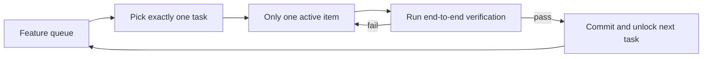
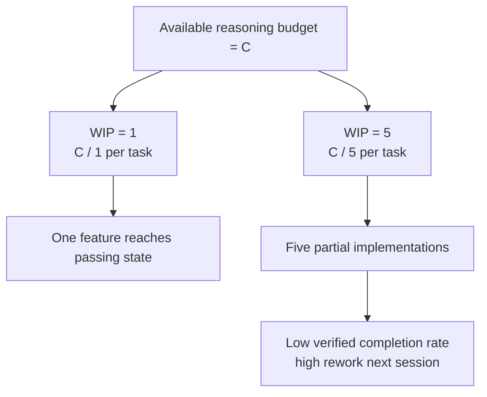

[中文版本 →](../../../zh/lectures/lecture-07-why-agents-overreach-and-under-finish/)

> Exemples de code : [code/](https://github.com/walkinglabs/learn-harness-engineering/blob/main/docs/fr/lectures/lecture-07-why-agents-overreach-and-under-finish/code/)
> Projet pratique : [Project 04. Runtime feedback and scope control](./../../projects/project-04-incremental-indexing/index.md)

# Leçon 07. Définir des limites de tâche claires

Vous demandez à Claude Code d'« ajouter l'authentification utilisateur à ce projet », et il commence à modifier le schéma de base de données, à écrire des routes, à changer des composants frontend, et — tant qu'à faire — à refactorer le middleware de gestion d'erreurs. Deux heures plus tard, vous vérifiez : 12 fichiers modifiés, 800 lignes de nouveau code, et pas une seule fonctionnalité qui fonctionne de bout en bout.

Mordre plus qu'on ne peut mâcher — ce dicton s'applique particulièrement bien aux agents IA. Les agents ont un instinct inné pour « faire un peu plus » — ils voient des choses liées et les traitent au passage, comme quelqu'un qui va au supermarché pour une bouteille de sauce soja et ressort en poussant un caddy plein. Le problème, c'est que les humains qui achètent trop gaspillent juste de l'argent ; les agents qui font trop de choses simultanément n'en terminent aucune correctement.

Le blog d'ingénierie d'Anthropic « Effective harnesses for long-running agents » le dit clairement : quand les prompts sont trop larges, les agents ont tendance à « commencer plusieurs choses à la fois » plutôt qu'à « terminer une chose d'abord ». Les pratiques d'ingénierie Codex d'OpenAI ont constaté la même chose — les tâches sans contrôles de portée explicites voient leurs taux de complétion chuter. Ce n'est pas un problème de modèle — c'est un problème de harness. Vous n'avez pas tracé la limite.

## L'attention est une ressource finie

Ce n'est pas une métaphore — ce sont des mathématiques. Supposez que la capacité de contexte de l'agent est C et qu'il active k tâches simultanément. Chaque tâche reçoit en moyenne C/k ressources de raisonnement. Quand C/k descend en dessous du seuil minimum nécessaire pour terminer une seule tâche, aucune n'est achevée. Votre estomac n'est que d'une certaine taille — enfoncez dix raviolis d'un coup et vous ne les digérerez pas tous, vous aurez juste dix cas d'indigestion.

Le comportement réel de Claude Code est révélateur. Demandez-lui d'« ajouter l'inscription utilisateur » et il pourrait :

1. Créer un modèle User
2. Écrire la route d'inscription
3. Remarquer qu'il a besoin de vérification email, donc ajouter un service mail
4. Voir que les mots de passe doivent être hachés, donc intégrer bcrypt
5. Remarquer que la gestion des erreurs est incohérente, donc refactorer le middleware d'erreurs global
6. Voir que la structure des fichiers de test est désordonnée, donc réorganiser le répertoire

Six étapes plus tard, chacune est à moitié faite. Pas de vérification de bout en bout, couplage complexe entre le code à moitié cuit, et la session suivante qui devra ramasser les morceaux sera complètement perdue. Comme quelqu'un qui cuisine six plats simultanément — chaque plat est dans la poêle mais aucun n'est dressé. Ils brûlent tous.

Les données expérimentales d'Anthropic le confirment directement : les agents utilisant une stratégie de « petit pas suivant » (équivalent à WIP=1) affichent un taux de complétion de tâches 37 % plus élevé que les agents utilisant des prompts larges. Plus intéressant encore, le nombre de lignes de code générées par les agents est faiblement corrélé négativement avec la complétion réelle des fonctionnalités — plus de code écrit, moins de fonctionnalités complétées. Prendre plus qu'on ne peut mâcher, prouvé par les données.

## Flux de travail WIP=1





## Concepts clés

- **Surportée (Overreach)** : L'agent active plus de tâches en une seule session que ce qui est optimal. C'est quantifiable — faire 5 fonctionnalités avec 0 passage de bout en bout est une surportée.
- **Sous-achèvement (Under-finish)** : Le ratio de tâches passant la vérification de bout en bout, parmi toutes les tâches activées, tombe en dessous du seuil. Du code écrit mais des tests qui ne passent pas est du sous-achèvement.
- **Limite WIP (Work-in-Progress Limit)** : Issu de la méthodologie Kanban. Idée fondamentale : limiter le nombre de tâches en cours simultanément. Pour les agents, WIP=1 est le défaut le plus sûr — terminez-en un avant de commencer le suivant. Comme au buffet — n'empilez pas votre assiette, terminez-en une puis retournez en chercher une autre.
- **Preuve de complétion (Completion Evidence)** : La condition vérifiable qu'une tâche doit satisfaire pour passer de « en cours » à « terminée ». Sans cela, les agents substituent « le code a l'air correct » à « le comportement passe les tests ».
- **Surface de portée (Scope Surface)** : Une structure DAG où chaque nœud est une unité de travail et les arêtes sont des dépendances. Les états sont limités à quatre : not_started, active, blocked, passing.
- **Pression d'achèvement (Completion Pressure)** : La force contraignante que le harness exerce via les limites WIP et les exigences de preuve de complétion, forçant l'agent à terminer la tâche en cours avant d'en commencer une nouvelle.

## Surportée et sous-achèvement sont symbiotiques

Ces deux problèmes ne sont pas indépendants — ils s'amplifient mutuellement. La surportée dilue l'attention, l'attention diluée cause du sous-achèvement, et le code à moitié terminé qui en résulte augmente la complexité du système, ce qui alimente davantage la surportée dans la tâche suivante. Un cercle vicieux.

En termes Kanban : la loi de Little nous dit L = lambda * W. Si le travail en cours L est trop élevé (faire trop de choses à la fois), le temps de traitement W de chaque tâche augmente inévitablement. Pour les agents, cela signifie que chaque fonctionnalité prend plus de temps du début à la vérification finale, et la probabilité d'échec croît.

C'est aussi un vieux problème dans le monde humain — Steve McConnell a documenté dans *Rapid Development* que la dérive du périmètre est la principale cause d'échec de projet. Mais les humains ont au moins l'intuition d'en avoir fait assez. Les agents n'en ont aucune. Générer l'idée suivante ne coûte presque rien en tokens supplémentaires au modèle — écrire « laissez-moi aussi corriger ça tant que j'y suis » ne compte presque pas — mais chaque modification supplémentaire dilue l'attention de l'agent. Comme un buffet où chaque assiette supplémentaire a un coût marginal quasi nul, mais votre estomac n'a qu'une certaine capacité.

## Comment bien le faire

### 1. Imposer WIP=1

C'est la méthode la plus directe et la plus efficace. Dans votre harness, dites explicitement à l'agent : **une seule tâche est autorisée en statut « active » à tout moment.** Dans le CLAUDE.md de Claude Code ou l'AGENTS.md de Codex, écrivez :

```
## Work Rules
- Work on one feature at a time
- Only start the next feature after the current one passes end-to-end verification
- Don't "also refactor" feature B while implementing feature A
```

Comme manger au buffet — une assiette à la fois, terminez-la avant de retourner en chercher une autre.

### 2. Définir des preuves de complétion explicites pour chaque tâche

Terminé n'est pas « le code est écrit » — c'est « la vérification du comportement passe ». Dans votre feature list, chaque entrée a besoin d'une commande de vérification :

```
F01: User Registration
  Verification: curl -X POST /api/register -d '{"email":"test@example.com","password":"123456"}' | jq .status == 201
  State: passing
```

### 3. Externaliser la surface de portée

Utilisez un fichier lisible par machine (JSON ou Markdown) pour enregistrer tous les états des tâches. Toute nouvelle session peut lire ce fichier et savoir immédiatement : quelle tâche est active ? Quel comportement compte comme terminé ? Quelles vérifications ont passé ?

### 4. Surveiller le taux de complétion vérifié

Le harness devrait suivre en continu le VCR (Verified Completion Rate) = tâches vérifiées / tâches activées. Bloquer les activations de nouvelles tâches quand VCR < 1.0.

## Cas concret

Un projet d'API REST avec 8 fonctionnalités, deux stratégies comparées :

**Mode buffet (sans contrainte)** : L'agent active 5 fonctionnalités simultanément lors de la session 1. Produit ~800 lignes sur 12 fichiers. Taux de réussite des tests de bout en bout : 20 % — seule l'inscription utilisateur fonctionne. Les 4 autres fonctionnalités : schéma de base de données créé mais logique de validation manquante, routes définies mais retournant de mauvais formats de réponse. Comme quelqu'un qui cuisine six plats à la fois, un seul est à peine comestible. À la fin de la session 3, seulement 3 fonctionnalités sur 8 sont complétées.

**Mode assiette unique (WIP=1)** : L'agent ne travaille que sur l'inscription utilisateur lors de la session 1. Produit ~200 lignes sur 4 fichiers. Tests de bout en bout : 100 % de réussite. Commite une implémentation propre et vérifiée. À la fin de la session 4, 7 fonctionnalités sur 8 sont complétées (la 8e bloquée par une dépendance externe).

Résultat : moins de code total (800 vs 1200 lignes) mais du code plus efficace. Taux de complétion : 87,5 % vs 37,5 %. Prenez une bouchée à la fois, et vous mangez finalement plus.

## Points clés

- **WIP=1 est le réglage de sécurité par défaut pour les harness d'agents** — terminez-en un, puis commencez le suivant ; n'essayez pas de paralléliser. On ne devient pas gros en une bouchée.
- **La preuve de complétion doit être exécutable** — « le code a l'air correct » ne compte pas ; « curl retourne 201 » compte.
- **La surface de portée doit être externalisée dans un fichier** — pas juste mentionnée en conversation, mais enregistrée dans un format lisible par machine dans le repo.
- **La surportée et le sous-achèvement sont symbiotiques** — résoudre l'un résout l'autre.
- **« Faire moins mais terminer » bat toujours « faire plus mais laisser à moitié »** — les lignes de code de l'agent et le taux de complétion des fonctionnalités sont corrélés négativement. La qualité bat toujours la quantité.

## Pour aller plus loin

- [Effective harnesses for long-running agents - Anthropic](https://www.anthropic.com/engineering/effective-harnesses-for-long-running-agents) — Blog d'ingénierie d'Anthropic, discussion détaillée de la stratégie « petit pas suivant »
- [Harness Engineering - OpenAI](https://openai.com/index/harness-engineering/) — Traitement complet du harness engineering par OpenAI
- [Kanban: Successful Evolutionary Change - David Anderson](https://www.goodreads.com/book/show/1070822.Kanban) — La source classique sur les limites WIP
- [Rapid Development - Steve McConnell](https://www.goodreads.com/book/show/125171.Rapid_Development) — Données empiriques sur la dérive du périmètre comme cause principale d'échec de projet

## Exercices

1. **Atomisation des tâches** : Prenez une exigence large (par ex., « implémenter un système de gestion des utilisateurs ») et décomposez-la en au moins 5 unités de travail atomiques. Pour chaque unité, spécifiez : (a) une description de comportement unique, (b) une commande de vérification exécutable, (c) les dépendances. Vérifiez si la décomposition satisfait la contrainte WIP=1.

2. **Expérience comparative** : Exécutez le même projet deux fois — une fois sans contraintes, une fois avec WIP=1 imposé. Comparez : le taux de complétion vérifié, le nombre total de lignes de code, le ratio de code effectif.

3. **Audit des preuves de complétion** : Examinez la sortie d'une exécution récente d'agent, en classant chaque modification de code comme « comportement complété », « comportement incomplet » ou « échafaudage ». Ajoutez les commandes de vérification manquantes pour chaque comportement incomplet.
